# Abfragen von Informationen zum Versand {#querying-delivery-information}

## Anzahl der Klicks für einen bestimmten Versand {#number-of-clicks-for-a-specific-delivery}

In diesem Beispiel möchten wir die Anzahl der Klicks für einen bestimmten Versand abrufen. Diese Klicks werden mithilfe der über einen bestimmten Zeitraum erfassten Empfänger-Trackinglogs aufgezeichnet. Der Empfänger wird über seine E-Mail-Adresse identifiziert. Diese Abfrage verwendet die **[!UICONTROL Empfänger-Trackinglogs]**-Tabelle.

* Welche Tabelle soll ausgewählt werden?

  Die Trackingtabelle des Empfängerprotokolls (**[!UICONTROL nms:trackingLogRcp]**)

* Felder, die als Ausgabespalten verwendet werden sollen?

  Primärschlüssel (mit Zählung) und E-Mail

* Nach welchen Kriterien werden die Informationen gefiltert?

  Nach einem Zeitraum und einem Element im Versandtitel

Gehen Sie für dieses Beispiel wie folgt vor:

1. Öffnen Sie den **[!UICONTROL generischen Abfrage-Editor]** und wählen Sie das Schema **[!UICONTROL Trackinglogs der Empfänger]** aus.

   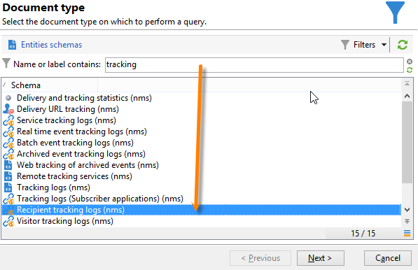

1. Erstellen Sie im Fenster **[!UICONTROL Zu extrahierende Daten]** ein Aggregat, um die gesuchten Informationen zu sammeln. Hierzu wird das Feld **[!UICONTROL Primärschlüssel]** benötigt, da die Zählung der Trackinglogs auf dem Feld **[!UICONTROL Primärschlüssel]** basiert. Der entsprechende Ausdruck lautet **[!UICONTROL x=count(Primärschlüssel)]**. Dabei wird die Summe der verschiedenen Trackinglogs mit einer einzelnen E-Mail-Adresse verknüpft.

   Gehen Sie dazu wie folgt vor:

   * Verwenden Sie die Schaltfläche **[!UICONTROL Hinzufügen]** rechts neben den **[!UICONTROL Ausgabespalten]**. Wählen Sie im Fenster **[!UICONTROL Formeltyp]** die Option **[!UICONTROL Formel von einem Ausdruck ausgehend erstellen]** und danach **[!UICONTROL Weiter]** aus. Verwenden Sie im Fenster **[!UICONTROL Feldauswahl]** die Option **[!UICONTROL Erweiterte Auswahl]**.

     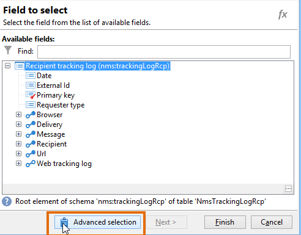

   * Führen Sie im Fenster **[!UICONTROL Formeltyp]** einen Prozess für die Aggregatfunktion aus. Dieser Prozess ist eine Anzahl von Primärschlüsseln.

     Wählen Sie im Abschnitt **[!UICONTROL Aggregat]** die Option **[!UICONTROL Aggregatfunktionen]** und klicken Sie auf **[!UICONTROL Zählung]**.

     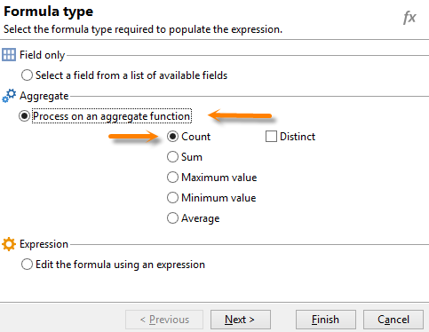

     Klicken Sie auf **[!UICONTROL Weiter]**.

   * Wählen Sie nun das Feld **[!UICONTROL Primärschlüssel (@id)]** aus. Die Ausgabespalte **[!UICONTROL count(Primärschlüssel)]** wurde konfiguriert.

     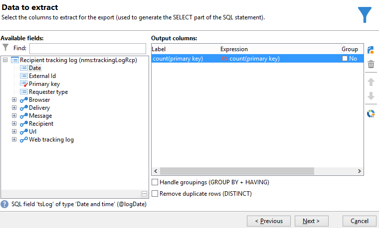

1. Wählen Sie das andere Feld aus, das in der Ausgabespalte angezeigt werden soll. Öffnen Sie in der Spalte **[!UICONTROL Verfügbare Felder]** den Knoten **[!UICONTROL Empfänger]** und wählen Sie **[!UICONTROL E-Mail]**. Dies führt zur Zuordnung eines jeden Trackinglogs zum entsprechenden Empfänger.**&#x200B;**&#x200B;**&#x200B;**

   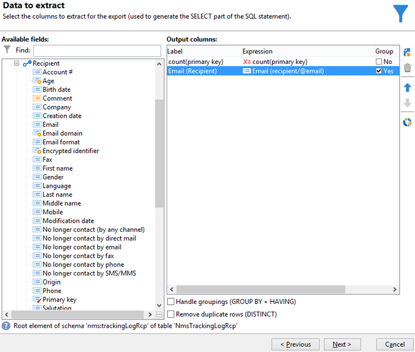

1. Konfigurieren Sie die Sortierung der Spalte so, dass die aktivsten Empfangenden (mit den meisten Tracking-Logs) zuerst angezeigt werden. Klicken Sie in der Spalte **[!UICONTROL Absteigende Sortierung]** auf **[!UICONTROL Ja]**.

   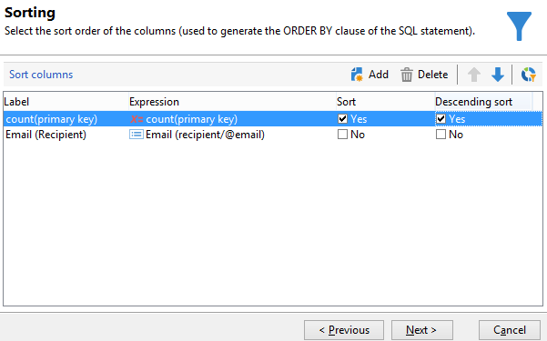

1. Im folgenden Schritt können Sie die Abfrageergebnisse weiter einschränken und beispielsweise aus allen Logs jene herausfiltern, die unter 15 Tage alt sind und deren Sendungen sich auf eine Gartenausstellung beziehen.

   Gehen Sie dazu wie folgt vor:

   * Konfigurieren Sie einen Datenfilter. Wählen Sie dazu **[!UICONTROL Filterbedingungen]** und danach **[!UICONTROL Weiter]** aus.

     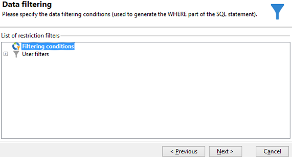

   * Trackinglogs über einen bestimmten Zeitraum für einen bestimmten Versand wiederherstellen Drei Filterbedingungen sind erforderlich: zwei Datumsbedingungen, um den Suchzeitraum zwischen 2 Wochen vor dem aktuellen Datum und dem Tag vor dem aktuellen Datum festzulegen, und eine weitere Bedingung, um die Suche auf einen bestimmten Versand zu beschränken.

     Konfigurieren Sie im Fenster **[!UICONTROL Zielelement]** das Datum, ab dem die Trackinglogs berücksichtigt werden sollen. Wählen Sie **[!UICONTROL Hinzufügen]** aus. Eine Bedingungszeile wird angezeigt. Bearbeiten Sie die Spalte **[!UICONTROL Ausdruck]**, indem Sie auf die Schaltfläche **[!UICONTROL Ausdruck bearbeiten]** klicken. Wählen Sie im Fenster **[!UICONTROL Feldauswahl]** das Feld **[!UICONTROL Datum (@logDate)]**.

     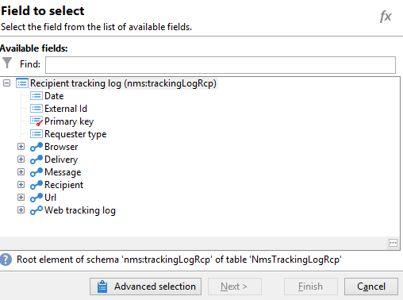

     Wählen Sie den Operator **[!UICONTROL größer als]**. Klicken Sie im Feld **[!UICONTROL Wert]** auf **[!UICONTROL Ausdruck bearbeiten]**. Wählen Sie im Fenster **[!UICONTROL Formeltyp]** die Option **[!UICONTROL Datumsfunktionen]** aus. Geben Sie in der Option **[!UICONTROL Aktuelles Datum abzüglich n Tage]** den Wert „15“ ein.

     Klicken Sie auf **[!UICONTROL Beenden]**.

     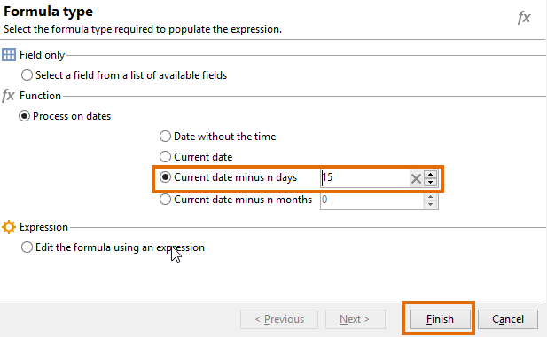

   * Zur Suche nach dem Enddatum der gewünschten Trackingperiode ist eine weitere Bedingungszeile erforderlich. **&#x200B;**&#x200B;Im Feld **[!UICONTROL Ausdruck]** wählen Sie wieder **[!UICONTROL Datum (@logDate)]**.

     Wählen Sie den Operator **[!UICONTROL kleiner als]**. Klicken Sie im Feld **[!UICONTROL Wert]** auf die Schaltfläche **[!UICONTROL Ausdruck bearbeiten]**. Gehen Sie zum Fenster **[!UICONTROL Formeltyp]** und geben Sie in unter **[!UICONTROL Aktuelles Datum abzüglich n Tage]** den Wert „1“ ein.

     Klicken Sie auf **[!UICONTROL Beenden]**.

     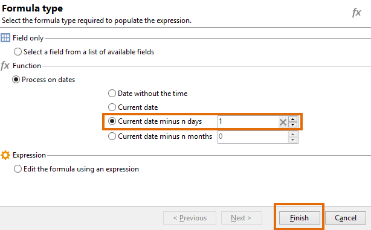

     Der gewünschte Zeitraum wurde konfiguriert. In der dritten Filterbedingung gilt es, nur einen bestimmten Versand zu berücksichtigen.

   * Klicken Sie auf **[!UICONTROL Hinzufügen]**, um eine weitere Filterbedingung zu erstellen. Klicken Sie im Feld **[!UICONTROL Ausdruck]** auf **[!UICONTROL Ausdruck bearbeiten]**. Wählen Sie im Fenster **[!UICONTROL Feldauswahl]** im Knoten **[!UICONTROL Versand]** das Feld **[!UICONTROL Titel]** aus.

     Klicken Sie auf **[!UICONTROL Beenden]**.

     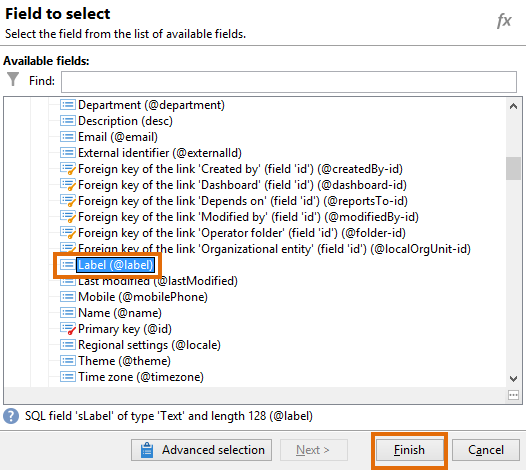

     Gesucht wird ein Versand zum Thema &quot;Gartenausstellung&quot;. Wählen Sie den Operator **[!UICONTROL enthält]** und geben Sie im Feld **[!UICONTROL Wert]** &quot;Garten&quot; ein, wenn Sie sich nicht an den genauen Versandtitel erinnern können.

     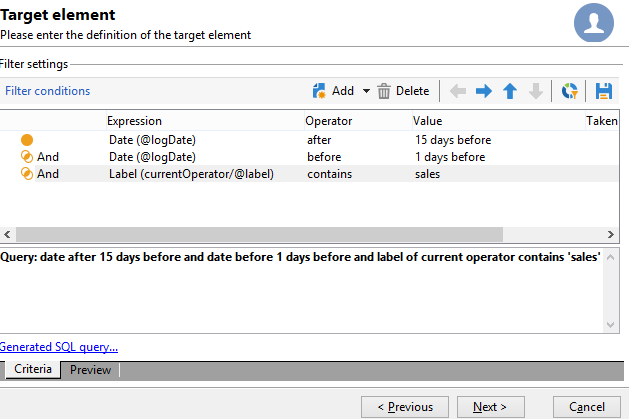

1. Da in unserem Beispiel keine spezielle Formatierung erforderlich ist, können Sie im Fenster **[!UICONTROL Datenformatierung]** direkt auf **[!UICONTROL Weiter]** klicken.
1. Klicken Sie nun im **[!UICONTROL Datenvorschau]**-Fenster auf **[!UICONTROL Datenvorschau starten]**, um die Anzahl an Trackinglogs für jeden Versandempfänger abzurufen.

   Die Trackinglogs werden wie gewünscht in absteigender Reihenfolge angezeigt.

   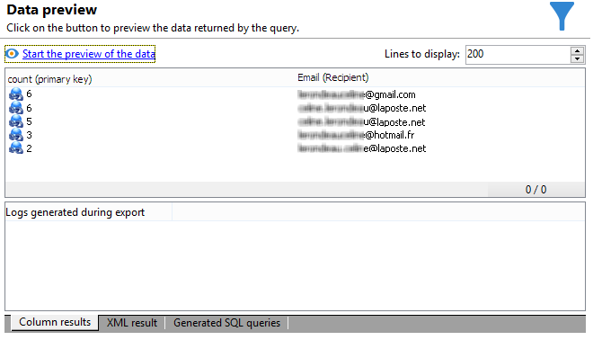

   Die höchste Anzahl an Logs für einen Benutzer ist 6 für diesen Versand. 5 verschiedene Benutzer haben die Versand-E-Mail geöffnet oder auf einen der Links in der E-Mail geklickt.

## Empfänger, die keine Nachricht geöffnet haben {#recipients-who-did-not-open-any-delivery}

In diesem Beispiel möchten wir Empfänger herausfiltern, die in den letzten sieben Tagen keine E-Mail geöffnet haben.

Gehen Sie wie folgt vor:

1. Ziehen Sie eine **[!UICONTROL Abfrage]** in den Workflow-Arbeitsbereich und öffnen Sie sie.
1. Wählen Sie **[!UICONTROL Abfrage bearbeiten]** aus und wählen Sie für die Zielgruppen- und Filterdimension die Option **[!UICONTROL Empfänger]** aus.

   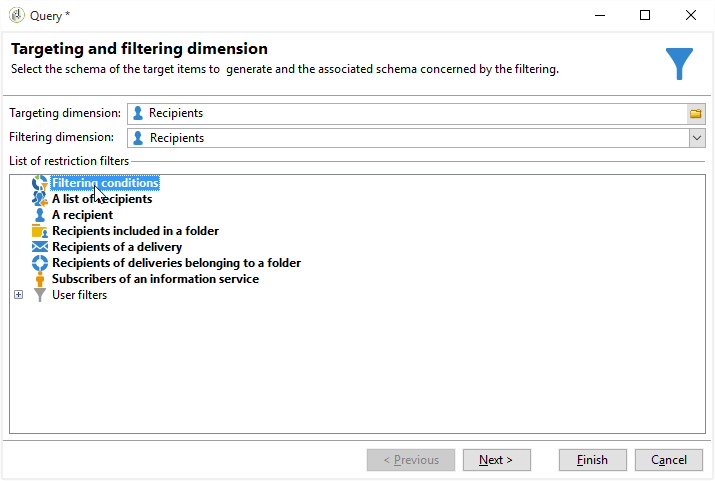

1. Wählen Sie **[!UICONTROL Filterbedingungen]** und danach **[!UICONTROL Weiter]** aus.
1. Verwenden Sie die Schaltfläche **[!UICONTROL Hinzufügen]** und wählen Sie **[!UICONTROL Trackinglogs]** aus.
1. Wählen Sie für den **[!UICONTROL Operator]** des **[!UICONTROL Trackinglogs]**-Ausdrucks **[!UICONTROL Nicht wie]** aus.

   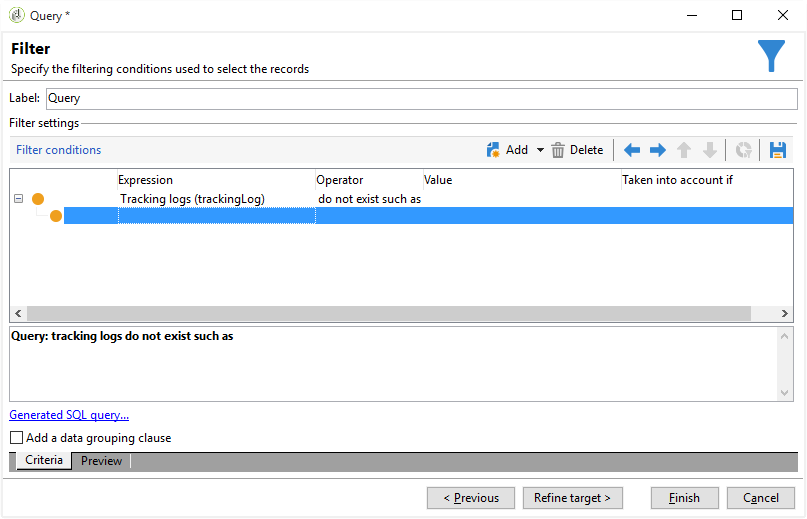

1. Fügen Sie einen weiteren Ausdruck hinzu. Wählen Sie in der **[!UICONTROL URL]**-Kategorie die Option **[!UICONTROL Typ]** aus.
1. Wählen Sie dann für den **[!UICONTROL Operator]** die Option **[!UICONTROL Gleich]** und für den **[!UICONTROL Wert]** die Option **[!UICONTROL Offen]** aus.

   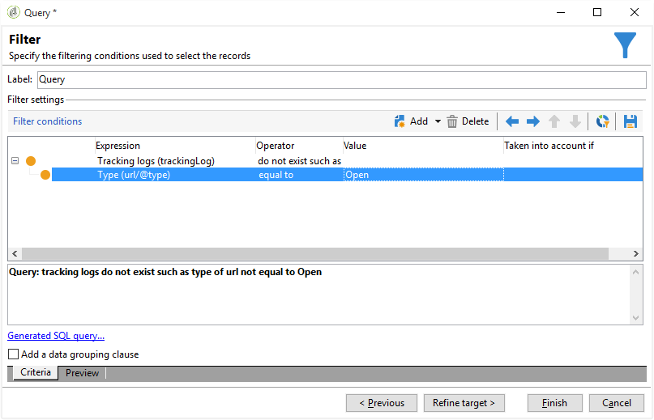

1. Fügen Sie einen weiteren Ausdruck hinzu und wählen Sie **[!UICONTROL Datum]** aus. Der **[!UICONTROL Operator]** sollte **[!UICONTROL Später als]** sein.

   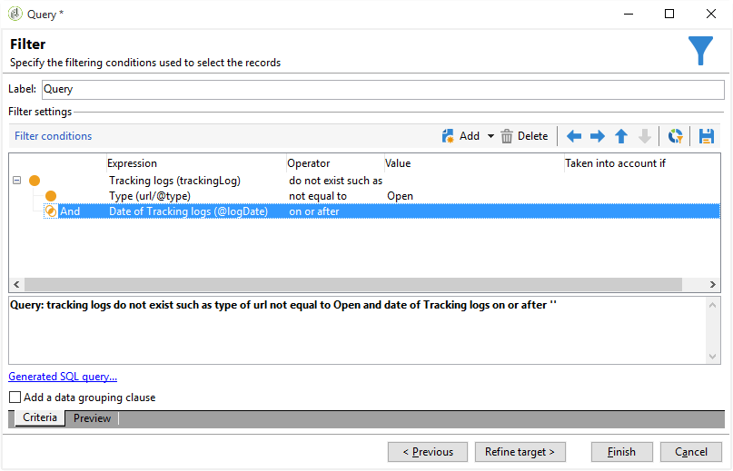

1. Um als Wert die letzten sieben Tage festzulegen, wählen Sie im Feld **[!UICONTROL Wert]** die Schaltfläche **[!UICONTROL Ausdruck bearbeiten]** aus.
1. Wählen Sie in der Kategorie **[!UICONTROL Funktion]** die Option **[!UICONTROL Aktuelles Datum minus n Tage]** und fügen Sie die Anzahl der Tage hinzu, die Sie ansprechen möchten. Hier möchten wir die letzten 7 Tage ins Visier nehmen.

   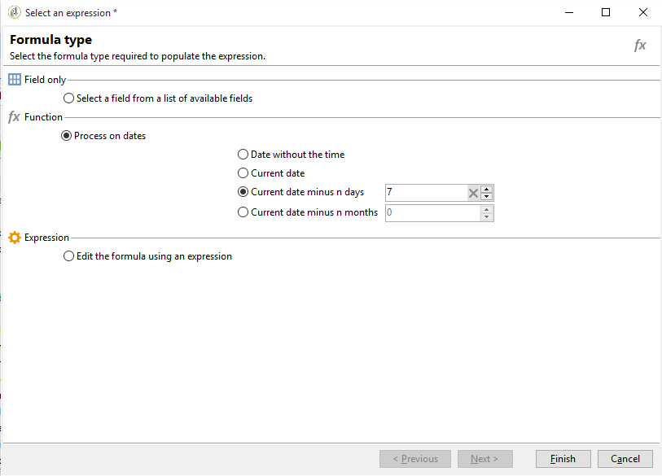

Ihre ausgehende Transition wird Empfänger enthalten, die in den letzten sieben Tagen keine E-Mail geöffnet haben.

Wenn Sie hingegen Empfänger filtern möchten, die mindestens eine E-Mail geöffnet haben, sollte Ihre Abfrage wie folgt lauten. Beachten Sie, dass in diesem Fall die **[!UICONTROL Filterdimension]** auf **[!UICONTROL Trackinglogs (Empfänger)]** gesetzt werden sollte.

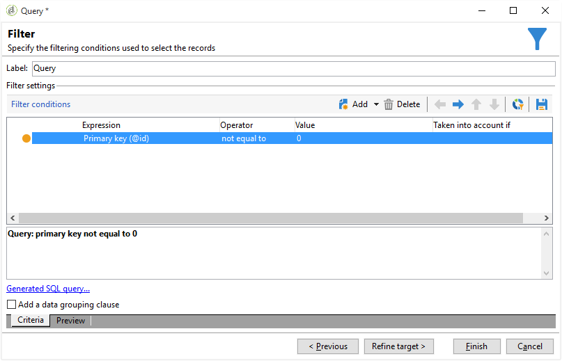

## Empfänger, die einen Versand geöffnet haben {#recipients-who-have-opened-a-delivery}

Im folgenden Beispiel erfahren Sie, wie Sie alle Profile auswählen können, die in den vergangenen zwei Wochen einen Versand geöffnet haben.

1. Verwenden Sie Trackinglogs, um Profile auszuwählen, die einen Versand geöffnet haben. Sie werden in einer verknüpften Tabelle gespeichert: Wählen Sie zunächst diese Tabelle in der Dropdown-Liste des Feldes **[!UICONTROL Filterdimension]**, wie unten gezeigt:

   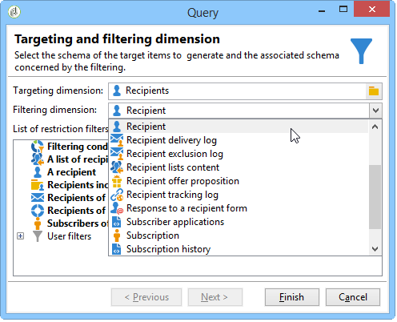

1. Wählen Sie aus der Liste der Einschränkungsfilter die Filterbedingungen aus und klicken Sie auf die Schaltfläche **[!UICONTROL Ausdruck bearbeiten]**. Markieren Sie nun im Knoten der Trackinglogs das Feld **[!UICONTROL Datum]**.

   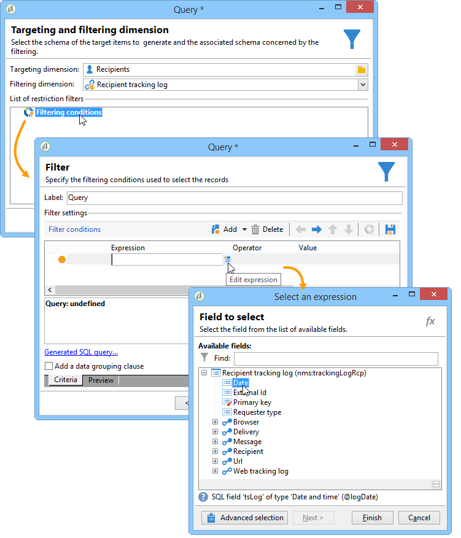

   Klicken Sie auf **[!UICONTROL Beenden]**, um die Auswahl zu bestätigen.

   Um nur die Trackinglogs der letzten 14 Tage abzurufen, müssen Sie den Operator **[!UICONTROL Größer als]** wählen.

   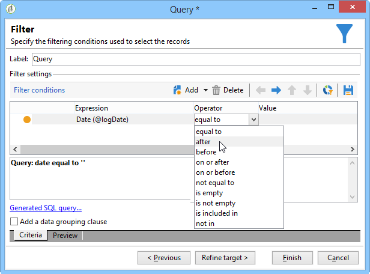

   Klicken Sie in der **[!UICONTROL Wert]**-Spalte wiederum auf **[!UICONTROL Ausdruck bearbeiten]**, um die Formel zur Datumsberechnung zu definieren. Kreuzen Sie die Option **[!UICONTROL Aktuelles Datum abzüglich n Tage]** an und geben Sie 15 ein.

   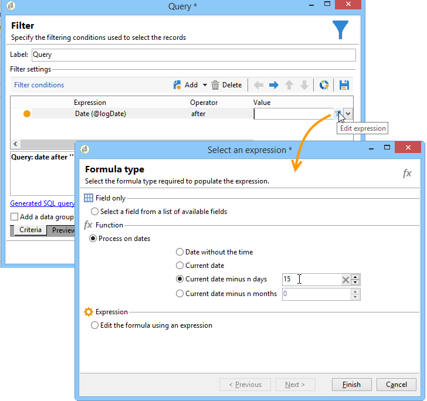

   Klicken Sie auf die Schaltfläche **[!UICONTROL Beenden]** des Formelfensters. Klicken Sie im Filterfenster auf die Registerkarte **[!UICONTROL Vorschau]** , um die Targeting-Kriterien zu überprüfen.

   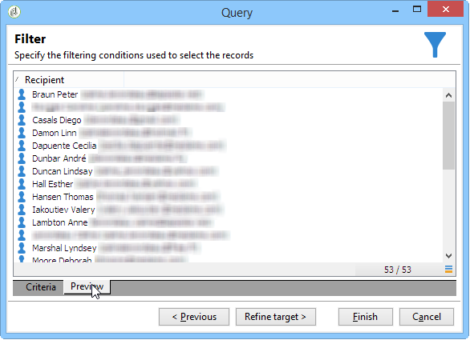

## Verhalten der Empfänger nach einem Versand filtern {#filtering-recipients--behavior-folllowing-a-delivery}

In einem Workflow ermöglichen die Aktivitäten **[!UICONTROL Abfrage]** und **[!UICONTROL Aufspaltung]** die Auswahl eines Verhaltens, das auf einen früheren Versand folgt. Diese Auswahl erfolgt mithilfe des Filters **[!UICONTROL Versandempfänger]**.

* Ziel des Beispiels

  In einem Versand-Workflow gibt es mehrere Möglichkeiten des weiteren Vorgehens nach einem ersten E-Mail-Kontakt. Diese werden über die Aktivität **[!UICONTROL Aufspaltung]** gesteuert.

* Kontext

  Versand eines „Sommersportangebots“. Vier Tage nach dem Versand werden zwei weitere Sendungen durchgeführt. Eines davon ist „Wassersportangebot“, das andere ist eine Folgemaßnahme zur ersten „Sommersportangebot“.

  Der Versand „Wassersportangebot“ wird an Empfänger gesendet, die im ersten Versand auf den Link „Wassersport“ geklickt haben. Diese Klicks zeigen, dass der Empfänger an dem Thema interessiert ist. Es ist sinnvoll, sie auf ähnliche Angebote auszurichten. Empfänger, die das „Sommersportangebot“ nicht angeklickt haben, erhalten jedoch wieder denselben Inhalt.

Die folgenden Schritte zeigen die Konfiguration der **[!UICONTROL Aufspaltung]** unter Berücksichtigung von zwei Verhaltensmustern:

1. Fügen Sie das Feld **[!UICONTROL Aufspaltung]** in den Workflow ein. In diesem Feld werden die Empfänger des ersten Versands in die nächsten beiden Sendungen unterteilt. Die Aufschlüsselung erfolgt basierend auf den Filterbedingungen, die mit dem Empfängerverhalten während des ersten Versands verknüpft sind.

   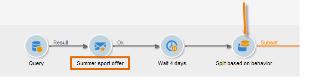

1. Öffnen Sie das Feld **[!UICONTROL Aufspaltung]**. Geben Sie auf der Registerkarte **[!UICONTROL Allgemein]** einen Titel ein, z. B. **Aufspaltung nach Verhalten**.

   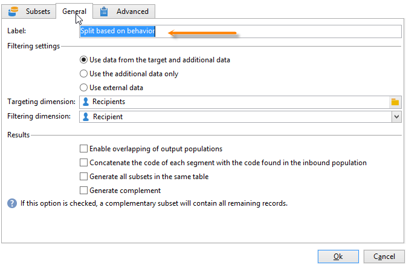

1. Konfigurieren Sie im Tab **[!UICONTROL Teilmengen]** die erste Verzweigung der Aufspaltung. Nennen Sie diesen Zweig beispielsweise &quot;**Haben geklickt**&quot;.
1. Wählen Sie die Option **[!UICONTROL Filterbedingung für die Eingangspopulation hinzufügen]**. Klicken Sie auf **[!UICONTROL Bearbeiten]**.
1. Doppelklicken Sie im Fenster **[!UICONTROL Zielgruppenbestimmungs- und Filterdimension]** auf den Filter **[!UICONTROL Versandempfänger]**.

   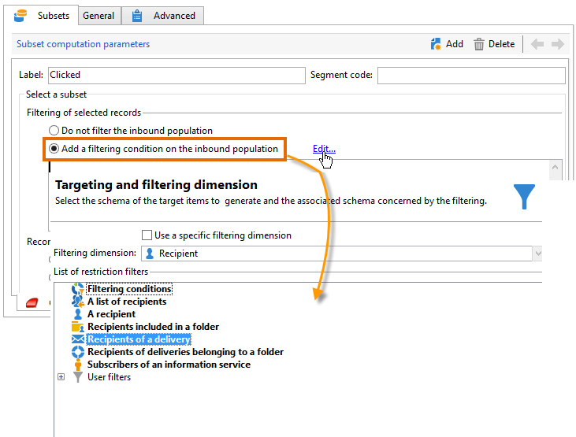

1. Wählen Sie im **[!UICONTROL Zielelement]**-Fenster das auf diesen Zweig zutreffende Verhalten: **[!UICONTROL Empfänger, die geklickt haben (E-Mail)]**.

   Wählen Sie unten die Option **[!UICONTROL Versand durch die Transition angegeben]** aus. Mit dieser Funktion werden die beim ersten Versand angesprochenen Personen automatisch wiederhergestellt.

   Die Empfänger dieses Zweigs bekommen also den Versand &quot;Wassersport-Angebote&quot;.

   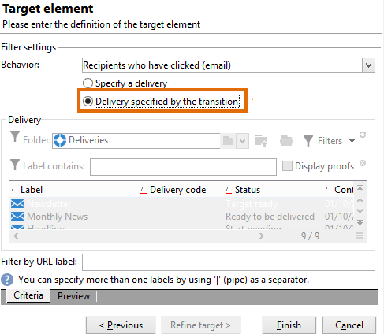

1. Definieren Sie den zweiten Zweig. Diese Verzweigung enthält die Folgenachricht mit demselben Inhalt wie beim ersten Versand. Gehen Sie zur Registerkarte **[!UICONTROL Teilmengen]** und klicken Sie auf **[!UICONTROL Hinzufügen]**, um sie zu erstellen.

   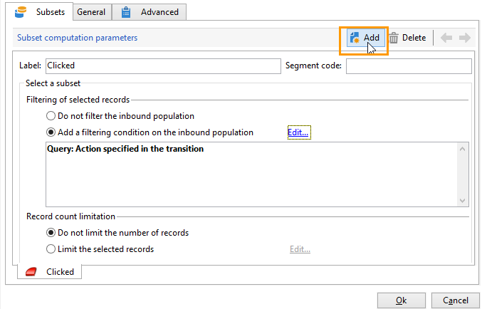

1. Eine weitere Unterregisterkarte wird angezeigt. Benennen Sie sie z. B. **Haben nicht geklickt**.
1. Aktivieren Sie die Option **[!UICONTROL Filterbedingung für die Eingangspopulation hinzufügen]**. Klicken Sie auf **[!UICONTROL Bearbeiten...]**.

   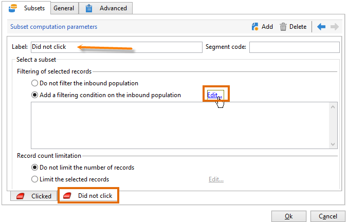

1. Doppelklicken Sie im Fenster **[!UICONTROL Zielgruppenbestimmungs- und Filterdimension]** auf den Filter **[!UICONTROL Versandempfänger]**.
1. Wählen Sie im Fenster **[!UICONTROL Zielelement]** das Verhalten **[!UICONTROL Empfänger, die nicht geklickt haben (E-Mail)]**. Wählen Sie die Option **[!UICONTROL Von der Transition festgelegter Versand]**, wie für den letzten Zweig angezeigt.

   Die Konfiguration der **[!UICONTROL Aufspaltung]** ist abgeschlossen.

   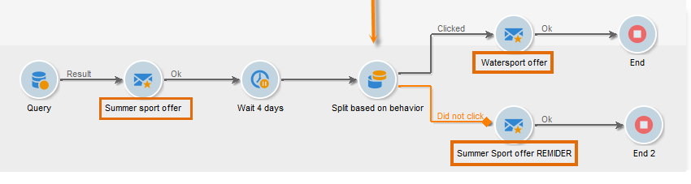

Folgende Empfängerverhalten wurden standardmäßig in der Anwendung hinterlegt:

* **[!UICONTROL Alle Empfänger,]**
* **[!UICONTROL Empfänger, denen die Nachricht erfolgreich zugestellt wurde,]**
* **[!UICONTROL Empfänger, die geöffnet oder geklickt haben (E-Mail),]**
* **[!UICONTROL Empfänger, die geklickt haben (E-Mail),]**
* **[!UICONTROL Empfänger, denen die Nachricht nicht zugestellt werden konnte,]**
* **[!UICONTROL Empfänger, die weder geöffnet noch geklickt haben (E-Mail),]**
* **[!UICONTROL Empfänger, die nicht geklickt haben (E-Mail).]**

  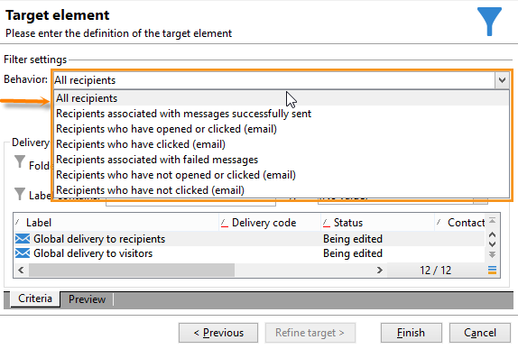
