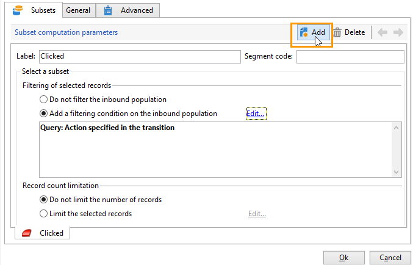

# Abfragen von Informationen zum Versand {#querying-delivery-information}

## Anzahl der Klicks für einen bestimmten Versand {#number-of-clicks-for-a-specific-delivery}

In diesem Beispiel wird die Anzahl der Klicks von Empfängern in einem bestimmten Zeitraum gesucht. Die Klicks werden in den Trackinglogs der Empfänger gespeichert. Letztere werden über die E-Mail-Adresse identifiziert. Diese Abfrage basiert auf der Tabelle **[!UICONTROL Trackinglogs der Empfänger]**.

* Welche Tabelle soll ausgewählt werden?

  Die Trackinglogs der Empfänger (**[!UICONTROL nms:trackingLogRcp]**)

* Felder, die als Ausgabespalten verwendet werden sollen?

  Primärschlüssel (mit Zählung) und E-Mail

* Nach welchen Kriterien werden die Informationen gefiltert?

  Nach einem Zeitraum und einem Element im Versandtitel

Gehen Sie für dieses Beispiel wie folgt vor:

1. Öffnen Sie das **[!UICONTROL generische Abfragetool]** und wählen Sie das Schema **[!UICONTROL Trackinglogs der Empfänger]** aus.

   

1. In der **[!UICONTROL Zu extrahierende Daten]** -Fenster verwenden, möchten wir ein Aggregat zum Erfassen von Informationen erstellen. Fügen Sie dazu den Primärschlüssel (über dem Hauptschlüssel) hinzu **[!UICONTROL Trackinglogs der Empfänger]** -Element): Die Trackinglog-Anzahl wird an diesem **[!UICONTROL Primäre Taste]** Feld. Der bearbeitete Ausdruck lautet **[!UICONTROL x=count (Primärschlüssel)]**. Sie verknüpft die Summe verschiedener Trackinglogs mit einer einzelnen E-Mail-Adresse.

   Gehen Sie dazu wie folgt vor:

   * Klicken Sie auf die Schaltfläche **[!UICONTROL Hinzufügen]** Symbol rechts neben dem **[!UICONTROL Ausgabespalten]** Feld. In der **[!UICONTROL Formeltyp]** Fenster, wählen Sie die **[!UICONTROL Formel mithilfe eines Ausdrucks bearbeiten]** und klicken Sie auf **[!UICONTROL Weiter]**. In der **[!UICONTROL Auszuwählendes Feld]** Fenster, klicken Sie auf **[!UICONTROL Erweiterte Auswahl]**.

     

   * Verwenden Sie im Fenster **[!UICONTROL Formeltyp]** eine Aggregatfunktion. In diesem Fall ist das die Zählung des Primärschlüssels.

     Wählen Sie im Abschnitt **[!UICONTROL Aggregat]** die Option **[!UICONTROL Aggregatfunktionen]** und klicken Sie auf **[!UICONTROL Zählung]**.

     

     Klicken Sie auf **[!UICONTROL Weiter]**.

   * Wählen Sie die **[!UICONTROL Primäre Taste (@id)]** Feld. Die **[!UICONTROL Anzahl (Primärschlüssel)]** Die Ausgabespalte ist konfiguriert.

     

1. Wählen Sie das andere Feld aus, das in der Ausgabespalte angezeigt werden soll. In der **[!UICONTROL Verfügbare Felder]** Spalte, öffnen Sie **[!UICONTROL Empfängerin oder Empfänger]** Knoten und auswählen **[!UICONTROL E-Mail]**. Überprüfen Sie die **[!UICONTROL Gruppe]** Kästchen an **[!UICONTROL Ja]** Tracking-Logs nach E-Mail-Adresse gruppieren: Diese Gruppe verknüpft jedes Log mit seinem Empfänger.

   

1. Konfigurieren Sie die Spaltensortierung so, dass zuerst die aktivsten Empfänger (mit den meisten Trackinglogs) angezeigt werden. nachprüfen **[!UICONTROL Ja]** in der **[!UICONTROL Absteigende Sortierung]** Spalte.

   

1. Im folgenden Schritt können Sie die Abfrageergebnisse weiter einschränken und beispielsweise aus allen Logs jene herausfiltern, die unter 15 Tage alt sind und deren Sendungen sich auf eine Gartenausstellung beziehen.

   Gehen Sie dazu wie folgt vor:

   * Konfigurieren der Datenfilterung. Wählen Sie dazu **[!UICONTROL Filterbedingungen]** Klicken Sie dann auf **[!UICONTROL Weiter]**.

     

   * Drei Filterbedingungen sind erforderlich, um die Ergebnisse wie gewünscht einzuschränken: zwei Datumsfilter zur Eingrenzung des Zeitraums zwischen 15 Tagen vor dem aktuellen Datum und 1 Tag vor dem aktuellen Datum sowie eine weitere Bedingung, um nur Logs bezüglich bestimmter Sendungen zu erfassen.

     In der **[!UICONTROL Zielelement]** das Datum konfigurieren, ab dem Trackinglogs berücksichtigt werden. Wählen Sie **[!UICONTROL Hinzufügen]** aus. Eine Bedingungszeile wird angezeigt. Bearbeiten Sie die **[!UICONTROL Ausdruck]** -Spalte durch Klicken auf **[!UICONTROL Ausdruck bearbeiten]** Funktion. In der **[!UICONTROL Auszuwählendes Feld]** Fenster, wählen **[!UICONTROL Datum (@logDate)]**.

     

     Wählen Sie die **[!UICONTROL Größer als]** Operator. In der **[!UICONTROL Wert]** -Spalte, klicken Sie auf **[!UICONTROL Ausdruck bearbeiten]** und in der **[!UICONTROL Formeltyp]** Fenster, auswählen **[!UICONTROL Verarbeitung nach Daten]**. Schließlich in **[!UICONTROL Aktuelles Datum abzüglich n Tage]**, geben Sie „15“ ein.

     Klicken Sie auf **[!UICONTROL Beenden]**.

     

   * Um das Enddatum der Trackinglog-Suche auszuwählen, erstellen Sie eine zweite Bedingung durch Klicken auf **[!UICONTROL Hinzufügen]**. In der **[!UICONTROL Ausdruck]** Spalte, wählen **[!UICONTROL Datum (@logDate)]** Nochmals.

     Wählen Sie die **[!UICONTROL Weniger als]** Operator. In der **[!UICONTROL Wert]** -Spalte, klicken Sie auf **[!UICONTROL Ausdruck bearbeiten]**. Zur Datumsverarbeitung navigieren Sie zu **[!UICONTROL Formeltyp]** Fenster, geben Sie „1“ in ein **[!UICONTROL Aktuelles Datum abzüglich n Tage]**.

     Klicken Sie auf **[!UICONTROL Beenden]**.

     

     Der gewünschte Zeitraum wurde konfiguriert. In der dritten Filterbedingung gilt es, nur einen bestimmten Versand zu berücksichtigen.

   * Klicken Sie auf die Schaltfläche **[!UICONTROL Hinzufügen]** Funktion zum Erstellen einer weiteren Filterbedingung In der **[!UICONTROL Ausdruck]** -Spalte, klicken Sie auf **[!UICONTROL Ausdruck bearbeiten]**. In der **[!UICONTROL Auszuwählendes Feld]** Fenster, wählen **[!UICONTROL Bezeichnung]** in der **[!UICONTROL Versand]** Knoten.

     Klicken Sie auf **[!UICONTROL Beenden]**.

     

     Suchen Sie nach einem Versand, der das Wort „Verkauf“ enthält. Da Sie sich nicht an den genauen Titel erinnern, können Sie den **[!UICONTROL enthält]** und geben Sie „Verkauf“ in das Feld **[!UICONTROL Wert]** Spalte.

     

1. Da in unserem Beispiel keine spezielle Formatierung erforderlich ist, können Sie im Fenster **[!UICONTROL Datenformatierung]** direkt auf **[!UICONTROL Weiter]** klicken.
1. Klicken Sie nun im **[!UICONTROL Datenvorschau]**-Fenster auf **[!UICONTROL Datenvorschau starten]**, um die Anzahl an Trackinglogs für jeden Versandempfänger abzurufen.

   Die Trackinglogs werden wie gewünscht in absteigender Reihenfolge angezeigt.

   

   Die höchste Loganzahl für einen Benutzer beträgt bei diesem Versand 8. 20 verschiedene Benutzer haben die E-Mail dieses Versands geöffnet oder auf einen Link geklickt.

## Empfänger, die keine Nachricht geöffnet haben {#recipients-who-did-not-open-any-delivery}

In diesem Beispiel möchten wir Empfänger herausfiltern, die in den letzten sieben Tagen keine E-Mail geöffnet haben.

Gehen Sie wie folgt vor:

1. Ziehen Sie eine **[!UICONTROL Abfrage]** in den Workflow-Arbeitsbereich und öffnen Sie sie.
1. Wählen Sie **[!UICONTROL Abfrage bearbeiten]** aus und wählen Sie für die Zielgruppen- und Filterdimension die Option **[!UICONTROL Empfänger]** aus.

   

1. Wählen Sie **[!UICONTROL Filterbedingungen]** und danach **[!UICONTROL Weiter]** aus.
1. Verwenden Sie die Schaltfläche **[!UICONTROL Hinzufügen]** und wählen Sie **[!UICONTROL Trackinglogs]** aus.
1. Wählen Sie für den **[!UICONTROL Operator]** des **[!UICONTROL Trackinglogs]**-Ausdrucks **[!UICONTROL Nicht wie]** aus.

   

1. Fügen Sie einen weiteren Ausdruck hinzu. Auswählen **[!UICONTROL Typ]** in der **[!UICONTROL URL]** Kategorie.
1. Wählen Sie dann für den **[!UICONTROL Operator]** die Option **[!UICONTROL Gleich]** und für den **[!UICONTROL Wert]** die Option **[!UICONTROL Offen]** aus.

   

1. Weiteren Ausdruck hinzufügen und auswählen **[!UICONTROL Datum]**. **[!UICONTROL Operator]** Sollte auf gesetzt werden **[!UICONTROL am oder nach]**.

   

1. Um als Wert die letzten sieben Tage festzulegen, wählen Sie im Feld **[!UICONTROL Wert]** die Schaltfläche **[!UICONTROL Ausdruck bearbeiten]** aus.
1. Wählen Sie in der Kategorie **[!UICONTROL Funktion]** die Option **[!UICONTROL Aktuelles Datum abzüglich n Tage]** aus und fügen Sie die gewünschte Anzahl der Tage ein. In unserem Fall sind das die letzten sieben Tage.

   

Ihre ausgehende Transition wird Empfänger enthalten, die in den letzten sieben Tagen keine E-Mail geöffnet haben.

Wenn Sie hingegen Empfänger filtern möchten, die mindestens eine E-Mail geöffnet haben, sollte Ihre Abfrage wie folgt lauten. Beachten Sie, dass in diesem Fall die **[!UICONTROL Filterdimension]** auf **[!UICONTROL Trackinglogs (Empfänger)]** gesetzt werden sollte.

## Empfänger, die einen Versand geöffnet haben {#recipients-who-have-opened-a-delivery}

Im folgenden Beispiel erfahren Sie, wie Sie alle Profile auswählen können, die in den vergangenen zwei Wochen einen Versand geöffnet haben.

1. Um Profile nach dem Öffnen eines Versands auszuwählen, müssen Sie Trackinglogs verwenden. Sie werden in einer verknüpften Tabelle gespeichert. Wählen Sie zunächst diese Tabelle in der Dropdown-Liste der Tabelle aus **[!UICONTROL Filterdimension]** -Feld, wie unten dargestellt:

   

1. Klicken Sie bezüglich der Filterbedingungen auf **[!UICONTROL Ausdruck bearbeiten]** Symbol der in der Unterbaumstruktur der Trackinglogs angezeigten Kriterien. Wählen Sie die **[!UICONTROL Datum]** Feld.

   

   Klicken Sie auf **[!UICONTROL Beenden]**, um die Auswahl zu bestätigen.

   Um nur die Trackinglogs der letzten 14 Tage abzurufen, müssen Sie den Operator **[!UICONTROL Größer als]** wählen.

   

   Klicken Sie dann auf die Schaltfläche **[!UICONTROL Ausdruck bearbeiten]** Symbol in der **[!UICONTROL Wert]** Spalte, um die anzuwendende Berechnungsformel zu definieren. Wählen Sie die **[!UICONTROL Aktuelles Datum abzüglich n Tage]** Formel und geben Sie 15 in das entsprechende Feld ein.

   

   Klicken Sie auf die Schaltfläche **[!UICONTROL beenden]** Schaltfläche im Fenster „Formel„. Klicken Sie im Filterfenster auf die Schaltfläche **[!UICONTROL Vorschau]** Registerkarte zur Überprüfung der Zielgruppenkriterien.

   

## Verhalten der Empfänger nach einem Versand filtern {#filtering-recipients--behavior-folllowing-a-delivery}

In einem Workflow gilt Folgendes **[!UICONTROL Abfrage]** und **[!UICONTROL Aufspaltung]** Mit Kästchen können Sie ein Verhalten auswählen, das einem früheren Versand folgt. Diese Auswahl erfolgt über die **[!UICONTROL Versandempfänger]** Filter.

* Ziel des Beispiels

  In einem Versand-Workflow gibt es mehrere Möglichkeiten, eine erste E-Mail-Kommunikation zu verfolgen. Diese Art von Vorgang umfasst die Verwendung von **[!UICONTROL Aufspaltung]** Box.

* Kontext

  Ein Versand zum Thema &quot;Sommersport-Angebote&quot;. Vier Tage nach dem Versand werden zwei weitere Sendungen geschaltet: &quot;Wassersport-Angebote&quot; und ein Erinnerungsschreiben bezüglich des ersten Sommersport-Angebots.

  Der Versand &quot;Wassersport-Angebote&quot; richtet sich an Empfänger, die in der ersten E-Mail auf Inhalte zum Thema Wassersport geklickt haben. Diese Klicks zeugen vom Interesse der Empfänger. Ähnliche Angebote könnten daher ebenfalls für diese Interessenten infrage kommen. Empfänger hingegen, die die &quot;Sommersport-Angebote&quot;-E-Mail nicht angeklickt haben, bekommen dieselben Angebote wie zuvor.

Die folgenden Schritte zeigen die Konfiguration der **[!UICONTROL Aufspaltung]** unter Berücksichtigung von zwei Verhaltensmustern:

1. Ziehen Sie die Aktivität **[!UICONTROL Aufspaltung]** in den Workflow. Sie steuert die Zuordnung der Empfänger des ersten Versands zu einer der zwei folgenden Sendungen. Dies geschieht in Abhängigkeit vom Verhalten der Empfänger infolge des ersten Versands.

   

1. Öffnen Sie **[!UICONTROL Aufspaltung]** Box. In der **[!UICONTROL Allgemein]** geben Sie auf der Registerkarte einen Titel ein: **Aufspaltung nach Verhalten** Zum Beispiel.

   

1. In der **[!UICONTROL Teilmengen]** auf der Registerkarte die erste Verzweigung definieren. Geben Sie beispielsweise **Geklickt** Bezeichnung für diese Verzweigung.
1. Wählen Sie die **[!UICONTROL Filterbedingung für die Eingangspopulation hinzufügen]** Option. Klick **[!UICONTROL Bearbeiten]**.
1. Doppelklicken Sie im Fenster **[!UICONTROL Zielgruppen- und Filterdimension]** auf den Filter **[!UICONTROL Versandempfänger]**.

   

1. Wählen Sie im **[!UICONTROL Zielelement]**-Fenster das auf diesen Zweig zutreffende Verhalten: **[!UICONTROL Empfänger, die geklickt haben (E-Mail)]**.

   Kreuzen Sie unterhalb die Option **[!UICONTROL Von der Transition festgelegter Versand]** an. Hierdurch werden automatisch alle vom ersten Versand angesprochenen Empfänger abgerufen.

   Die Empfänger dieses Zweigs bekommen also den Versand &quot;Wassersport-Angebote&quot;.

   

1. Definieren Sie den zweiten Zweig. Diese Verzweigung enthält die Folgenachricht mit demselben Inhalt wie beim ersten Versand. Zum **[!UICONTROL Teilmengen]** und klicken Sie auf **[!UICONTROL Hinzufügen]** um sie zu erstellen.

   

1. Eine weitere Unterregisterkarte wird angezeigt. Benennen Sie ihn &quot;**Haben nicht geklickt**„.
1. Klick **[!UICONTROL Filterbedingung für die Eingangspopulation hinzufügen]**. Klicken Sie dann auf **[!UICONTROL Bearbeiten…]**.

   

1. Doppelklicken Sie im Fenster **[!UICONTROL Zielgruppen- und Filterdimension]** auf den Filter **[!UICONTROL Versandempfänger]**.
1. In der **[!UICONTROL Zielelement]** Fenster, wählen Sie die **[!UICONTROL Empfänger, die nicht geklickt haben (E-Mail)]** Verhalten. Wählen Sie die **[!UICONTROL Durch die Transition festgelegter Versand]** Option wie für die letzte Verzweigung gezeigt.

   Die Konfiguration der **[!UICONTROL Aufspaltung]** ist abgeschlossen.

   

Folgende Empfängerverhalten wurden standardmäßig in der Anwendung hinterlegt:

* **[!UICONTROL Alle Empfänger,]**
* **[!UICONTROL Empfänger, denen die Nachricht erfolgreich zugestellt wurde,]**
* **[!UICONTROL Empfänger, die geöffnet oder geklickt haben (E-Mail),]**
* **[!UICONTROL Empfänger, die geklickt haben (E-Mail),]**
* **[!UICONTROL Empfänger, denen die Nachricht nicht zugestellt werden konnte,]**
* **[!UICONTROL Empfänger, die weder geöffnet noch geklickt haben (E-Mail),]**
* **[!UICONTROL Empfänger, die nicht geklickt haben (E-Mail).]**

  
