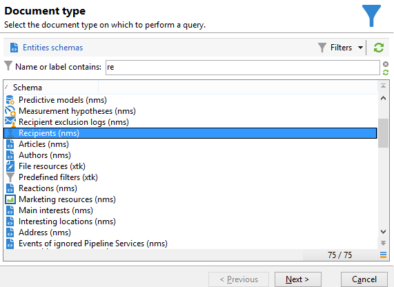

# Abfrage mit Gruppierungsverwaltung {#querying-using-grouping-management}

Im folgenden Beispiel werden die E-Mail-Domains gesucht, die bei früheren Sendungen mehr als 30-mal kontaktiert wurden.

* Welche Tabelle soll ausgewählt werden?

   Die Empfängertabelle (nms:recipient)

* Felder, die als Ausgabespalten verwendet werden sollen?

   E-Mail-Domain und Primärschlüssel (mit Zählung)

* Nach welchen Kriterien werden die Daten gruppiert?

   Nach E-Mail-Domain mit einer Primärschlüsselanzahl von über 30. Hierfür wird die Funktion **[!UICONTROL Gruppierungen verwalten (GROUP BY + HAVING)]** ) verwendet, welche sowohl die Gruppierung (&quot;group by&quot;) als auch die Filterung (&quot;having&quot;) der Daten erlaubt, die gruppiert wurden.****

Gehen Sie wie folgt vor:

1. Öffnen Sie das **[!UICONTROL generische Abfragetool]** und wählen Sie die Empfängertabelle (**nms:recipient**).

   

1. Wählen Sie im Fenster **[!UICONTROL Zu extrahierende Daten]** das Feld **[!UICONTROL E-Mail-Domain]** aus und konfigurieren Sie eine Zählung des Felds **[!UICONTROL Primärschlüssel]**.****

   Weiterführende Informationen zur Anzahl von Primärschlüsseln finden Sie hier:

1. Kreuzen Sie die Option **[!UICONTROL Gruppierungen verwalten (GROUP BY + HAVING)]** an.

   

1. Ordnen Sie im Fenster **[!UICONTROL Sortierung]** die E-Mail-Domains in absteigender Reihenfolge. Kreuzen Sie hierfür in der Spalte **[!UICONTROL Absteigende Sortierung]** die Option **[!UICONTROL Ja]** an. Klicken Sie anschließend auf **[!UICONTROL Weiter]**.

   

1. Wählen Sie im Fenster **[!UICONTROL Datenfilter]** die Option **[!UICONTROL Filterbedingungen]** und klicken Sie im Fenster **[!UICONTROL Zielelement]** auf **[!UICONTROL Weiter]**.
1. Klicken Sie im Fenster **[!UICONTROL Gruppierung der Daten]** auf **[!UICONTROL Hinzufügen]** und wählen Sie das Feld **[!UICONTROL E-Mail-Domain]** aus.

   Die Gruppierung (GROUP BY) erfolgt an dieser Stelle. Das Fenster wird nur angezeigt, wenn die Option **[!UICONTROL Gruppierungen verwalten (GROUP BY + HAVING)]** angekreuzt wurde.

   

1. Geben Sie anschließend im Fenster **[!UICONTROL Gruppierbedingung]** eine Primärschlüsselanzahl von über 30 an. So werden nur die E-Mail-Domains ausgegeben, die mehr als 30-mal kontaktiert wurden.

   Dieses Fenster wird ebenfalls nur angezeigt, wenn die Option **[!UICONTROL Gruppierungen verwalten (GROUP BY + HAVING)]** angekreuzt wurde. Hier erfolgt die Filterung des Ergebnisses der Gruppierung (HAVING).

   

1. Da in unserem Beispiel keine spezielle Formatierung erforderlich ist, können Sie im Fenster **[!UICONTROL Datenformatierung]** direkt auf **[!UICONTROL Weiter]** klicken.
1. Klicken Sie anschließend auf **[!UICONTROL Datenvorschau starten]**. Das Ergebnis zeigt nur eine E-Mail-Domain, die mehr als 30-mal kontaktiert wurde.

   
