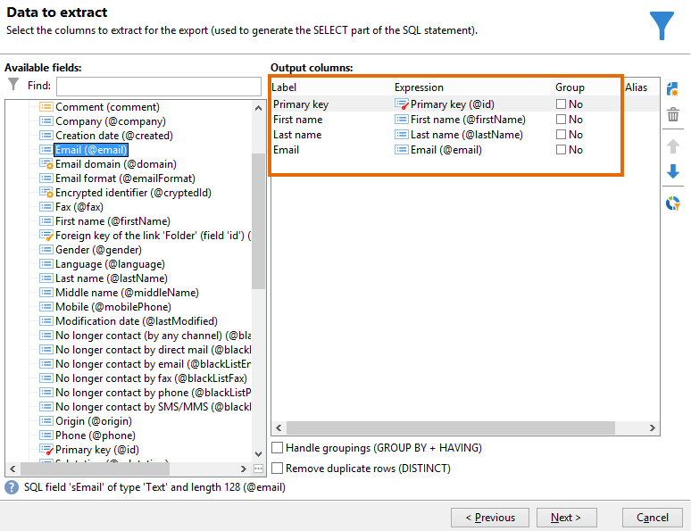
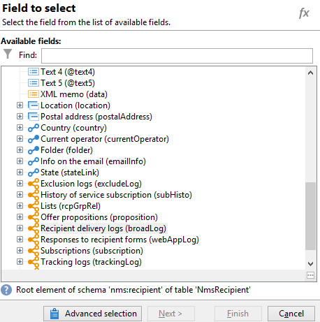
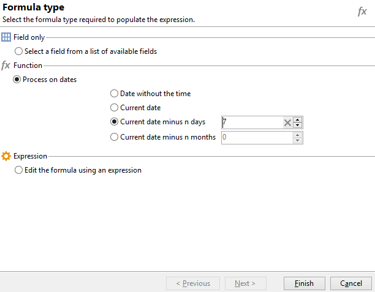

# Abfrage mit einer Viele-zu-viele-Beziehung {#querying-using-a-many-to-many-relationship}


In diesem Beispiel werden die Empfänger gesucht, die innerhalb der letzten sieben Tage nicht kontaktiert wurden.

Außerdem wird die Konfiguration eines von einem Sammlungselement (orangefarbener Knoten) ausgehenden Filters gezeigt. Auf Sammlungselemente kann im Fenster **[!UICONTROL Feldauswahl]** zugegriffen werden.

* Welche Tabelle soll ausgewählt werden?

   Die Empfängertabelle (**nms:recipient**)

* Felder, die als Ausgabespalten verwendet werden sollen?

   Primärschlüssel, Nachname, Vorname und E-Mail

* Nach welchen Kriterien sind die Empfänger zu filtern?

   Nach den Versandlogs der Empfänger, bis 7 Tage vor dem Tagesdatum

Gehen Sie wie folgt vor:

1. Öffnen Sie das generische Abfragetool und wählen Sie die Empfängertabelle (**[!UICONTROL nms:recipient]**).
1. Wählen Sie im Fenster **[!UICONTROL Zu extrahierende Daten]** die Felder **[!UICONTROL Primärschlüssel]**, **[!UICONTROL Vorname]**, **[!UICONTROL Nachname]** und **[!UICONTROL E-Mail]**.

   

1. Ordnen Sie im Sortierfenster die Nachnamen in alphabetischer Reihenfolge.

   

1. Wählen Sie dann im **[!UICONTROL Datenfilter]**-Fenster die Option **[!UICONTROL Filterbedingungen]**.
1. Anschließend wird im Fenster **[!UICONTROL Zielelement]** in zwei Schritten die gesuchte Filterbedingung erstellt. Es handelt sich bei dem auszuwählenden Kollektionselement um eine n:n-Relation.

   * Wählen Sie also im **[!UICONTROL Ausdruck]**-Feld das durch einen orangefarbenen Knoten symbolisierte Sammlungselement **[!UICONTROL Versandlogs der Empfänger (broadLog)]**.

      

      In diesem Fall ist der zu wählende Operator **[!UICONTROL nicht wie]** und es wird kein Wert angegeben.

   * Der Inhalt der zweiten Filterbedingung ergibt sich direkt aus der Wahl der ersten: Hier wird das Feld **[!UICONTROL Ereignisdatum]** aus der Tabelle **[!UICONTROL Versandlogs der Empfänger]** vorgeschlagen, da eine Relation mit dieser Tabelle besteht.

      

      Wählen Sie also **[!UICONTROL Ereignisdatum]** und den Operator **[!UICONTROL streng später als]** aus. Geben Sie den Wert **[!UICONTROL DaysAgo (7)]** ein. Klicken Sie hierzu im Feld **[!UICONTROL Wert]** auf **[!UICONTROL Ausdruck bearbeiten]**. Wählen Sie im Fenster **[!UICONTROL Formeltyp]** die Option **[!UICONTROL Datumsfunktionen]** und **[!UICONTROL Aktuelles Datum abzüglich n Tage]**. Geben Sie den Wert &quot;7&quot; ein.

      

      Hiermit ist die Konfiguration der Filterbedingung abgeschlossen.

      

1. Im Fenster **[!UICONTROL Datenformatierung]** können Sie die Anzeige dahingehend ändern, dass alle Nachnamen in Großbuchstaben angezeigt werden. Klicken Sie hierfür in der Zeile **[!UICONTROL Nachname]** auf **[!UICONTROL Schreibweise]** und wählen Sie **[!UICONTROL Alles in Großbuchstaben]** aus der Dropdownliste.

   

1. Verwenden Sie die Funktion **[!UICONTROL Berechnetes Feld hinzufügen]**, um eine neue Spalte zu erstellen.

   In unserem Beispiel sollen Vor- und Nachname in einer Spalte angezeigt werden. Klicken Sie also auf **[!UICONTROL Berechnetes Feld hinzufügen]** und geben Sie im Fenster **[!UICONTROL Definition eines berechneten Export-Feldes]** einen Titel und einen internen Namen für die neue Spalte ein. Wählen Sie den Typ **[!UICONTROL JavaScript-Ausdruck]** aus der Dropdown-Liste und erfassen Sie folgenden Ausdruck:

   ```
   var rep = source._firstName+" - "+source._lastName
   return rep
   ```

   

   Klicken Sie auf **[!UICONTROL OK]**. Die Konfiguration des **[!UICONTROL Datenformatierung]**-Fensters ist abgeschlossen.

   Weiterführende Informationen zum Hinzufügen berechneter Felder finden Sie in diesem Abschnitt.

1. Im Fenster **[!UICONTROL Datenvorschau]** können Sie das Ergebnis prüfen. Es werden die Empfänger angezeigt, die innerhalb der letzten sieben Tage vor dem aktuellen Tagesdatum nicht kontaktiert worden sind. Die Nachnamen sind in Großbuchstaben und alphabetisch geordnet. Eine weitere Spalte zeigt Vor- und Nachnamen in einem Feld an.

   
