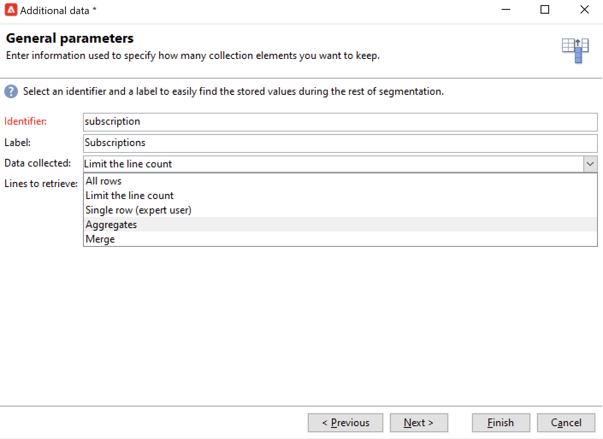
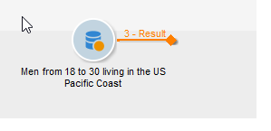

# Abfrage{#query}

## Erstellen einer Abfrage {#creating-a-query}

Über Abfragen lassen sich Zielgruppen anhand von Filterkriterien bestimmen. Es besteht die Möglichkeit, dem Abfrageergebnis einen Segment-Code zuzuweisen und es mit Zusatzdaten zu ergänzen.
Weitere Informationen zu Beispielen für Abfragen finden Sie in diesem [Abschnitt](querying-recipient-table.md).

Weitere Informationen zum Verwenden und Verwalten zusätzlicher Daten finden Sie unter [Hinzufügen von Daten](#adding-data).

Klicken Sie auf den Link **[!UICONTROL Abfrage bearbeiten...]** und gehen Sie wie folgt vor, um Zielgruppentyp, Beschränkungen und Auswahlkriterien der anzusprechenden Population zu definieren:

1. Wählen Sie zunächst Zielgruppen- und Filterdimension aus. Standardmäßig wird die Zielgruppe aus den Empfängern ausgewählt. Die vorgeschlagenen Einschränkungsfilter sind dieselben wie bei der Zielgruppenbestimmung in einem Versand.

   Die Zielgruppendimension bezeichnet den Elementtyp, der verwendet werden soll, beispielsweise die mit der Kampagne anzusprechende Population.

   Filterdimensionen ermöglichen die spezifische Auswahl der Elemente, beispielsweise nach Kriterien wie Verträgen, Altersgruppen etc.

   Weitere Informationen hierzu finden Sie unter [Zielgruppen- und Filterdimension](targeting-workflows.md#targeting-and-filtering-dimensions).

   

   Eine Abfrage kann sich bei Bedarf auf die Daten der eingehenden Transition beziehen. Aktivieren Sie in diesem Fall bei der Auswahl der Zielgruppen- und Filterdimension die Option **[!UICONTROL Temporäres Schema]**.

   

1. Definieren Sie mithilfe des Assistenten die Filterkriterien zur Auswahl der gewünschten Population. Je nach Zielgruppentyp können die angezeigten Felder unterschiedlich sein. Im **[!UICONTROL Vorschau]**-Tab können Sie prüfen, ob die angegebenen Kriterien das gewünschte Ergebnis liefern.

   

1. Fügen Sie gegebenenfalls manuell Filterkriterien hinzu, wenn Sie im ersten Schritt **[!UICONTROL Filterbedingungen]** gewählt haben, oder verwenden Sie die Option **[!UICONTROL Filter]** > **[!UICONTROL Erweiterte Filter...]**.

   Es besteht darüber hinaus die Möglichkeit, die gefilterten Daten zu gruppieren. Dies ist jedoch nur möglich, wenn die Filterdimension nicht mit der Zielgruppendimension identisch ist. Weiterführende Informationen finden Sie in diesem [Abschnitt](query-grouping-management.md).

   Sie können auch weitere Kriterien hinzufügen, indem Sie den Expression Builder verwenden und ihn mit den logischen Optionen AND, OR und EXCEPT kombinieren.

   Speichern Sie Ihren Filter, um ihn später erneut verwenden zu können.

## Hinzufügen von Daten {#adding-data}

Es besteht die Möglichkeit, in Workflows zusätzliche Informationen über die Zielgruppe zu verwenden. Dies können beispielsweise Versicherungsnummern, Abonnements von bestimmten Newslettern oder die Herkunft der Empfänger sein. Diese Informationen können entweder aus der Adobe-Campaign-Datenbank oder aus externen Datenbanken stammen.

Die Auswahl dieser Zusatzinformationen erfolgt über den Link **[!UICONTROL Daten hinzufügen...]**.

Wählen Sie im ersten Fenster des Assistenten zunächst den Typ der hinzuzufügenden Daten aus:

* Die Option **[!UICONTROL Daten in Relation mit der Filterdimension]** erlaubt den Zugriff auf Daten aus der Adobe-Campaign-Datenbank.
* Die Option **[!UICONTROL Externe Daten]** erlaubt den Zugriff auf Daten aus einer externen Datenbank. Für diese Option benötigen Sie das optionale Modul **Federated Data Access**. Weitere Informationen hierzu finden Sie unter [Zugriff auf eine externe Datenbank (FDA)](accessing-an-external-database--fda-.md).
* Die Option **[!UICONTROL Angebotsvorschlag]** erlaubt den Zugriff auf den jeweils besten, vom Angebotsmodul erzeugten Vorschlag. Hierfür benötigen Sie das optionale Modul **Interaction**.

Wenn keines der o. g. Module auf Ihrer Plattform installiert ist, überspringt der Assistent das Auswahlfenster. Sie werden direkt zum nächsten Schritt weitergeleitet.

Gehen Sie folgendermaßen vor, um Daten aus der Adobe-Campaign-Datenbank hinzuzufügen:

1. Wählen Sie den Datentyp aus, der hinzugefügt werden soll. Hierbei kann es sich um Daten der Filterdimension direkt oder Daten aus in Relation zur Filterdimension stehenden Tabellen handeln.

   

1. Wenn die Daten aus der Filterdimension der Abfrage stammen, können Sie sie direkt aus der Liste der verfügbaren Felder auswählen, um sie in den Ausgabespalten anzuzeigen.

   

   Hinzugefügt werden können des Weiteren:

   * Aus Daten der Zielpopulation berechnete Felder oder Aggregate (z. B. Anzahl an ausstehenden Käufen im vergangenen Monat, durchschnittlicher Warenkorb usw.). Ein Beispiel finden Sie unter [Auswählen von Daten](targeting-workflows.md#selecting-data).
   * Neue Felder (über die Schaltfläche **[!UICONTROL Hinzufügen]** rechts von der Liste der Ausgabespalten).

      Es ist darüber hinaus möglich, Informationssammlungen hinzuzufügen, beispielsweise eine Vertragsliste, die letzten fünf Sendungen usw. Sammlungen entsprechen Feldern, die für ein Profil mehrere Werte aufweisen können (1:n-Relation). Weitere Informationen hierzu finden Sie unter [Bearbeiten zusätzlicher Daten](targeting-workflows.md#editing-additional-data).

Gehen Sie folgendermaßen vor, um eine mit einer Zielpopulation verknüpfte Informationssammlung hinzuzufügen:

1. Wählen Sie im ersten Schritt des Assistenten die Option **[!UICONTROL Daten in Relation mit der Filterdimension]** aus.
1. Markieren Sie die Tabelle, die die abzurufenden Informationen enthält und klicken Sie auf **[!UICONTROL Weiter]**.

   

1. Geben Sie bei Bedarf die Anzahl an Sammlungselementen an, die Sie beibehalten möchten, indem Sie aus der Dropdown-Liste des Felds **[!UICONTROL Abgerufene Daten]** den gewünschten Wert auswählen. Standardmäßig werden alle Zeilen der Sammlung abgerufen und nach den im nächsten Schritt definierten Bedingungen gefiltert.

   * Wenn nur ein Sammlungselement den Filterbedingungen entspricht, ist die Option **[!UICONTROL Nur eine Zeile]** im Feld **[!UICONTROL Abgerufene Daten]** auszuwählen.

      >[!IMPORTANT]
      >
      >Dieser Modus optimiert die erzeugte SQL-Abfrage, da ein direkter Join auf die Sammlungselemente erstellt wird.
      >
      >Wenn die ursprüngliche Bedingung nicht respektiert wird, kann das Ergebnis falsch sein (fehlende Zeilen oder Dubletten).

   * Wenn Sie mehrere Zeilen abrufen möchten (**[!UICONTROL Zeilenanzahl begrenzen]**), können Sie die Anzahl an abzurufenden Zeilen angeben.
   * Wenn die abgerufenen Spalten Aggregate enthalten, beispielsweise die Anzahl an Versicherungsfällen, der durchschnittliche Warenkorb in einem POS etc., kann die Option **[!UICONTROL Aggregate]** verwendet werden.

   

1. Geben Sie die Unterauswahl der Sammlung an.

   

1. Wenn Sie die Option **[!UICONTROL Zeilenanzahl begrenzen]** gewählt haben, ist eine Sortierreihenfolge zu definieren. Dies ermöglicht es, die beizubehaltenden Daten zu bezeichnen, wenn die Anzahl an abgerufenen Zeilen die Anzahl an Zeilen übersteigt, die Sie beibehalten möchten.

## Beispiel: Zielgruppenbestimmung anhand einfacher Empfängerattribute {#example--targeting-on-simple-recipient-attributes}

In folgendem Beispiel sollen alle Männer zwischen 18 und 30 Jahre identifiziert werden, die in Deutschland leben. Die Abfrage könnte in einem Workflow Verwendung finden, der ein speziell an diese Zielgruppe gerichtetes Angebot versendet. Gehen Sie wie folgt vor:

>[!NOTE]
>
>Beispiele für zusätzliche Abfragen werden in [diesem Abschnitt](querying-recipient-table.md) beschrieben.

1. Benennen Sie die Abfrage und klicken Sie auf den Link **[!UICONTROL Abfrage bearbeiten...]**.
1. Wählen Sie aus der Liste der verfügbaren Filter die Option **[!UICONTROL Filterbedingungen]** aus.
1. Konfigurieren Sie die verschiedenen Kriterien für die gesuchte Zielgruppe. Im vorliegenden Beispiel werden die einzelnen Kriterien mit dem Operator UND verknüpft. Die Empfänger müssen also die vier folgenden Bedingungen erfüllen:

   * Anrede gleich &quot;Herr&quot; (oder **Geschlecht** gleich **Männlich**),
   * Alter kleiner als 30 Jahre.
   * Alter größer als 18 Jahre.
   * Land gleich Deutschland.

   

   Der der Abfrage entsprechende SQL-Code stellt sich wie folgt dar:

   

1. Prüfen Sie das Abfrageergebnis im Vorschau-Tab:

   

1. Speichern Sie bei Bedarf die Abfrage und klicken Sie auf **[!UICONTROL Beenden]** > **[!UICONTROL OK]**.
1. Vervollständigen Sie den Workflow mit weiteren Aktivitäten und starten Sie ihn. Nach Ausführung der Abfrage wird das Ergebnis auf der ausgehenden Transition angezeigt. Sie können das Ergebnis im Detail ansehen, indem Sie einen Rechtsklick auf der Transition machen und im Kontextmenü die Option **[!UICONTROL Ergebnis anzeigen...]** auswählen.

   

## Ausgabeparameter {#output-parameters}

* tableName
* schema
* recCount

Anhand der drei Werte lässt sich die durch den Ausschluss ermittelte Zielgruppe identifizieren. **[!UICONTROL tableName]** ist der Name der Tabelle, welche die Kennungen der Zielgruppenempfänger enthält, **[!UICONTROL schema]** ist das Schema der Population, (i. d. R. nms:recipient) und **[!UICONTROL recCount]** ist die Anzahl an Elementen in der Tabelle.

Dieser Wert bezeichnet das Schema der Arbeitstabelle. Dieser Parameter ist für alle Transitionen mit **[!UICONTROL tableName]** und **[!UICONTROL schema]** gültig.

## Abfragen optimieren {#optimizing-queries}

Im folgenden Abschnitt finden Sie Best Practices zur Optimierung der in Adobe Campaign ausgeführten Abfragen, um den Arbeitsaufwand für die Datenbank zu begrenzen und die Benutzerfreundlichkeit zu verbessern.

### Joins und Indizes {#joins-and-indexes}

* Effiziente Abfragen beruhen auf Indizes.
* Verwenden Sie einen Index für alle Joins.
* Durch die Definition von Links im Schema werden die Joinbedingungen festgelegt. Die verknüpfte Tabelle sollte einen eindeutigen Index für den Primärschlüssel haben und der Join sollte sich in diesem Feld befinden.
* Führen Sie Joins durch, indem Sie Schlüssel für numerische Felder anstelle von Zeichenfolgenfeldern definieren.
* Vermeiden Sie äußere Joins. Verwenden Sie nach Möglichkeit den Null-ID-Datensatz, um eine äußere Join-Funktion zu erhalten.
* Verwenden Sie den richtigen Datentyp für Joins.

   Stellen Sie sicher, dass die `where`-Klausel vom gleichen Typ wie das Feld ist.

   Ein häufiger Fehler ist `iBlacklist='3'`, wobei `iBlacklist` ein numerisches Feld und `3` ein Textwert ist.

   Informieren Sie sich über den Ausführungsplan Ihrer Anfrage. Vermeiden Sie vollständige Tabellen-Scans, insbesondere bei Echtzeitabfragen oder Abfragen nahezu in Echtzeit, die jede Minute ausgeführt werden.

### Funktionen {#functions}

* Vorsicht vor Funktionen wie `Lower(...)`. Wenn die Funktion „Lower“ verwendet wird, wird der Index nicht verwendet.
* Überprüfen Sie Abfragen mit der Anweisung „Like“ oder den Anweisungen „Upper“ und „Lower“ sorgfältig. Wenden Sie „Upper“ auf die Benutzereingabe an, nicht auf das Datenbankfeld.

### Filterdimensionen {#filtering-dimensions}

Verwenden Sie die Filterdimension der Abfrage, anstatt den Operator „wie“ zu verwenden.

In Abfragen sind „wie“-Bedingungen in Filtern nicht effizient. Sie entsprechen einer Subabfrage in SQL:

`select iRecipientId from nmsRecipient where iRecipientId IN (select iRecipientId from nmsBroadLog where (...))`

Am besten verwenden Sie stattdessen die Filterdimension der Abfrage:

Das Äquivalent der Filterdimension in SQL ist der innere Join:

`select iRecipientId from nmsRecipient INNER JOIN nmsBroadLog ON (...)`

Weitere Informationen zu Filterdimension finden Sie in [diesem Abschnitt](build-a-workflow.md#targeting-and-filtering-dimensions).

### Architektur {#architecture}

* Erstellen Sie eine Entwicklungsplattform mit ähnlichen Umfängen, Parametern und Architekturen wie die Produktionsplattform.
* Verwenden Sie dieselben Werte für die Entwicklungs- und Produktionsumgebungen. Wenn möglich, sollten die folgenden Einstellungen dieselben sein:

   * Betriebssystem,
   * Version,
   * Daten,
   * Anwendung,
   * Umfänge.

   >[!NOTE]
   >
   >Eine Funktion, die in einer Entwicklungsumgebung funktioniert, funktioniert möglicherweise nicht in einer Produktionsumgebung, in der die Daten unterschiedlich sein können. Versuchen Sie, die Hauptunterschiede zu identifizieren, um Risiken vorherzusehen und Lösungen vorzubereiten.

* Bereiten Sie Konfigurationen vor, die mit den Zielgruppenumfängen übereinstimmen. Große Umfänge erfordern spezifische Konfigurationen. Eine Konfiguration, die für 100.000 Empfänger funktionierte, funktioniert möglicherweise nicht für 10.000.000 Empfänger.

   Überlegen Sie, wie das System skaliert wird, wenn es live geschaltet wird. Nur weil etwas in kleinem Maßstab funktioniert, heißt das nicht, dass es sich auch für größere Mengen eignet. Die Tests sollten mit ähnlichen Umfängen wie der Umfang in der Produktion durchgeführt werden. Sie sollten auch die Auswirkungen von Änderungen der Umfänge (Anzahl der Aufrufe, Größe der Datenbank) zu Spitzenzeiten, an Spitzentagen und während der gesamten Projektlaufzeit bewerten.
