# Abfrage{#query}

## Erstellen einer Abfrage {#creating-a-query}

Mit einer Abfrage können Sie eine Zielgruppe anhand von Kriterien auswählen. Sie können dem Abfrageergebnis einen Segment-Code zuordnen und zusätzliche Daten darin einfügen.
In diesem Abschnitt erfahren Sie, wie Sie anhand von Anwendungsfällen [ Abfragen ](querying-recipient-table.md). Siehe auch den Abschnitt über den [Abfrage-Editor](../../v8/start/query-editor.md).

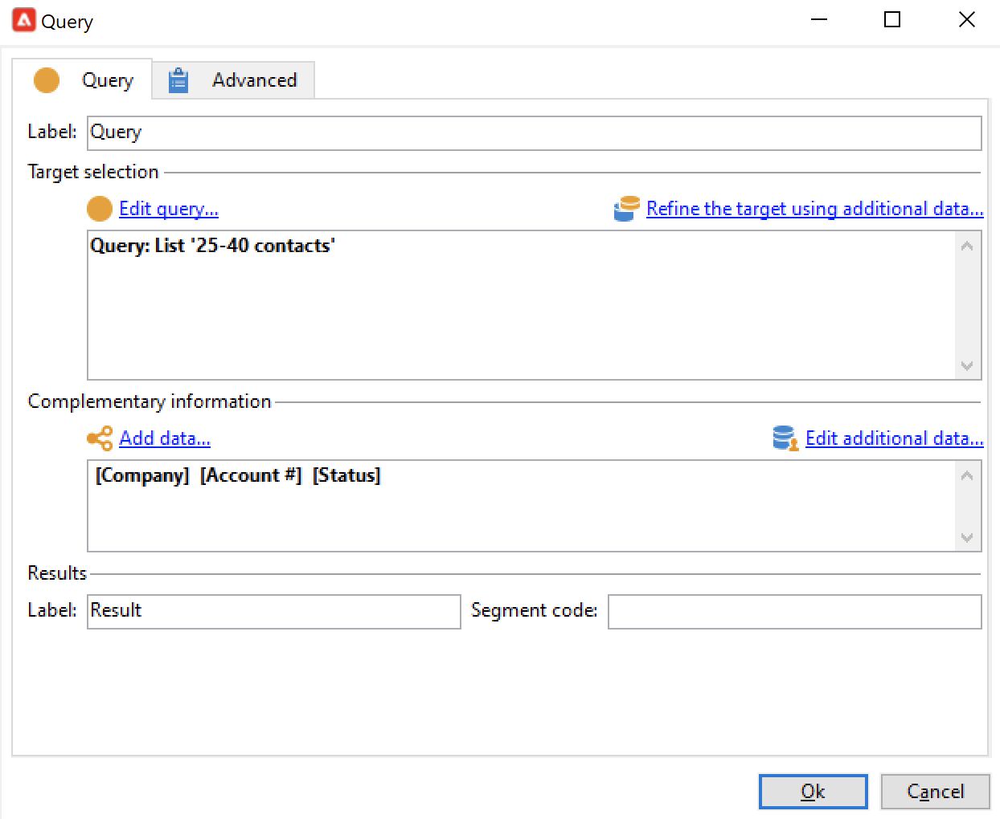{width="70%" align="center" zoomable="yes"}

>[!NOTE]
>
>Die Web-Benutzeroberfläche von Adobe Campaign bietet einen leistungsstarken Abfragemodellierer, der den Prozess der Datenbankfilterung vereinfacht, um bestimmte Ziele basierend auf verschiedenen Kriterien auszuwählen, sodass Sie Ihre Abfrage einfacher erstellen und verwalten können. Weitere Informationen zum Abfrage-Modeler für die Web-Benutzeroberfläche finden Sie in der [Dokumentation zur Campaign Web-Benutzeroberfläche](https://experienceleague.adobe.com/de/docs/campaign-web/v8/query-database/query-modeler-overview){target=_blank}.

Klicken Sie auf den Link **[!UICONTROL Abfrage bearbeiten...]** und gehen Sie wie folgt vor, um Zielgruppenbestimmungstyp, Beschränkungen und Auswahlkriterien der anzusprechenden Population zu definieren:

1. Zielgruppenbestimmungs- und Filterdimension auswählen. Standardmäßig wird die Zielgruppe aus den Empfängerinnen und Empfängern ausgewählt. Die Liste der Einschränkungsfilter entspricht der Liste für die Versand-Zielgruppenbestimmung.

   Die Zielgruppendimension bezeichnet den Elementtyp, der verwendet werden soll, beispielsweise die mit der Kampagne anzusprechende Population.

   Filterdimensionen ermöglichen die spezifische Auswahl der Elemente, beispielsweise nach Kriterien wie Verträgen, Altersgruppen etc.

   Weitere Informationen hierzu finden Sie unter [Zielgruppenbestimmungs- und Filterdimension](targeting-workflows.md#targeting-and-filtering-dimensions).

   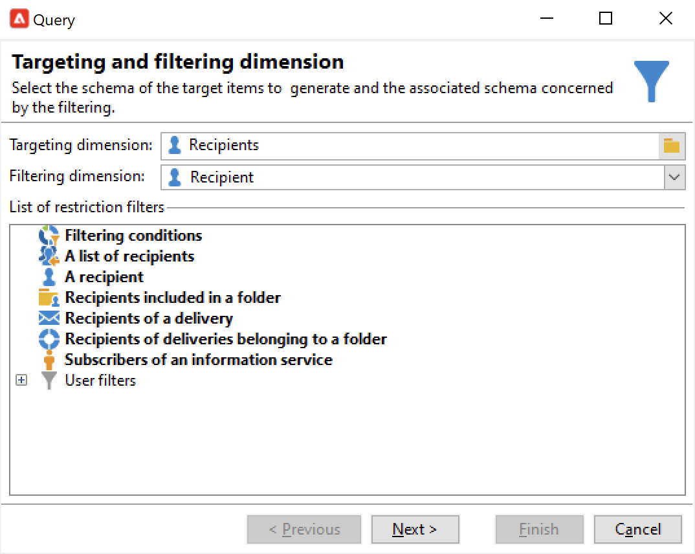{width="70%" align="center" zoomable="yes"}

   Eine Abfrage kann sich bei Bedarf auf die Daten der eingehenden Transition beziehen. Aktivieren Sie in diesem Fall bei der Auswahl der Zielgruppenbestimmungs- und Filterdimension die Option **[!UICONTROL Temporäres Schema]**.

   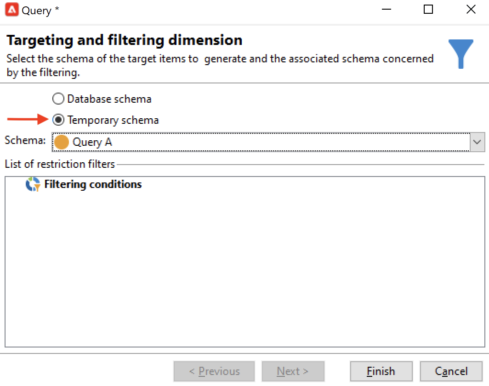{width="70%" align="center" zoomable="yes"}

1. Definieren Sie die Populationen mithilfe des Assistenten. Je nach Zielgruppentyp können die angezeigten Felder unterschiedlich sein. Sie können die Vorschau der Zielpopulation mit Ihren aktuellen Kriterien über die Registerkarte **[!UICONTROL Vorschau]** anzeigen.

   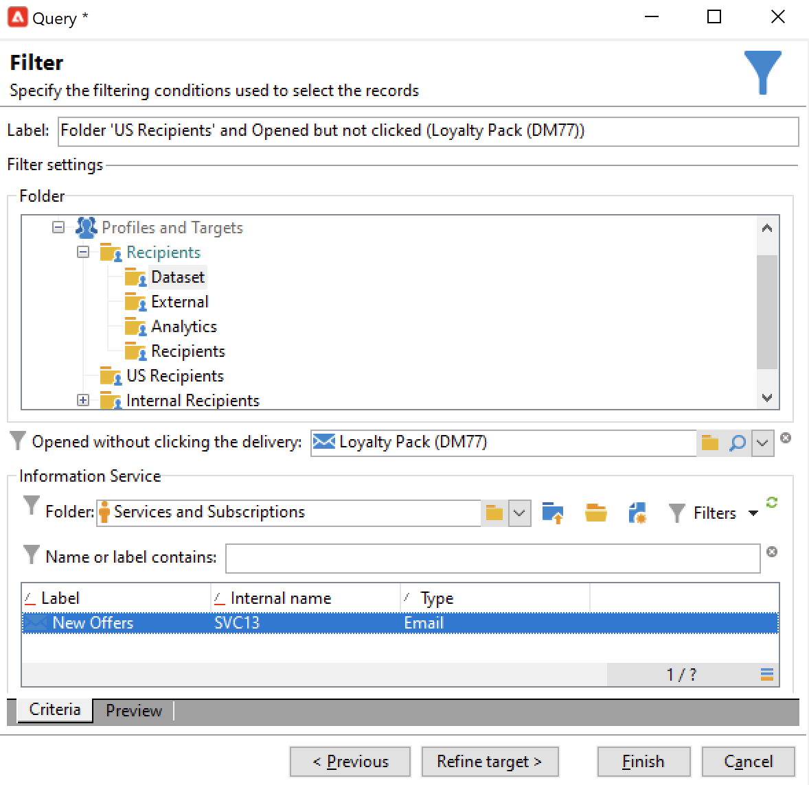{width="70%" align="center" zoomable="yes"}

1. Wenn Sie in Schritt 1 **[!UICONTROL Filterbedingungen]** ausgewählt haben oder die Option **[!UICONTROL Filter]** > **[!UICONTROL Erweiterter Filter…]** verwenden, müssen Sie später manuell Filterkriterien hinzufügen.

   Sie können auch Bedingungen für die Datengruppierung hinzufügen, indem Sie das entsprechende Kontrollkästchen aktivieren. Dazu muss sich die Filterdimension von der Zielgruppendimension der Abfrage unterscheiden. Weiterführende Informationen finden Sie in [diesem Abschnitt](query-grouping-management.md).

   Sie können auch weitere Kriterien hinzufügen, indem Sie den [Ausdrucksgenerator](../../v8/start/filter-conditions.md#using-and--or--except) verwenden und ihn mit den logischen Optionen AND, OR und EXCEPT kombinieren.

   Speichern Sie Ihren Filter, um ihn später erneut verwenden zu können.

## Hinzufügen von Daten {#adding-data}

Über die zusätzlichen Spalten können Sie zusätzliche Informationen zur Zielpopulation erfassen, z. B. Vertragsnummern, Newsletter-Abonnements oder Herkunft. Diese Daten können in der Adobe Campaign-Datenbank oder in einer externen Datenbank gespeichert werden.

Die Auswahl dieser Zusatzinformationen erfolgt über den Link **[!UICONTROL Daten hinzufügen...]**.

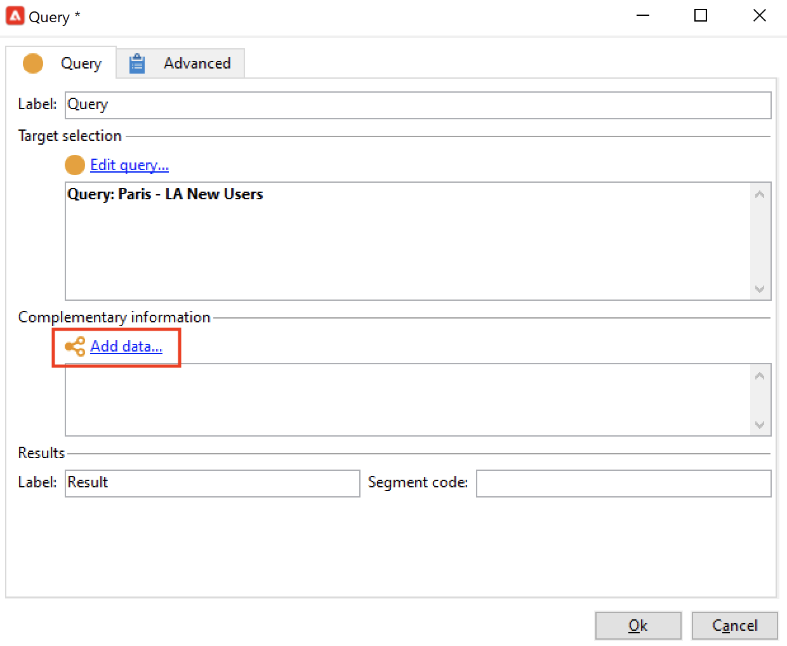{width="70%" align="center" zoomable="yes"}

Wählen Sie im ersten Fenster des Assistenten zunächst den Typ der hinzuzufügenden Daten aus:

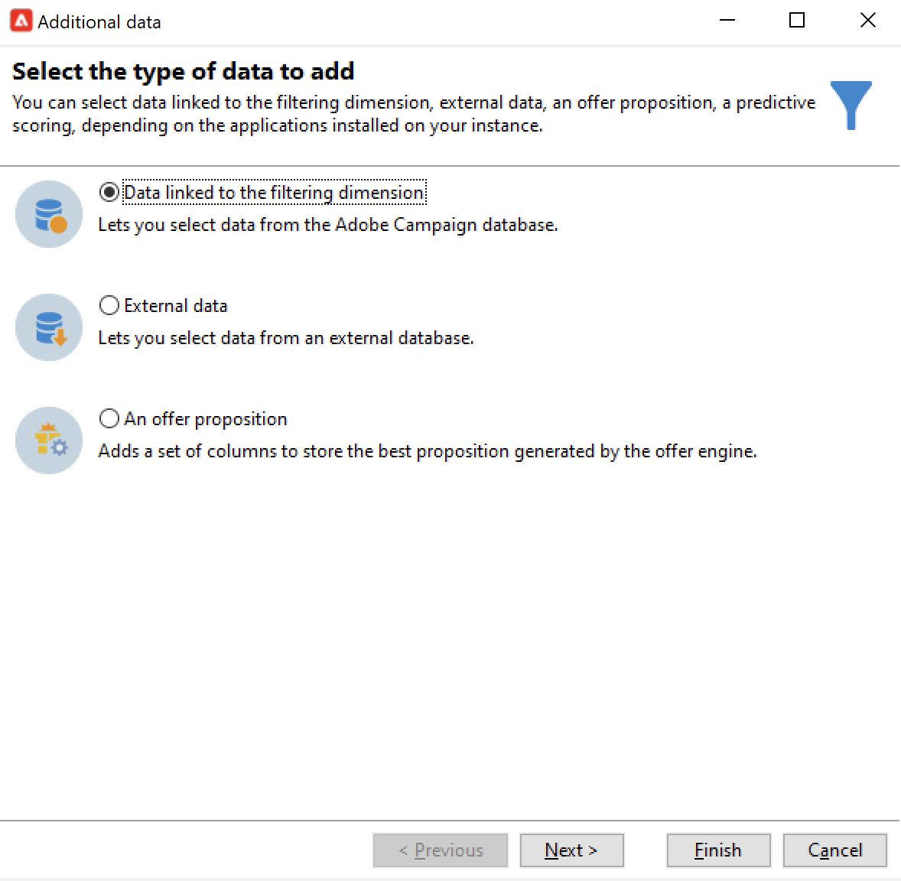{width="70%" align="center" zoomable="yes"}

* Die Option **[!UICONTROL Daten in Relation mit der Filterdimension]** erlaubt den Zugriff auf Daten aus der Adobe Campaign-Datenbank.
* Wählen Sie **[!UICONTROL Externe Daten]** aus, um Daten aus einer externen Datenbank hinzuzufügen. Diese Option ist nur verfügbar, wenn Sie die Option **Federated Data Access** erworben haben. Weitere Informationen hierzu finden Sie unter [Zugriff auf eine externe Datenbank (FDA)](accessing-an-external-database-fda.md).
* Wählen Sie die Option **[!UICONTROL Angebotsvorschlag]** aus, um einen Spaltensatz hinzuzufügen, mit dem Sie den besten, vom Angebotsmodul erzeugten Vorschlag speichern können. Diese Option ist nur verfügbar, wenn Sie das Modul **Interaktion** erworben haben.

Wenn kein optionales Modul auf der Plattform installiert ist, wird dieser Schritt nicht angezeigt. Sie werden direkt zur nächsten Stufe weitergeleitet.

Gehen Sie folgendermaßen vor, um Daten aus der Adobe Campaign-Datenbank hinzuzufügen:

1. Wählen Sie den Datentyp aus, den Sie hinzufügen möchten. Dabei kann es sich um Daten handeln, die zur Filterdimension gehören, oder um Daten, die in verknüpften Tabellen gespeichert sind.

   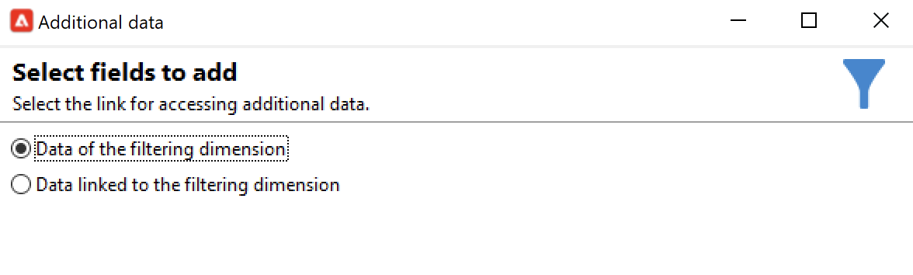{width="70%" align="center" zoomable="yes"}

1. Wenn die Daten aus der Filterdimension der Abfrage stammen, können Sie sie direkt aus der Liste der verfügbaren Felder auswählen, um sie in den Ausgabespalten anzuzeigen.

   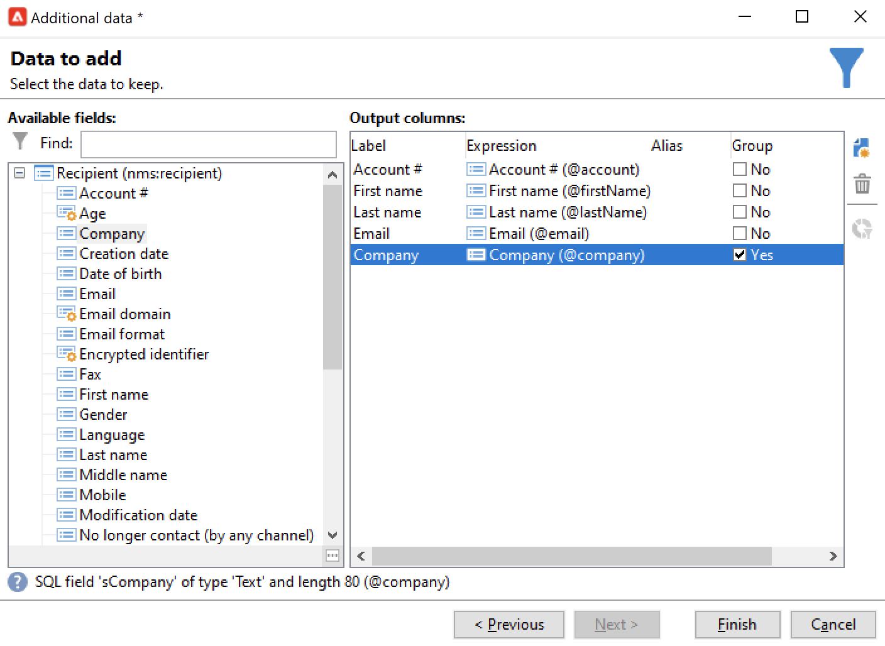{width="70%" align="center" zoomable="yes"}

   Hinzugefügt werden können des Weiteren:

   * Aus Daten der Zielpopulation berechnete Felder oder Aggregate (z. B. Anzahl an ausstehenden Käufen im vergangenen Monat, durchschnittlicher Warenkorb usw.). Ein Beispiel finden Sie unter [Auswählen von Daten](targeting-workflows.md#selecting-data).
   * Neue Felder (über die Schaltfläche **[!UICONTROL Hinzufügen]** rechts von der Liste der Ausgabespalten).

     Es ist darüber hinaus möglich, Informationssammlungen hinzuzufügen, beispielsweise eine Vertragsliste, die letzten fünf Sendungen usw. Sammlungen entsprechen Feldern, die für ein Profil mehrere Werte aufweisen können (1:n-Relation). Weitere Informationen hierzu finden Sie unter [Bearbeiten zusätzlicher Daten](targeting-workflows.md#editing-additional-data).

Gehen Sie folgendermaßen vor, um eine mit einer Zielpopulation verknüpfte Informationssammlung hinzuzufügen:

1. Wählen Sie im ersten Schritt des Assistenten die Option **[!UICONTROL Daten in Relation mit der Filterdimension]** aus.
1. Markieren Sie die Tabelle, die die abzurufenden Informationen enthält und klicken Sie auf **[!UICONTROL Weiter]**.

   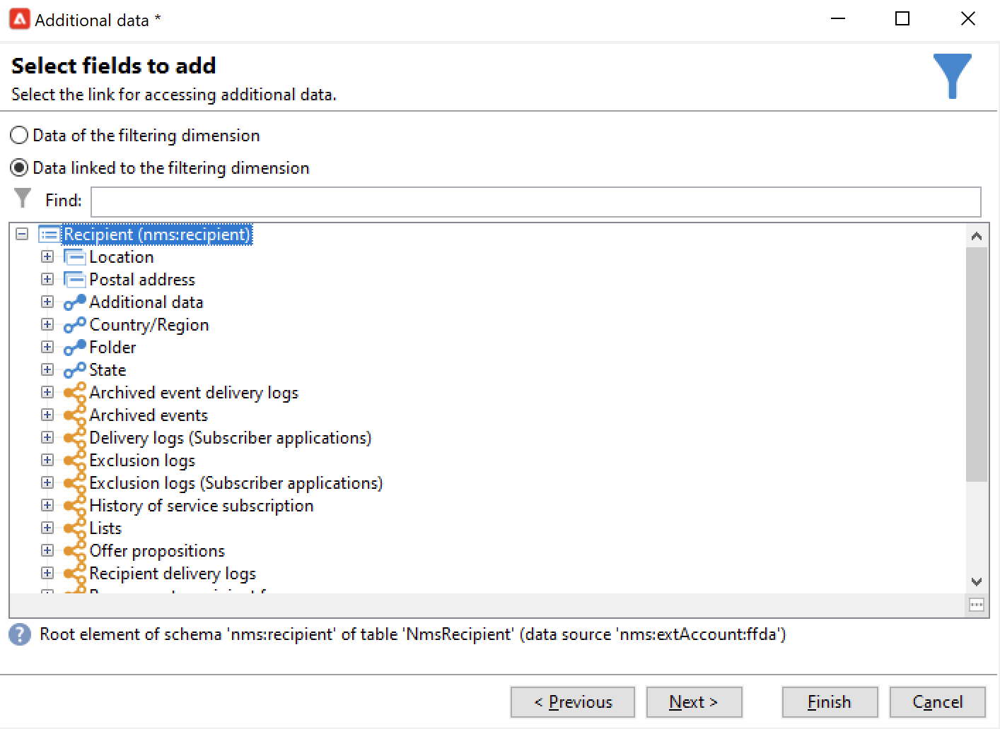{width="70%" align="center" zoomable="yes"}

1. Geben Sie ggf. die Anzahl der Elemente der Sammlung an, die Sie beibehalten möchten, indem Sie einen der Werte im Feld **[!UICONTROL Erfasste Daten]** auswählen. Standardmäßig werden alle Zeilen der Sammlung wiederhergestellt und dann entsprechend den im folgenden Schritt angegebenen Bedingungen gefiltert.

   * Wenn nur ein Sammlungselement den Filterbedingungen entspricht, ist die Option **[!UICONTROL Nur eine Zeile]** im Feld **[!UICONTROL Abgerufene Daten]** auszuwählen.

     >[!IMPORTANT]
     >
     >Dieser Modus optimiert die erzeugte SQL-Abfrage, da ein direkter Join auf die Sammlungselemente erstellt wird.
     >
     >Wenn die ursprüngliche Bedingung nicht respektiert wird, kann das Ergebnis falsch sein (fehlende Zeilen oder Dubletten).

   * Wenn Sie mehrere Zeilen abrufen möchten (**[!UICONTROL Zeilenanzahl begrenzen]**), können Sie die Anzahl an abzurufenden Zeilen angeben.
   * Wenn die erfassten Spalten Aggregate enthalten, z. B. die Anzahl der deklarierten Fehler, durchschnittliche Kosten für eine Site usw., können Sie den Wert **[!UICONTROL Aggregate]** verwenden.

   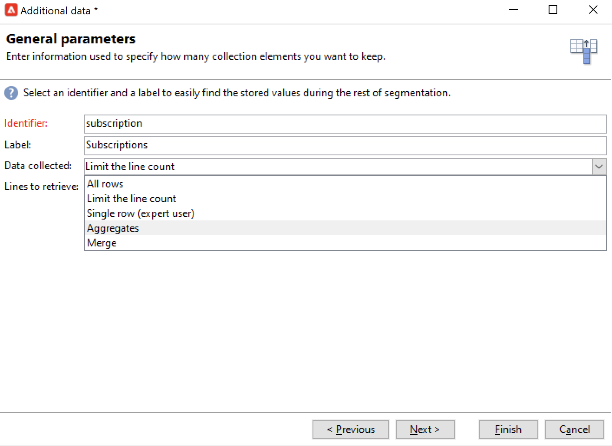{width="70%" align="center" zoomable="yes"}

1. Geben Sie die Unterauswahl der Sammlung an.

   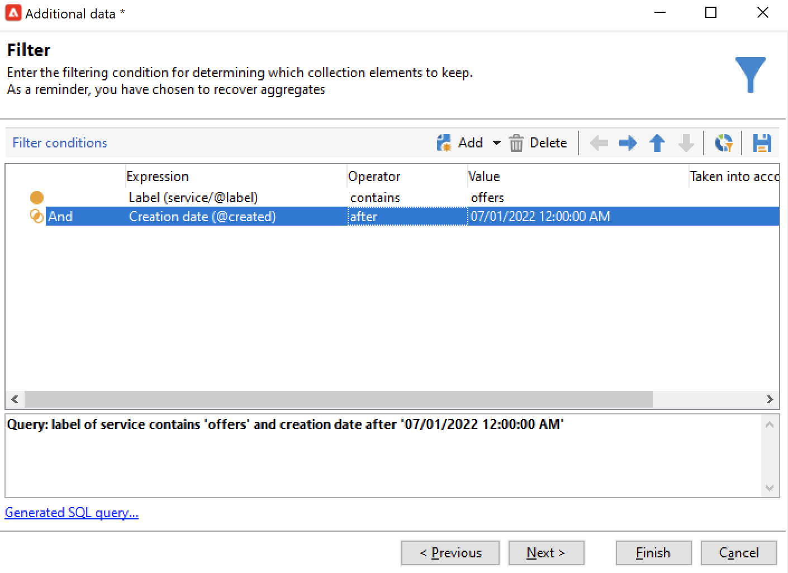{width="70%" align="center" zoomable="yes"}

1. Wenn Sie die Option **[!UICONTROL Zeilenanzahl begrenzen]** ausgewählt haben, definieren Sie die Reihenfolge, in der die erfassten Daten gefiltert werden sollen. Sobald die Anzahl der abgerufenen Zeilen die Anzahl der Zeilen übersteigt, die Sie beibehalten möchten, können Sie mit der Filterreihenfolge festlegen, welche Zeilen beibehalten werden sollen.

## Beispiel: Zielgruppenbestimmung anhand einfacher Empfängerattribute {#example--targeting-on-simple-recipient-attributes}

Im folgenden Beispiel soll die Abfrage Männer zwischen 18 und 30 Jahren identifizieren, die in Frankreich leben. Diese Abfrage wird beispielsweise in einem Workflow verwendet, der darauf abzielt, aus ihnen ein exklusives Angebot zu machen.

>[!NOTE]
>
>Beispiele für zusätzliche Abfragen werden in [diesem Abschnitt](querying-recipient-table.md) beschrieben.

1. Benennen Sie die Abfrage und klicken Sie auf den Link **[!UICONTROL Abfrage bearbeiten...]**.
1. Wählen Sie aus der Liste der verfügbaren Filter die Option **[!UICONTROL Filterbedingungen]** aus.
1. Geben Sie die verschiedenen Kriterien für die vorgeschlagene Zielgruppe ein. In diesem Fall werden die Kriterien mithilfe der Option und kombiniert. Um in die Auswahl einbezogen zu werden, müssen die Empfänger die folgenden vier Bedingungen erfüllen:

   * Anrede gleich &quot;Herr&quot; (oder **Geschlecht** gleich **Männlich**),
   * Alter kleiner als 30 Jahre.
   * Alter größer als 18 Jahre.
   * Land gleich Deutschland.

   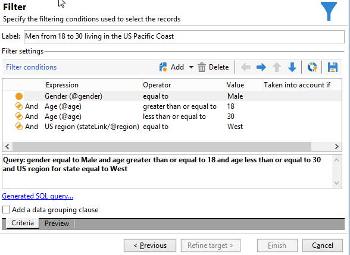{width="70%" align="center" zoomable="yes"}

   Der der Abfrage entsprechende SQL-Code stellt sich wie folgt dar:

   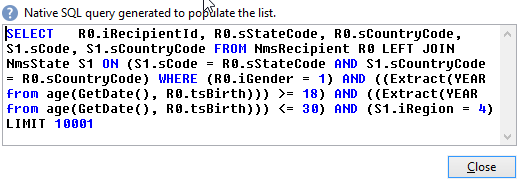{width="70%" align="center" zoomable="yes"}

1. Prüfen Sie das Abfrageergebnis im Vorschau-Tab:

   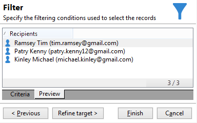{width="70%" align="center" zoomable="yes"}

1. Speichern Sie bei Bedarf die Abfrage und klicken Sie auf **[!UICONTROL Beenden]** > **[!UICONTROL OK]**.
1. Fahren Sie mit der Bearbeitung Ihres Workflows fort, indem Sie ihm weitere Aktivitäten hinzufügen. Sobald er gestartet wurde und der vorherige Abfrageschritt abgeschlossen ist, wird die Anzahl der gefundenen Empfänger angezeigt. Weitere Details können per Maus mit dem Popup-Menü angezeigt werden (Rechtsklick auf die Transition > **[!UICONTROL Zielgruppe anzeigen…]**).

   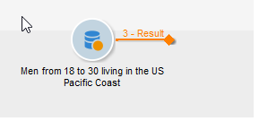{width="70%" align="center" zoomable="yes"}

## Ausgabeparameter {#output-parameters}

* tableName
* schema
* recCount

Anhand der drei Werte lässt sich die durch die Abfrage ermittelte Population identifizieren. **[!UICONTROL tableName]** ist der Name der Tabelle, die die Zielgruppen-IDs enthält, **[!UICONTROL schema]** ist das Schema der Population, (i. d. R. nms:recipient) und **[!UICONTROL recCount]** ist die Anzahl der Elemente in der Tabelle.

Dieser Wert ist das Schema der Arbeitstabelle. Dieser Parameter ist für alle Transitionen mit **[!UICONTROL tableName]** und **[!UICONTROL schema]** gültig.

## Abfragen optimieren {#optimizing-queries}

Im folgenden Abschnitt finden Sie Best Practices zur Optimierung der in Adobe Campaign ausgeführten Abfragen, um den Arbeitsaufwand für die Datenbank zu begrenzen und die Benutzerfreundlichkeit zu verbessern.

### Joins und Indizes {#joins-and-indexes}

* Effiziente Abfragen beruhen auf Indizes.
* Verwenden Sie einen Index für alle Joins.
* Durch die Definition von Links im Schema werden die Joinbedingungen festgelegt. Die verknüpfte Tabelle sollte einen eindeutigen Index für den Primärschlüssel haben und der Join sollte sich in diesem Feld befinden.
* Führen Sie Joins durch, indem Sie Schlüssel für numerische Felder anstelle von Zeichenfolgenfeldern definieren.
* Vermeiden Sie äußere Joins. Verwenden Sie nach Möglichkeit den Null-ID-Datensatz, um eine äußere Join-Funktion zu erhalten.
* Verwenden Sie den richtigen Datentyp für Joins.

  Stellen Sie sicher, dass die `where`-Klausel vom gleichen Typ wie das Feld ist.

  Ein häufiger Fehler ist `iBlacklist='3'`, wobei `iBlacklist` ein numerisches Feld und `3` ein Textwert ist.

  Informieren Sie sich über den Ausführungsplan Ihrer Abfrage. Vermeiden Sie vollständige Tabellen-Scans, insbesondere bei Echtzeitabfragen oder Abfragen nahezu in Echtzeit, die jede Minute ausgeführt werden.

### Funktionen {#functions}

* Vorsicht vor Funktionen wie `Lower(...)`. Wenn die Funktion „Lower“ verwendet wird, wird der Index nicht verwendet.
* Überprüfen Sie Abfragen mit der Anweisung „Like“ oder den Anweisungen „Upper“ und „Lower“ sorgfältig. Wenden Sie „Upper“ auf die Benutzereingabe an, nicht auf das Datenbankfeld.

### Filterdimensionen {#filtering-dimensions}

Verwenden Sie die Filterdimension der Abfrage, anstatt den Operator „wie“ zu verwenden.

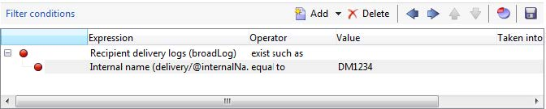{width="70%" align="center" zoomable="yes"}

In Abfragen sind „wie“-Bedingungen in Filtern nicht effizient. Sie entsprechen einer Subabfrage in SQL:

`select iRecipientId from nmsRecipient where iRecipientId IN (select iRecipientId from nmsBroadLog where (...))`

Am besten verwenden Sie stattdessen die Filterdimension der Abfrage:

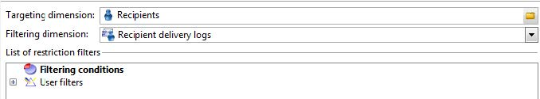{width="70%" align="center" zoomable="yes"}

Das Äquivalent der Filterdimension in SQL ist der innere Join:

`select iRecipientId from nmsRecipient INNER JOIN nmsBroadLog ON (...)`

Weitere Informationen zu Filterdimension finden Sie in [diesem Abschnitt](build-a-workflow.md#targeting-and-filtering-dimensions).

### Architektur {#architecture}

* Erstellen Sie eine Entwicklungsplattform mit ähnlichen Umfängen, Parametern und Architekturen wie die Produktionsplattform.
* Verwenden Sie dieselben Werte für die Entwicklungs- und Produktionsumgebungen. Wenn möglich, sollten die folgenden Einstellungen dieselben sein:

   * Betriebssystem,
   * Version,
   * Daten,
   * Anwendung,
   * Umfänge.

  >[!NOTE]
  >
  >Eine Funktion, die in einer Entwicklungsumgebung funktioniert, funktioniert möglicherweise nicht in einer Produktionsumgebung, in der die Daten unterschiedlich sein können. Versuchen Sie, die Hauptunterschiede zu identifizieren, um Risiken vorherzusehen und Lösungen vorzubereiten.

* Bereiten Sie Konfigurationen vor, die mit den Zielgruppenumfängen übereinstimmen. Große Umfänge erfordern spezifische Konfigurationen. Eine Konfiguration, die für 100.000 Empfänger funktionierte, funktioniert möglicherweise nicht für 10.000.000 Empfänger.

  Überlegen Sie, wie das System skaliert wird, wenn es live geschaltet wird. Nur weil etwas in kleinem Maßstab funktioniert, heißt das nicht, dass es sich auch für größere Mengen eignet. Die Tests sollten mit ähnlichen Umfängen wie der Umfang in der Produktion durchgeführt werden. Sie sollten auch die Auswirkungen von Änderungen der Umfänge (Anzahl der Aufrufe, Größe der Datenbank) zu Spitzenzeiten, an Spitzentagen und während der gesamten Projektlaufzeit auswerten.
