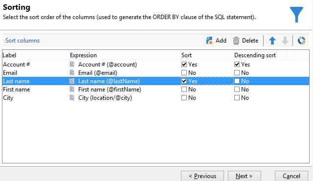

# Abfrage der Empfängertabelle {#querying-recipient-table}

In diesem Beispiel werden die Namen und E-Mail-Adressen der Empfänger gesucht, deren E-Mail-Domain &quot;web.de&quot; ist und die nicht in Berlin wohnen.

* Welche Tabelle soll ausgewählt werden?

   Die Empfängertabelle (nms:recipient)

* Felder, die als Ausgabespalten verwendet werden sollen

   E-Mail, Name, Wohnort und Kundennummer

* Nach welchen Kriterien sind die Empfänger zu filtern?

   Nach Wohnort und E-Mail-Domain

* Wird das Ergebnis sortiert?

   Ja, nach **[!UICONTROL Kundennummer]** und **[!UICONTROL Nachname]**.

Gehen Sie wie folgt vor:

1. Klicken Sie auf **[!UICONTROL Werkzeuge > Generisches Abfragetool...]** und wählen Sie die Tabelle der **Empfänger** (**nms:recipient**). Klicken Sie nun auf **[!UICONTROL Weiter]**.
1. Doppelklicken Sie auf **[!UICONTROL Nachname]**, **[!UICONTROL Vorname]**, **[!UICONTROL E-Mail]**, **[!UICONTROL Ort]** und **[!UICONTROL Kundennummer]**. Diese Felder befinden sich nun im Bereich der **[!UICONTROL Ausgabespalten]**. Klicken Sie nun auf **[!UICONTROL Weiter]**.

   

1. Sortieren Sie die Spalten in der gewünschten Anzeigereihenfolge, hier beispielsweise die Kundennummern in absteigender und die Nachnamen in alphabetischer Reihenfolge. Klicken Sie nun auf **[!UICONTROL Weiter]**.

   

1. Wählen Sie im Fenster **[!UICONTROL Datenfilter]** die Option **[!UICONTROL Filterbedingungen]** aus, um die Abfrageergebnisse einzuschränken, und klicken Sie auf **[!UICONTROL Weiter]**.
1. Das Fenster **[!UICONTROL Zielelement]** dient der Konfiguration der Filterbedingungen.

   Gesucht werden die Empfänger mit E-Mail-Domain &quot;web.de&quot;. Wählen Sie also **E-Mail-Domain (@domain)** in der Spalte **[!UICONTROL Ausdruck]**, **gleich** in der Spalte **[!UICONTROL Operator]** und geben Sie &quot;web.de&quot; in der Spalte **[!UICONTROL Wert]** ein.

   

1. Bei Bedarf können Sie die Schaltfläche **[!UICONTROL Werteverteilung]** auswählen. Dann werden die in der Datenbank enthaltenen E-Mail-Domains und deren Häufigkeit angezeigt. Auch alle anderen Domains werden angezeigt, da der Filter noch nicht aktiv ist.

   Die Zusammenfassung der Abfrage wird unten im Fenster angezeigt, hier also **E-Mail-Domain gleich web.de**.

1. Klicken Sie nun auf **[!UICONTROL Vorschau]**, um die Ergebnisse der Abfrage zum bisherigen Zeitpunkt anzusehen. Es werden nur Empfänger angezeigt, deren E-Mail-Domain &quot;web.de&quot; ist.

   

1. Ändern Sie die Abfrage, um nur die Empfänger anzuzeigen, die nicht in Berlin wohnen.

   Wählen Sie **[!UICONTROL Ort (location/@city)]** in der Spalte **[!UICONTROL Ausdruck]**, den Operator **[!UICONTROL ungleich]** und geben Sie **[!UICONTROL Berlin]** in der Spalte **[!UICONTROL Wert]** ein.

   

1. Im Fenster **[!UICONTROL Datenformatierung]** können Sie die Anzeigereihenfolge der Ausgabespalten festlegen. Benutzen Sie die Pfeile, um die Zeile &quot;Ort&quot; nach oben unmittelbar unter &quot;Kundennummer&quot; zu verschieben.

   Entfernen Sie das Kreuz aus der &quot;Vorname&quot;-Checkbox, um dieses Feld im Ergebnis nicht anzuzeigen.

   

1. Im letzten Schritt, der **[!UICONTROL Datenvorschau]**, wird das Abfrageergebnis berechnet. Klicken Sie hierfür auf **[!UICONTROL Datenvorschau starten]**.

   Im Tab **[!UICONTROL Ergebnis in Spalten]** wird das Ergebnis der Abfrage in Spaltenform angezeigt.

   Die Ergebnistabelle enthält alle Empfänger, deren E-Mail-Domain &quot;web.de&quot; ist, und die nicht in Berlin wohnen. Die Vornamen werden nicht angezeigt, da diese Spalte im verangehenden Schritt abgewählt wurde. Die Kundennummern wurden in absteigender Reihenfolge sortiert.

   

   Im Tab **[!UICONTROL XML-Ergebnis]** können Sie das Ergebnis im XML-Format einsehen.

   

   Klicken Sie auf **[!UICONTROL Erzeugte SQL-Abfragen]**, um die SQL-Entsprechung der Abfrage anzusehen.

   
