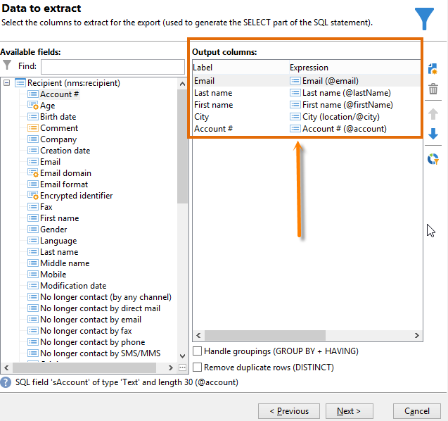
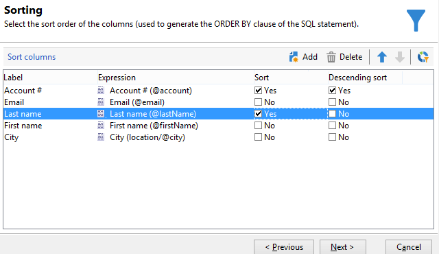
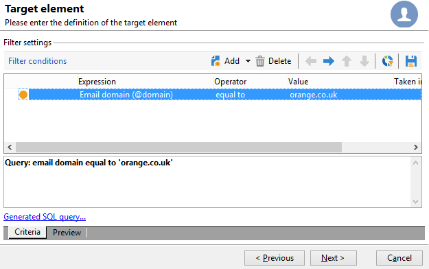
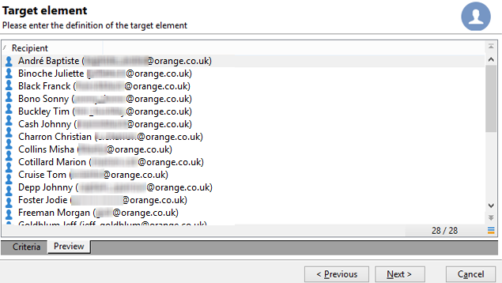
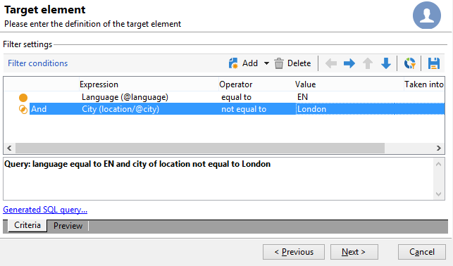
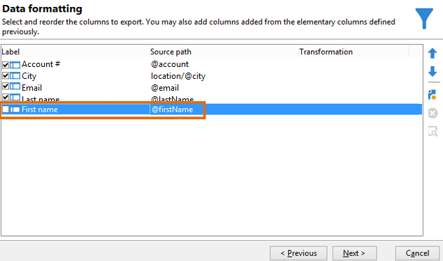
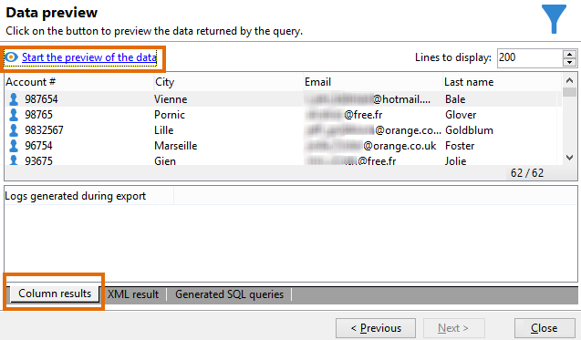
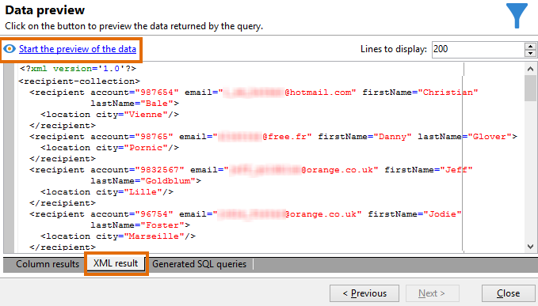
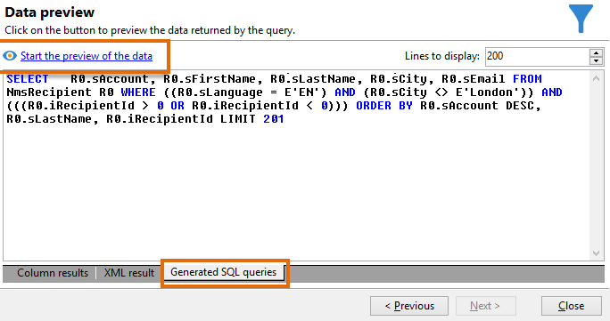

# Abfrage der Empfängertabelle {#querying-recipient-table}

In diesem Beispiel werden die Namen und E-Mail-Adressen der Empfänger gesucht, deren E-Mail-Domain &quot;web.de&quot; ist und die nicht in Berlin wohnen.

* Welche Tabelle soll ausgewählt werden?

  Die Empfängertabelle (nms:recipient)

* Felder, die als Ausgabespalten verwendet werden sollen

  E-Mail, Name, Wohnort und Kundennummer

* Nach welchen Kriterien sind die Empfänger zu filtern?

  Nach Wohnort und E-Mail-Domain

* Wird das Ergebnis sortiert?

  Ja, nach **[!UICONTROL Kundennummer]** und **[!UICONTROL Nachname]**.

Gehen Sie wie folgt vor:

1. Klicken Sie **[!UICONTROL Tools > Generischer Abfrage-Editor…]** und wählen Sie die **Empfänger**-Tabelle (**nms:recipient**) aus. Klicken Sie nun auf **[!UICONTROL Weiter]**.
1. Wählen Sie: **[!UICONTROL Nachname]**, **[!UICONTROL Vorname]**, **[!UICONTROL E-Mail]**, **[!UICONTROL Ort]** und **[!UICONTROL Kundennummer]**. Diese Felder werden zu **[!UICONTROL Ausgabespalten]**. Klicken Sie nun auf **[!UICONTROL Weiter]**.

   

1. Sortieren Sie die Spalten, um sie in der richtigen Reihenfolge anzuzeigen. Hier möchten wir die Kontonummern in absteigender Reihenfolge und die Namen in alphabetischer Reihenfolge sortieren. Klicken Sie nun auf **[!UICONTROL Weiter]**.

   

1. Wählen Sie im Fenster **[!UICONTROL Datenfilter]** die Option **[!UICONTROL Filterbedingungen]** aus, um die Abfrageergebnisse einzuschränken, und klicken Sie auf **[!UICONTROL Weiter]**.
1. Das Fenster **[!UICONTROL Zielelement]** dient der Konfiguration der Filterbedingungen.

   Definieren Sie die folgende Filterbedingung: Empfangende, deren E-Mail-Domain gleich „orange.co.uk“ ist. Wählen Sie also **E-Mail-Domain (@domain)** in der Spalte **[!UICONTROL Ausdruck]**, **gleich** in der Spalte **[!UICONTROL Operator]** und geben Sie „orange.co.uk“ in der Spalte **[!UICONTROL Wert]** ein.

   

1. Klicken Sie bei Bedarf auf die **[!UICONTROL Werteverteilung]**, um eine Verteilung auf der Grundlage der E-Mail-Domain potenzieller Kunden anzuzeigen. Für jede E-Mail-Domain in der Datenbank ist ein Prozentsatz verfügbar. Andere Domains als &quot;orange.co.uk&quot; werden angezeigt, bis der Filter angewendet wird.

   Die Zusammenfassung der Abfrage wird unten im Fenster angezeigt, hier also **E-Mail-Domain gleich web.de**.

1. Klicken Sie nun auf **[!UICONTROL Vorschau]**, um die Ergebnisse der Abfrage zum bisherigen Zeitpunkt anzusehen. Es werden nur Empfänger angezeigt, deren E-Mail-Domain &quot;web.de&quot; ist.

   

1. Ändern Sie die Abfrage, um nur die Empfänger anzuzeigen, die nicht in Berlin wohnen.

   Wählen Sie **[!UICONTROL Ort (location/@city)]** in der Spalte **[!UICONTROL Ausdruck]**, den Operator **[!UICONTROL ungleich]** und geben Sie **[!UICONTROL Berlin]** in der Spalte **[!UICONTROL Wert]** ein.

   

1. Dadurch gelangen Sie zum Fenster **[!UICONTROL Datenformatierung]**. Überprüfen Sie die Spaltenreihenfolge. Verschieben Sie die Spalte „Ort“ nach oben in die Spalte „Kontonummer“.

   Entfernen Sie das Kreuz aus der &quot;Vorname&quot;-Checkbox, um dieses Feld im Ergebnis nicht anzuzeigen.

   

1. Klicken Sie **[!UICONTROL Fenster]** Datenvorschau“ auf **[!UICONTROL Vorschau der Daten starten]**. Diese Funktion berechnet das Ergebnis der Abfrage.

   Im Tab **[!UICONTROL Ergebnis in Spalten]** wird das Ergebnis der Abfrage in Spaltenform angezeigt.

   Das Ergebnis zeigt alle Empfänger mit der E-Mail-Domain &quot;orange.co.uk&quot;, die nicht in London leben. Die Spalte „Vorname“ wird nicht angezeigt, da sie im vorherigen Schritt deaktiviert wurde. Die Kontonummern werden in absteigender Reihenfolge sortiert.

   

   Im Tab **[!UICONTROL XML-Ergebnis]** können Sie das Ergebnis im XML-Format einsehen.

   

   Auf der Registerkarte **[!UICONTROL Erzeugte SQL-Abfragen]** wird das Abfrageergebnis im SQL-Format angezeigt.

   
