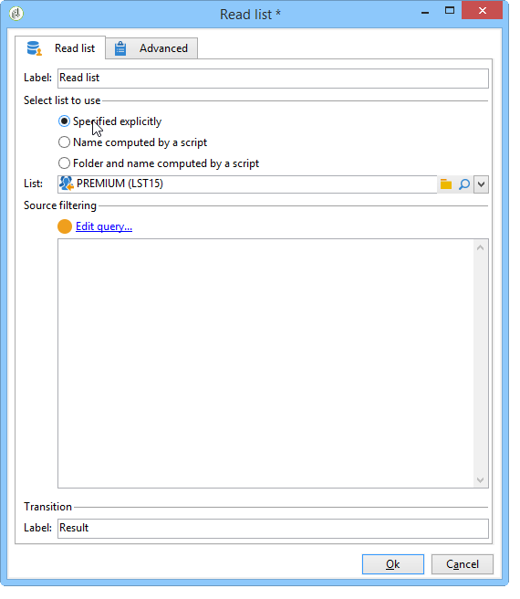
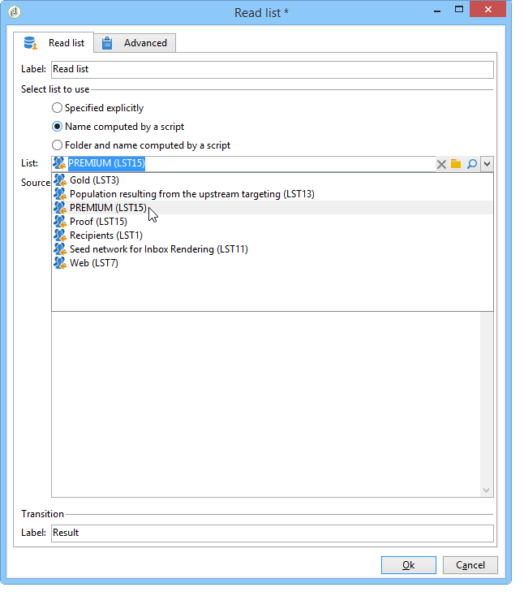
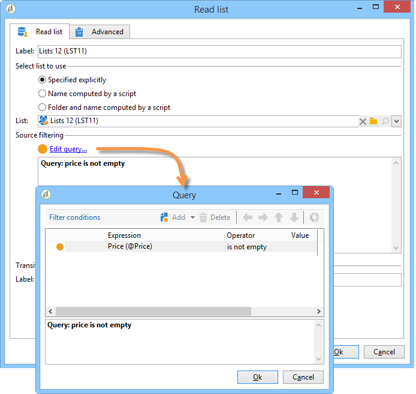
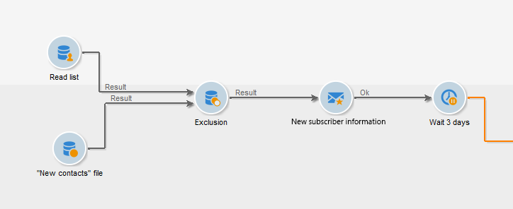
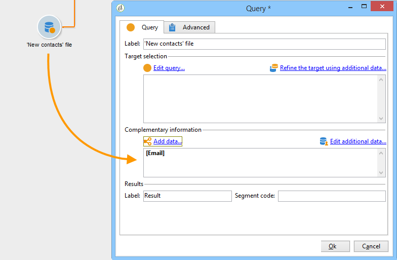
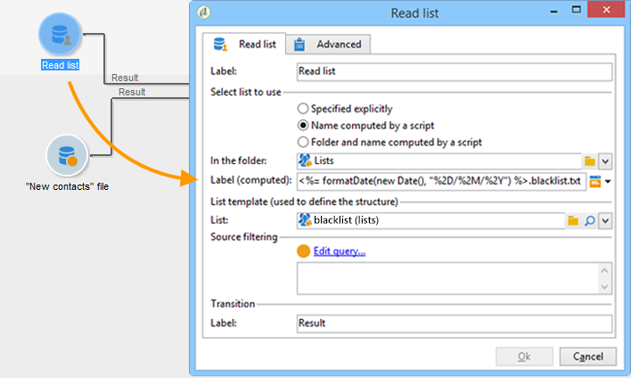
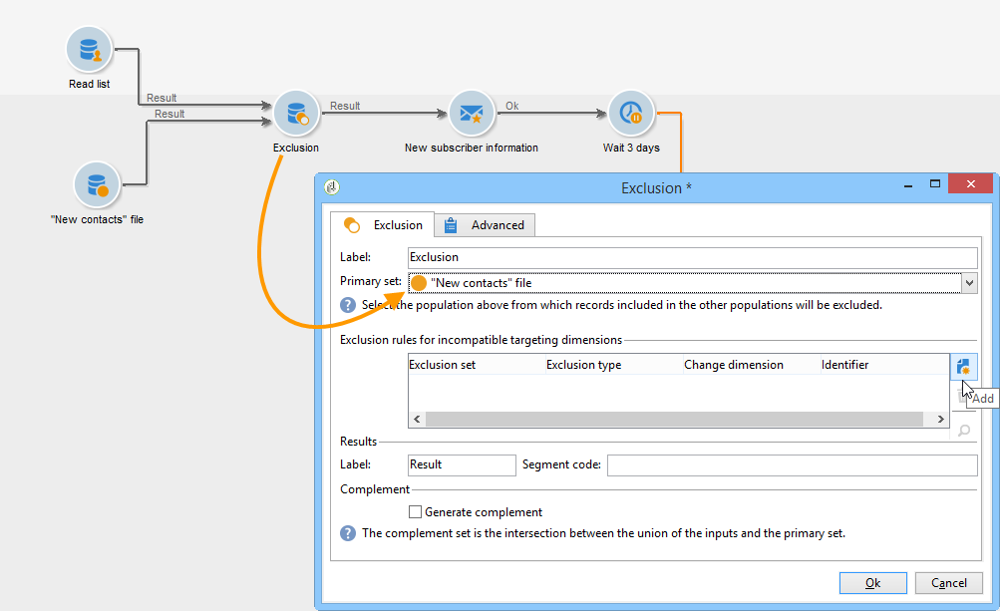
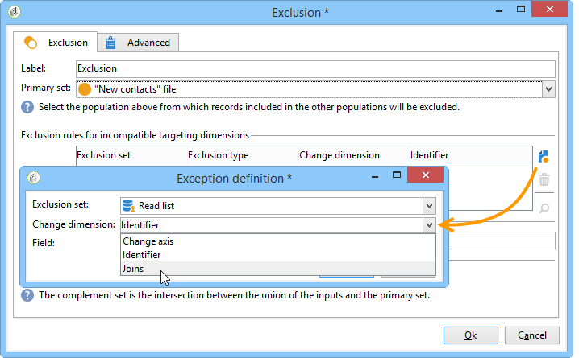

# Liste lesen{#read-list}

In Workflows genutzte Daten können aus Listen stammen, deren Daten zuvor aufbereitet und strukturiert wurden, beispielsweise in einer früheren Segmentierung oder im Zuge eines Datei-Ladevorgangs.

Die Aktivität **[!UICONTROL Liste lesen]** ermöglicht das Kopieren der Daten aus einer Liste in der Workflow-Arbeitstabelle, z. B. von Daten aus einer Abfrage. Sie ist dann im gesamten Workflow verfügbar.

Die zu verarbeitende Liste kann explizit angegeben, von einem Script berechnet oder dynamisch abgerufen werden. Dies hängt von den in der Aktivität **[!UICONTROL Liste lesen]** aktivierten Optionen oder angegebenen Parametern ab.

Wenn die Liste nicht explizit bezeichnet wird, ist eine Beispielliste anzugeben, die als Strukturvorlage verwendet wird.

Nach erfolgter Konfiguration der Liste können Sie über die Option **[!UICONTROL Abfrage bearbeiten...]** einen Filter hinzufügen, um die für den weiteren Workflow-Verlauf zu nutzende Population einzuschränken.

>[!CAUTION]
>
>Um in einer Liste-lesen-Aktivität Filter verwenden zu können, muss die Liste als Datei vorliegen.

Listen können direkt in der Adobe Campaign-Startseite über die Schaltfläche **[!UICONTROL Profile und Zielgruppen > Listen]** erstellt werden. Sie können auch im Rahmen eines Workflows über die Aktivität **[!UICONTROL Listen-Update]** erstellt werden.

**Anwendungsbeispiel: Ausschluss einer Adressenliste von einem Versand**

Im folgenden Beispiel soll eine Datei mit Adressen importiert werden, die grundsätzlich vom E-Mail-Versand auszuschließen sind (beispielsweise, weil die Empfänger nicht mehr existieren).

Die im Ordner **Neue Kontakte** enthaltenen Profile müssen als Zielgruppe für einen Versand ausgewählt werden. Die aus der Zielgruppe auszuschließenden E-Mail-Adressen werden in einer externen Liste gespeichert. In unserem Beispiel sind nur die Informationen zu E-Mail-Adressen für den Ausschluss erforderlich.

1. Die zum Laden der im **Premiumkunden**-Ordner enthaltenen Empfänger erstellte Abfrage muss die E-Mail-Adressen der Empfänger ausgeben, um die Abstimmung mit der Ausschlussliste zu ermöglichen.

   

1. Im vorliegenden Beispiel ist die Liste im Ordner **Listen** gespeichert und der Titel wird berechnet.

   

1. Um die E-Mail-Adressen der externen Liste von der Hauptzielgruppe auszuschließen, müssen Sie die Ausschlussaktivität konfigurieren und angeben, dass der Ordner **Neue Kontakte** die beizubehaltenden Daten enthält. Die gemeinsamen Daten dieses Sets und aller anderen eingehenden Sets aus der Ausschlussaktivität werden aus der Zielgruppe gelöscht.

   

   Die Ausschlussregeln werden im mittleren Bereich des Fensters konfiguriert. Klicken Sie auf die Schaltfläche **[!UICONTROL Hinzufügen]**, um den Ausschlusstyp zu definieren.

   Sie können für jede in die Aktivität eingehende Transition einen Ausschluss definieren.

1. Wählen Sie im Feld **[!UICONTROL Ausschlussmenge]** die Aktivität **[!UICONTROL Liste lesen]** aus. Die von dieser Aktivität übermittelten Daten werden somit von der Hauptmenge ausgeschlossen.

   Im vorliegenden Beispiel handelt es sich um einen Ausschluss über einen Join: Die Daten der Liste werden über das E-Mail-Feld mit der Hauptmenge abgestimmt. Wählen Sie zur Konfiguration des Joins im Feld **[!UICONTROL Dimensionsänderung]** die Option **[!UICONTROL Join]** aus.

   

1. Wählen Sie dann das Feld aus, das der E-Mail-Adresse in den beiden Sätzen (Source und Destination) entspricht. Die Spalten werden dann verknüpft und die Empfänger, deren E-Mail-Adresse in der Liste der importierten Adressen enthalten ist, werden aus der Zielgruppe ausgeschlossen.
