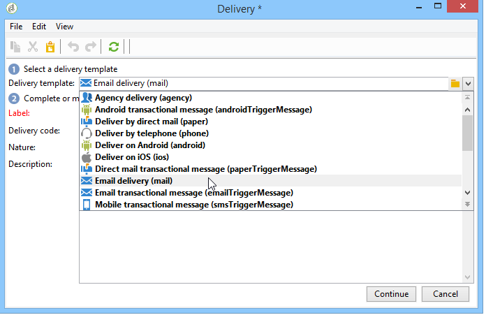

# Wiederkehrender Versand{#recurring-delivery}

Ein **[!UICONTROL wiederkehrender Versand]** dient der Konfiguration einer Versandvorlageninstanz im Rahmen einer Kampagne.

 [Funktion im Video kennenlernen](#recurring-delivery-video).

Diese Aktivität ist nur im Tab **[!UICONTROL Zielbestimmungen und Workflows]** von Kampagnen verfügbar.

Gehen Sie dazu wie folgt vor:

1. Wählen Sie die Versandvorlage aus, auf der die Aktivität basieren soll.

   

1. Konfigurieren Sie die Versandvorlage.

Die im Konfigurationsprozess dieser Aktivität zur Verfügung stehenden Optionen entsprechen denen einer Versandvorlage. Weiterführende Informationen finden Sie hier.

Ein Anwendungsbeispiel für diese Aktivität finden Sie in diesem [Abschnitt](send-a-birthday-email.md#creating-a-recurring-delivery-in-a-targeting-workflow).

## Einrichten eines wiederkehrenden Versands

Ein **wiederkehrender Versand** erstellt bei jeder Ausführung eine neue Versandinstanz. Wenn der Workflow beispielsweise einmal pro Woche ausgeführt werden soll, führt dies nach einem Jahr zu 52 Sendungen. Dies bedeutet auch, dass das Broadlog und die Trackinglogs je Versandinstanz getrennt sind.

Wenn Sie die Ausführung eines wiederkehrenden Versands stoppen möchten, sollten Sie die Kampagne vollständig abbrechen oder den Workflow, mit dem sie ausgeführt wird, stoppen. Wird der Versand über das Kampagnen-Dashboard gestoppt, wird nur der aktuelle Versand gestoppt, doch die nächsten Instanzen des wiederkehrenden Versands werden bei jeder Workflow-Ausführung weiterhin erstellt.

>[!NOTE]
>
>Die Durchführung von Testsendungen ist in der Aktivität **[!UICONTROL Wiederkehrender Versand]** nicht möglich.
> 
>Nutzen Sie zur direkten Erstellung von Sendungen in Kampagnen-Workflows die vorkonfigurierten kanalspezifischen Versandaktionen, wie z. B. **[!UICONTROL E-Mail-Versand]**.

## Anleitungsvideo (#recurring-delivery-video)

In diesem Video wird das Konfigurieren eines wiederkehrenden Versands und einer Planungsaktivität erläutert.

>[!VIDEO](https://video.tv.adobe.com/v/25040?quality=12)

Weitere Anleitungsvideos zu Campaign Classic finden Sie [hier](https://experienceleague.adobe.com/docs/campaign-classic-learn/tutorials/overview.html?lang=de).
