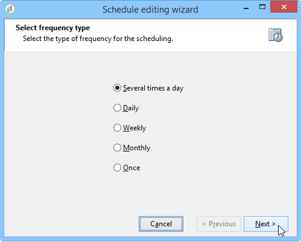

# Planung {#scheduler}

Die **Planung** ist eine persistente Aufgabe, die ihre ausgehende Transition zum konfigurierten Zeitpunkt aktiviert.

Eine **[!UICONTROL Planung]** entspricht einem programmierten Start, daher sind die gleichen Regeln zu beachten wie für die **[!UICONTROL Start]**-Aktivität. So darf die Planung beispielsweise keine eingehende Transition aufweisen.

## Best Practices {#best-practices}

**Workflow nach einer Änderung der Zeitplanung neu starten** - Beim Ändern der geplanten Zeit der **[!UICONTROL Planung]**-Aktivität ist es wichtig, den Workflow neu zu starten. Dadurch wird sichergestellt, dass der Workflow zu den aktualisierten Zeiten ausgeführt wird. Ohne Neustart wird der Workflow weiterhin gemäß dem alten Zeitplan ausgeführt.

**Planungshäufigkeit begrenzen** - Vermeiden Sie es, Workflows so zu planen, dass sie häufiger als alle 15 Minuten ausgeführt werden. Eine häufigere Ausführung kann die Systemleistung beeinträchtigen und zu einer Überlastung der Datenbank führen.

**Eine Planungsaktivität pro Verzweigung verwenden** - Jede Verzweigung Ihres Workflows sollte nur eine **[!UICONTROL Planungsaktivität]** aufweisen. Weitere Informationen zu Best Practices für die Verwendung von Aktivitäten in Workflows finden Sie auf der [ „Best Practices für Workflows](workflow-best-practices.md#using-activities).

**Gleichzeitige Workflow-Ausführungen verhindern** - Wenn ein Workflow von einer Planung ausgelöst wird, sollten Sie beachten, dass mehrere Instanzen des Workflows gleichzeitig ausgeführt werden können. Wenn beispielsweise der Workflow stündlich von einer Planung Trigger wird, die Workflow-Ausführung jedoch länger als eine Stunde dauert, kann es zu Überschneidungen bei den Ausführungen kommen. Um dies zu vermeiden, sollten Sie Prüfungen einrichten, um mehrere gleichzeitige Ausführungen zu verhindern. [Erfahren Sie, wie Sie mehrere gleichzeitige Workflow-Ausführungen verhindern können](monitor-workflow-execution.md#preventing-simultaneous-multiple-executions).

**Konto für verzögerte Transitionen** - Transitionen, die vom Planer ausgelöst werden, können verzögert werden, wenn der Workflow lang laufende Aufgaben ausführt (z. B. Importe) oder wenn das wfserver-Modul vorübergehend angehalten wurde. Um dies abzumildern, beschränken Sie die Aktivierungszeiten der Planung, um sicherzustellen, dass die Aufgaben innerhalb eines definierten Zeitfensters ausgeführt werden.

## Konfigurieren der Planungsaktivität {#configuring-scheduler-activity}

Die Planung definiert die Aktivierungsplanung der Transition. Doppelklicken Sie zur Konfiguration auf das grafische Objekt und klicken Sie auf **[!UICONTROL Ändern...]**

In den folgenden Schritten des Assistenten lassen sich die Frequenz der Ausführungen und die Gültigkeit der Aktivität festlegen. Gehen Sie wie folgt vor:

1. Kreuzen Sie die gewünschte Häufigkeit an und klicken Sie auf **[!UICONTROL Weiter]**.

   

1. Geben Sie die Tage und Uhrzeit der Ausführung an. Die zur Verfügung stehenden Parameter hängen von der im ersten Schritt ausgewählten Häufigkeit ab. Wenn Sie die Aktivität mehrmals täglich aktivieren, sind folgende Optionen verfügbar:

   

1. Definieren Sie im nächsten Schritt die Gültigkeit der Planung oder die maximale Anzahl an Ausführungen.

   

1. Prüfen Sie im letzten Schritt die Konfiguration und klicken Sie auf **[!UICONTROL Beenden]**, um sie zu speichern.

   
