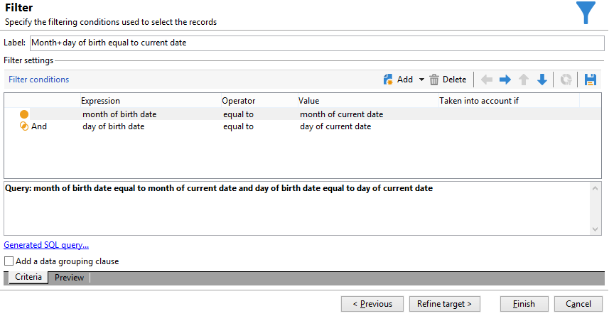

# Senden einer Geburtstags-E-Mail{#sending-a-birthday-email}

Im folgenden Anwendungsbeispiel wird aufgezeigt, wie sich der wiederkehrende Versand einer E-Mail an Empfänger zu deren Geburtstag planen lässt.

Der Workflow für dieses Anwendungsbeispiel stellt sich wie folgt dar:


In diesem täglich ausgeführten Workflow werden alle Empfänger ausgewählt, deren Geburtstag dem aktuellen Datum entspricht.

Erstellen Sie dazu eine Kampagne und fügen Sie eine [Kampagnen-Workflow](campaign-workflows.md).

Gehen Sie dann wie folgt vor:

## Identifizieren von Empfängern, die Geburtstag haben {#identifying-recipients-whose-birthday-it-is}

Konfigurieren Sie zunächst die **[!UICONTROL Planung]** für eine tägliche Ausführung des Workflows. Identifizieren Sie dann alle Empfänger, deren Geburtstag dem aktuellen Datum entspricht.

Gehen Sie hierzu wie folgt vor:

1. Ziehen Sie eine **[!UICONTROL Abfrage]** in den Workflow-Arbeitsbereich und öffnen Sie sie per Doppelklick.
1. Klicken Sie auf den Link **Abfrage bearbeiten** und wählen Sie **[!UICONTROL Filterbedingungen]** aus.

   

1. Klicken Sie in die erste Zelle der Spalte **[!UICONTROL Ausdruck]** und anschließend auf die Schaltfläche **[!UICONTROL Ausdruck bearbeiten]**, um den Ausdruckseditor zu öffnen.

   

1. Klicken Sie auf die Schaltfläche **[!UICONTROL Erweiterte Auswahl]**, um den Filtermodus auszuwählen.

   

1. Wählen Sie die Option **[!UICONTROL Formel von einem Ausdruck ausgehend erstellen]** und klicken Sie auf die Schaltfläche **[!UICONTROL Weiter]**.
1. Wählen Sie aus der Funktionsliste über den Knoten **[!UICONTROL Datum]** mit einem Doppelklick die Funktion **[!UICONTROL Day]** aus. Diese Funktion gibt die Zahl aus, die dem Tag des als Parameter übergebenen Datums entspricht.

   

1. Wählen Sie in der Liste der verfügbaren Felder mit einem Doppelklick das **[!UICONTROL Geburtsdatum]** aus. Im oberen Abschnitt des Editors wird nun die folgende Formel angezeigt:

   ```
   Day(@birthDate)
   ```

   Klicken Sie zur Bestätigung auf **[!UICONTROL Beenden]**.

1. Wählen Sie nun aus der Dropdown-Liste den **[!UICONTROL Operator]****[!UICONTROL gleich aus]**.

   

1. Klicken Sie anschließend in die erste Zelle der Spalte **[!UICONTROL Werte]** und auf die Schaltfläche **[!UICONTROL Ausdruck bearbeiten]**, um den Ausdruckseditor zu öffnen.
1. Wählen Sie aus der Funktionsliste über den Knoten **[!UICONTROL Datum]** mit einem Doppelklick die Funktion **[!UICONTROL Day]** aus.
1. Wählen Sie anschließend mit einem Doppelklick die Funktion **[!UICONTROL GetDate]** aus, um das aktuelle Datum abzurufen.

   

   Im oberen Abschnitt des Ausdruckseditors wird nun folgende Formel angezeigt:

   ```
   Day(GetDate())
   ```

   Klicken Sie zur Bestätigung auf **[!UICONTROL Beenden]**.

1. Wiederholen Sie diesen Vorgang, um den dem aktuellen Monat entsprechenden Geburtsmonat abzurufen. Klicken Sie hierzu auf die Schaltfläche **[!UICONTROL Hinzufügen]** und wiederholen Sie die Schritte 3 bis 10 unter Ersetzung der Funktion **[!UICONTROL Day]** durch die Funktion **[!UICONTROL Month]**.

   Die vollständige Formel lautet wie folgt:

   

Schließen Sie nun am Ergebnis der **[!UICONTROL Abfrage]**-Aktivität einen **[!UICONTROL E-Mail-Versand]** an, damit alle in Ihrer Liste enthaltenen Empfänger eine E-Mail zum Geburtstag erhalten.

## Empfänger einschließen, die am 29. Februar Geburtstag haben (optional) {#including-recipients-born-on-february-29th--optional-}

Wenn Sie alle Abonnenten einschließen möchten, die am 29. Februar Geburtstag haben, sehen Sie in diesem Anwendungsbeispiel, wie Sie den Versand einer wiederkehrenden Geburtstags-E-Mail an eine Liste von Empfängern planen können – unabhängig davon ob es sich um ein Schaltjahr handelt oder nicht.

Die Umsetzung des Anwendungsbeispiels gliedert sich in folgende Schritte:

* Auswahl der Empfänger, die am aktuellen Datum Geburtstag haben.
* Test, ob ein Schaltjahr vorliegt.
* Auswahl der Empfänger, die am 29. Februar Geburtstag haben.

Der Workflow für dieses Anwendungsbeispiel stellt sich wie folgt dar:


Sollte es sich bei dem laufenden Jahr **nicht um ein Schaltjahr handeln**, müssen bei der Workflow-Ausführung am 1. März auch die Empfänger ausgewählt und zu der Empfängerliste hinzugefügt werden, deren Geburtstag am 29. Februar ist. In allen anderen Fällen ist keinerlei zusätzliche Maßnahme notwendig.

### Schritt 1: Empfänger auswählen {#step-1--selecting-the-recipients}

Konfigurieren Sie zunächst die **[!UICONTROL Planung]** für eine tägliche Ausführung des Workflows. Identifizieren Sie dann alle Empfänger, deren Geburtstag dem aktuellen Datum entspricht.

>[!NOTE]
>
>Sollte es sich bei dem laufenden Jahr um ein Schaltjahr handeln, werden alle Empfänger, deren Geburtstag auf den 29. Februar fällt, automatisch mit eingeschlossen.



Die Auswahl der Empfänger, deren Geburtstag dem aktuellen Datum entspricht, wird im Abschnitt [Identifizieren von Empfängern, die Geburtstag haben](#identifying-recipients-whose-birthday-it-is) beschrieben.

### 2. Schritt: Test, ob ein Schaltjahr vorliegt {#step-2--select-whether-or-not-it-is-a-leap-year}

Prüfen Sie mithilfe einer **[!UICONTROL Test]**-Aktivität, ob das aktuelle Jahr ein Schaljahr und ob das aktuelle Datum der 1. März ist.

Wenn der Test wahr ist (d. h. es ist kein Schaltjahr – es gibt keinen 29. Februar – und das aktuelle Datum ist der 1. März), wird die **[!UICONTROL Wahr]**-Transition aktiviert und die Empfänger, die am 29. Februar Geburtstag haben, werden zum Versand des 1. März hinzugefügt. Andernfalls wird die **[!UICONTROL Falsch]**-Transition aktiviert und nur die Empfänger, die am aktuellen Datum Geburtstag haben, erhalten den Versand.

Kopieren Sie den unten stehenden Code und fügen Sie ihn im Bereich **[!UICONTROL Initialisierungsscript]** des **[!UICONTROL Erweitert]**-Tabs ein.

```
function isLeapYear(iYear)
{
    if(iYear/4 == Math.floor(iYear/4))
    {
        if(iYear/100 != Math.floor(iYear/100))
        {
            // Divisible by 4 only -> Leap Year
            return 1;
        }
        else
        {
            if(iYear/400 == Math.floor(iYear/400))
            {
                // Divisible by 4, 100 and 400 -> Leap year
                return 1;
            }
        }
    }
    // all others: no leap year
    return 0;
}

// Return today's date and time
var currentTime = new Date()
// returns the month (from 0 to 11)
var month = currentTime.getMonth() + 1
// returns the day of the month (from 1 to 31)
var day = currentTime.getDate()
// returns the year (four digits)
var year = currentTime.getFullYear()

// is current year a leap year?
vars.currentIsALeapYear = isLeapYear(year);

// is current date the first of march?
if(month == 3 && day == 1) {
  // today is 1st of march
vars.firstOfMarch = 1;
}
```


Fügen Sie im Bereich **[!UICONTROL Bedingte Verzweigung]** die folgende Bedingung hinzu:

```
vars.currentIsALeapYear == 0 && vars.firstOfMarch == 1
```


### 3. Schritt: Auswahl der Empfänger, die am 29. Februar Geburtstag haben {#step-3--select-any-recipients-born-on-february-29th}

Ziehen Sie eine **[!UICONTROL Verzweigung]** in das Diagramm und schließen Sie an eine der ausgehenden Transitionen eine **[!UICONTROL Abfrage]**-Aktivität an.

Wählen Sie in dieser Abfrage alle Empfänger aus, die am 29. Februar Geburtstag haben.


Kombinieren Sie die Ergebnisse mithilfe einer **[!UICONTROL Vereinigung]**.

Schließen Sie nun an beide Zweige der **[!UICONTROL Test]**-Aktivität einen **[!UICONTROL E-Mail-Versand]** an, damit alle in Ihrer Liste enthaltenen Empfänger eine E-Mail zum Geburtstag erhalten – selbst diejenigen, die am 29. Februar Geburtstag haben, und das auch, wenn gerade kein Schaltjahr vorliegt.

## Wiederkehrenden Versand erstellen {#creating-a-recurring-delivery-in-a-targeting-workflow}

Fügen Sie für die gewünschte Geburtstags-E-Mail-Vorlage einen **wiederkehrenden Versand** hinzu.

>[!CAUTION]
>
>Damit die Workflows ausgeführt werden, müssen die mit dem Campaign-Package verbundenen technischen Workflows gestartet werden. Mehr Informationen finden Sie im Abschnitt [Liste der technischen Workflows](technical-workflows.md).
>
>Wenn die Validierungsschritte für die Kampagne aktiviert sind, werden die Sendungen erst ausgeführt, nachdem diese Schritte bestätigt wurden. Weiterführende Informationen hierzu finden Sie im Abschnitt .


