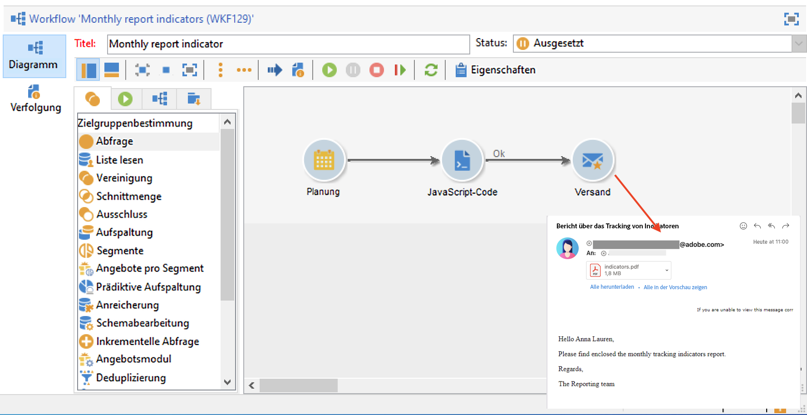
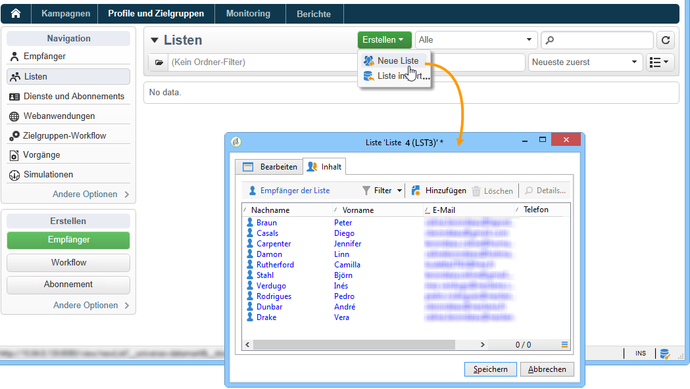
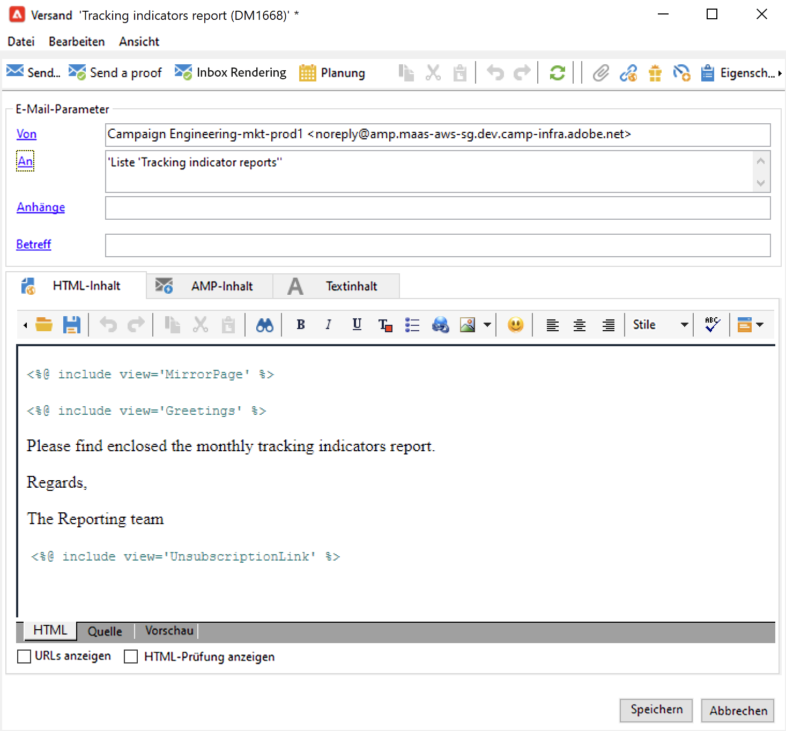
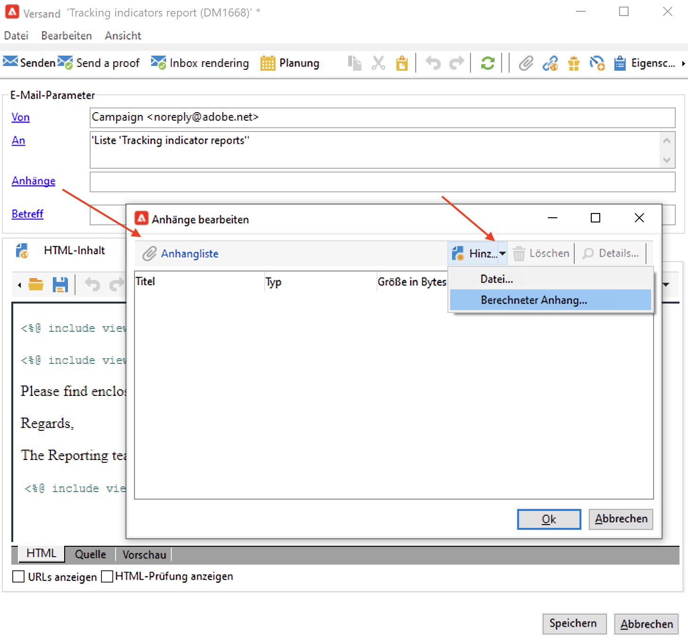
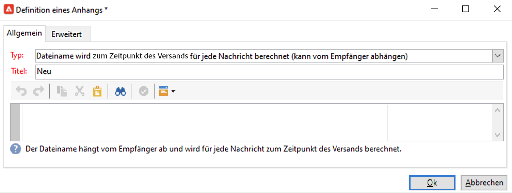
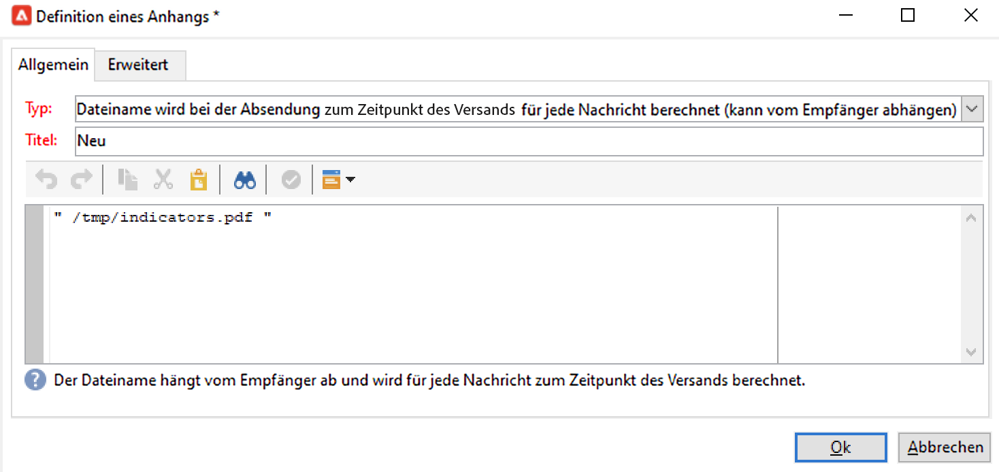
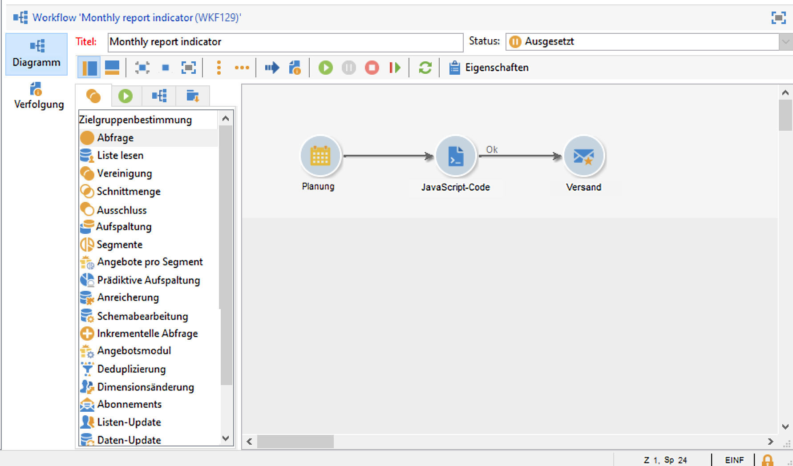
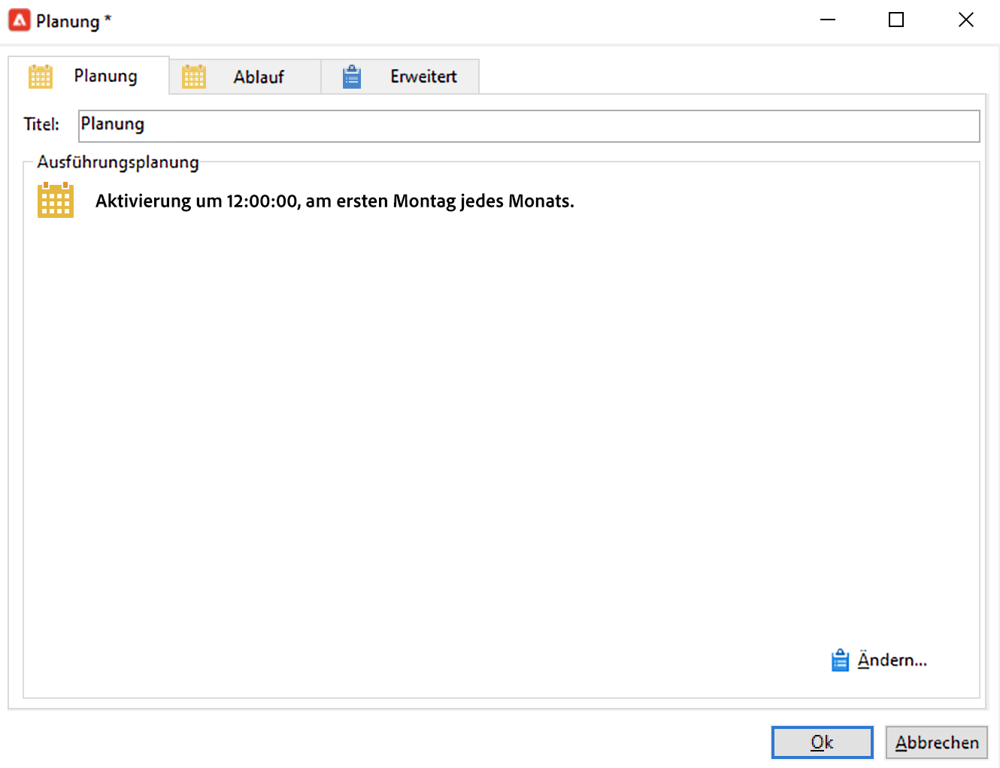
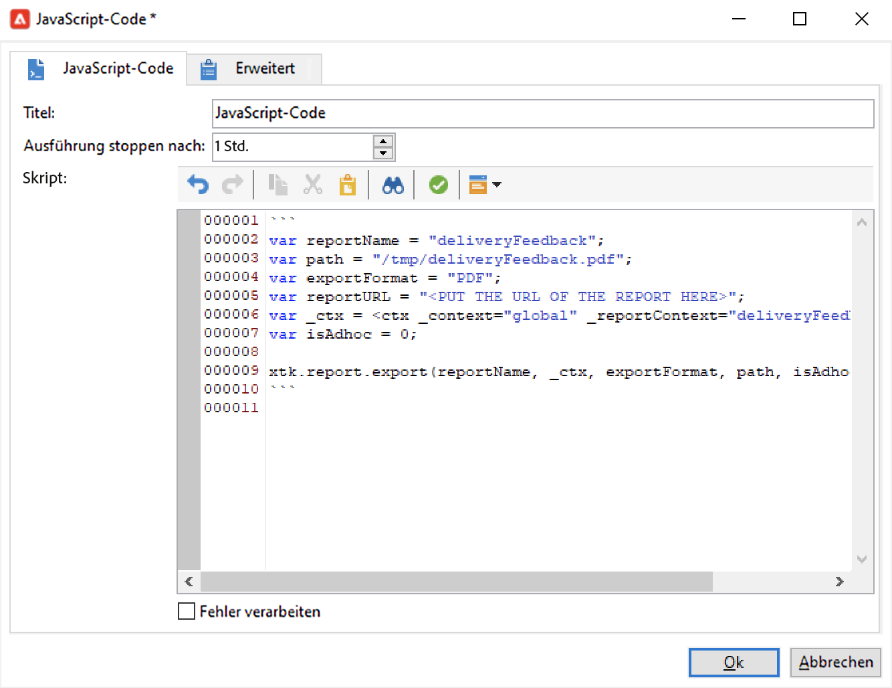
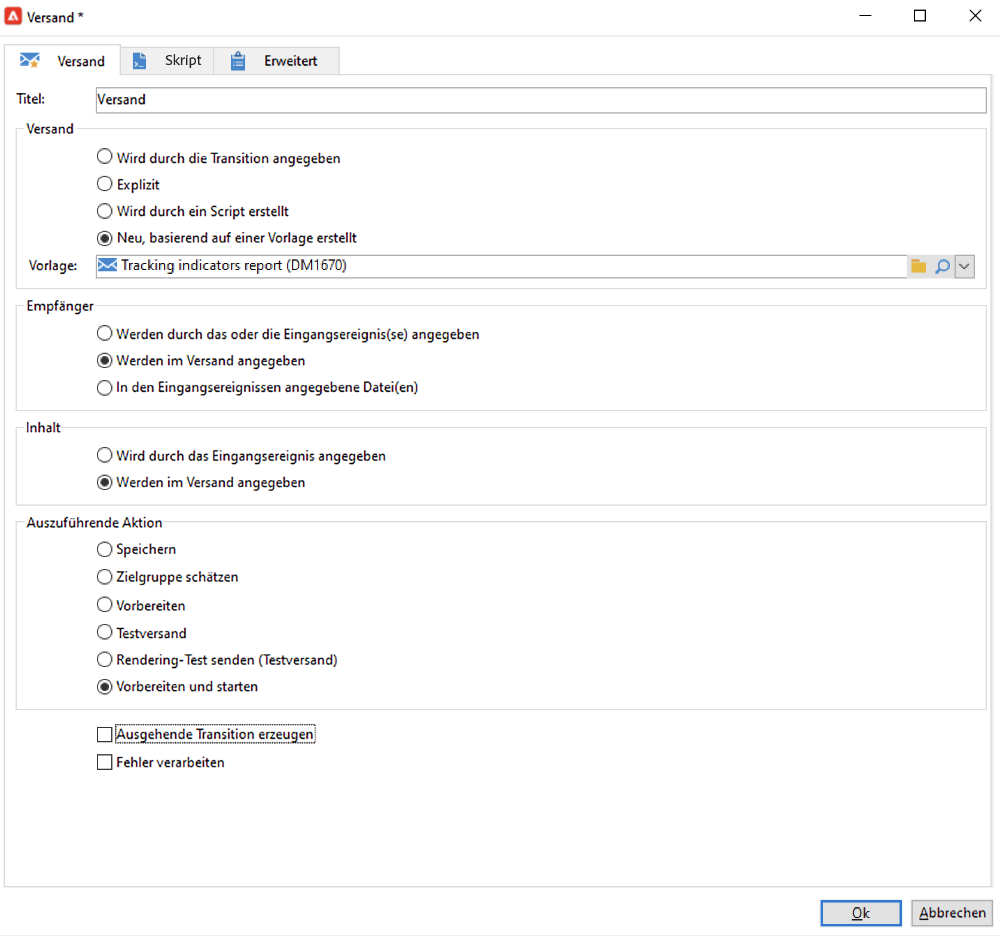

# Senden eines Berichts an eine Liste{#sending-a-report-to-a-list}


Im folgenden Anwendungsbeispiel soll jeden Monat der Standardbericht zu den **[!UICONTROL Trackingindikatioren]** erzeugt und als PDF an eine Empfängerliste gesendet werden.



Die Umsetzung des Anwendungsbeispiels gliedert sich in folgende Schritte:

* Erstellen einer Liste von Empfängern, die den Versand erhalten werden (siehe [1. Schritt: Erstellung der Empfängerliste](#step-1--creating-the-recipient-list)).
* Erstellung einer Versandvorlage, die bei jeder Workflow-Ausführung einen neuen Versand erzeugt (siehe [2. Schritt: Erstellung der Versandvorlage](#step-2--creating-the-delivery-template)).
* Erstellung eines Workflows, der den Bericht im PDF-Format erzeugt und an die Empfängerliste sendet (siehe [3. Schritt: Erstellung des Workflows](#step-3--creating-the-workflow)).

## 1. Schritt: Erstellung der Empfängerliste {#step-1--creating-the-recipient-list}

Wechseln Sie zum Tab **[!UICONTROL Profile und Zielgruppen]**, klicken Sie auf den Link **[!UICONTROL Listen]** und dann auf die Schaltfläche **[!UICONTROL Erstellen]**. Wählen Sie **[!UICONTROL Neue Liste]** aus und erstellen Sie eine neue Empfängerliste, an die der Bericht gesendet werden soll.



Weiterführende Informationen zum Erstellen von Listen finden Sie hier:

## 2. Schritt: Erstellung der Versandvorlage {#step-2--creating-the-delivery-template}

1. Gehen Sie im Adobe Campaign-Explorer zum Knoten **[!UICONTROL Ressourcen > Vorlagen > Versandvorlagen]** und duplizieren Sie die vordefinierte Vorlage **[!UICONTROL E-Mail-Versand]**.

   

   Weiterführende Informationen zur Erstellung von Versandvorlagen finden Sie hier:

1. Konfigurieren Sie die Vorlage, indem Sie Titel, Zielgruppe (d. h. die zuvor erstellte Empfängerliste), Betreff und Inhalt angeben.

   

1. Bei jeder Ausführung des Workflows wird der Bericht zu **[!UICONTROL Trackingindikatoren]** aktualisiert (siehe [3. Schritt: Erstellung des Workflows](#step-3--creating-the-workflow)). Um die neueste Version des Berichts in den Versand einzubeziehen, müssen Sie einen **[!UICONTROL berechneten Anhang]** hinzufügen:

   Weiterführende Informationen zur Erstellung eines berechneten Anhangs finden Sie hier:

   * Klicken Sie auf den Link **[!UICONTROL Anhänge]**, dann auf die Schaltfläche **[!UICONTROL Hinzufügen]** und wählen Sie die Option **[!UICONTROL Berechneter Anhang...]** aus.

      

   * Wählen Sie im Feld **[!UICONTROL Typ]** die Option **[!UICONTROL Dateiname wird bei der Absendung für jede Nachricht berechnet (kann vom Empfänger abhängen)]** aus.

      

      Der im Feld **[!UICONTROL Titel]** angegebene Wert erscheint nicht im tatsächlichen Versand.

   * Geben Sie im Eingabefeld den Pfad und den genauen Namen der Datei ein.

      

      >[!CAUTION]
      >
      >Die Datei muss sich auf dem Server befinden. Pfad und Name müssen mit den Werten übereinstimmen, die in der **[!UICONTROL JavaScript-Code]**-Aktivität des Workflows eingegeben wurden (siehe [3. Schritt: Erstellung des Workflows](#step-3--creating-the-workflow)).

   * Gehen Sie in den **[!UICONTROL Erweitert]**-Tab und aktivieren Sie die Option **[!UICONTROL Script erstellen zur Berechnung des Dateinamens, der beim Empfänger angezeigt wird]**. Geben Sie im Eingabefeld den Namen für den Anhang im endgültigen Versand ein.

      

## 3. Schritt: Erstellung des Workflows {#step-3--creating-the-workflow}

Für das Anwendungsbeispiel ist ein Workflow mit drei Aktivitäten zu erstellen:

* **[!UICONTROL Planung]**, um die Workflow-Ausführung jeden Monat zu wiederholen,
* **[!UICONTROL JavaScript-Code]**, um den Bericht im PDF-Format zu erzeugen,
* **[!UICONTROL Versand]**, basierend auf der zuvor erstellten Vorlage.



1. Gehen Sie in den Knoten **[!UICONTROL Administration > Betreibung > Technische Workflows]** und erstellen Sie einen neuen Workflow.

   

1. Ziehen Sie eine **[!UICONTROL Planung]** in das Diagramm und konfigurieren Sie sie dahingehend, dass der Workflow an jedem ersten Montag eines Monats ausgeführt wird.

   

   Weiterführende Informationen zur Konfiguration der Planung finden Sie im Abschnitt [Planung](scheduler.md).

1. Schließen Sie eine **[!UICONTROL JavaScript-Code]**-Aktivität an.

   

   Geben Sie folgenden Code ein:

   ```
   var reportName = "deliveryFeedback";
   var path = "/tmp/deliveryFeedback.pdf";
   var exportFormat = "PDF";
   var reportURL = "<PUT THE URL OF THE REPORT HERE>";
   var _ctx = <ctx _context="global" _reportContext="deliveryFeedback" />
   var isAdhoc = 0;
   
   xtk.report.export(reportName, _ctx, exportFormat, path, isAdhoc);
   ```

   Hierbei werden folgende Variablen verwendet:

   * **var reportName**: der interne Name des Berichts in Anführungsstrichen. Im vorliegenden Beispiel lautet der interne Name des **Trackingindikatoren**-Berichts &quot;deliveryFeedback&quot;.
   * **var path**: Speicherpfad der Datei (&quot;tmp/files/&quot;), Name des Anhangs (&quot;deliveryFeedback&quot;) und Dateiendung (&quot;.pdf&quot;). Im vorliegenden Beispiel ist der Name des Anhangs mit dem internen Namen des Berichts identisch. Die Werte müssen in Anführungszeichen gesetzt und durch das Zeichen &quot;+&quot; verbunden werden.

      >[!CAUTION]
      >
      >Die Datei muss auf dem Server gespeichert werden. Sie müssen für den berechneten Anhang denselben Pfad und denselben Namen wie auf dem Tab **[!UICONTROL Allgemein]** des Bearbeitungsfensters eingeben (siehe [2. Schritt: Erstellung der Versandvorlage](#step-2--creating-the-delivery-template)).

   * **var exportFormat**: Format des Anhangs (&quot;PDF&quot;).
   * **var _ctx** (Kontext): Im vorliegenden Beispiel wird der Bericht **[!UICONTROL Trackingindikatoren]** im allgemeinen Kontext verwendet.

1. Fügen Sie abschließend einen **[!UICONTROL Versand]** an und wählen Sie folgende Optionen:

   * Im Bereich **[!UICONTROL Versand]**: Aktivieren Sie die Option **[!UICONTROL Neu, basierend auf einer Vorlage erstellt]** und wählen Sie die zuvor erstellte Vorlage aus.
   * In den Bereichen **[!UICONTROL Empfänger]** und **[!UICONTROL Inhalt]**: Aktivieren Sie **[!UICONTROL Werden bzw. Wird im Versand angegeben]**.
   * Im Bereich **[!UICONTROL Auszuführende Aktion]**: Aktivieren Sie **[!UICONTROL Vorbereiten und starten]**.
   * Deaktivieren Sie die Optionen **[!UICONTROL Ausgehende Transition erzeugen]** und **[!UICONTROL Fehler verarbeiten]**.
   
