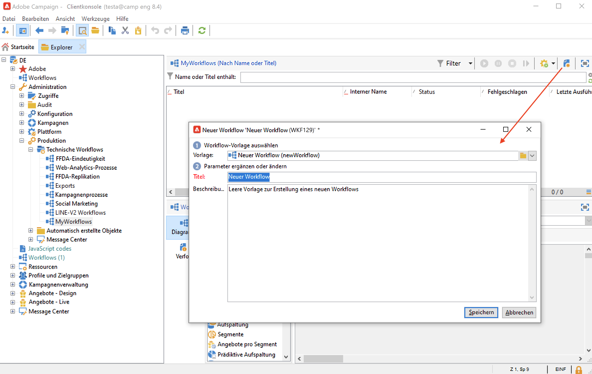

# Senden eines Berichts an eine Liste{#send-a-report-to-a-list}

Im folgenden Anwendungsbeispiel soll jeden Monat der Standardbericht zu den **[!UICONTROL Trackingindikatioren]** erzeugt und als PDF an eine Empfängerliste gesendet werden.


Die Umsetzung des Anwendungsbeispiels gliedert sich in folgende Schritte:

* Erstellen Sie eine Empfängerliste für diesen Bericht. [Weitere Informationen](#step-1--create-the-recipient-list).
* Erstellen Sie eine Versandvorlage, die bei jeder Ausführung des Workflows einen neuen Versand erstellt. [Weitere Informationen](#step-2--create-the-delivery-template).
* Erstellen Sie einen Workflow, der den Bericht im PDF-Format erzeugt und an die Empfängerliste sendet. [Weitere Informationen](#step-3--create-the-workflow)).

## 1. Schritt: Erstellen der Empfängerliste {#step-1--create-the-recipient-list}

Gehen Sie wie folgt vor, um eine Liste der gewünschten Empfänger zu erstellen:

1. Navigieren Sie zur Registerkarte **[!UICONTROL Profile und Zielgruppen]** und klicken Sie auf den Link **[!UICONTROL Listen]**.
1. Klicken Sie auf die Schaltfläche **[!UICONTROL Erstellen]**.
1. Wählen Sie **[!UICONTROL Neue Liste]** aus und erstellen Sie eine neue Empfängerliste, an die der Bericht gesendet werden soll.

Weiterführende Informationen zum Erstellen von Listen finden Sie in [diesem Abschnitt](../../v8/audiences/create-audiences.md).

## 2. Schritt: Erstellen der Versandvorlage {#step-2--create-the-delivery-template}

Gehen Sie wie folgt vor, um eine Versandvorlage zu erstellen:

1. Gehen Sie im Adobe Campaign-Explorer zum Knoten **[!UICONTROL Ressourcen > Vorlagen > Versandvorlagen]** und duplizieren Sie die integrierte Vorlage **[!UICONTROL E-Mail-Versand]**.

   Weiterführende Informationen zum Erstellen von Versandvorlagen finden Sie in [diesem Abschnitt](../../v8/send/create-templates.md).

1. Konfigurieren Sie die Vorlage, indem Sie Titel, Zielgruppe (d. h. die zuvor erstellte Empfängerliste), Betreff und Inhalt angeben.

   Bei jeder Ausführung des Workflows wird der Bericht **[!UICONTROL Tracking-Indikatoren]** aktualisiert, wie in [Schritt 3: Erstellen des Workflows](#step-3--creating-the-workflow) erklärt wird.

1. Um die neueste Version des Berichts in den Versand einzubeziehen, müssen Sie einen **[!UICONTROL berechneten Anhang]** hinzufügen:

   * Klicken Sie auf den Link **[!UICONTROL Anhänge]** und dann auf den Pfeil neben der Schaltfläche **[!UICONTROL Hinzufügen]**. Wählen Sie **[!UICONTROL Berechneter Anhang...]** aus

      

   * Wählen Sie in der Dropdown-Liste **[!UICONTROL Typ]** die letzte Option aus: **[!UICONTROL Dateiname wird beim Versand jeder Nachricht berechnet (kann vom Empfängerprofil abhängen)]**.

      

      Der im Feld **[!UICONTROL Titel]** angegebene Wert erscheint nicht im tatsächlichen Versand.

   * Geben Sie in der Textzone den Pfad und den Namen der Datei ein.

      

      >[!CAUTION]
      >
      >Pfad und Name müssen mit den Werten übereinstimmen, die in der **[!UICONTROL JavaScript-Code]**-Aktivität des Workflows eingegeben wurden (siehe [Schritt 3: Erstellen des Workflows](#step-3--creating-the-workflow)).

   * Wählen Sie die Registerkarte **[!UICONTROL Erweitert]** aus und markieren Sie **[!UICONTROL Script erstellen zur Berechnung des Dateinamens, der beim Empfänger angezeigt wird]**. Geben Sie in der Textzone den Namen des Anhangs im endgültigen Versand ein.

      

## Schritt 3: Erstellen des Workflows {#step-3--creating-the-workflow}

Erstellen Sie für diesen Anwendungsfall den folgenden Workflow.


Es werden drei Aktivitäten verwendet:

* Eine **[!UICONTROL Planungsaktivität]**, die den Workflow einmal monatlich ausführt,
* Eine **[!UICONTROL JavaScript-Code]**-Aktivität, die den Bericht im PDF-Format generiert,
* Eine **[!UICONTROL Versandaktivität]**, die auf die zuvor erstellte Versandvorlage verweist.

Um den Workflow zu erstellen, gehen Sie wie folgt vor:

1. Navigieren Sie zum Knoten **[!UICONTROL Administration > Betreibung > Technische Workflows]** des Campaign-Explorers und erstellen Sie einen neuen Ordner, in dem Sie Ihre Workflows speichern können.
1. Erstellen Sie einen neuen Workflow.

   

1. Ziehen Sie eine **[!UICONTROL Planung]** in das Diagramm und konfigurieren Sie sie dahingehend, dass der Workflow an jedem ersten Montag eines Monats ausgeführt wird.

   

   Weiterführende Informationen zur Konfiguration der Planung finden Sie im Abschnitt [Planung](scheduler.md).

1. Schließen Sie eine **[!UICONTROL JavaScript-Code]**-Aktivität an.

   

   Geben Sie folgenden Code ein:

   ```sql
   var reportName = "indicators";
   var path = "/tmp/indicators.pdf";
   var exportFormat = "PDF";
   var reportURL = "<PUT THE URL OF THE REPORT HERE>";
   var _ctx = <ctx _context="global" _reportContext="deliveryFeedback" />
   var isAdhoc = 0;
   
   xtk.report.export(reportName, _ctx, exportFormat, path, isAdhoc);
   ```


   mit den folgenden Variablen:

   * **var reportName**: der interne Name des Berichts in Anführungsstrichen. Im vorliegenden Beispiel lautet der interne Name des **Tracking-Indikatoren**-Berichts &quot;deliveryFeedback&quot;.
   * **Var-Pfad**: Geben Sie den Speicherpfad der Datei („tmp“), den Namen, den Sie der Datei geben möchten („deliveryFeedback“), und die Dateierweiterung („.pdf“) ein. In diesem Fall haben wir den internen Namen als Dateinamen verwendet. Die Werte müssen zwischen doppelten Anführungszeichen stehen und durch ein „+“-Zeichen getrennt werden.

      >[!CAUTION]
      >
      >Die Datei muss auf dem Server gespeichert werden. Sie müssen den gleichen Pfad und den gleichen Namen wie in der Registerkarte **[!UICONTROL Allgemein]** des Fensters „Bearbeiten“ für den berechneten Anhang eingeben, wie [hier](#step-2--create-the-delivery-template) beschrieben wird.

   * **var exportFormat**: Format des Anhangs (&quot;PDF&quot;).
   * **var _ctx** (Kontext): Im vorliegenden Beispiel wird der Bericht **[!UICONTROL Trackingindikatoren]** im allgemeinen Kontext verwendet.

1. Fügen Sie abschließend eine **[!UICONTROL Versandaktivität]** mit den folgenden Optionen hinzu:

   

   * Im Bereich **[!UICONTROL Versand]**: Aktivieren Sie die Option **[!UICONTROL Neu, basierend auf einer Vorlage erstellt]** und wählen Sie die zuvor erstellte Vorlage aus.
   * In den Bereichen **[!UICONTROL Empfänger]** und **[!UICONTROL Inhalt]**: Aktivieren Sie **[!UICONTROL Werden bzw. Wird im Versand angegeben]**.
   * **[!UICONTROL Auszuführende Aktion]**: Wählen Sie **[!UICONTROL Vorbereiten und starten]** aus.
   * Deaktivieren Sie die Optionen **[!UICONTROL Ausgehende Transition erzeugen]** und **[!UICONTROL Fehler verarbeiten]**.

1. Speichern Sie Ihre Änderungen und starten Sie den Workflow. Die Nachricht wird an jeden ersten Montag des Monats zusammen mit dem angehängten Bericht an die Empfängerliste gesendet.