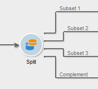

# Aufspaltung{#split}

Über die **Aufspaltung** lässt sich eine Population in verschiedene Teilmengen splitten. Die Zielgruppe wird aus allen eingehenden Ergebnissen erstellt, dies bedeutet, dass die vorgeschalteten Aktivitäten beendet sein müssen, bevor die Aufspaltung ausgeführt werden kann.

Da die Aktivität die eingehenden Populationen nicht vereinigt, wird im Fall von mehreren eingehenden Transitionen empfohlen, eine **[!UICONTROL Vereinigung]** vorzuschalten, um eine korrekte Ergebnisfindung zu gewährleisten.

Ein Beispiel der verwendeten Aufspaltungsaktivität finden Sie unter [diesem Abschnitt](targeting-workflows.md#create-subsets-using-the-split-activity).

Ein Beispiel für die Verwendung der Aufspaltungs-Aktivität zur Segmentierung der Zielgruppe in unterschiedliche Populationen mithilfe von Filterbedingungen finden Sie in [diesem Abschnitt](cross-channel-delivery-workflow.md).

Ein Beispiel für die Verwendung einer Instanzvariablen in einer Aufspaltungs-Aktivität finden Sie in [diesem Abschnitt](javascript-scripts-and-templates.md).

Konfigurieren Sie die Aktivität, indem Sie im Tab **[!UICONTROL Teilmengen]** jeweils einen Titel und die Auswahlkriterien der Teilmengen angeben. Geben Sie im Tab **[!UICONTROL Allgemein]** die Zielgruppendimension an.

## Erstellen von Teilmengen {#create-subsets}

Gehen Sie wie folgt vor:

1. Bennennen Sie die Teilmenge und geben Sie den Auswahlmodus an.
1. Wenn die eingehende Population gefiltert werden soll, ist die Option **[!UICONTROL Filterbedingung für die Eingangspopulation hinzufügen]** zu verwenden. Klicken Sie dann auf den Link **[!UICONTROL Bearbeiten...]**.

   Wählen Sie nun den Filtertyp aus.

   Die Vorgehensweise ist mit der der Abfrageaktivität identisch.****

   >[!NOTE]
   >
   >Es können maximal Daten aus zwei externen Datenbanken gefiltert werden.

1. Es besteht die Möglichkeit, die Anzahl an zu berücksichtigenden Datensätzen zu begrenzen. Kreuzen Sie hierfür die entsprechende Option an und klicken Sie auf den Link **[!UICONTROL Bearbeiten.........]**.****

   Mit einem Assistenten können Sie den Auswahlmodus für Datensätze dieser Teilmenge auswählen. [Weitere Informationen](#limit-the-number-of-subset-records).

   

1. **** Durch Klick auf die Schaltfläche **[!UICONTROL Hinzufügen]** können Sie weitere Teilmengen definieren.

   

   >[!NOTE]
   >
   >Wenn Sie im Allgemein-Tab nicht die Option **[!UICONTROL Überlappung der Ausgabepopulationen zulassen]** angekreuzt haben, werden die Teilmengen in Reihenfolge der Tabs erstellt. Mithilfe der Pfeile oben rechts kann diese angepasst werden. Wenn also die erste Teilmenge beispielsweise 70 % der Ursprungspopulation abruft, werden die Auswahlkriterien der zweiten Teilmenge nur auf die restlichen 30 Prozent angewendet.

   Für jede Teilmenge weist die Aufspaltung standardmäßig eine ausgehende Transition auf.

   

   Sie können jedoch auch alle Teilmengen in einer ausgehenden Transition zusammenzufassen. Kreuzen Sie hierzu im **[!UICONTROL Allgemein]**-Tab die Option **[!UICONTROL Alle Teilmengen in derselben Tabelle erzeugen]** an. In diesem Fall kann der Segment-Code verwendet werden, um die Zugehörigkeit zu einer bestimmten Teilmenge anzuzeigen.

   Falls angegeben, wird der Segment-Code aller Teilmengen automatisch in einer Zusatzspalte gespeichert. Auf diese Spalte kann im Rahmen eines Versands über die Personalisierungsfelder zugegriffen werden.

## Anzahl an Datensätzen in Teilmengen begrenzen {#limit-the-number-of-subset-records}

Es besteht die Möglichkeit, die Anzahl an Datensätzen in Teilmengen zu begrenzen, wenn Sie nicht alle potentiellen Empfänger ansprechen wollen.

1. Kreuzen Sie in diesem Fall die Option **[!UICONTROL Anzahl von Datensätzen begrenzen]** an und klicken Sie auf den Link **[!UICONTROL Bearbeiten...]**.
1. Wählen Sie den Begrenzungstyp aus:

   * **[!UICONTROL Zufallsauswahl aktivieren]**: Die Datenbank-Engine wählt die Datensätze nach dem Zufallsprinzip aus.
   * **[!UICONTROL Die ersten, aus einer Sortierung hervorgehenden Elemente beibehalten]**: Die Begrenzung erfolgt mithilfe von Sortierungskriterien. Wenn Sie beispielsweise das Feld **[!UICONTROL Alter]** als Kriterium wählen und eine Begrenzung von 100 angeben, werden nur die 100 jüngsten Empfänger beibehalten.
   * **[!UICONTROL Die ersten, aus einer Sortierung hervorgehenden Elemente beibehalten (Auswahl nach Kriterien oder zufällig)]**: Kombination der beiden vorangehenden Optionen. Diese Option ermöglicht die Angabe von Sortierungskriterien und im Anschluss eine zufällige Auswahl aus den ersten Datensätzen, falls mehrere Datensätze für die gewählten Kriterien den gleichen Wert aufweisen.

      Angenommen, das Feld **[!UICONTROL Alter]** wurde als Sortierungskriterium gewählt und die Anzahl der auszugebenden Datensätze auf 100 begrenzt. Wenn nun die 2000 jüngsten Empfänger in der Datenbank alle 18 Jahre alt sind, werden aus diesen 2000 Empfängern 100 zufällig ausgewählt.
   

1. Wenn Sie sich für die Definition von Sortierungskriterien entscheiden, können Sie im darauffolgenden Schritt die Spalten und die Reihenfolge der Sortierung bestimmen.

   

1. Wählen Sie dann die Begrenzungsmethode aus.

   

   Verschiedene Möglichkeiten bieten sich Ihnen:

   * **[!UICONTROL Größe (in %)]**: Begrenzt die Datensätze auf einen prozentualen Anteil in Bezug auf die gesamte Population (in der vorangehenden Abbildung 10 %).

      Der prozentuale Anteil bezieht sich auf die Eingangspopulation und nicht auf das Ergebnis der Aktivität.

   * **[!UICONTROL Größe (in % von der Teilmenge)]**: Begrenzt die Datensätze auf einen prozentualen Anteil in Bezug auf die Teilmenge (und nicht auf die Eingangspopulation).
   * **[!UICONTROL Maximale Größe]**: Begrenzt die Datensätze auf eine anzugebende Anzahl.
   * **[!UICONTROL Durch Datengruppierung]**: Begrenzt die Datensätze auf die Profile der Eingangspopulation, die in einem anzugebenden Feld einen bestimmten Wert aufweisen. [Weitere Informationen](#limit-the-number-of-subset-records-by-data-grouping).
   * **[!UICONTROL Durch Datengruppierung (in %)]**: Begrenzt die Datensätze auf die Profile der Eingangspopulation, die in einem anzugebenden Feld einen bestimmten Wert aufweisen, durch einen Prozentsatz. [Weitere Informationen](#limit-the-number-of-subset-records-by-data-grouping).
   * **[!UICONTROL Durch Datenverteilung]**: Begrenzt die Datensätze, wenn die Gruppierungsfelder zu viele Werte aufweisen oder wenn Sie die Werte nicht bei jeder Aufspaltung neu erfassen möchten (erfordert das Modul **[!UICONTROL Dezentrales Marketing]**). [Weitere Informationen](#limit-the-number-of-subset-records-per-data-distribution).

1. Klicken Sie auf **[!UICONTROL Beenden]**, um die Begrenzungskriterien zu bestätigen. Die Konfiguration wird im zentralen Bereich des Editors zusammenfassend angezeigt.

## Anzahl an Datensätzen in Teilmengen durch Datengruppierung begrenzen {#limit-the-number-of-subset-records-by-data-grouping}

Die Anzahl an Datensätzen kann mithilfe einer Datengruppierung begrenzt werden. Dies kann entweder über einen prozentualen Anteil oder eine feste Größe geschehen.

Wenn Sie beispielsweise das Feld **[!UICONTROL Sprache]** als Gruppierungsfeld auswählen, können Sie für jede Sprache separat eine Begrenzung definieren.

1. Kreuzen Sie die Option **[!UICONTROL Durch Datengruppierung]** oder **[!UICONTROL Durch Datengruppierung (in %)]** an und klicken Sie auf **[!UICONTROL Weiter]**.

   

1. Geben Sie dann das oder die Gruppierungsfelder (z. B. **[!UICONTROL Sprache]**) an und klicken Sie auf **[!UICONTROL Weiter]**.

   

1. Definieren Sie nun die Begrenzungswerte der Datengruppierung (je nach gewählter Option in Prozent oder mit einer festen Größe). Kreuzen Sie die Option **[!UICONTROL Alle Datengruppierungen haben die gleiche Größe]** an, wenn jeder Wert mit der gleichen Häufigkeit im Endergebnis vertreten sein soll (beispielsweise je 10 Profile pro Sprache). Die Option **[!UICONTROL Bregrenzungen nach Gruppierungswert]** erlaubt die Angabe einer unterschiedlichen Begrenzung für jeden Wert (beispielsweise 20 für Englisch, 50 für Deutsch etc.).

   

1. Klicken Sie auf **[!UICONTROL Beenden]**, um die Begrenzungen zu bestätigen und zur Konfiguration der Aufspaltungsaktivität zurückzukehren.

## Anzahl an Datensätzen in Teilmengen durch Datenverteilung begrenzen {#limit-the-number-of-subset-records-per-data-distribution}

Wenn Ihre Gruppierungsfelder zu viele Werte enthalten oder Sie vermeiden möchten, dass Werte für jede neue Aufspaltungsaktivität zurückgesetzt werden, können Sie mit Adobe Campaign eine Beschränkung für die Datenverteilung erstellen. Bei Auswahl [Datenbegrenzungswerte](#create-subsets) ), wählen Sie die **[!UICONTROL Durch Datenverteilung]** und wählen Sie eine Vorlage aus dem Dropdown-Menü aus. Die Erstellung einer Datenverteilungsvorlage wird nachfolgend erläutert.

Ein Beispiel für die **[!UICONTROL Lokale Validierung]** Aktivität mit einer Verteilungsvorlage, siehe [diese Seite](local-approval-activity.md).

>[!CAUTION]
>
>Diese Funktion ist nur mit der Funktion [Distributed Marketing-Add-on](../distributed-marketing/about-distributed-marketing.md). Prüfen Sie diesbezüglich Ihren Lizenzvertrag.

Eine Verteilungsvorlage ermöglicht die Begrenzung der Datensatzanzahl mithilfe einer Gruppierungswertliste. Gehen Sie wie folgt vor, um eine entsprechende Vorlage zu erstellen:

1. Gehen Sie in den Knoten **[!UICONTROL Ressourcen > Kampagnenverwaltung > Datenverteilung]** und klicken Sie auf die Schaltfläche **[!UICONTROL Neu]**.

   

1. Der **[!UICONTROL Allgemein]**-Tab dient der Angabe eines Titels sowie des Ausführungskontexts (Zielgruppendimension und Verteilungsfeld).

   

   Folgende Angaben sind erforderlich:

   * **[!UICONTROL Titel]**: Titel der Verteilungsvorlage.
   * **[!UICONTROL Zielgruppendimension]**: Geben Sie das Schema an, auf das sich die Verteilung beziehen soll, z. B. **[!UICONTROL Empfänger]**. Das Schema muss mit den im Zielgruppen-Workflow verwendeten Daten kompatibel sein.
   * **[!UICONTROL Verteilungsfeld]**: Wählen Sie ausgehend von der Zielgruppendimension ein Feld aus. Wenn Sie beispielsweise das Feld **[!UICONTROL E-Mail-Domain]** auswählen, werden die Empfänger nach ihren Domains verteilt.
   * **[!UICONTROL Verteilungstyp]**: Wählen Sie hier aus, ob der Begrenzungswert im Tab **[!UICONTROL Verteilung]** als **[!UICONTROL Feste Größe]** oder als **[!UICONTROL Größe in Prozent]** ausgedrückt werden soll.
   * ** .
   * **[!UICONTROL Validierungsspeicherung]**: Wenn Sie eine [Lokale Validierung](local-approval.md) Aktivität in Ihrem Zielgruppen-Workflow das Schema, in dem die Validierungsergebnisse gespeichert werden. Sie müssen ein Speicherschema pro Zielgruppenbestimmungsschema angeben. Wenn Sie das Zielgruppenbestimmungsschema für **[!UICONTROL Empfänger]** verwenden, geben Sie das standardmäßige Speicherschema **[!UICONTROL Lokale Validierung der Empfänger]** ein.

      Bei einer einfachen Begrenzung durch Datenverteilung ohne lokale Validierung, ist im Feld **[!UICONTROL Validierungsspeicherung]** keine Angabe erforderlich.

1. Wenn Sie eine [Lokale Validierung](local-approval.md) Aktivität, geben Sie die **[!UICONTROL Erweiterte Einstellungen]** für die Verteilungsvorlage:

   

   Folgende Angaben sind erforderlich:

   * **[!UICONTROL Nachrichten validieren]**: Kreuzen Sie diese Option an, wenn alle Empfänger in der Liste der zu validierenden Empfänger vor-ausgewählt sein sollen. Wenn die Option deaktiviert ist, wird kein Empfänger vor-ausgewählt.

      >[!NOTE]
      >
      >Diese Option ist standardmäßig aktiviert.

      

   * **[!UICONTROL Versandtitel]**: Erlaubt die Definition eines Ausdrucks zur Berechnung des Versandtitels in der Versandreaktionen-Benachrichtigung. Der Standardausdruck gibt den Versandtitel aus (Compute String). Der Ausdruck kann angepasst werden.

      

   * **[!UICONTROL Gruppierungsfeld]**: Erlaubt die Definition der für die Empfängeranzeige in den Validierungs- und Versandreaktionen-Benachrichtigungen verwendeten Gruppierung.

      

   * **[!UICONTROL Webschnittstelle]**: Erlaubt die Zuordnung einer Webschnittstelle zur Empfängerliste. In den Validierungs- und Versandreaktionen-Benachrichtigungen ist dann jeder Empfänger anklickbar und leitet auf die ausgewählte Webschnittstelle weiter. Im Feld **[!UICONTROL Parameter]** (z. B. **[!UICONTROL recipientId]**) kann der zusätzliche Parameter angegeben werden, der in der URL der Webanwendung verwendet werden soll.

1. Im Tab **[!UICONTROL Verteilung]** wird die Liste der Verteilungswerte definiert.

   

   * **[!UICONTROL Wert des Verteilungsfeldes]**: Geben Sie die Werte der Verteilung an.
   * **[!UICONTROL Prozent/Feste Größe]**: Geben Sie die jedem Wert zugeordnete Speicherbegrenzung in Prozent oder als feste Größe an.

      Diese Spalte wird durch das Feld **[!UICONTROL Verteilungstyp]** im **[!UICONTROL Allgemein]**-Tab bestimmt.

   * **[!UICONTROL Titel]**: Vergeben Sie für jeden Verteilungswert einen Titel.
   * **[!UICONTROL Gruppe oder Benutzer]**: wenn Sie eine[Lokale Validierung](local-approval.md) -Aktivität den für jeden Verteilungswert zugewiesenen Benutzer oder die Benutzergruppe auswählen.

      Bei einer einfachen Begrenzung durch Datenverteilung ohne lokale Validierung ist ein Zuweisung in der Spalte **[!UICONTROL Benutzer oder Benutzergruppe]** nicht erforderlich.

      >[!CAUTION]
      >
      >Vergewissern Sie sich, dass den Benutzern die entsprechenden Berechtigungen zugewiesen wurden.

## Filterparameter {#filtering-parameters}

Gehen Sie in den **[!UICONTROL Allgemein]**-Tab und benennen Sie die Aktivität. Wählen Sie die Zielgruppen- und Filterdimensionen der Aufspaltung aus. Bei Bedarf können diese für jede Teilmenge angepasst werden.

Kreuzen Sie die Option **[!UICONTROL Komplement erzeugen]** an, wenn Sie auch die restliche Population im weiteren Verlauf des Workflows verwenden möchten. Das Komplement enthält in diesem Fall die eingehende Population abzüglich der Vereinigung der Teilmengen. Die Aufspaltungsaktivität weist somit, wie unten abgebildet, eine zusätzliche Transition auf:

Damit diese Option korrekt arbeiten kann, müssen die eingehenden Daten einen Primärschlüssel aufweisen.

Wenn die Daten beispielsweise direkt aus einer externen Datenbank wie Netezza (die keine Unterstützung von Indizes bietet) über eine **[!UICONTROL Laden-(SGBD)]**-Aktivität gelesen werden, ist das von der **[!UICONTROL Aufspaltung]** erzeugte Komplement falsch.

Dies lässt sich vermeiden, indem Sie der **[!UICONTROL Aufspaltung]** eine **[!UICONTROL Anreicherung]** vorschalten. Aktivieren Sie in der **[!UICONTROL Anreicherung]** die Option **[!UICONTROL Alle Zusatzdaten der Hauptmenge beibehalten]** und geben Sie als Zusatzdaten die Spalten an, die Sie für die Konfiguration der Filter der **[!UICONTROL Aufspaltung]** verwenden möchten. Die Daten der in die **[!UICONTROL Aufspaltung]** eingehenden Transition werden in diesem Fall lokal in einer temporären Tabelle auf dem Adobe-Campaign-Server gespeichert und das Komplement kann korrekt erzeugt werden.

Die Option **[!UICONTROL Überlappung der Ausgabepopulationen zulassen]** ermöglicht den Umgang mit Profilen, die in mehreren Teilmengen enthalten sind:

* Wenn diese Option deaktiviert ist, stellt die Aufspaltung sicher, dass ein Profil nur in einer Ergebnismenge enthalten ist, auch wenn es den Kriterien anderer Teilmengen entspricht. Das Profil ist in der ersten Teilmenge enthalten, dessen Kriterien es entspricht.
* Wenn die Option aktiviert ist, sind die Profile in allen Teilmengen enthalten, deren Kriterien sie erfüllen. Es wird jedoch empfohlen, keine Überlappungen zuzulassen.

## Eingabeparameter {#input-parameters}

* tableName
* schema

Jedes eingehende Ereignis muss eine durch diese Parameter definierte Zielgruppe angeben.

## Ausgabeparameter {#output-parameters}

* tableName
* schema
* recCount

Anhand der drei Werte lässt sich die durch den Ausschluss ermittelte Zielgruppe identifizieren. **[!UICONTROL tableName]** ist der Name der Tabelle, welche die Kennungen der Zielgruppenempfänger enthält, **[!UICONTROL schema]** ist das Schema der Population, (i. d. R. nms:recipient) und **[!UICONTROL recCount]** ist die Anzahl an Elementen in der Tabelle.

Die Transition des Komplements weist die gleichen Parameter auf.
