# Aufspaltung{#split}

Mit **Aktivität vom Typ** Aufspaltung“ können Sie eine Zielgruppe in mehrere Teilmengen unterteilen. Die Zielgruppe wird mit allen empfangenen Ergebnissen erstellt: Alle vorherigen Aktivitäten müssen daher beendet worden sein, damit diese Aktivität ausgeführt werden kann.

Diese Aktivität löst keine Vereinigung der eingehenden Populationen aus. Wenn mehrere eingehende Transitionen in einer Split-Aktivität landen, wird empfohlen, eine **[!UICONTROL Vereinigung]** vorzuschalten.

>[!NOTE]
>
>Aufspaltungsvorgänge können nicht für Tabellen mit unterschiedlichen Quellen durchgeführt werden. Zu diesem Zweck müssen Sie eine **Anreicherungsaktivität** vor der **Aufspaltungsaktivität** hinzufügen.

* Weiterführende Informationen zur Aufspaltungsaktivität finden Sie in [diesem Abschnitt](targeting-workflows.md#create-subsets-using-the-split-activity).
* Ein Beispiel für die Verwendung der Aufspaltungs-Aktivität zur Segmentierung der Zielgruppe in unterschiedliche Populationen mithilfe von Filterbedingungen finden Sie in [diesem Abschnitt](cross-channel-delivery-workflow.md).
* Ein Beispiel für die Verwendung einer Instanzvariablen in einer Aufspaltungs-Aktivität finden Sie in [diesem Abschnitt](javascript-scripts-and-templates.md).

Konfigurieren Sie die Aktivität, indem Sie im Tab **[!UICONTROL Teilmengen]** jeweils einen Titel und die Auswahlkriterien der Teilmengen angeben. Geben Sie im Tab **[!UICONTROL Allgemein]** die Zielgruppendimension an.

## Erstellen von Teilmengen {#create-subsets}

Gehen Sie wie folgt vor:

1. Bennennen Sie die Teilmenge und geben Sie den Auswahlmodus an.
1. Wenn die eingehende Population gefiltert werden soll, ist die Option **[!UICONTROL Filterbedingung für die Eingangspopulation hinzufügen]** zu verwenden. Klicken Sie dann auf den Link **[!UICONTROL Bearbeiten...]**.

   Wählen Sie nun den Filtertyp aus.

   Die Vorgehensweise ist mit der der Abfrageaktivität identisch.**&#x200B;**

   >[!NOTE]
   >
   >Es können maximal Daten aus zwei externen Datenbanken gefiltert werden.

1. Sie können die Anzahl an Einträgen festlegen, die maximal aus der Zielgruppe extrahiert werden sollen, um die Teilmenge zu erstellen. Markieren Sie hierfür die Option **[!UICONTROL Ausgewählte Einträge einschränken]** und klicken Sie auf den Link **[!UICONTROL Bearbeiten...]**.

   Mit einem Assistenten können Sie den Auswahlmodus für Einträge dieser Teilmenge auswählen. [Weitere Informationen](#limit-the-number-of-subset-records).

   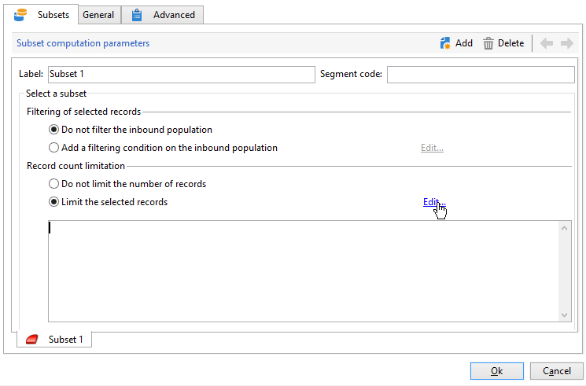

1. **&#x200B;**&#x200B;Durch Klick auf die Schaltfläche **[!UICONTROL Hinzufügen]** können Sie weitere Teilmengen definieren.

   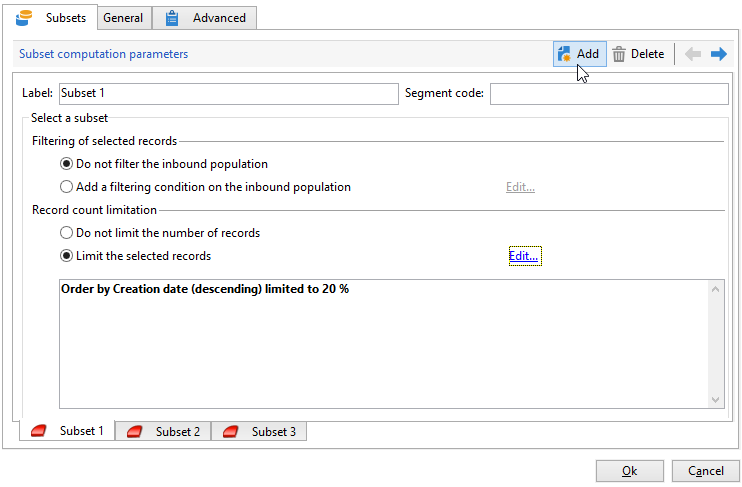

   >[!NOTE]
   >
   >Wenn die Option **[!UICONTROL Überlappung der Ausgabepopulationen aktivieren]** nicht aktiviert ist, werden Teilmengen in der Reihenfolge der Registerkarten erstellt. Verwenden Sie die Pfeile im oberen rechten Bereich dieses Fensters, um sie zu verschieben. Wenn die erste Teilmenge beispielsweise 70 % der ursprünglichen Population abruft, wendet die nächste Teilmenge ihre Auswahlkriterien nur auf die verbleibenden 30 % an usw.

   Für jede Teilmenge weist die Aufspaltung standardmäßig eine ausgehende Transition auf.

   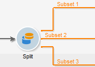

   Sie können jedoch auch alle Teilmengen in einer ausgehenden Transition zusammenzufassen. Kreuzen Sie hierzu im **[!UICONTROL Allgemein]**-Tab die Option **[!UICONTROL Alle Teilmengen in derselben Tabelle erzeugen]** an. In diesem Fall kann der Segment-Code verwendet werden, um die Zugehörigkeit zu einer bestimmten Teilmenge anzuzeigen.

   Wenn er abgeschlossen ist, wird der Segment-Code jeder Teilmenge automatisch in einer zusätzlichen Spalte gespeichert. Auf diese Spalte kann in den Personalisierungsfeldern auf Versandebene zugegriffen werden.

## Begrenzen der Anzahl an Datensätzen in Teilmengen {#limit-the-number-of-subset-records}

Es besteht die Möglichkeit, die Anzahl an Datensätzen in Teilmengen zu begrenzen, wenn Sie nicht alle potentiellen Empfänger ansprechen wollen.

1. Kreuzen Sie in diesem Fall die Option **[!UICONTROL Anzahl von Datensätzen begrenzen]** an und klicken Sie auf den Link **[!UICONTROL Bearbeiten...]**.
1. Wählen Sie den Begrenzungstyp aus:

   * **[!UICONTROL Zufallsauswahl aktivieren]** Mit dieser Option wird eine zufällige Stichprobe der Datensätze entnommen. Die Art der Stichprobenentnahme hängt von der Datenbank-Engine ab.
   * **[!UICONTROL Nur die ersten Datensätze nach dem Sortieren beibehalten]**: Mit dieser Option können Sie eine Begrenzung festlegen, die auf einer oder mehreren Sortierreihenfolgen basiert. Wenn Sie das Feld **[!UICONTROL Alter]** als Kriterium wählen und eine Begrenzung von 100 angeben, werden nur die 100 jüngsten Empfänger beibehalten.
   * **[!UICONTROL Die ersten beibehalten nach dem Sortieren (Kriterien, zufällig)]**: Diese Option kombiniert die beiden vorherigen Optionen. Damit können Sie eine Einschränkung definieren, die auf einer oder mehreren Sortierreihenfolgen basiert, und dann eine Zufallsauswahl auf die ersten Datensätze anwenden, wenn einige der Datensätze dieselben Werte wie die definierten Kriterien aufweisen.

     Angenommen, das Feld **[!UICONTROL Alter]** wurde als Sortierungskriterium gewählt und die Anzahl der auszugebenden Datensätze auf 100 begrenzt. Wenn nun die 2000 jüngsten Empfänger in der Datenbank alle 18 Jahre alt sind, werden aus diesen 2000 Empfängern 100 zufällig ausgewählt.

   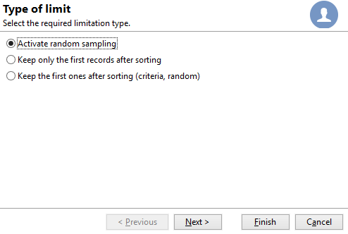

1. Wenn Sie sich für die Definition von Sortierungskriterien entscheiden, können Sie im darauffolgenden Schritt die Spalten und die Reihenfolge der Sortierung bestimmen.

   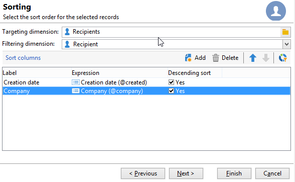

1. Wählen Sie dann die Begrenzungsmethode aus.

   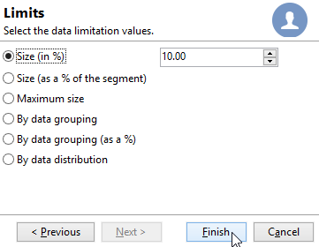

   Verschiedene Möglichkeiten bieten sich Ihnen:

   * **[!UICONTROL Größe (in %)]**: ein Prozentsatz von Datensätzen. Mit der folgenden Konfiguration werden beispielsweise 10 % der Gesamtpopulation extrahiert.

     Der prozentuale Anteil bezieht sich auf die Eingangspopulation und nicht auf das Ergebnis der Aktivität.

   * **[!UICONTROL Größe (in % von der Teilmenge)]**: Begrenzt die Datensätze auf einen prozentualen Anteil in Bezug auf die Teilmenge (und nicht auf die Eingangspopulation).
   * **[!UICONTROL Maximale Größe]**: Begrenzt die Datensätze auf eine anzugebende Anzahl.
   * **[!UICONTROL Durch Datengruppierung]**: Begrenzt die Datensätze auf die Profile der Eingangspopulation, die in einem anzugebenden Feld einen bestimmten Wert aufweisen. [Weitere Informationen](#limit-the-number-of-subset-records-by-data-grouping).
   * **[!UICONTROL Durch Datengruppierung (in %)]**: Begrenzt die Datensätze auf die Profile der Eingangspopulation, die in einem anzugebenden Feld einen bestimmten Wert aufweisen, durch einen Prozentsatz. [Weitere Informationen](#limit-the-number-of-subset-records-by-data-grouping).
   * **[!UICONTROL Durch Datenverteilung]**: Begrenzt die Datensätze, wenn die Gruppierungsfelder zu viele Werte aufweisen oder wenn Sie die Werte nicht bei jeder Aufspaltung neu erfassen möchten (erfordert das Modul **[!UICONTROL Dezentrales Marketing]**). [Weitere Informationen](#limit-the-number-of-subset-records-per-data-distribution).

1. Klicken Sie **[!UICONTROL Beenden]**, um die Datensatzauswahlkriterien zu genehmigen. Die definierte Konfiguration wird dann im mittleren Fenster des Editors angezeigt.

## Begrenzen der Anzahl an Datensätzen in Teilmengen durch Datengruppierung {#limit-the-number-of-subset-records-by-data-grouping}

Sie können die Anzahl der Datensätze durch Datengruppierung begrenzen. Diese Begrenzung kann mit einem festen Wert oder einem Prozentsatz durchgeführt werden.

Wenn Sie beispielsweise das Feld **[!UICONTROL Sprache]** als Gruppierungsfeld auswählen, können Sie für jede Sprache separat eine Begrenzung definieren.

1. Kreuzen Sie die Option **[!UICONTROL Durch Datengruppierung]** oder **[!UICONTROL Durch Datengruppierung (in %)]** an und klicken Sie auf **[!UICONTROL Weiter]**.

   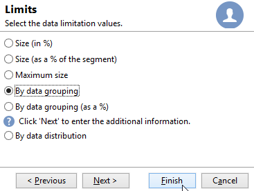

1. Geben Sie dann das oder die Gruppierungsfelder (z. B. **[!UICONTROL Sprache]**) an und klicken Sie auf **[!UICONTROL Weiter]**.

   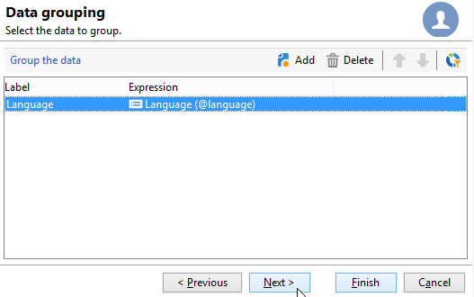

1. Definieren Sie nun die Begrenzungswerte der Datengruppierung (je nach gewählter Option in Prozent oder mit einer festen Größe). Um für jeden Wert die gleiche Begrenzung festzulegen, beispielsweise wenn Sie die Anzahl der Datensätze für jede Sprache auf 10 festlegen möchten, wählen Sie die Option **[!UICONTROL Alle Datengruppierungen haben die gleiche Größe]**. Wählen Sie die Option **[!UICONTROL Begrenzungen nach Gruppierungswert]**, um eine unterschiedliche Begrenzung für jeden Wert festzulegen. Dies erlaubt die Angabe einer unterschiedlichen Begrenzung für jeden Wert (beispielsweise 20 für Englisch, 50 für Deutsch etc.).

   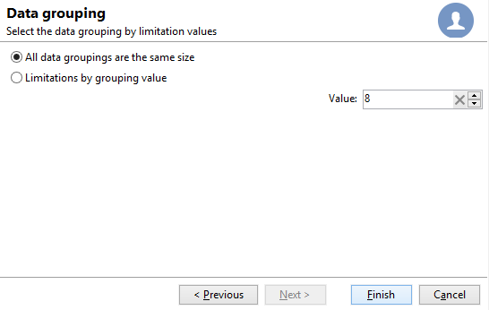

1. Klicken Sie auf **[!UICONTROL Beenden]**, um die Begrenzungen zu bestätigen und zur Konfiguration der Aufspaltungsaktivität zurückzukehren.

## Begrenzen der Anzahl an Datensätzen in Teilmengen durch Datenverteilung {#limit-the-number-of-subset-records-per-data-distribution}

Wenn Ihre Gruppierungsfelder zu viele Werte enthalten oder Sie vermeiden möchten, dass Werte für jede neue Aufspaltungsaktivität zurückgesetzt werden, können Sie mit Adobe Campaign eine Beschränkung für die Datenverteilung erstellen. Bei der Auswahl von [Datenbegrenzungswerten](#create-subsets) (Abschnitt) wählen Sie die Option **[!UICONTROL Durch Datenverteilung]** und anschließend eine Vorlage aus dem Dropdown-Menü aus. Die Erstellung einer Datenverteilungsvorlage wird nachfolgend erläutert.

Ein Beispiel für die Aktivität **[!UICONTROL Lokale Validierung]** mit einer Verteilungsvorlage finden Sie auf [dieser Seite](local-approval-activity.md).

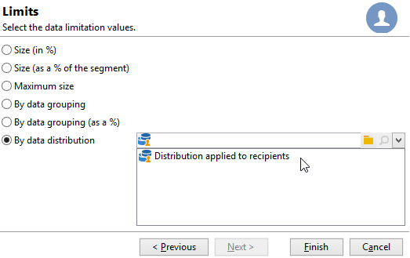

>[!CAUTION]
>
>Diese Funktion ist nur mit dem Add-on [Verteiltes Marketing](../distributed-marketing/about-distributed-marketing.md) verfügbar. Prüfen Sie diesbezüglich Ihren Lizenzvertrag.

Mit der Datenverteilungsvorlage können Sie die Anzahl der Datensätze mithilfe einer Liste von Gruppierungswerten begrenzen. Gehen Sie wie folgt vor, um eine Datenverteilungsvorlage zu erstellen:

1. Gehen Sie in den Knoten **[!UICONTROL Ressourcen > Kampagnenverwaltung > Datenverteilung]** und klicken Sie auf die Schaltfläche **[!UICONTROL Neu]**.

   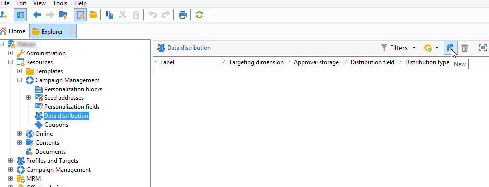

1. Der **[!UICONTROL Allgemein]**-Tab dient der Angabe eines Titels sowie des Ausführungskontexts (Zielgruppendimension und Verteilungsfeld).

   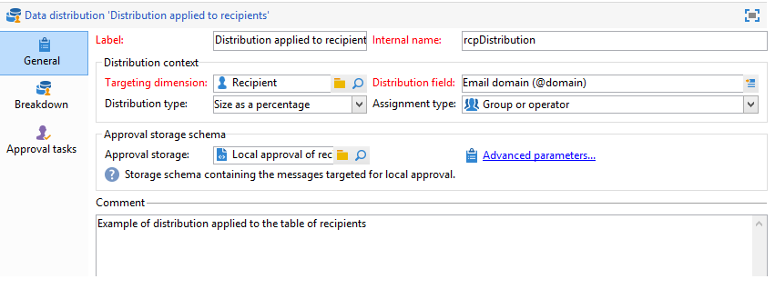

   Folgende Angaben sind erforderlich:

   * **[!UICONTROL Titel]**: Titel der Verteilungsvorlage.
   * **[!UICONTROL Zielgruppendimension]**: Geben Sie die Zielgruppendimension ein, auf die die Datenverteilung angewendet werden soll, **[!UICONTROL z. B]** Empfänger. Dieses Schema muss stets mit den im Zielgruppenbestimmungs-Workflow verwendeten Daten kompatibel sein.
   * **[!UICONTROL Verteilungsfeld]**: Wählen Sie ausgehend von der Zielgruppendimension ein Feld aus. Wenn Sie beispielsweise das Feld **[!UICONTROL E-Mail-Domain]** auswählen, werden die Empfänger nach ihren Domains verteilt.
   * **[!UICONTROL Verteilungstyp]**: Wählen Sie hier aus, ob der Begrenzungswert im Tab **[!UICONTROL Verteilung]** als **[!UICONTROL Feste Größe]** oder als **[!UICONTROL Größe in Prozent]** ausgedrückt werden soll.
   * **[!UICONTROL Validierungsspeicherung]**: Wenn Sie die Aktivität [Lokale Validierung](local-approval.md) in Ihrem Zielgruppen-Workflow verwenden, geben Sie das Schema ein, in dem die Validierungsergebnisse gespeichert werden. Sie müssen ein Speicherschema pro Zielgruppenbestimmungsschema angeben. Wenn Sie das Zielgruppenbestimmungsschema für **[!UICONTROL Empfänger]** verwenden, geben Sie das standardmäßige Speicherschema **[!UICONTROL Lokale Validierung der Empfänger]** ein.

     Bei einer einfachen Begrenzung durch Datenverteilung ohne lokale Validierung, ist im Feld **[!UICONTROL Validierungsspeicherung]** keine Angabe erforderlich.

1. Wenn Sie die Aktivität [Lokale Validierung](local-approval.md) verwenden, geben Sie die **[!UICONTROL Erweiterten Einstellungen]** für die Verteilungsvorlage ein:

   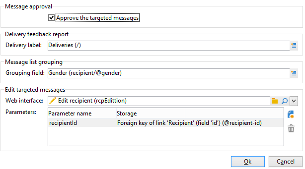

   Folgende Angaben sind erforderlich:

   * **[!UICONTROL Validieren zielgerichteter Nachrichten]**: Aktivieren Sie diese Option, wenn Sie möchten, dass alle Empfänger vorab aus der Liste der zu validierenden Empfänger ausgewählt werden. Wenn diese Option deaktiviert ist, wird kein Empfänger vorab ausgewählt.

     >[!NOTE]
     >
     >Diese Option ist standardmäßig aktiviert.

     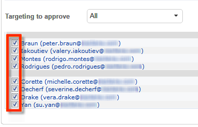

   * **[!UICONTROL Versandtitel]** definiert einen Ausdruck, der die Versandbezeichnung in der Rücksendebenachrichtigung anzeigt. Der Standardausdruck enthält Informationen über die Standardbeschriftung des Versands (Compute string). Sie können diesen Ausdruck ändern.

     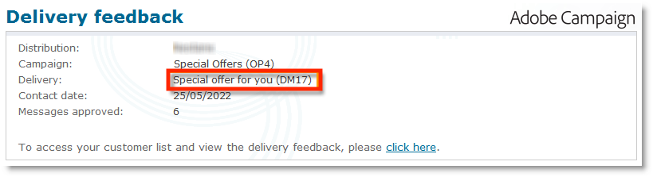

   * **[!UICONTROL Gruppierungsfeld]**: Erlaubt die Definition der für die Empfängeranzeige in den Validierungs- und Versandreaktionen-Benachrichtigungen verwendeten Gruppierung.

     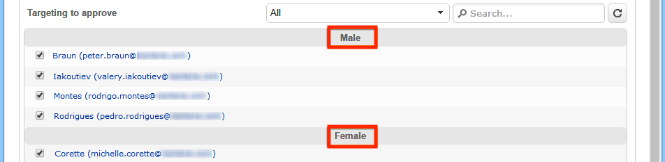

   * **[!UICONTROL Web-Schnittstelle]**: dient der Verknüpfung einer Web-Anwendung mit der Empfängerliste. In der Validierungs- und Rückgabenachrichtigung kann jeder Empfänger angeklickt werden und eine Verknüpfung zur ausgewählten Web-Anwendung herstellen. Im Feld **[!UICONTROL Parameter]** (z. B. **[!UICONTROL recipientId]**) kann der zusätzliche Parameter angegeben werden, der in der URL der Webanwendung verwendet werden soll.

1. Im Tab **[!UICONTROL Aufschlüsselung]** wird die Liste der Verteilungswerte definiert.

   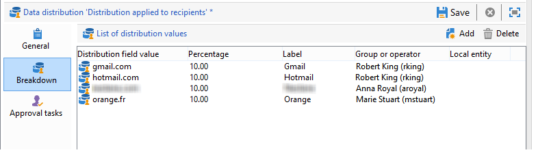

   * **[!UICONTROL Wert des Verteilungsfeldes]**: Geben Sie die Werte der Verteilung an.
   * **[!UICONTROL Prozent/Feste Größe]**: Geben Sie die jedem Wert zugeordnete Speicherbegrenzung in Prozent oder als feste Größe an.

     Diese Spalte wird durch das Feld **[!UICONTROL Verteilungstyp]** im **[!UICONTROL Allgemein]**-Tab bestimmt.

   * **[!UICONTROL Titel]**: Vergeben Sie für jeden Verteilungswert einen Titel.
   * **[!UICONTROL Gruppe oder Benutzer]**: Wenn Sie eine [Lokale Validierung](local-approval.md) verwenden, wählen Sie den/die Benutzende(n) oder die Benutzergruppe aus, die jedem Verteilungswert zugeordnet sind.

     Bei einer einfachen Begrenzung durch Datenverteilung ohne lokale Validierung ist ein Zuweisung in der Spalte **[!UICONTROL Benutzer oder Benutzergruppe]** nicht erforderlich.

     >[!CAUTION]
     >
     >Stellen Sie sicher, dass die Benutzenden über die nötigen Berechtigungen verfügen.

## Filterparameter {#filtering-parameters}

Klicken Sie auf die **[!UICONTROL Allgemein]**, um den Aktivitätstitel einzugeben. Wählen Sie die Ziel- und Filterdimensionen für diese Aufspaltung aus. Bei Bedarf können Sie diese Dimensionen für eine bestimmte Teilmenge ändern.

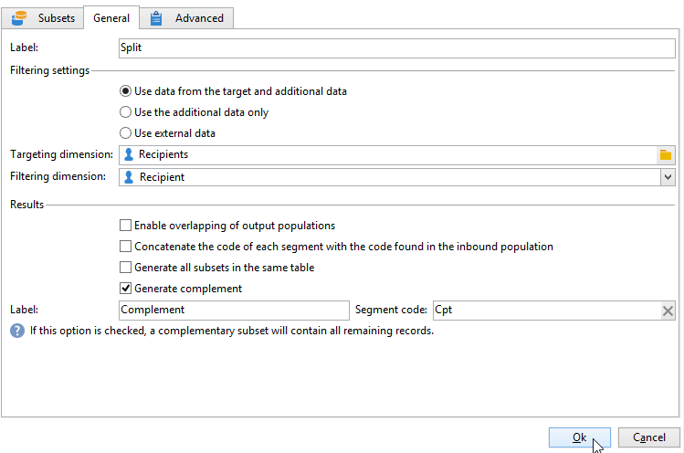

Aktivieren Sie die **[!UICONTROL Komplement erzeugen]**, wenn Sie die verbleibende Population nutzen möchten. Das Komplement besteht aus der eingehenden Zielgruppe minus der Vereinigung der Teilmengen. Die Aktivität weist somit, wie unten abgebildet, eine zusätzliche ausgehende Transition auf:

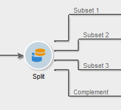

Damit diese Option korrekt arbeiten kann, müssen die eingehenden Daten einen Primärschlüssel aufweisen.

Wenn die Daten beispielsweise direkt aus einer externen Datenbank wie Netezza (die keine Unterstützung von Indizes bietet) über eine **[!UICONTROL Laden-(SGBD)]**-Aktivität gelesen werden, ist das von der **[!UICONTROL Aufspaltung]** erzeugte Komplement falsch.

Dies lässt sich vermeiden, indem Sie der **[!UICONTROL Aufspaltung]** eine **[!UICONTROL Anreicherung]** vorschalten. Aktivieren Sie in der **[!UICONTROL Anreicherung]** die Option **[!UICONTROL Alle Zusatzdaten der Hauptmenge beibehalten]** und geben Sie als Zusatzdaten die Spalten an, die Sie für die Konfiguration der Filter der **[!UICONTROL Aufspaltung]** verwenden möchten. Die Daten der in die **[!UICONTROL Aufspaltung]** eingehenden Transition werden in diesem Fall lokal in einer temporären Tabelle auf dem Adobe-Campaign-Server gespeichert und das Komplement kann korrekt erzeugt werden.

Die Option **[!UICONTROL Überlappung der Ausgabepopulationen zulassen]** ermöglicht Ihnen die Verwaltung von Populationen, die in mehreren Teilmengen enthalten sind:

* Wenn diese Option deaktiviert ist, stellt die Aktivität der Aufspaltung sicher, dass ein Profil nicht in mehreren Ausgangstransitionen vorhanden sein kann, selbst wenn es die Kriterien mehrerer Teilmengen erfüllt. Sie befinden sich in der Zielgruppe der ersten Registerkarte mit passenden Kriterien.
* Wenn das Kästchen aktiviert ist, können die Empfängerinnen und Empfänger in mehreren Teilmengen gefunden werden, wenn sie ihre Filterkriterien erfüllen. Adobe Campaign empfiehlt, Ausschlusskriterien zu verwenden.

## Eingabeparameter {#input-parameters}

* tableName
* schema

Jedes eingehende Ereignis muss eine durch diese Parameter definierte Zielgruppe angeben.

## Ausgabeparameter {#output-parameters}

* tableName
* schema
* recCount

Anhand der drei Werte lässt sich die durch den Ausschluss ermittelte Zielgruppe identifizieren. **[!UICONTROL tableName]** ist der Name der Tabelle, die die Zielgruppen-IDs enthält, **[!UICONTROL schema]** ist das Schema der Population, (i. d. R. nms:recipient) und **[!UICONTROL recCount]** ist die Anzahl der Elemente in der Tabelle.

Die Transition des Komplements weist die gleichen Parameter auf.
