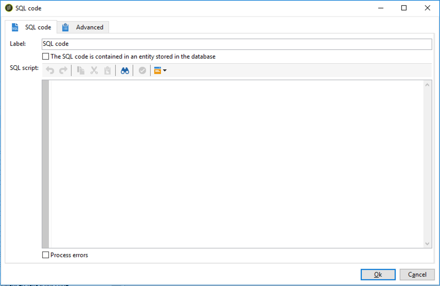
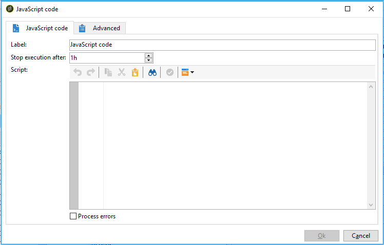
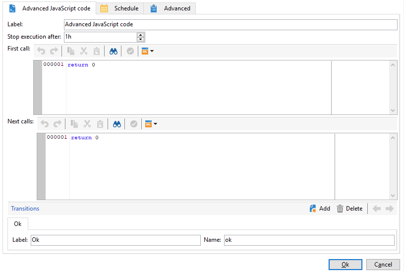

# SQL-Code und JavaScript-Code{#sql-code-and-javascript-code}

## SQL-Code {#sql-code}

Die Aktivität **[!UICONTROL SQL-Code]** führt ein SQL-Script in Form eines JST-Templates aus.



* **[!UICONTROL Script]**

  Das Script wird in den zentralen Bereich des Editors eingefügt. Da es sich beim Script um ein JST-Template handelt, kann es dem Workflow-Kontext entsprechend konfiguriert werden.

* **[!UICONTROL Fehler verarbeiten]**

  Siehe [Fehler verarbeiten](monitor-workflow-execution.md#processing-errors).

### Wichtige Hinweise        {#important-notes}

Ab 8.9.1 wurden die Workflow-Aktivitäten **[!UICONTROL SQL-Code]** und **[!UICONTROL SQL-Daten-Management]** verbessert, um PostgreSQL-Datenbanken besser zu schützen und dafür zu sorgen, dass Ihre Workflows reibungslos ausgeführt werden, wenn benutzerdefinierte SQL von Campaign aus ausgeführt wird. Im Folgenden finden Sie Best Practices für den Fall von Fehlern.

Optionen sind unter **[!UICONTROL Administration]** > **[!UICONTROL Plattform]** > **[!UICONTROL Optionen]** verfügbar. Für den Fall von Fehlern stehen zwei Lösungen zur Verfügung:

**Lösung 1**

Legen Sie `XtkSecurity_FeatureFlag_SqlSensitive` auf `0` fest. Die Funktion ist deaktiviert.

**Lösung 2**

`XtkSecurity_SqlSensitive_Methods` ändern. Sie können `<method name="TRUNCATE" action="block"/>` in `<method name="TRUNCATE" action="warn"/>` ändern

Andere Methoden wie VACUUM FULL, REINDEX, CREATE INDEX, DROP INDEX sind ebenfalls standardmäßig blockiert, um die Datenbankintegrität zu schützen. Seien Sie vorsichtig, wenn Sie sie auf WARNUNG anstelle von BLOCK einstellen möchten. Diese Methoden können bei der Ausführung schwerwiegende Auswirkungen auf die Datenbankleistung haben.

## JavaScript-Code und erweiterter JavaScript-Code {#javascript-code}

Aktivitäten mit **[!UICONTROL JavaScript-Code]** und **[!UICONTROL erweitertem JavaScript-Code]** führen im Kontext von Workflows ein JavaScript-Script aus. Weitere Informationen zur Scripterstellung finden Sie in diesen Abschnitten:

* [JavaScript-Scripte und -Vorlagen](javascript-scripts-and-templates.md)
* [Beispiele für JavaScript-Code in Workflows](javascript-in-workflows.md)

### Ausführungsverzögerung {#exec-delay}

Ab Version 20.2 wurde eine Ausführungsverzögerung zu den Aktivitäten **[!UICONTROL JavaScript-Code]** und **[!UICONTROL Erweiterter JavaScript-Code]** hinzugefügt. Standardmäßig darf die Ausführungsphase nicht länger als eine Stunde sein. Nach dieser Verzögerung wird der Vorgang mit einer Fehlermeldung abgebrochen und die Ausführung der Aktivität schlägt fehl.

Sie können diese Verzögerung im Feld **[!UICONTROL Ausführung stoppen nach]** in diesen Aktivitäten ändern.

Um diese Begrenzung zu ignorieren, müssen Sie den Wert auf **0** setzen.

### JavaScript-Code {#js-code-desc}



* **[!UICONTROL Script]**: Das auszuführende Script wird in den zentralen Bereich des Editors eingefügt.

* **[!UICONTROL Fehler verarbeiten]**: Siehe [Fehler verarbeiten](monitor-workflow-execution.md#processing-errors).

### Erweiterter JavaScript-Code {#adv-js-code-desc}



* **[!UICONTROL Erster Aufruf]**: Das beim ersten Aufruf auszuführende Script wird im oberen Bereich des Editors eingefügt.
* **[!UICONTROL Nächste Aufrufe]**: Das bei allen weiteren Aufrufen auszuführende Script wird im unteren Bereich des Editors eingefügt.
* **[!UICONTROL Transitionen]**: Es ist möglich, mehrere aus dieser Aktivität ausgehende Transitionen zu definieren.
* **[!UICONTROL Zeitplan]** Im Tab **[!UICONTROL Planung]** können der Ausführungszeitpunkt und -rhythmus der Aktivität definiert werden.

Erweitertes JavaScript ist eine persistente Aufgabe und wird in regelmäßigen Abständen zurückgerufen, wenn es nicht als abgeschlossen markiert wurde. Um die Aufgabe zu beenden und künftige Rückrufe zu verhindern, müssen Sie die **task.setCompleted()**-Methode im Abschnitt **[!UICONTROL Nächste Aufrufe]** verwenden:

```
task.postEvent(task.transitionByName("ok")); // to transition to Ok branch
task.setCompleted();

return 0;
```
