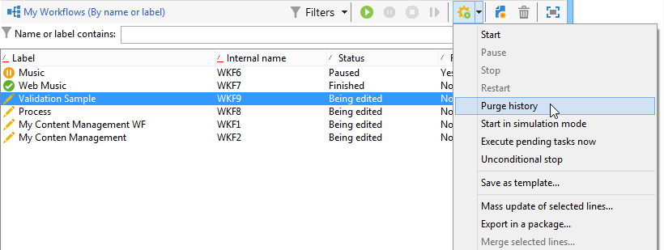
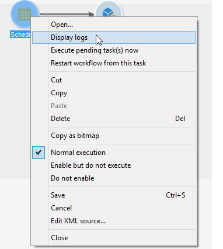

# Starten, Pausieren und Stoppen eines Workflows {#starting-a-workflow}

Workflows werden grundsätzlich manuell gestartet, Nach dem Starten können sie jedoch inaktiv bleiben, je nachdem, welche Informationen über eine Planung (siehe [Planung](scheduler.md)) oder Aktivitätsplanung angegeben wurden.

Aktionen zur Ausführung des Zielgruppen-Workflows (Start, Stopp, Pause usw.) sind **asynchrone** Prozesse: Die Bestellung wird aufgezeichnet und wird wirksam, sobald der Server für die Anwendung verfügbar ist.

Anhand der Schaltflächen der Symbolleiste kann die Ausführung des Workflows gesteuert und überwacht werden.

Die im Menü **[!UICONTROL Aktionen]** und im Kontextmenü verfügbaren Befehle werden nachstehend erläutert.

>[!IMPORTANT]
>
>Beachten Sie: Von Benutzern angeforderte Aktionen (Workflow starten, stoppen, aussetzen usw.) werden nicht sofort ausgeführt, sondern in eine Warteschlange eingereiht und dort vom Workflow-Modul verarbeitet.

## Aktionen-Symbolleiste {#actions-toolbar}

Die Schaltfläche **[!UICONTROL Aktionen]** in der Symbolleiste bietet Zugriff auf zusätzliche Ausführungsoptionen in ausgewählten Workflows. Sie können auch das Menü **[!UICONTROL Datei > Aktionen]** verwenden oder mit der rechten Maustaste auf einen Workflow klicken und dann **[!UICONTROL Aktionen]** auswählen.



* **[!UICONTROL Starten]**

  Mit dieser Aktion können Sie die Ausführung eines Workflows starten: Ein Workflow, der **Abgeschlossen**, **In Bearbeitung** oder **Paused** ist, ändert den Status in **Gestartet**. Die Workflow-Engine übernimmt dann die Ausführung dieses Workflows. Wenn der Workflow angehalten wurde, wird er fortgesetzt, andernfalls wird der Workflow von Anfang an gestartet und die ersten Aktivitäten werden aktiviert.

  Der Start eines Workflows ist ein asynchroner Prozess, d. h. der jeweilige Befehl wird gespeichert und erst dann ausgeführt, wenn ein Server verfügbar ist.

* **[!UICONTROL Aussetzen]**

  Diese Aktion setzt den Status des Workflows auf **Paused**. Bis zur Wiederaufnahme des Workflows werden keine Aktivitäten aktiviert. Die laufenden Vorgänge werden jedoch nicht angehalten.

* **[!UICONTROL Anhalten]**

  Dieser Befehl hält die Ausführung eines laufenden Workflows an. Der Status der Workflow-Instanz wechselt zu **Abgeschlossen**. Laufende Aktionen werden nach Möglichkeit gestoppt. Gestartete Importe oder SQL-Abfragen werden sofort abgebrochen.

  >[!IMPORTANT]
  >
  >Das Anhalten eines Workflows ist ein asynchroner Prozess: Die Anfrage wird registriert und der oder die Workflow-Server brechen die laufenden Vorgänge ab. Das Anhalten einer Workflow-Instanz kann daher einige Zeit in Anspruch nehmen, insbesondere wenn der Workflow auf mehreren Servern ausgeführt wird, von denen jeder die laufenden Aufgaben abbrechen muss. Um Probleme zu vermeiden, warten Sie, bis der Stopp-Vorgang abgeschlossen ist, und führen Sie nicht mehrere Stopp-Anfragen für denselben Workflow durch.

* **[!UICONTROL Unbedingter Stopp]**

  Diese Option ändert den Workflow-Status in **[!UICONTROL Abgeschlossen]**. Diese Aktion sollte nur als letztes Mittel verwendet werden, wenn der normale Stopp-Vorgang nach einigen Minuten fehlschlägt. Verwenden Sie den bedingungslosen Stopp nur, wenn Sie sicher sind, dass keine aktuellen Workflow-Aufträge in Bearbeitung sind.

  >[!CAUTION]
  >
  >„Unbedingter Stopp“ steht nur Admins zur Verfügung.

* **[!UICONTROL Neu starten]**

  Diese Aktion stoppt und startet den Workflow neu. In den meisten Fällen ist es möglich, schneller neu zu starten. Es ist auch nützlich, den Neustart zu automatisieren, wenn das Anhalten eine bestimmte Zeit dauert: Dies liegt daran, dass der Befehl „Stopp“ nicht verfügbar ist, wenn der Workflow angehalten wird.

  Beachten Sie, dass die Aktion **Neustart** die Workflow-Instanzvariablen im Vergleich zu den Aktionen **Ausführung**, **Anhalten** und **Starten** nicht löscht (das Löschen der Instanzvariablen erfolgt bei der Aktion „Starten“). Beim Neustart eines Workflows sind Instanzvariablen weiterhin für die Verwendung mit beibehaltenen Werten verfügbar. Zum Löschen haben Sie folgende Möglichkeiten:
   * Führen Sie die Aktionen **Anhalten** und **Starten** aus.
   * Fügen Sie am Ende der Workflow-Ausführung folgenden JavaScript-Code hinzu:

     ```
     var wkf = xtk.workflow.load(instance.id)
     wkf.variables='<variables/>'
     wkf.save()
     ```

* **[!UICONTROL Verlaufsbereinigung]**

  Mit dieser Aktion können Sie den Workflow-Verlauf bereinigen. Weitere Informationen finden Sie unter [Verläufe bereinigen](monitor-workflow-execution.md#purging-the-logs).

* **[!UICONTROL Im Simulationsmodus starten]**

  Mithilfe dieses Befehls wird der Workflow im Simulationsmodus gestartet. Wenn Sie diesen Modus aktivieren, werden nur Aktivitäten ausgeführt, die keine Auswirkungen auf die Datenbank oder das Dateisystem haben (z. B. **[!UICONTROL Abfrage]**, **[!UICONTROL Vereinigung]**, **[!UICONTROL Schnittmenge]** usw.). Aktivitäten, die eine Auswirkung haben (z. B. **[!UICONTROL Export]**, **[!UICONTROL Import]** usw.), sowie die nach ihnen (in derselben Verzweigung) werden nicht ausgeführt.

* **[!UICONTROL Vorgezogene Ausführung der ausstehenden Aufgaben]**

  Dieser Befehl bietet die Möglichkeit, so schnell wie möglich alle ausstehenden Aufgaben zu starten. Wenn Sie eine bestimmte Aufgabe starten möchten, klicken Sie auf die entsprechende Aktivität und wählen Sie **[!UICONTROL Aufgabe(n) jetzt bearbeiten]**.


* **[!UICONTROL Als Vorlage speichern]**

  Dieser Befehl erstellt eine neue, auf dem markierten Workflow basierende Workflow-Vorlage. Geben Sie im Feld **[!UICONTROL Ordner]** den gewünschten Speicherordner an.


## Best Practices für die Workflow-Ausführung {#workflow-execution-best-practices}

Verbessern Sie die Stabilität Ihrer Instanz, indem Sie die folgenden Best Practices beachten:

* **Es wird empfohlen, Workflows nicht öfter als alle 15 Minuten auszuführen**, da die Gesamt-Performance des Systems beeinträchtigt werden kann und Blockierungen in der Datenbank entstehen können.

* **Vermeiden Sie es, Ihre Workflows in einem angehaltenen Zustand zu belassen**. Wenn Sie einen temporären Workflow erstellen, stellen Sie sicher, dass er korrekt beendet werden kann und nicht in einem **[!UICONTROL pausierten]** Zustand bleibt. Wenn er pausiert ist, bedeutet dies nämlich, dass Sie die temporären Tabellen beibehalten müssen und somit die Größe der Datenbank erhöhen. Weisen Sie unter „Workflow-Eigenschaften“ Workflow-Verantwortliche zu, um eine Warnung zu senden, wenn ein Workflow fehlschlägt oder vom System ausgesetzt wird.

  So vermeiden Sie, dass Workflows ausgesetzt werden:

   * Prüfen Sie Ihre Workflows regelmäßig, um sicherzustellen, dass keine unerwarteten Fehler auftreten.
   * Bauen Sie Ihre Workflows möglichst einfach auf, indem Sie beispielsweise große Workflows in mehrere kleine unterteilen. Mit der Aktivität **[!UICONTROL Externes Signal]** können Sie Workflows durch andere Workflows auslösen.
   * Vermeiden Sie es, Aktivitäten mit Flüssen in Ihren Workflows zu deaktivieren, die Threads offen lassen und zu vielen temporären Tabellen führen, die viel Platz verbrauchen können. Behalten Sie in Ihren Workflows keine Aktivitäten im Status **[!UICONTROL Nicht aktivieren]** oder **[!UICONTROL Aktivieren, aber nicht ausführen]**.

* **Stoppen von nicht verwendeten Workflows**. Workflows, die weiterhin ausgeführt werden, halten Verbindungen zur Datenbank aufrecht.

* **Verwenden Sie den bedingungslosen Stopp so selten wie möglich**. Diese Option steht nur Admins zur Verfügung. Verwenden Sie diese Aktion nicht regelmäßig. Wenn Verbindungen, die von Workflows zur Datenbank erzeugt werden, nicht sauber geschlossen werden, beeinträchtigt dies die Performance.

* **Führen Sie nicht mehrere Stopp-Anfragen für denselben Workflow aus**. Das Anhalten eines Workflows ist ein asynchroner Prozess: Die Anfrage wird registriert und der oder die Workflow-Server brechen die laufenden Vorgänge ab. Das Anhalten einer Workflow-Instanz kann daher einige Zeit in Anspruch nehmen, insbesondere wenn der Workflow auf mehreren Servern ausgeführt wird, von denen jeder die laufenden Aufgaben abbrechen muss. Um Probleme zu vermeiden, warten Sie, bis der Stopp-Vorgang abgeschlossen ist, und vermeiden Sie, einen Workflow mehrmals anzuhalten.

## Kontextmenü {#right-click-menu}

Durch Markierung und Rechtsklick auf eine oder mehrere Aktivitäten eines Workflows können Sie speziell auf diese einwirken.



Im Kontextmenü stehen folgende Optionen zur Verfügung:

**[!UICONTROL Öffnen...]** - ermöglicht den Zugriff auf die Eigenschaften der Aktivität.

**[!UICONTROL Protokoll anzeigen]** - zeigt das Ausführungsprotokoll der Aufgaben der ausgewählten Aktivität an. Weitere Informationen finden Sie unter [Protokoll anzeigen](monitor-workflow-execution.md#displaying-logs).

**[!UICONTROL Aufgabe(n) jetzt bearbeiten]** - startet so schnell wie möglich alle ausstehenden Aufgaben der Aktivität.

**[!UICONTROL Workflow ab dieser Aufgabe neu starten]** - startet den Workflow ab der ausgewählten Aufgabe neu und verwendet dabei die durch die vorangehende Ausführung in der Aktivität gespeicherten Ergebnisse.

**[!UICONTROL Ausschneiden/Kopieren/Einfügen/Löschen]** - ermöglicht das Ausschneiden, Kopieren, Einfügen oder Löschen der ausgewählten Aktivität(en).

**[!UICONTROL Als Bild kopieren]** - erstellt einen Screenshot sämtlicher Aktivitäten des Workflows.

**[!UICONTROL Normale Ausführung/Aktivieren, aber nicht ausführen/Nicht aktivieren]** - sind auch im Tab **[!UICONTROL Erweitert]** der Aktivitätseigenschaften verfügbar. Sie werden unter [Ausführung](advanced-parameters.md#execution) ausführlich beschrieben.

**[!UICONTROL Speichern/Abbrechen]** - speichert oder verwirft die im Workflow vorgenommenen Änderungen.

>[!NOTE]
>
>Es ist möglich, mehrere Aktivitäten zu markieren, um einen der genannten Befehle auf sie anzuwenden.

