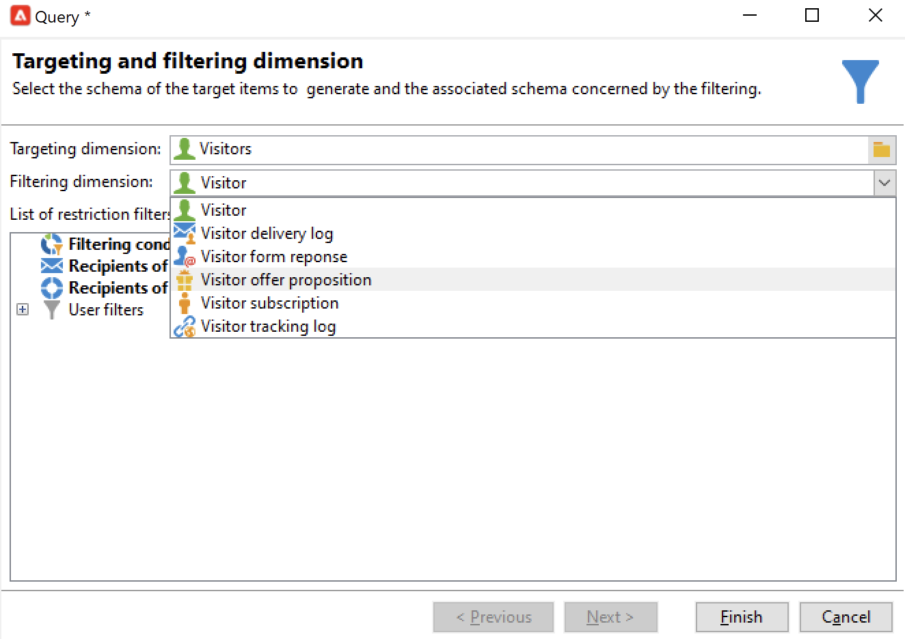
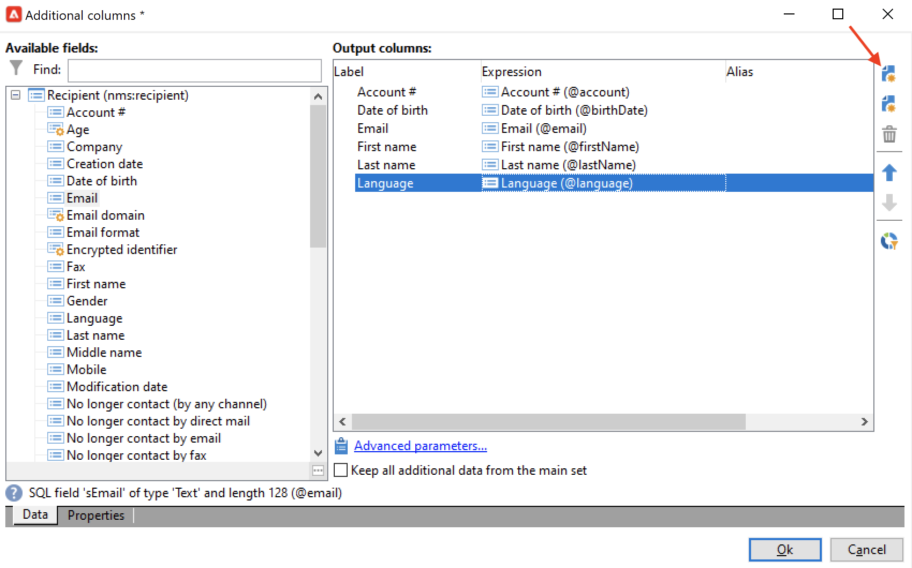
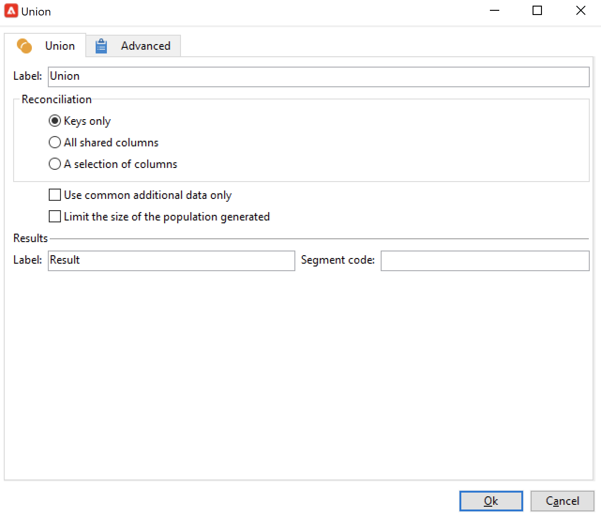
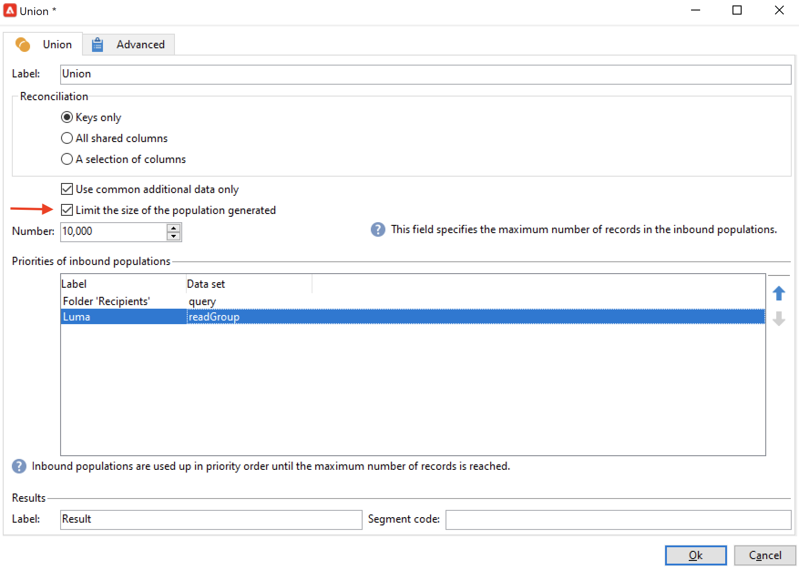
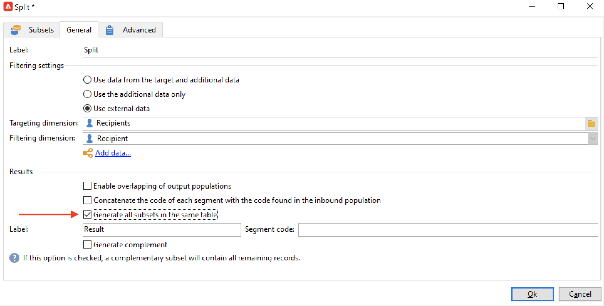

# Erstellen eines Zielgruppen-Workflows{#target-data}

Workflows können für die Abfrage einer Datenbank und die Segmentierung von Daten verwendet werden. Das Workflow-Modul von Campaign ist ein leistungsstarkes Tool, um Daten-Management-Aktivitäten durchzuführen, Daten zu extrahieren, anzureichern und umzuwandeln, Zielgruppen zu verwalten und Populationen zu verfeinern.

Zielgruppen-Workflows erlauben die Bestimmung von einer oder mehreren Versandzielgruppen. Dies geschieht mithilfe von Abfragen, Vereinigungen oder Ausschlüssen nach bestimmten Kriterien. Das Ergebnis der Zielgruppenbestimmung kann dann beispielsweise in eine Liste übertragen werden, um diese als Grundlage für Versandaktionen zu verwenden.

Adobe Campaign bietet in den Workflows darüber hinaus Data Management-Optionen, die erweiterte Funktionen für komplexe Zielgruppenbestimmungen enthalten. Weitere Informationen hierzu finden Sie unter [Data Management](targeting-workflows.md#data-management).

Alle diese Aktivitäten sind im ersten Tab der Workflow-Palette enthalten.

>[!NOTE]
>
>Zielgruppenaktivitäten werden in diesem [Abschnitt](activities.md) beschrieben.

Der Zugriff auf Zielgruppen-Workflows erfolgt im Navigationsbaum über den Knoten **[!UICONTROL Profile und Zielgruppen > Vorgänge > Zielgruppen-Workflows]** oder auf der Startseite über die Rubrik **[!UICONTROL Profile und Zielgruppen]**.

Im Gegensatz dazu werden die im Rahmen einer Kampagne erstellten Zielgruppen-Workflows zusammen mit den anderen Kampagnen-Workflows gespeichert.

## Wichtige Schritte zum Erstellen eines Zielgruppen-Workflows {#implementation-steps-}

In den folgenden Abschnitten finden Sie Details zum Erstellen eines Zielgruppen-Workflows:

1. **Identifizieren** von Daten in der Datenbank – Siehe [Erstellen von Abfragen](#create-queries)
1. **Vorbereiten** der Daten auf die Versandanforderungen – Siehe [Anreichern und Ändern von Daten](#enrich-and-modify-data)
1. **Verwenden** von Daten zur Durchführung von Aktualisierungen oder innerhalb eines Versands – Siehe [Aktualisieren der Datenbank](use-workflow-data.md#update-the-database)

Die Ergebnisse aller Anreicherungen und aller Behandlungen, die während der Zielgruppenbestimmung durchgeführt werden, werden gespeichert und können über Personalisierungsfelder beispielsweise zur Gestaltung individueller Nachrichten verwendet werden. Weitere Informationen hierzu finden Sie im Abschnitt [Zielgruppendaten](use-workflow-data.md#target-data).

## Zielgruppen- und Filterdimensionen {#targeting-and-filtering-dimensions}

Bei Vorgängen zur Datensegmentierung wird einer Zielgruppendimension in der Regel eine Filterdimension zugeordnet. Die Zielgruppendimension definiert die Population, die von einer Kampagne angesprochen werden soll: Empfänger, Kunden, Abonnenten, Benutzer etc. Die Filterdimension ermöglicht die Einschränkung der gewählten Population nach bestimmten Kriterien: Kauf eines bestimmten Produkts, Abonnement eines bestimmten Newsletters etc.

Angenommen, Sie möchten alle Kunden auswählen, die seit mehr als fünf Jahren eine Lebensversicherung haben. Verwenden Sie in diesem Fall die Zielgruppendimension **Kunden** und die Filterdimension **Hat eine Versicherung abgeschlossen**. In der Abfrageaktivität können Sie die weiteren Filterbedingungen definieren (Versicherung = Lebensversicherung, Abschlussdatum > 5 Jahre).

Nach Auswahl einer Zielgruppendimension stehen nur die Filterdimensionen zur Verfügung, die mit der gewählten Zielgruppendimension kompatibel sind.

Diese beiden Dimensionen müssen miteinander verknüpft sein. Der Inhalt der Liste **[!UICONTROL Filterdimension]** hängt somit von der im ersten Feld angegebenen Zielgruppendimension ab.

Bei Auswahl der Empfängerinnen und Empfänger (**Empfänger**) stehen folgende Filterdimensionen zur Verfügung:

Für **Besuchende** dagegen enthält die Liste die folgenden Filterdimensionen:

## Erstellen von Abfragen {#create-queries}

### Arbeiten mit zusätzlichen Daten {#select-data}

Mit einer **[!UICONTROL Abfrageaktivität]** können Sie allgemeine Daten zum Aufbau der Zielpopulation auswählen. Weiterführende Informationen hierzu finden Sie in [diesem Abschnitt](query.md#create-a-query).

Sie können auch mithilfe der folgenden Aktivitäten Daten aus der Datenbank abfragen und weiter filtern: [Inkrementelle Abfrage ](incremental-query.md), [Liste lesen](read-list.md).

Es ist möglich, zusätzliche Daten zu sammeln, die während des gesamten Lebenszyklus des Workflows weitergeleitet und verarbeitet werden. Weitere Informationen hierzu finden Sie unter [Hinzufügen von Daten](query.md#add-data) und [Bearbeiten von zusätzlichen Daten](#edit-additional-data).

### Bearbeiten zusätzlicher Daten {#edit-additional-data}

Nach Hinzufügung der zusätzlichen Daten können Sie diese bearbeiten oder zur Verfeinerung der in der Abfrageaktivität definierten Zielgruppe verwenden.

Über den Link **[!UICONTROL Zusätzliche Daten bearbeiten...]** können Sie die hinzugefügten Daten anzeigen und sie gegebenenfalls ändern oder ergänzen.

Um Daten zu den zuvor definierten Ausgabespalten hinzuzufügen, wählen Sie sie in der Liste der verfügbaren Felder aus. Um eine neue Ausgabespalte zu erstellen, klicken Sie auf das Symbol **[!UICONTROL Hinzufügen]**, wählen Sie das Feld aus und klicken Sie auf **[!UICONTROL Ausdruck bearbeiten]**.

Klicken Sie auf die Schaltfläche **Erweiterte Auswahl**.

Kreuzen Sie den gewünschten Formeltyp an, beispielsweise Aggregat.

Über die Option **[!UICONTROL Unterelement hinzufügen]** können die berechneten Daten in die Sammlung eingefügt werden. Sie können also aus der Sammlung stammende Zusatzdaten auswählen oder aus den Sammlungselementen Aggregate berechnen.

Die Unterelemente erscheinen als Unterordner der Sammlung, der sie angehören.

Sammlungen werden in der Unterregisterkarte **[!UICONTROL Sammlungen]** angezeigt. Sie können die gesammelten Elemente filtern, indem Sie auf das Symbol **[!UICONTROL Detail]** der ausgewählten Sammlung klicken. Mit dem Filterassistenten können Sie die gesammelten Daten auswählen und die auf die Daten in der Sammlung anzuwendenden Filterbedingungen festlegen.

### Einschränken einer Zielgruppe mithilfe zusätzlicher Daten {#refine-the-target-using-additional-data}

Mit den gesammelten zusätzlichen Daten können Sie die Datenfilterung in der Datenbank verfeinern. Klicken Sie dazu auf den Link **[!UICONTROL Zielgruppe mithilfe zusätzlicher Daten einschränken…]**: Dies ermöglicht die Überfilterung der hinzugefügten Daten.

### Vereinheitlichen von Daten {#homogenize-data}

Mit den Aktivitäten vom Typ **[!UICONTROL Vereinigung]** und **[!UICONTROL Schnittmenge]** haben Sie die Möglichkeit, nur gemeinsame Zusatzdaten auszuwählen, um eine konsistente Datenbasis zu erhalten. In diesem Fall enthält die resultierende temporäre Arbeitstabelle dieser Aktivität nur die Zusatzdaten, die in allen eingehenden Teilmengen vorkommen.

### Abstimmen mit zusätzlichen Daten {#reconciliation-with-additional-data}

Bei der Datenabstimmung (der Aktivitäten **[!UICONTROL Vereinigung]**, **[!UICONTROL Schnittmenge]** etc.) können Sie die zur Abstimmung zu verwendenden Spalten aus den zusätzlichen Spalten auswählen. Konfigurieren Sie hierzu eine Abstimmung einer Auswahl an Spalten und geben Sie die Hauptmenge an. Wählen Sie dann im unteren Fensterbereich wie dargestellt die entsprechenden Spalten aus:

Wählen Sie einen Ausdruck aus und bestätigen Sie Ihre Auswahl.

### Erstellen von Teilmengen {#create-subsets}

Über die **[!UICONTROL Aufspaltungsaktivität]** lassen sich gemäß bestimmten Kriterien entsprechende Teilmengen erstellen. Aktivieren Sie hierfür in jeder Teilmenge die Option zur Erstellung von Filterbedingungen für die Population und definieren Sie im sich öffnenden Abfragefenster die Kriterien zur Zielgruppensegmentierung.

Sie können eine Zielgruppe in mehrere Teilmengen unterteilen, indem Sie als Filterbedingungen nur zusätzliche Daten oder aber diese zusätzlich zu den Zielgruppendaten verwenden. Sie können auch externe Daten nutzen, wenn Sie die Option **Federated Data Access** besitzen.

Weiterführende Informationen hierzu finden Sie in [diesem Abschnitt](#create-subsets-using-the-split-activity).

## Segmentieren von Daten {#segment-data}

### Kombinieren mehrerer Zielgruppen (Vereinigung) {#combine-several-targets--union-}

Über die Vereinigungsaktivität lassen sich die Ergebnisse verschiedener Aktivitäten in einer Transition zusammenfassen. Dabei müssen die Mengen nicht zwingend homogen sein.

Zur Abstimmung der Daten stehen folgende Optionen zur Verfügung:

* **[!UICONTROL Nur die Schlüssel]**

  Diese Option kann bei homogenen Eingangspopulationen verwendet werden.

* **[!UICONTROL Alle gemeinsamen Spalten]**

  Diese Option ermöglicht die Abstimmung der Datensätze über alle den verschiedenen Zielpopulationen gemeinsamen Spalten.

  Spalten werden in Adobe Campaign anhand der Spaltentitel identifiziert. Dabei werden geringfügige Unterschiede akzeptiert. Der Spaltentitel &#39;Email&#39; wird als identisch mit dem Titel &#39;@email&#39; gewertet.

* **[!UICONTROL Auswahl an Spalten]**

  Diese Option ermöglicht die Auswahl der Spalten, die zur Abstimmung herangezogen werden sollen.

  Wählen Sie zunächst die die Quelldaten enthaltende Hauptmenge aus und anschließend die Spalten, die den Join herstellen sollen.

  

  >[!CAUTION]
  >
  >Die Populationen werden im Rahmen der Abstimmung nicht auf Dubletten geprüft.

  Sie können die Populationsgröße auf eine gewisse Anzahl an Datensätzen begrenzen. Kreuzen Sie hierfür die entsprechende Option an und geben Sie die Anzahl an beizubehaltenden Datensätzen an.

  Geben Sie außerdem die Priorität der Eingangspopulationen an. Im unteren Bereich des Fensters werden die in die Vereinigungsaktivität eingehenden Transitionen aufgelistet. Die Reihenfolge kann mithilfe der blauen Pfeile rechts verändert werden.

  Die beibehaltenen Datensätze stammen zunächst aus der ersten eingehenden Transition und werden, falls die gewünschte Anzahl noch nicht erreicht ist, durch die Population der folgenden Transitionen ergänzt.

  

### Extrahieren gemeinsamer Daten (Schnittmenge) {#extract-joint-data--intersection-}

Über die Schnittmenge lassen sich nur die Zeilen abrufen, die alle Populationen der eingehenden Transitionen gemeinsam haben. Diese Aktivität muss wie die Vereinigungsaktivität konfiguriert werden.

Es ist außerdem möglich, nur eine Auswahl an Spalten oder nur die Spalten, die in allen eingehenden Populationen enthalten sind, abzurufen.

Die Schnittmengenaktivität wird im Abschnitt [Schnittmenge](intersection.md) detailliert beschrieben.

### Ausschließen von Populationen (Ausschluss) {#exclude-a-population--exclusion-}

Über die Ausschlussaktivität lassen sich Elemente aus einer Zielgruppe ausschließen, die auch in mindestens einer anderen Zielgruppenpopulation enthalten sind. Die Zielgruppendimension am Aktivitätsausgang entspricht der der Hauptmenge.

Bei Bedarf können eingehende Tabellen angepasst werden. Um eine Zielgruppe aus einer anderen Dimension auszuschließen, muss diese Zielgruppe zur selben Zielgruppendimension wie die Hauptzielgruppe zurückgeführt werden. Klicken Sie dazu auf die Schaltfläche **[!UICONTROL Hinzufügen]** und geben Sie die Bedingungen der Dimensionsänderung an.

Die Abstimmung der Daten kann über eine Kennung, eine Achsenänderung oder einen Join erfolgen.

### Erstellen von Teilmengen mithilfe der Aufspaltungs-Aktivität {#create-subsets-using-the-split-activity}

Bei der Aktivität **[!UICONTROL Aufspaltung]** handelt es sich um eine Standardaktivität, die die unbegrenzte Erstellung von Teilmengen mit einer oder mehreren Filterdimensionen ermöglicht. Es kann eine ausgehende Transition pro Teilmenge oder eine eindeutige Transition erzeugt werden.

Dabei können von der Transition übermittelte Zusatzdaten in den Filterbedingungen verwendet werden.

Zur Konfiguration wählen Sie zunächst die Bedingungen aus:

1. Ziehen Sie in Ihren Workflow die Aktivität **[!UICONTROL Aufspaltung]**.
1. Wählen Sie im Tab **[!UICONTROL Allgemein]** die gewünschte Option aus: **[!UICONTROL Zielgruppendaten und zusätzliche Daten nutzen]**, **[!UICONTROL Nur zusätzliche Daten nutzen]** oder **[!UICONTROL Externe Daten nutzen]**.
1. Bei Auswahl der Option **[!UICONTROL Zielgruppendaten und zusätzliche Daten nutzen]** erlaubt die Zielgruppendimension die Verwendung aller von der eingehenden Transition übermittelten Daten.

   

   Bei der Erstellung von Teilmengen werden die zuvor definierten Filterparameter genutzt.

   Kreuzen Sie zur Definition von Filterbedingungen die Option **[!UICONTROL Filterbedingung für Eingangspopulation hinzufügen]** an und klicken Sie auf den Link **[!UICONTROL Bearbeiten...]**. Geben Sie dann die Kriterien zur Erstellung der Teilmenge an.

   

   Ein Beispiel für die Verwendung der Aktivität **[!UICONTROL Aufspaltung]** zur Segmentierung der Zielgruppe in unterschiedliche Populationen finden Sie in [diesem Abschnitt](cross-channel-delivery-workflow.md).

   Im Feld **[!UICONTROL Titel]** können Sie die erstellte Teilmenge benennen. Der Titel wird auf der ausgehenden Transition angezeigt.

   Sie können der Teilmenge außerdem einen Segment-Code zuweisen, welcher ihre Identifizierung und ihre Verwendung als Zielgruppe ermöglicht.

   Bei Bedarf können die Zielgruppenbestimmungs- und Filterungsdimensionen für jede Teilmenge, die Sie erstellen wollen, einzeln angepasst werden. Bearbeiten Sie dazu die Filterbedingung der Teilmenge und aktivieren Sie die Option **[!UICONTROL Spezifische Filterdimension verwenden]**.

   

1. Wenn die Option **[!UICONTROL Nur Zusatzdaten verwenden]** aktiviert wurde, stehen nur die zusätzlichen Daten zur Filterung der Teilmengen zur Verfügung.

1. Wenn die Option **Federated Data Access** aktiviert wurde, bietet die Option **[!UICONTROL Externe Daten verwenden]** die Möglichkeit, Daten einer bereits verbundenen externen Datenbank zu verwenden oder eine neue Verbindung herzustellen.

Danach müssen neue Teilmengen hinzugefügt werden:

1. Klicken Sie auf die Schaltfläche **[!UICONTROL Hinzufügen]** und definieren Sie die Filterbedingungen.

   

1. Definieren Sie die Filterdimension im **[!UICONTROL Allgemein]**-Tab (siehe oben). Sie gilt automatisch für alle Teilmengen.

   

1. Bei Bedarf kann die Filterdimension für jede Teilmenge individuell angepasst werden. Auf diese Weise können Sie etwa mithilfe derselben Aktivität „Aufspaltung“ eine Teilmenge für alle Kundinnen und Kunden mit einer Gold-Karte aufbauen, eine zweite für alle Empfängerinnen und Empfänger, die auf den letzten Newsletter geklickt haben, und eine dritte für Kundinnen und Kunden zwischen 18 und 25 Jahren, die in den letzten 30 Tagen einen Kauf in einem Ihrer Geschäfte getätigt haben. Wählen Sie dazu die Option **[!UICONTROL Spezifische Filterdimension verwenden]** und wählen Sie den Kontext der Datenfilterung aus.

Nach der Erstellung von Teilmengen zeigt die Aufspaltungsaktivität standardmäßig so viele ausgehende Transitionen an, wie Teilmengen vorhanden sind:

Sie können alle Teilmengen in einer einzelnen ausgehenden Transition gruppieren. In diesem Fall ist die Verknüpfung mit den entsprechenden Teilmengen beispielsweise im Segment-Code sichtbar. Wählen Sie dazu die Option **[!UICONTROL Alle Teilmengen in derselben Tabelle erzeugen]**.

Dies ist beispielsweise dann interessant, wenn Sie eine einzige Versandaktivität anschließen, den Inhalt aber je nach Segment-Code der Empfänger-Teilmenge personalisieren möchten.

Teilmengen können auch mithilfe der Aktivität **[!UICONTROL Segmente]** erstellt werden. Weitere Informationen hierzu finden Sie im Abschnitt [Segmente](cells.md).

### Verwenden von Zielgruppendaten {#using-targeted-data}

Nach Identifizierung und Aufbereitung der Daten können diese in folgenden Kontexten verwendet werden:

* Update der Datenbank im Anschluss an die verschiedenen Workflow-Aktivitäten.

  Weitere Informationen hierzu finden Sie unter [Daten aktualisieren](update-data.md).

* Update von existierenden Listen.

  Weitere Informationen hierzu finden Sie unter [Listen-Update](list-update.md).

* Vorbereitung und/oder Start von Sendungen direkt im Workflow.

  Weitere Informationen hierzu finden Sie unter [Versand](delivery.md), [Versand bearbeiten](delivery-control.md) und [Versand (fortlaufend)](continuous-delivery.md).

## Daten-Management {#data-management}

In Adobe Campaign umfasst das Data Management eine Reihe von Aktivitäten, die mithilfe effizienterer und flexiblerer Tools komplexe Zielgruppenbestimmungen und Anreicherungen ermöglichen. Auf diese Weise ist es möglich, eine kohärente und individuelle Kommunikation mit Kontakten zu gewährleisten, indem beispielsweise Informationen zu Verträgen, Abonnements oder Reaktionen auf vorhergehende Sendungen verwendet werden. Das Data Management erlaubt es darüber hinaus, den Lebenszyklus von Daten während der Segmentierungsprozesse zu verfolgen, insbesondere werden:

* Zielbestimmungen vereinfacht, u. a. durch Einschluss von nicht im Datamart modelisierten Daten (Erstellung neuer Tabellen: lokale Erweiterung auf jeden Zielgruppen-Workflow in Abhängigkeit von seiner Konfiguration);
* Zwischenergebnisse gespeichert und weitergegeben (interessant im Zuge der Zielbestimmung oder der Datenbankadministration);
* Zugriffe auf externe Datenbanken ermöglicht (optional), was die Berücksichtigung heterogener Datenbanken bei Zielbestimmungsprozessen zulässt.

Hierfür bietet Adobe Campaign:

* Datenerfassungsaktivitäten: [Dateiübertragung](file-transfer.md), [Laden (Datei)](data-loading-file.md), [Laden (DBMS)](data-loading-rdbms.md), [Daten-Update](update-data.md). Dieser erste Schritt der Datenerfassung bereitet die Daten so vor, dass sie in anderen Aktivitäten verarbeitet werden können. Mehrere Parameter müssen überwacht werden, um sicherzustellen, dass der Workflow korrekt ausgeführt wird und die erwarteten Ergebnisse liefert. Wenn Sie beispielsweise Daten importieren, muss der Primärschlüssel (Pkey) für diese Daten für jeden Datensatz eindeutig sein.
* Aktivitäten mit Data Management-Optionen ([Abfrage](query.md), [Vereinigung](union.md), [Schnittmenge](intersection.md), [Aufspaltung](split.md)). Dies ermöglicht beispielsweise die Konfiguration einer Vereinigung oder einer Schnittmenge mit Daten, die unterschiedliche Zielgruppendimensionen aufweisen, vorausgesetzt eine Abstimmung der Daten ist möglich.
* Formatierungsaktivitäten: [Anreicherung](enrichment.md), [Dimensionsänderung](change-dimension.md).

>[!CAUTION]
>
>In Workflows löst bei in Relation stehenden Tabellen das Löschen eines Elements der Quelltabelle nicht das Löschen der verbundenen Elemente aus.
>  
>Zum Beispiel zieht das Löschen eines Empfängers mithilfe eines Workflows nicht das Löschen seines Versandverlaufs nach sich. Wird ein Empfänger jedoch direkt im &#39;Empfänger&#39;-Ordner des Navigationsbaums gelöscht, werden auch alle anderen auf ihn bezogenen Daten gelöscht.

### Anreichern und Ändern von Daten {#enrich-and-modify-data}

Ergänzend zur Zielgruppendimension ermöglicht die Filterdimension, die Art der abgerufenen Daten zu präzisieren. Weitere Informationen finden Sie in [diesem Abschnitt](targeting-workflows.md#targeting-and-filtering-dimensions).

Identifizierte und abgerufene Daten können angereichert, zusammengefasst und bearbeitet werden, um die Zielgruppenerstellung zu optimieren. Verwenden Sie dazu zusätzlich zu den in [diesem Abschnitt](#segmen-data) beschriebenen Datenmanipulationsaktivitäten die folgenden:

* Mit der Aktivität **[!UICONTROL Anreicherung]** können Sie vorübergehend Spalten zu einem Schema sowie Informationen zu bestimmten Elementen hinzufügen. Weitere Informationen hierzu finden Sie im Abschnitt [Anreicherung](enrichment.md) des Aktivitäten-Repositorys.
* Mit der Aktivität **[!UICONTROL Schema-Bearbeitung]** können Sie die Struktur eines Schemas ändern. Weitere Informationen hierzu finden Sie im Abschnitt [Schema-Bearbeitung](edit-schema.md) des Aktivitäten-Repositorys.
* Mit der Aktivität **[!UICONTROL Dimensionsänderung]** können Sie die Zielgruppendimension beim Erstellen der Zielgruppe ändern. Weitere Informationen hierzu finden Sie im Abschnitt [Dimensionsänderung](change-dimension.md).
