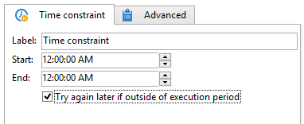

# Zeitliche Beschränkung{#time-constraint}

Mit der Aktivität **Zeitliche Beschränkung** können Sie die Ausführung einer Aufgabe verschieben oder abbrechen.

Geben Sie einen Titel für die Aktivität an und geben Sie den Zeitrahmen an, in dem die Workflow-Aufgabe ausgeführt werden darf. Der Workflow wird nur während dieses definierten Ausführungsfensters ausgeführt und außerhalb davon angehalten.

Wenn die Option **[!UICONTROL Später erneut versuchen, wenn außerhalb des]**) ausgewählt ist, können Sie die Aufgabe außerhalb des Ausführungszeitrahmens neu starten. Wenn Sie möchten, dass die Workflow-Aktion nach dem Aussetzen endgültig eingestellt wird, deaktivieren Sie diese Option.

