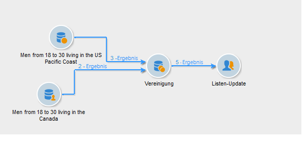

# Vereinigung{#union}

Über eine **[!UICONTROL Vereinigung]** lassen sich die Ergebnisse mehrerer eingehender Aktivitäten in einer einzigen Zielgruppe zusammenfassen. Die Zielgruppe wird aus allen eingehenden Ergebnissen erstellt, was bedeutet, dass alle vorgeschalteten Aktivitäten beendet sein müssen, bevor die Vereinigung ausgeführt werden kann.

>[!NOTE]
>
>Weitere Informationen zum Konfigurieren und Verwenden der Aktivität **[!UICONTROL Vereinigung]** finden Sie auf [dieser Seite](targeting-workflows.md#combining-several-targets--union-).

## Anwendungsbeispiel für eine Vereinigung {#union-example}

Im folgenden Beispiel sollen die Ergebnisse zweier Abfragen zusammengefasst werden, um eine Liste zu aktualisieren. Beide Abfragen betreffen Empfänger. Die Ergebnisse basieren also auf derselben Tabelle.

1. Schließen Sie unmittelbar an die zwei Abfragen eine **[!UICONTROL Vereinigung]** an, gefolgt von einem Listen-Update.
1. Benennen Sie die Aktivität.
1. Wählen Sie als Abstimmoption **[!UICONTROL Nur die Schlüssel]**, da im vorliegenden Beispiel die aus den Abfragen stammenden Populationen homogen sind.
1. Falls Sie in den Abfragen Zusatzdaten verwenden, können Sie sich dafür entscheiden, nur gemeinsame Daten beizubehalten.
1. Wenn Sie die Größe der endgültigen Population begrenzen möchten, aktivieren Sie die Option **[!UICONTROL Größe der erzeugten Population begrenzen]**.

   Geben Sie in diesem Fall die maximale Anzahl an Empfängern und die Abfrage an, deren Population Vorrang hat.

1. Bestätigen Sie die Aktivität **[!UICONTROL Vereinigung]** und konfigurieren Sie dann die Aktivität [Listen-Update](list-update.md).
1. Starten Sie dann den Workflow. Die Anzahl an in der Ergebnismenge enthaltenen Kontakten wird angezeigt und die in der Update-Aktivität angegebene Liste wird erstellt oder aktualisiert. Letztere enthält nun alle Empfänger aus den beiden Abfragen bzw. die im vorangehenden Schritt definierte Anzahl.

   

## Eingabeparameter {#input-parameters}

* tableName
* schema

Jedes eingehende Ereignis muss eine durch diese Parameter definierte Zielgruppe angeben.

## Ausgabeparameter {#output-parameters}

* tableName
* schema
* recCount

Anhand der drei Werte lässt sich die durch die Vereinigung ermittelte Zielgruppe identifizieren. **[!UICONTROL tableName]** ist der Name der Tabelle, welche die Kennungen der Zielgruppenempfänger enthält, **[!UICONTROL schema]** ist das Schema der Population, (i. d. R. nms:recipient) und **[!UICONTROL recCount]** ist die Anzahl an Elementen in der Tabelle.
