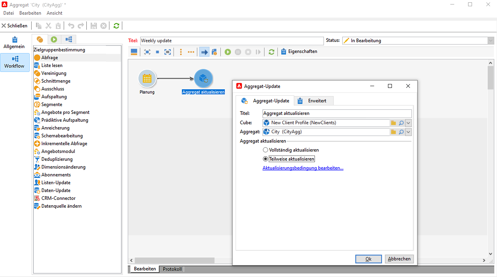
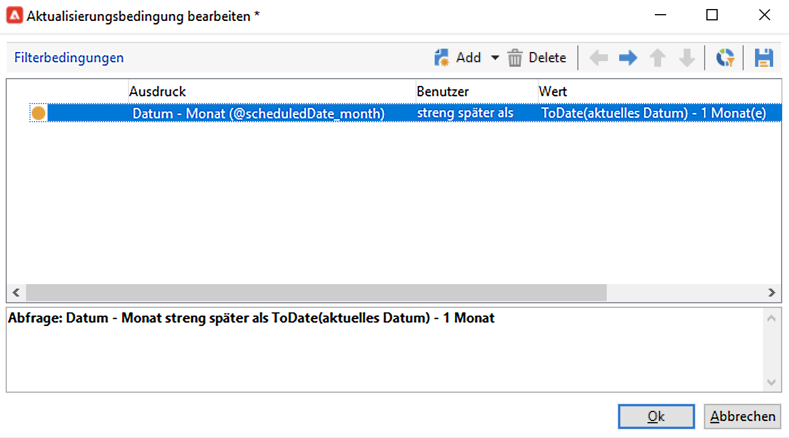

# Aggregat-Update{#update-aggregate}

Aggregate, definiert in [Cubes](../../v8/reporting/gs-cubes.md) zu Berichtszwecken mit einer bestimmten Aktivität aktualisiert werden. A **[!UICONTROL Workflow]** bei der Konfiguration des Aggregats verfügbar.

Erfahren Sie mehr über Cubes und Aggregate in [diesem Abschnitt](../../v8/reporting/customize-cubes.md#calculate-and-use-aggregates).

Um ein Aggregat zu aktualisieren, bearbeiten Sie die **[!UICONTROL Aggregat-Update]** und wählen Sie den zu aktualisierenden Cube und Aggregat aus.

Sie können eine **Vollständige Aktualisierung** oder **Teilweise aktualisiert**.

Standardmäßig wird bei jeder Berechnung eine vollständige Aktualisierung ausgeführt. Um eine teilweise Aktualisierung zu aktivieren, wählen Sie die Option aus und definieren Sie die Aktualisierungsbedingungen.

Es empfiehlt sich, eine **[!UICONTROL Planung]** -Aktivität, um die Aktualisierungshäufigkeit der Berechnungen festzulegen.
