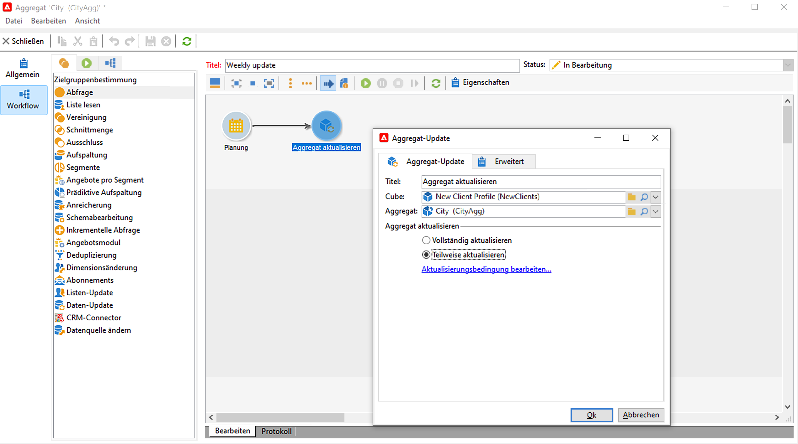
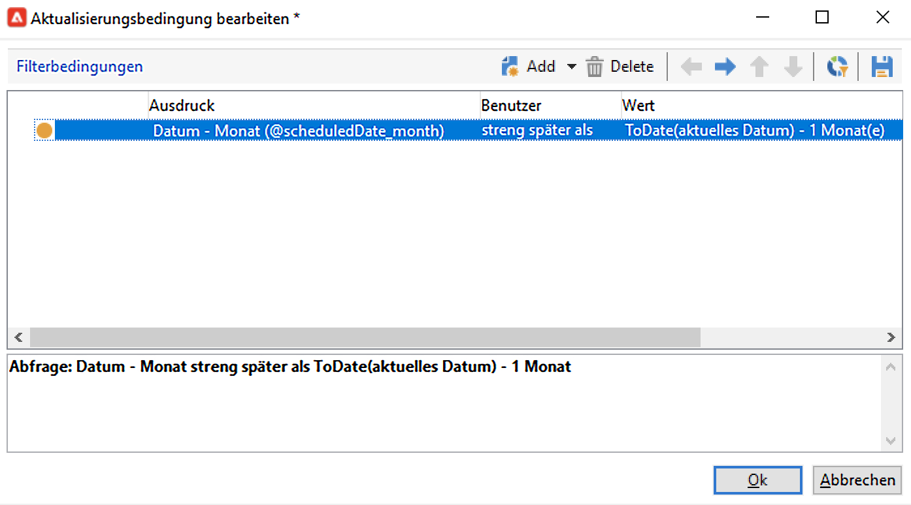

# Aggregat-Update{#update-aggregate}

Die in [Cubes](../../v8/reporting/gs-cubes.md) für Berichtszwecke definierten Aggregate können mit einer bestimmten Aktivität aktualisiert werden. Bei der Konfiguration des Aggregats ist ein **[!UICONTROL Workflow]** verfügbar.

Erfahren Sie mehr über Cubes und Aggregate in [diesem Abschnitt](../../v8/reporting/customize-cubes.md#calculate-and-use-aggregates).

Um ein Aggregat zu aktualisieren, bearbeiten Sie die Aktivität **[!UICONTROL Aggregat aktualisieren]** und wählen Sie den zu aktualisierenden Cube und das Aggregat aus.

Sie können eine **vollständige Aktualisierung** oder eine **partielle Aktualisierung** durchführen.

Standardmäßig wird bei jeder Berechnung eine vollständige Aktualisierung ausgeführt. Um eine partielle Aktualisierung zu aktivieren, wählen Sie die entsprechende Option aus und definieren Sie die Aktualisierungsbedingungen.

Es empfiehlt sich, eine **[!UICONTROL Planungsaktivität]** hinzuzufügen, um die Aktualisierungshäufigkeit der Berechnungen festzulegen.
