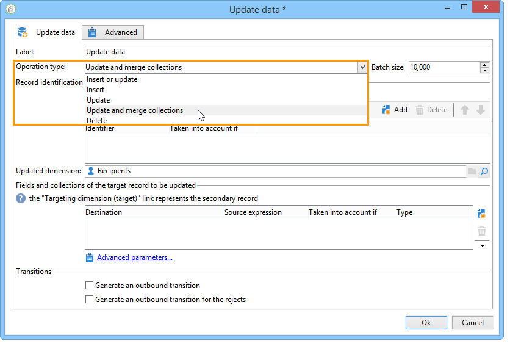

# Daten-Update{#update-data}

Die Aktivität **Daten-Update** ermöglicht eine gebündelte Aktualisierung von Datenbankfeldern.

## Aktionstyp {#operation-type}

Geben Sie im Feld **[!UICONTROL Aktionstyp]** an, auf welche Weise die Daten aktualisiert werden sollen:

* **[!UICONTROL Hinzufügen oder aktualisieren]**: fügt neue Daten zur Datenbank hinzu oder aktualisiert existierende Daten.
* **[!UICONTROL Hinzufügen]**: fügt nur neue Daten hinzu (existierende Daten werden nicht verändert).
* **[!UICONTROL Aktualisieren]**: aktualisiert existierende Daten (fügt keine neuen Datensätze hinzu).
* **[!UICONTROL Sammlung aktualisieren und fusionieren]**: Aktualisieren Sie Daten und wählen Sie einen primären Datensatz; verknüpfen Sie dann Elemente, die mit den Duplikaten in diesem primären Datensatz verknüpft sind. Anschließend können Duplikate gelöscht werden, ohne dass verwaiste angehängte Elemente erstellt werden.
* **[!UICONTROL Löschen]** - löscht in der Datenbank existierende Daten.

Im Feld **[!UICONTROL Aktualisierungsgröße]** wird bestimmt, wie viele Elemente der eingehenden Transition aktualisiert werden. Bei Angabe von 500 beispielsweise werden die 500 ersten Datensätze aktualisiert.

## Datensatz-Identifizierung {#record-identification}

Geben Sie an, auf welche Weise die Datensätze der Datenbank identifiziert werden können:

* Wählen Sie die Option **[!UICONTROL Über die Zielgruppendimension]**, wenn die eingehenden Daten einer existierenden Zielgruppendimension entsprechen und geben Sie diese im Feld **[!UICONTROL Aktualisierte Dimension]** an.

   Mithilfe der Lupe (**[!UICONTROL Verknüpftes Element öffnen]**) können die Felder der ausgewählten Dimension angezeigt werden.

* Wenn die eingehenden Daten keiner existierenden Zielgruppendimension entsprechen, können Sie entweder eine oder mehrere Relationen angeben, die die Identifizierung der Daten ermöglichen, oder Abstimmschlüssel verwenden.

## Auswahl der zu aktualisierenden Felder {#selecting-the-fields-to-be-updated}

Über die Schaltfläche **[!UICONTROL Felder gleichen Namens automatisch verknüpfen]** werden die zu aktualisierenden Felder automatisch von Adobe Campaign identifiziert.

Es besteht auch die Möglichkeit, die Zuordnung manuell vorzunehmen, indem Sie die zu aktualisierenden Felder über die Schaltfläche **[!UICONTROL Hinzufügen]** auswählen.

Wählen Sie alle zu aktualisierenden Felder aus und geben Sie bei Bedarf Bedingungen für die Aktualisierung an. Dies ist in der Spalte **[!UICONTROL Berücksichtigt wenn]** möglich. Die Bedingungen werden nacheinander, in Reihenfolge der Liste geprüft. Die Reihenfolge kann mithilfe der blauen Pfeile rechts der Tabelle angepasst werden.

Ein Zielfeld kann mehrmals verwendet werden.

Wenn Sie die Option **[!UICONTROL Hinzufügen oder aktualisieren]** gewählt haben, können Sie in der Spalte **[!UICONTROL Aktion]** für jedes Feld individuell entscheiden, welche der möglichen Aktionen ausgeführt werden soll.

Die Felder **[!UICONTROL modifiedDate]**, **[!UICONTROL modifiedBy]**, **[!UICONTROL createdDate]** und **[!UICONTROL createdBy]** werden im Zuge der Daten-Update-Aktivität automatisch aktualisiert, es sei denn, in der Tabelle der zu aktualisierenden Felder wird explizit etwas anderes konfiguriert.

Nur Datensätze, die mindestens eine Änderung aufweisen, werden aktualisiert. Alle anderen bleiben unverändert.

Über den Link **[!UICONTROL Erweiterte Parameter]** können weitere Optionen zur Aktualisierung und den Umgang mit Dubletten definiert werden:

* **[!UICONTROL Automatische Schlüsselverwaltung deaktivieren]**;
* **[!UICONTROL Audit deaktivieren]**;
* **[!UICONTROL Bei leerem Quellwert (NULL) den Zielwert löschen]** (standardmäßig aktiviert);
* **[!UICONTROL Alle Spalten mit übereinstimmenden Namen aktualisieren]**;
* Angabe von Bedingungen bezüglich der Quellelemente mithilfe eines Ausdrucks im Feld **[!UICONTROL Berücksichtigung]**;
* Angabe von Bedingungen zur Berücksichtigung von Dubletten mithilfe eines Ausdrucks. Wenn die Option **[!UICONTROL Den gleichen Zielkontakt betreffende Datensätze ignorieren]** aktiviert ist, wird nur der erste Datensatz der Ausdruckliste berücksichtigt.

**[!UICONTROL Ausgehende Transition erzeugen]**

Erzeugt eine ausgehende Transition im Anschluss an die Aktivität. Im Allgemeinen bildet die Daten-Update-Aktivität den Schlusspunkt eines Zielgruppen-Workflows. Aus diesem Grund, wird die ausgehende Transition nicht standardmäßig erzeugt.

**[!UICONTROL Ausgehende Transition für die Zurückweisungen erzeugen]**

Erzeugt eine ausgehende Transition, welche die Datensätze enthält, die im Zuge der Aktualisierung nicht korrekt verarbeitet werden konnten (z. B. Dubletten). Im Allgemeinen bildet die Daten-Update-Aktivität den Schlusspunkt eines Zielgruppen-Workflows. Aus diesem Grund, wird die ausgehende Transition nicht standardmäßig erzeugt.

## Aktualisierung und Fusion von Sammlungen {#updating-and-merging-collections}

Die Aktualisierung mit Fusion von Sammlungen ermöglicht die Aktualisierung von Daten eines Datensatzes mit Informationen, die aus einem oder mehreren sekundären Datensätzen stammen. Auf diese Weise werden die Datensätze zu einem einzigen verschmolzen. Hierbei sind eine Reihe von Regeln zu beachten.

>[!NOTE]
>
>Diese Option bietet auch die Möglichkeit, Referenzen zu sekundären Datensätzen in Workflow-Arbeitstabellen (targetWorkflow), Sendungen (targetDelivery) und Listen (targetList) zu verarbeiten. Wenn vorhanden, erscheinen diese Relationen in der Auswahlliste der Felder und Sammlungen.

1. Wählen Sie die Option **[!UICONTROL Sammlungen aktualisieren und fusionieren]**.

   

1. Geben Sie in Reihenfolge der Prioritäten die Relationen an, die die Identifizierung des Hauptdatensatzes ermöglichen. Je nach eingehender Transition können die möglichen Relationen variieren.

   

1. Geben Sie die in den Hauptdatensatz zu verschiebenden Sammlungen und die zu aktualisierenden Felder an.

   Definieren Sie die Regeln, die hierfür gelten sollen, sobald ein oder mehrere sekundäre Datensätze identifiziert wurden. Hierzu können Sie den Ausdruckseditor verwenden. Weiterführende Informationen dazu finden Sie hier:. Sie können beispielsweise angeben, dass bei Werten aus verschiedenen möglichen Datensätzen jeweils der zuletzt aktualisierte Wert beibehalten werden soll.

   Geben Sie die Bedingungen zur Berücksichtigung der Regel an.

   Geben Sie schließlich den Aktualisierungstyp an. Sie haben beispielsweise die Möglichkeit, die sekundären Datensätze nach der Datenaktualisierung zu löschen.

   Die Sammlungsfusion ermöglicht die Verschmelzung von heterogenen Daten wie z. B. bei der Liste der Abonnements eines Empfängers. Mithilfe der Regeln kann einer neuer, auf den sekundären Datensätzen beruhender Abonnementverlauf erstellt oder die Liste der Abonnements eines sekundären Datensatzes zum primären Datensatz verschoben werden.

1. Im **[!UICONTROL Dubletten]**-Tab der **[!UICONTROL Erweiterten Parameter]** besteht die Möglichkeit, die Reihenfolge anzugeben, in der die sekundären Datensätze verarbeitet werden sollen.

   

Die Daten der sekundären Datensätze werden dem Hauptdatensatz zugeordnet, wenn die definierten Regeln zutreffen. Je nach ausgewähltem Aktualisierungstyp werden die sekundären Datensätze nach der Fusion gegebenenfalls gelöscht.

## Anwendungsbeispiel: Daten-Update nach einer Anreicherung {#example--update-data-following-an-enrichment}

Ein Beispiel für ein Daten-Update nach einer Anreicherungsaktivität finden Sie im Anwendungsbeispiel zur Erstellung einer Zusammenfassungsliste in [Schritt 2: Schreiben der angereicherten Daten in die Tabelle &quot;Bestellungen&quot;](create-a-summary-list.md#step-2--writing-enriched-data-to-the--purchases--table).

## Eingabeparameter {#input-parameters}

* tableName
* schema

Jedes eingehende Ereignis muss eine durch diese Parameter definierte Zielgruppe angeben.
