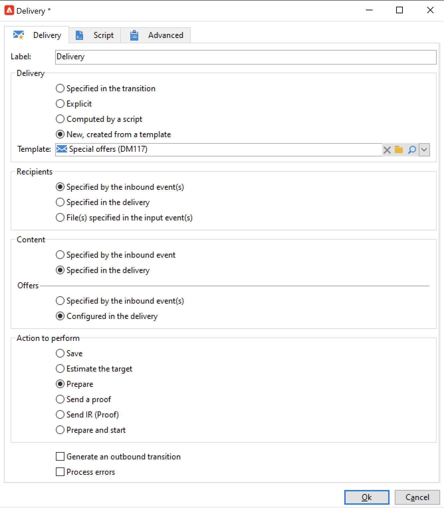

# Verwenden von Workflow-Daten{#how-to-use-workflow-data}

Sie können Workflow-Aktivitäten zur Durchführung unterschiedlicher Aufgaben verwenden. Im Folgenden finden Sie Beispiele zur Aktualisierung der Datenbank durch die Erstellung von Listen, die Verwaltung von Abonnements, den Versand von Nachrichten über einen Workflow oder die Anreicherung von Sendungen und ihren Audiences.

Mehrere Anwendungsfälle für Workflows finden Sie in [diesem Abschnitt](workflow-use-cases.md).

## Lebenszyklus der Arbeitsdaten {#data-life-cycle}

### Temporäre Arbeitstabelle für Workflows {#work-table}

In einem Workflow werden die von einer Aktivität zur anderen übertragenen Daten in temporären Arbeitstabellen gespeichert.

Die Daten können durch Rechtsklick auf die entsprechende Transition angezeigt und analysiert werden.


Wählen Sie im Kontextmenü die entsprechende Option aus:

* **[!UICONTROL Zielgruppe anzeigen…]**

   In diesem Menü werden die verfügbaren Daten der Zielpopulation angezeigt.

   

   Sie können auf die Struktur der Arbeitstabelle in der Registerkarte **[!UICONTROL Schema]** zugreifen.

   

   Weiterführende Informationen hierzu finden Sie in [diesem Abschnitt](monitor-workflow-execution.md#worktables-and-workflow-schema).

* **[!UICONTROL Zielgruppe analysieren…]**

   Diese Option bietet Zugriff auf den Assistenten zur beschreibenden Analyse, welcher die Erstellung von Statistiken und Berichten über die in der Transition übermittelten Daten ermöglicht.

   Mehr dazu finden Sie in der [Dokumentation zu Campaign Classic v7](https://experienceleague.adobe.com/docs/campaign-classic/using/reporting/analyzing-populations/about-descriptive-analysis.html?lang=de){target=&quot;_blank&quot;}.

Die Zielgruppendaten werden im Verlauf der Workflow-Ausführung bereinigt. Nur die letzte Arbeitstabelle bleibt zugänglich. Sie haben die Möglichkeit, den Workflow dahingehend zu konfigurieren, dass alle Arbeitstabellen beibehalten werden. Kreuzen Sie hierzu in den Workflow-Eigenschaften die Option **[!UICONTROL Zwischen zwei Ausführungen die ermittelte Population festhalten]** an.


>[!CAUTION]
>
>Diese Option darf **nie** in einem **Produktions**-Workflow aktiviert werden. Diese Option wird zur Analyse der Ergebnisse verwendet und ist nur für Testzwecke konzipiert. Sie darf daher nur in Entwicklungs- oder Staging-Umgebungen verwendet werden.


### Verwenden der Zieldaten {#target-data}

Die in der temporären Arbeitstabelle des Workflows gespeicherten Daten stehen für Personalisierungsaufgaben zur Verfügung. Daten können in Personalisierungsfeldern verwendet werden.

Auf diese Weise können Sie beispielsweise Daten verwenden, die über eine Liste in einem Versand erfasst wurden. Verwenden Sie dazu die folgende Syntax:

```
%= targetData.FIELD %
```

Personalisierungselemente vom Typ **[!UICONTROL Erweiterung des Zieldatensatzes]** (targetData) stehen in Zielgruppen-Workflows nicht zur Verfügung. Dies bedeutet, dass die Versandzielgruppe im Workflow bestimmt und in der eingehenden  Transition des Versands spezifiziert werden muss.

Im folgenden Beispiel sollen Kundeninformationen in einer Liste gesammelt und dann in einer personalisierten E-Mail verwendet werden. Gehen Sie wie folgt vor:

1. Erstellen Sie einen Workflow, um die Informationen zu sammeln, sie mit der Datenbank abzustimmen und den Versand zu starten.

   

1. Im vorliegenden Beispiel enthält die Datei folgende Informationen:

   ```
   Music,First name,Last name,Account,CD/DVD,Card
   Pop,David,BLAIR,4323,CD,0
   Rock,Daniel,ARCARI,3222,DVD,1
   Disco,Uma,ALTON,0488,DVD,0
   Jazz,Paul,BOLES,6475,CD,1
   Jazz,David,BOUKHARI,0841,DVD,1
   [...]
   ```

   Um die Datei zu laden, konfigurieren Sie die Aktivität **[!UICONTROL Laden (Datei)]** wie folgt:

   

1. Konfigurieren Sie nun eine Aktivität vom Typ **[!UICONTROL Anreicherung]**, um die geladenen Daten mit denen, die sich schon in der Adobe Campaign-Datenbank befinden, abzustimmen. Hier dient die Kundennummer als Abstimmschlüssel:

   

1. Konfigurieren Sie dann die **[!UICONTROL Versandaktivität]**. Sie wird basierend auf einer Vorlage erstellt und die Empfänger werden durch die eingehende Transition bestimmt.

   

   >[!CAUTION]
   >
   >Nur die von der Transition übermittelten Daten können für die Versandpersonalisierung verwendet werden. Personalisierungsfelder vom Typ **targetData** stehen nur für die in die **[!UICONTROL Versandaktivität]** eingehende Population zur Verfügung.

1. Verwenden Sie in der Versandvorlage die im Workflow gesammelten Daten.

   Fügen Sie hierfür Personalisierungsfelder vom Typ **[!UICONTROL Erweiterung des Zieldatensatzes]** ein.

   

   Im vorliegenden Beispiel wird der bevorzugte Musikstil des Kunden und der bevorzugte Datenträger (CD oder DVD) - gemäß den Informationen der geladenen Datei - eingefügt.

   Des Weiteren enthält der Versand ein Angebot für Kunden mit Kundenkarte, d. h. für Kunden, bei denen der Wert &#39;Kundenkarte&#39; gleich 1 ist.

   

   Daten vom Typ **[!UICONTROL Erweiterung des Zieldatensatzes]** (targetData) werden wie andere Personalisierungsfelder auch in Sendungen eingefügt. D. h. sie können u. a. in Nachrichtenbetreffs, Linktiteln oder Links selbst verwendet werden.


## Aktualisieren der Datenbank {#update-the-database}

Alle in Workflows erfassten Daten können zur Aktualisierung der Datenbank oder in Sendungen verwendet werden, um beispielsweise die Möglichkeiten der Inhaltspersonalisierung zu ergänzen (Einfügung der Anzahl von Versicherungspolicen, des durchschnittlichen Warenkorbs im vergangenen Jahr etc.) oder die Zielgruppenbestimmung zu verfeinern (eine Nachricht an die Mitversicherten adressieren, die 1.000 besten Kunden ansprechen etc.). Diese Daten können auch exportiert oder in einer Liste archiviert werden.

### Aktualisieren von Listen  {#list-updates}

Zur Aktualisierung der Adobe-Campaign-Datenbank und von Listen stehen zwei dedizierte Aktivitäten zur Verfügung:

* Über die Aktivität **[!UICONTROL Listen-Update]** können Arbeitstabellen in einer Datenliste gespeichert werden.

   Hierbei kann eine existierende Liste verwendet oder eine neue erstellt werden. In diesem Fall werden ihr Name und gegebenenfalls ihr Speicherverzeichnis berechnet.

   

   Siehe [Listen-Update](list-update.md).

* Die **[!UICONTROL Daten-Update]**-Aktivität ermöglicht eine gebündelte Aktualisierung von Datenbankfeldern.

   Weitere Informationen hierzu finden Sie im Abschnitt [Daten-Update](update-data.md).

### Verwalten von Abonnements {#subscription-management}

Die An- und Abmeldung von Empfängern für einen Informationsdienst im Rahmen eines Workflows wird im Abschnitt [Abonnements](subscription-services.md) beschrieben.
