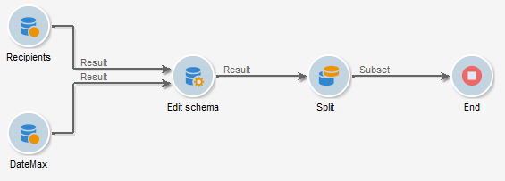
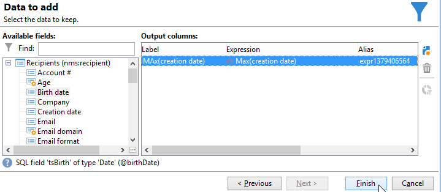
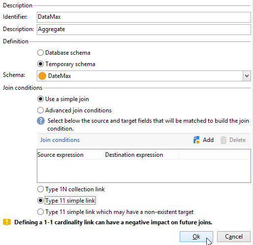
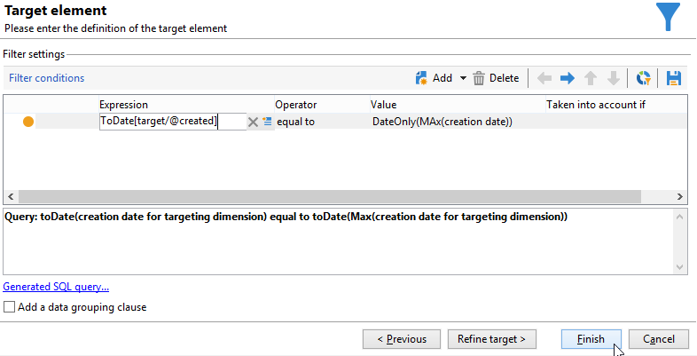

# Verwenden von Aggregaten{#using-aggregates}

Ziel des folgenden Anwendungsbeispiels ist es, die zuletzt zur Datenbank hinzugefügten Empfänger zu identifizieren.

Mithilfe des folgenden Prozesses wird das Erstellungsdatum der Empfänger in der Datenbank mit dem letzten bekannten Datum verglichen, an dem ein Empfänger mithilfe eines Aggregats erstellt wurde. Alle am selben Tag erstellten Empfänger werden ebenfalls ausgewählt.

Die Konfiguration eines Empfängerfilters vom Typ **Erstellungsdatum = max (Erstellungsdatum)** ist mithilfe des folgenden Workflows möglich:

1. Abrufen von Datenbankempfängern mithilfe einer einfachen Abfrage. Weitere Informationen zu diesem Schritt finden Sie unter [Abfragen erstellen](query.md#creating-a-query).
1. Berechnung des letzten bekannten Empfängererstellungs-Datums mit der Aggregatfunktion **max (Erstellungsdatum)**.
1. Zuordnung der Empfänger zum Ergebnis des Aggregats im selben Schema.
1. Filterung der Empfänger mithilfe des Aggregats im bearbeiteten Schema.

## &#x200B;1. Schritt: Berechnung des Aggregats {#step-1--calculating-the-aggregate-result}

1. Erstellen Sie eine Abfrage. Hier besteht das Ziel darin, das letzte bekannte Erstellungsdatum aus allen Empfängern in der Datenbank zu berechnen. Die Abfrage enthält daher keinen Filter.
1. Klicken Sie auf den Link **[!UICONTROL Daten hinzufügen...]**.
1. Wählen Sie in den aufeinanderfolgenden Fenstern die Optionen **[!UICONTROL Daten in Relation mit der Filterdimension]** und **[!UICONTROL Daten der Filterdimension]**.
1. Definieren Sie im Fenster **[!UICONTROL Hinzuzufügende Daten]** eine neue Spalte zur Berechnung des maximalen Werts im Feld **Erstellungsdatum** der Empfängertabelle. Verwenden Sie hierzu den Ausdruckseditor oder geben Sie direkt **max(@created)** in der **[!UICONTROL Ausdruck]**-Spalte ein. Klicken Sie dann auf **[!UICONTROL Beenden]**.

   

1. Klicken Sie **[!UICONTROL Zusätzliche Daten bearbeiten]** und dann **[!UICONTROL Erweiterte Parameter…]**. Aktivieren Sie **[!UICONTROL Option „Automatisches Hinzufügen der Primärschlüssel der Zielgruppendimension deaktivieren]**.

   Diese Option stellt sicher, dass nicht alle Empfänger angezeigt werden und dass explizit hinzugefügte Daten nicht beibehalten werden. In diesem Fall bezieht er sich auf das letzte Datum, an dem ein Empfänger erstellt wurde.

   Lassen Sie die Option **[!UICONTROL Duplikate löschen (DISTINCT)]** angekreuzt.

## &#x200B;2. Schritt: Verknüpfung von Empfängern und Aggregat {#step-2--linking-the-recipients-and-the-aggregation-function-result}

Verwenden Sie die Schema-Bearbeitung, um die auf Empfänger bezogene Abfrage mit der zur Berechnung eines Aggregats dienenden Abfrage zu verknüpfen.

1. Wählen Sie als Hauptmenge die Abfrage bezüglich der Empfänger aus.
1. Fügen Sie im **[!UICONTROL Relationen]**-Tab eine neue Relation hinzu und konfigurieren Sie sie wie folgt:

   * Wählen Sie das temporäre Schema für das Aggregat aus. Die Daten für dieses Schema werden den Mitgliedern der Hauptmenge hinzugefügt.
   * Aktivieren Sie die Option **[!UICONTROL Einfachen Join verwenden]**, um das Ergebnis des Aggregats zu jedem Empfänger der Hauptmenge zuzuordnen.
   * Geben Sie schließlich an, dass es sich bei der Relation um eine **[!UICONTROL 1:1-Relation]** handelt.

   

Auf diese Weise wird das Ergebnis des Aggregats mit jedem einzelnen der Empfänger verknüpft.

## &#x200B;3. Schritt: Filterung der Empfänger mithilfe des Aggregats {#step-3--filtering-recipients-using-the-aggregate-}

Sobald die Relation hergestellt wurde, bilden das Aggregatergebnis und die Empfänger einen Teil desselben temporären Schemas. Es ist daher möglich, einen Filter für das Schema zu erstellen, um das Erstellungsdatum der Empfänger und das letzte bekannte Erstellungsdatum, dargestellt durch die Aggregationsfunktion, zu vergleichen. Dieser Filter wird mithilfe einer Aufspaltungsaktivität ausgeführt.

1. Wählen Sie im **[!UICONTROL Allgemein]**-Tab **Empfänger** als Zielgruppendimension und **Schema-Bearbeitung** als Filterdimension aus (um das Schema der eingehenden Transition zu filtern).
1. Gehen Sie in den **[!UICONTROL Teilmengen]**-Tab, kreuzen Sie die Option **[!UICONTROL Filterbedingung für die Eingangspopulation hinzufügen]** an und klicken Sie auf **[!UICONTROL Bearbeiten...]**.
1. Setzen Sie im Ausdruckseditor das Erstellungsdatum der Empfänger mit dem vom Aggregat berechneten Datum gleich.

   Die Datumsfelder in der Datenbank werden im Allgemeinen in der Millisekunde gespeichert. Sie müssen diese daher für den gesamten Tag verlängern, um zu vermeiden, dass nur die Empfänger abgerufen werden, die in derselben Millisekunde erstellt wurden.

   Im Ausdruckseditor steht hierzu die Funktion **ToDate** zur Verfügung, die Datumsangaben mit Uhrzeit in einfache Daten konvertiert.

   Folgende Ausdrücke sind also für die Bedingung erforderlich:

   * **[!UICONTROL Ausdruck]**: `toDate([target/@created])`.
   * **[!UICONTROL Wert`toDate([datemax/expr####])`]**, wobei expr#### dem in der Aggregatabfrage definierten Aggregat entspricht.

   

Das Ergebnis der Aufspaltung entspricht somit den am selben Tag wie die letzte bekannte Erstellung erstellten Empfängern.

Sie haben die Möglichkeit, im Anschluss weitere Aktivitäten wie beispielsweise ein Listen-Update oder einen Versand im Workflow-Diagramm zu platzieren.
