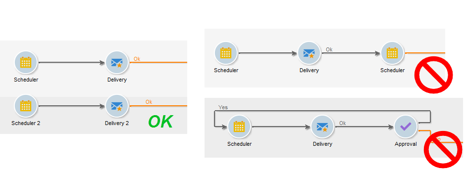

# Best Practices bei Workflows{#workflow-best-practices}

Im Folgenden finden Sie allgemeine Richtlinien zur Optimierung der Workflow-Performance von Campaign, zur Verbesserung Ihres Workflow-Designs und zur Auswahl der richtigen Einstellungen.

## Workflow-Ordner {#workflow-folders}

Adobe empfiehlt, Ihre Workflows in einem eigenen Ordner zu erstellen.

Wenn der Workflow die gesamte Plattform betrifft, (z. B. Bereinigungsprozesse), könnte es sinnvoll sein, einen Unterordner zum nativen Ordner **[!UICONTROL Technische Workflows]** hinzuzufügen.

## Workflow-Name {#workflow-naming}

Um die Suche und Fehlerbehebung zu vereinfachen, empfiehlt Adobe, Ihre Workflows mit eigenen Namen und Titeln zu versehen: Erläutern Sie im Beschreibungsfeld des Workflows kurz den jeweiligen Prozess, damit dessen Zweck für den Benutzer leicht ersichtlich ist.

Wenn der Workflow Teil eines mehrere Workflows umfassenden Prozesses ist, können Sie jeden Workflow durch die Angabe eines Titels exakt benennen. Zahlen sind beispielsweise eine gute Möglichkeit, Workflows zu ordnen.

Beispiel:

* 001 – Importieren – Empfänger importieren
* 002 – Importieren – Verkäufe importieren
* 003 – Importieren – Verkaufsdetails importieren
* 010 – Exportieren – Versandlogs exportieren
* 011 – Exportieren – Trackinglogs exportieren

## Workflow-Prioritätsstufe {#workflow-severity}

Sie können die Prioritätsstufe eines Workflows im Tab **[!UICONTROL Ausführung]** der Workflow-Eigenschaften konfigurieren:

* Normal
* Produktion
* Kritisch

Durch Angabe dieser Informationen bei der Erstellung eines Workflows ist die Prioritätsstufe des konfigurierten Prozesses besser ersichtlich.

Diese Option beeinflusst nur Kampagnen-Workflows.

Kampagnen-Workflows (Workflows, die als Teil einer Kampagne erstellt werden) mit höherer Prioritätsstufe werden vorgezogen, wenn die Kampagne mehrere Prozesse enthält, die gleichzeitig ausgeführt werden müssen. Standardmäßig können entsprechend der Option NmsOperation_LimitConcurrency maximal zehn Prozesse einer Kampagnen gleichzeitig ausgeführt werden. Wenn eine Kampagne beispielsweise aus 25 Workflows besteht, werden Workflows mit einer höheren Prioritätsstufe in der ersten Gruppe von zehn Prozessen ausgeführt.

## Überwachen von Workflows {#workflow-monitoring}

Alle Ihre terminierten in Produktionsumgebungen ausgeführten Workflows sollten überwacht werden, damit Sie bei Auftreten eines Fehlers benachrichtigt werden.

Wählen Sie dazu in den Workflow-Eigenschaften eine Gruppe von Verantwortlichen. Dies können entweder die standardmäßigen **[!UICONTROL Workflow-Verantwortlichen]** oder eine benutzerdefinierte Gruppe sein. Achten Sie darauf, dass zumindest ein Benutzer der Gruppe eine eingerichtete E-Mail-Adresse besitzt.

Bestimmen Sie zu Beginn der Workflow-Erstellung Workflow-Verantwortliche. Diese werden bei Fehlern per E-Mail informiert. Weitere Informationen hierzu finden Sie unter [Fehler beheben](monitor-workflow-execution.md#managing-errors).

Überprüfen Sie regelmäßig den Tab **[!UICONTROL Monitoring]**, um den Gesamtstatus der aktiven Workflows anzuzeigen. Weitere Informationen hierzu finden Sie unter [Instanz-Monitoring](monitor-workflow-execution.md#instance-supervision).

Mit der Workflow-Heatmap können Adobe Campaign-Plattformadministratoren die Auslastung der Instanz überwachen und Workflows entsprechend planen. Weitere Informationen hierzu finden Sie unter [Workflow-Überwachung](heatmap.md).

## Aktivitäten {#using-activities}

>[!CAUTION]
>
>Sie können Aktivitäten innerhalb eines Workflows kopieren und einfügen. Wir raten jedoch davon ab, Aktivitäten über verschiedene Workflows hinweg zu kopieren und einzufügen. Einige Einstellungen, die Aktivitäten wie Sendungen und Planung betreffen, können zu Konflikten und Fehlern beim Ausführen des Ziel-Workflows führen. Stattdessen empfehlen wir, Workflows zu **duplizieren**. Weitere Informationen finden Sie unter [Workflows duplizieren ](build-a-workflow.md#duplicate-workflows).

### Name der Aktivität {#name-of-the-activity}

Bei der Entwicklung Ihres Workflows erhalten alle Aktivitäten sowie alle Adobe Campaign-Objekte einen Namen. Diese Namen werden zwar vom Tool erstellt, wir empfehlen jedoch, sie bei der Konfiguration zu ändern. Geschieht dies erst zu einem späteren Zeitpunkt, besteht die Gefahr, dass der Workflow durch Aktivitäten mit Namen einer anderen früheren Aktivität unterbrochen wird. Deshalb wäre eine nachträgliche Aktualisierung der Namen eine schwierige Aufgabe.

Den Aktivitätsnamen finden Sie in der **[!UICONTROL Erweitert]** Tabulator. Lasst sie nicht beim Namen **[!UICONTROL Abfrage]**, **[!UICONTROL query1]**, **[!UICONTROL query11]**, aber geben Sie ihnen explizite Namen wie **[!UICONTROL querySubscribedRecipients]**. Dieser Name wird im Protokoll und ggf. in den SQL-Protokollen angezeigt. Dies hilft beim Debugging des Workflows bei der Konfiguration.

### Erste und letzte Aktivitäten {#first-and-last-activities}

* Starten Sie Ihren Workflow immer mit einem **[!UICONTROL Starten]** Aktivität oder eine **[!UICONTROL Scheduler]** Aktivität. Bei Bedarf können Sie auch eine **[!UICONTROL Externes Signal]** Aktivität.
* Pro Workflow-Verzweigung darf nur eine einzige **** Planung verwendet werden. Wenn dieselbe Verzweigung eines Workflows mehrere Planungen enthält, die miteinander verknüpft sind, steigt die Anzahl der auszuführenden Aufgaben exponentiell an, wodurch die Datenbank überlastet würde. Diese Regel gilt auch für alle Aktivitäten mit einem Tab **[!UICONTROL Planung &amp; Verlauf]**. Weitere Informationen zur [Planung](scheduler.md).

  

* Verwenden Sie in allen Workflows jeweils **[!UICONTROL Ende]**-Aktivitäten. Auf diese Weise wird temporärer Speicherplatz freigesetzt, der für Berechnungen in Workflows reserviert ist. Weitere Informationen finden Sie unter [Start und Ende](start-and-end.md).

### JavaScript innerhalb einer Aktivität {#javascript-within-an-activity}

Bei der Initialisierung einer Workflow-Aktivität empfiehlt es sich, JavaScript hinzuzufügen. Dies kann in der Datei einer Aktivität erfolgen. **[!UICONTROL Erweitert]** Registerkarte der Aktivität.

Um den Workflow leichter erkennbar zu machen, empfehlen wir, am Anfang und Ende des Titels der Aktivität doppelte Bindestriche zu setzen, z. B.: -- Mein Titel --.

### Signal {#signal}

Meistens weiß man nicht, woher das Signal kommt. Um dieses Problem zu vermeiden, verwenden Sie die **[!UICONTROL Kommentar]** Feld innerhalb der **[!UICONTROL Erweitert]** Registerkarte der Signalaktivität, um den erwarteten Ursprung eines Signals für diese Aktivität zu dokumentieren.

## Workflow-Aktualisierungen {#workflow-update}

Ein Produktions-Workflow sollte nicht direkt aktualisiert werden. Prozesse sollten zuerst in einer Entwicklungsumgebung getestet werden, außer der Prozess besteht aus einer Kampagne mit Vorlagen-Workflows. Nach der Validierung kann der Workflow für die Produktion bereitgestellt werden.

Führen Sie alle Tests in Entwicklungs- oder Staging-Umgebungen, nicht in Produktionsumgebungen durch. die Performance kann in einem solchen Fall nicht gewährleistet werden.

Während Workflows in einem Archivordner auf Entwicklungs- oder Testplattformen aufbewahrt werden können, sollte die Produktionsumgebung möglichst sauber gehalten werden. Entfernen Sie deshalb alte, inaktive Workflows aus der Produktionsumgebung.

## Ausführung und Performance {#execution-and-performance}

### Logs {#logs}

Die JavaScript-Methode **[!UICONTROL logInfo()]** ist eine Lösung zum Debuggen eines Workflows. Sie muss jedoch mit Bedacht verwendet werden, insbesondere für häufig ausgeführte Aktivitäten, denn sie kann die Protokolle überlasten und die Größe der Protokolltabelle erheblich erhöhen.

### Beibehaltung der Zwischenpopulationen

Die Option **Zwischen zwei Ausführungen die ermittelte Population festhalten** speichert temporäre Tabellen zwischen zwei Ausführungen eines Workflows.

Diese Option ist auf der Registerkarte **[!UICONTROL Allgemein]** der Workflow-Eigenschaften verfügbar und kann für Entwicklungs- und Testzwecke verwendet werden, um Daten zu überwachen und Ergebnisse zu überprüfen. Sie können diese Option in Entwicklungsumgebungen verwenden, sollten sie aber nie in Produktionsumgebungen verwenden. Die Beibehaltung temporärer Tabellen könnte dazu führen, dass die Größe der Datenbank erheblich zunimmt und letztendlich die Größenbeschränkung erreicht wird. Außerdem wird dadurch das Backup verlangsamt.

Nur die Arbeitstabellen der letzten Ausführung des Workflows werden beibehalten. Arbeitstabellen früherer Ausführungen werden vom Bereinigt **[!UICONTROL Bereinigung]** -Workflow, der täglich ausgeführt wird.

>[!CAUTION]
>
>Diese Option darf **nie** in einem **Produktions**-Workflow aktiviert werden. Diese Option wird zur Analyse der Ergebnisse verwendet und ist nur für Testzwecke konzipiert. Sie darf daher nur in Entwicklungs- oder Staging-Umgebungen verwendet werden.

### Protokollieren von SQL-Abfragen

Die Option **SQL-Abfragen im Protokoll speichern** ist auf der Registerkarte **[!UICONTROL Ausführung]** der Workflow-Eigenschaften verfügbar. Diese Option protokolliert alle SQL-Abfragen aus den verschiedenen Aktivitäten und zeigt an, was von der Plattform tatsächlich ausgeführt wird. Diese Option sollte jedoch nur **vorübergehend** während der Entwicklung verwendet und **nicht in der Produktion aktiviert werden**.

Es empfiehlt sich, die Protokolle zu entfernen, wenn sie nicht mehr benötigt werden. Workflow-Verläufe werden nicht automatisch bereinigt: Alle Nachrichten werden standardmäßig beibehalten. Der Verlauf kann über die **[!UICONTROL Datei > Aktionen]** oder durch Klicken auf die Schaltfläche Aktionen in der Symbolleiste oberhalb der Liste. Wählen Sie Bereinigungsverlauf aus.
Informationen zum Bereinigen der Logs finden Sie in dieser [Dokumentation](start-a-workflow.md).

### Workflow-Planung {#workflow-planning}

Die folgenden Best Practices sollten zusätzlich bei der Planung der Ausführung von Workflows angewendet werden, um Probleme zu vermeiden:

* Achten Sie auf ein über den Tag verteiltes stabiles Aktivitätsniveau und vermeiden Sie Spitzen, um zu verhindern, dass die Instanz überlastet wird. Verteilen Sie dazu die Startzeiten des Workflows gleichmäßig über den Tag.
* Planen Sie das Laden der Daten für die Nacht, um Ressourcenkonflikte zu reduzieren.
* Lange Workflows können sich auf die Server- und Datenbankressourcen auswirken. Teilen Sie die längsten Workflows auf, um die Bearbeitungszeit zu verkürzen.
* Um die Gesamtlaufzeit zu verkürzen, ersetzen Sie zeitaufwändige Aktivitäten durch einfachere und schnellere Aktivitäten.
* Vermeiden Sie die gleichzeitige Ausführung von mehr als 20 Workflows. Wenn zu viele Workflows gleichzeitig ausgeführt werden, kann Ihre Plattform durch Überlastung instabil werden.

### In der Engine ausführen {#execute-in-the-engine-option}

Vermeiden Sie in einer Produktionsumgebung die Ausführung von Workflows in der Engine. Wenn die Option **[!UICONTROL In der Engine ausführen]** in den **[!UICONTROL Workflow-Eigenschaften]** aktiviert ist, hat dieser Workflow Priorität und alle anderen Workflows werden von der Workflow-Engine angehalten, bis dieser beendet ist.

