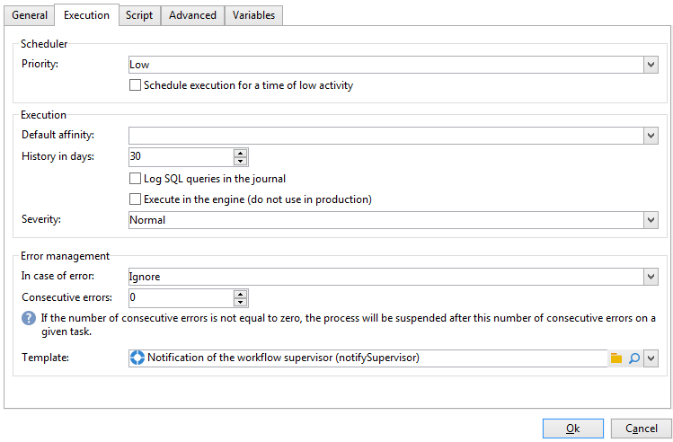

# Workflow-Eigenschaften{#workflow-properties}

## Ausführungs-Tab {#execution-tab}

Der Tab **[!UICONTROL Ausführung]** im Fenster der Workflow-**[!UICONTROL Eigenschaften]** enthält drei Bereiche:

### Planung {#scheduler}

Dieser Bereich wird nur in Kampagnen-Workflows angezeigt.

* **[!UICONTROL Versandpriorität]**

   Die Workflow-Engine verarbeitet anstehende Workflows gemäß der in diesem Feld angegebenen Priorität. So werden beispielsweise alle Workflows mit **[!UICONTROL mittlerer Priorität]** vor den Workflows mit **[!UICONTROL niedriger Priorität]** ausgeführt.

* **[!UICONTROL Ausführung auf einen Zeitpunkt mit geringer Auslastung verschieben]**

   Bei Aktivierung dieser Option wird der Workflow zu einem Zeitpunkt mit geringerer Auslastung gestartet. Gewisse Workflows können sich als sehr ressourcenintensiv für die Datenbank-Engine erweisen. Es kann daher interessant sein, weniger dringende Workflows beispielsweise nachts auszuführen. Die Zeiten mit geringer Auslastung werden im technischen Workflow **[!UICONTROL Kampagnenvorgänge]** bestimmt.

### Ausführung {#execution}

* **[!UICONTROL Standard-Affinität]**

   Verwenden Sie dieses Feld, wenn Ihre Installation mehrere Workflow-Server aufweist, um festzulegen, auf welchem Server der Workflow laufen soll. Sollte der in diesem Feld angegebene Wert auf keinem Server existieren, bleibt der Workflow im Stand-by.

   Siehe hier:

* **[!UICONTROL Verlaufsumfang (Tage)]**

   In den Arbeitstabellen der Datenbank werden der Ausführungsverlauf von Aufgaben und Ereignissen sowie das Protokoll gespeichert. Geben Sie hier an, wie lange der Verlauf für diesen Workflow beibehalten werden soll. Die in der Datenbank enthaltenen Bereinigungsprozesse löschen jeden Tag die obsoleten Verläufe. Bei Angabe von Null wird der Verlauf nie gelöscht.

* **[!UICONTROL SQL-Abfragen im Protokoll speichern]**

   Diese Funktion richtet sich an erfahrene Benutzer. Sie betrifft Workflows mit Zielgruppenbestimmungs-Aktivitäten (Abfrage, Vereinigung, Schnittmenge usw.). Wenn diese Option aktiviert wurde, werden die bei Ausführung des Workflows an die Datenbank gesendeten SQL-Abfragen in Adobe Campaign gespeichert. Auf diese Weise haben Sie die Möglichkeit, die Abfragen zu analysieren und eventuelle Probleme zu erkennen.

   Die Abfragen werden in diesem Fall im Tab **[!UICONTROL SQL-Logs]** angezeigt, der dem Workflow (außer bei Kampagnen-Workflows) und dem Fenster der Workflow-**[!UICONTROL Eigenschaften]** hinzugefügt wird. Die SQL-Abfragen werden darüber hinaus im **[!UICONTROL Verfolgung]**-Tab angezeigt.

   

* **[!UICONTROL In der Engine ausführen]**

   Diese Option darf nur zur Problembehebung verwendet werden und nie im Produktionsalltag. Bei Aktivierung der Option wird der Workflow prioritär. Alle anderen Workflows werden bis zu seinem Abschluss von der Workflow-Engine angehalten.

### Umgang mit Fehlern       {#error-management}

* **[!UICONTROL Fehlerbehebung]**

   In diesem Feld können Sie angeben, welche Aktion ausgeführt werden soll, wenn eine Workflow-Aufgabe einen Fehler ausgibt. Zwei Optionen stehen zur Verfügung:

   * **[!UICONTROL Prozess aussetzen]** - der Workflow wird automatisch ausgesetzt. Der Workflow-Status wechselt zu **[!UICONTROL Fehlgeschlagen]**. Nach Behebung des Problems können Sie den Workflow **[!UICONTROL Starten]** oder **[!UICONTROL Neu starten]**.
   * **[!UICONTROL Ignorieren]** - die den Fehler verursachende Aufgabe wechselt in den Status **[!UICONTROL Fehlgeschlagen]**, der Workflow behält jedoch den Status **[!UICONTROL Gestartet]**. Diese Konfiguration empfiehlt sich bei wiederkehrenden Aufgaben. Wenn der Workflow-Zweig eine Planungsaktivität enthält, löst diese automatisch zum nächsten geplanten Zeitpunkt die nächste Ausführung aus.

* **[!UICONTROL Folgefehler]**

   Dieses Feld erscheint, wenn im Feld **[!UICONTROL Bei Fehler]** die Option **[!UICONTROL Ignorieren]** ausgewählt wurde. Geben Sie die Anzahl an Fehlern an, die ignoriert werden soll, bevor der Prozess ausgesetzt wird. Bei Erreichen der angegebenen Fehleranzahl wechselt der Workflow in den Status **[!UICONTROL Fehlgeschlagen]**. Bei Angabe von Null wird der Workflow nie aufgrund von Fehlern unterbrochen.

* **[!UICONTROL Template]**

   Geben Sie in diesem Feld die Vorlage für die Benachrichtigung an, die die Workflow-Supervisoren erhalten, wenn ein Workflow den Status **[!UICONTROL Fehlgeschlagen]** annimmt.

   Die betroffenen Benutzer werden per E-Mail benachrichtigt, sofern in ihrem Profil eine E-Mail-Adresse angegeben wurde. Die verantwortlichen Supervisoren werden im Feld **[!UICONTROL Supervisor(en)]** im **[!UICONTROL Allgemein]**-Tab der Workflow-Eigenschaften ausgewählt.

   

   Die Standardvorlage **[!UICONTROL Benachrichtigung des Workflow-Verantwortlichen]** enthält einen Link, die den Webzugriff auf die Adobe-Campaign-Konsole ermöglicht. Auf diese Weise kann der Supervisor nach Anmeldung in den fehlgeschlagenen Workflow eingreifen.

   Sie haben die Möglichkeit, im Knoten **[!UICONTROL Administration > Kampagnen > Vorlagen technischer Sendungen]** eine eigene Vorlage zu erstellen.
