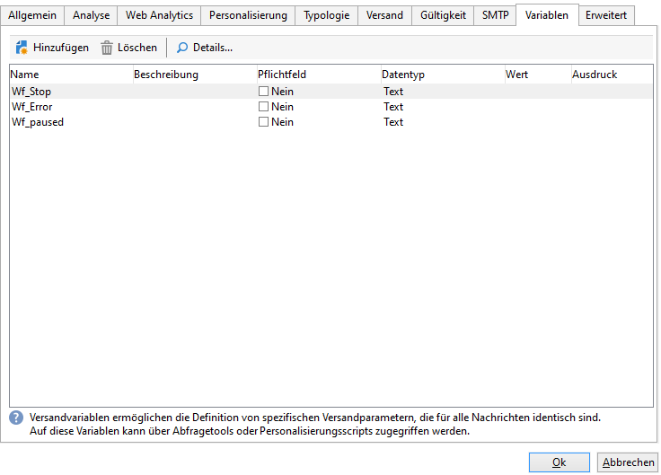

# Anwendungsfall: Überwachen Ihrer Workflows{#supervising-workflows}

Dieses Anwendungsbeispiel zeigt die Erstellung eines Workflows zur Überwachung einer Reihe von Workflows. Abgefragt werden Workflows mit den Status &quot;ausgesetzt&quot;, &quot;angehalten&quot; und &quot;fehlgeschlagen&quot;.

Sie ermöglicht Ihnen Folgendes:

* Die Erstellung eines Workflows zur Überwachung einer Reihe von geschäftsrelevanten Workflows.
* Den Versand einer Benachrichtigung an einen Supervisor mithilfe einer Versandaktivität.

Um den Status einer Reihe von Workflows zu überwachen, sind folgende Schritte erforderlich:

1. Erstellung des Monitoring-Workflows,
1. Erstellung des JavaScripts zur Abfrage der Workflows mit den Status fehlgeschlagen, ausgesetzt oder angehalten.
1. Erstellung der **[!UICONTROL Test]**-Aktivität.
1. Erstellung der Versandvorlage.

>[!NOTE]
>
>Zusätzlich zum Workflow können Sie mit der **Campaign Workflow-Heatmap** die aktuell aktiven Workflows im Detail analysieren. Weiterführende Informationen dazu finden Sie im [entsprechenden Abschnitt](heatmap.md).
>
>Weitere Informationen zur **Überwachung der Ausführung Ihrer Workflows** finden Sie in [diesem Abschnitt](monitor-workflow-execution.md).

## 1. Schritt: Erstellung des Monitoring-Workflows {#step-1--creating-the-monitoring-workflow}

Der zu überwachende Workflow-Ordner ist **CustomWorkflows** im Knoten **Administration > Betreibung > Technische Workflows**. Dieser Ordner enthält diverse geschäftsrelevante Workflows.

Der **Monitoring-Workflow** wird an der Wurzel des Ordners der technischen Workflows unter dem Namen **Monitoring** gespeichert.

Das folgende Schema stellt die Beziehungen zwischen den einzelnen Aktivitäten dar.


Der vorliegende Workflow besteht aus folgenden Aktivitäten:

* **Beginn**,
* **JavaScript-Code** zur Analyse des Ordners mit geschäftsspezifischen Workflows,
* **Test** zum Start eines Versands an den Supervisor oder um den Workflow wiederaufzunehmen,
* **Versand** mit den Informationen sur Aufmachung der Nachricht,
* **Warten** zur Steuerung der zeitlichen Intervalle zwischen den einzelnen Ausführungen des Workflows.

## 2. Schritt: Erstellung des JavaScripts {#step-2--writing-the-javascript}

Der erste Teil des JavaScript-Codes entspricht einer **Abfrage (queryDef)** zum Abruf der Workflows mit dem Status &quot;ausgesetzt&quot; (@state == 13), &quot;fehlgeschlagen&quot; (@failed == 1) oder &quot;angehalten&quot; (@state == 20).

Der **interne Name** des zu überwachenden Workflow-Ordners wird in der folgenden Bedingung angegeben:

```
<condition boolOperator="AND" expr="[folder/@name] = 'Folder20'" internalId="1"/>
```

```
var strError = "";
var strPaused = "";
var strStop = "";

var queryWkfError = xtk.queryDef.create(
  <queryDef schema="xtk:workflow" operation="select">
    <select>
      <node expr="@internalName"/>
      <node expr="@state"/>
      <node expr="@label"/>
      <node expr="@failed"/>
      <node expr="@state"/>   
    </select>
    <where id="12837805386">
      <condition boolOperator="AND" expr="[folder/@name] = 'Folder20'" internalId="1"/>
        <condition boolOperator="AND" internalId="2">
          <condition boolOperator="OR" expr="@state = 20" internalId="3"/>
          <condition expr="@state = 13" internalId="4"/>
        </condition>  
    </where>
  </queryDef>
);
var ndWkfError = queryWkfError.ExecuteQuery(); 
```

Der zweite Teil des JavaScript-Codes ermöglicht die **Anzeige einer bestimmten Nachricht für jeden Workflow**, je nach Status, der von der Abfrage ausgegeben wurde.

>[!NOTE]
>
>Die erzeugten Strings müssen in die Ereignisvariablen des Workflows geladen werden.

```
for each ( var wkf in ndWkfError.workflow ) 
{
  if ( wkf.@state == 13 )  // Status 13 = paused
  {
    if ( wkf.@failed == 1 )
      strError += "<li>Workflow '" + wkf.@internalName + "' with the label '" + wkf.@label + "'</li>";
    else
      strPaused += "<li>Workflow '" + wkf.@internalName + "' with the label '" + wkf.@label + "'</li>";
  }
  
  if ( wkf.@state == 20 )  // Status 20 = stop
    strStop += "<li>Workflow '" + wkf.@internalName + "' with the label '" + wkf.@label + "'</li>";
}

vars.strWorkflowError = strError;
vars.strWorkflowPaused = strPaused;
vars.strWorkflowStop = strStop;
```

## 3. Schritt: Erstellung der Testaktivität {#step-3--creating-the--test--activity}

Die Testaktivität bestimmt, ob ein Versand oder ein neuer Workflow-Zyklus gestartet werden soll. In letzterem Fall wird die Warteaktivität aktiviert.

Der Versand an den Supervisor wird gestartet, **wenn wenigstens eine der drei Ereignisvariablen &quot;vars.strWorkflowError&quot;, &quot;vars.strWorkflowPaused&quot;, &quot;vars.strWorkflowStop&quot; nicht null ist**.


Die Warteaktivität kann dahingehend konfiguriert werden, dass sie den Monitoring-Workflow in regelmäßigen Abständen neu startet. Im vorliegenden Beispiel **beträgt die Wartezeit eine Stunde**.


## 4. Schritt: Vorbereitung des Versands {#step-4--preparing-the-delivery}

Die Versandaktivität basiert auf einer **Versandvorlage**, auf die über den Knoten **Ressourcen > Vorlagen > Versandvorlagen** zugegriffen werden kann.

In der Vorlage müssen folgende Informationen gespeichert sein:

* **E-Mail-Adresse des Supervisors**,
* **HTML-Inhalt** mit der Möglichkeit, einen personalisierten Text einzufügen.

   

   Die drei deklarierten Variablen (WF_Stop, WF_Paused, WF_Error) entsprechen den drei Ereignisvariablen des Workflows.

   Diese Variablen werden im **Variablen**-Tab der Versandvorlagen-Eigenschaften deklariert.

   Um den **Inhalt der Ereignisvariablen des Workflows** abrufen zu können, müssen versandspezifische Variablen deklariert werden, die mit den vom JavaScript-Code ausgegebenen Werten initialisiert werden.

   Die folgende Abbildung zeigt den Inhalt der Versandvorlage:

   

Nach Erstellung und Validierung der Versandvorlage ist die **Versandaktivität** zu konfigurieren.

* Stellen Sie die Relation zwischen der Aktivität und der zuvor erstellten Vorlage her.
* Stellen Sie die Relation zwischen den Ereignisvariablen des Workflows und den Variablen der Versandvorlage her.

Öffnen Sie die **Versandaktivität** per Doppelklick.

* Aktivieren Sie im Bereich &quot;Versand&quot; die Option **Neu, basierend auf einer Vorlage erstellt** und wählen Sie die zuvor erstellte Versandvorlage aus.
* Aktivieren Sie in den Bereichen **&quot;Empfänger&quot; und &quot;Inhalt&quot;** jeweils Werden/Wird im **Versand angegeben**.
* Aktivieren Sie schließlich im Bereich &quot;Auszuführende Aktion&quot; die Option **Vorbereiten und Starten**.
* Deaktivieren Sie die Option **Fehler verarbeiten**.

   

* Fügen Sie im **Script**-Tab der **Versandaktivität** unter Verwendung der Personalisierungsschaltfläche drei Variablen vom Typ **String** hinzu.

   

   

   Folgende drei Variablen wurden deklariert:

   ```
   delivery.variables._var[0].stringValue = vars.strWorkflowError;
   delivery.variables._var[1].stringValue = vars.strWorkflowPaused;
   delivery.variables._var[2].stringValue = vars.strWorkflowStop; 
   ```

Nach dem Start des Monitoring-Workflows wird eine Zusammenfassung an die Empfänger gesendet.
