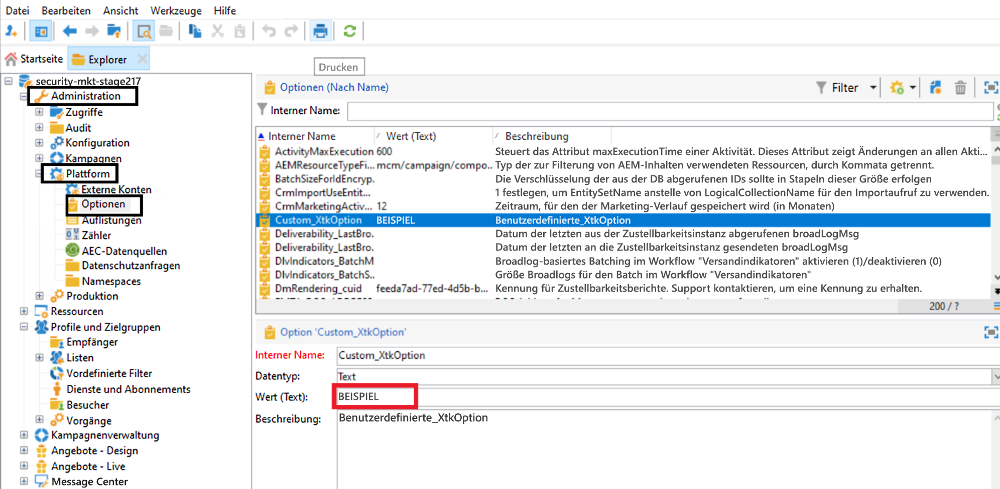
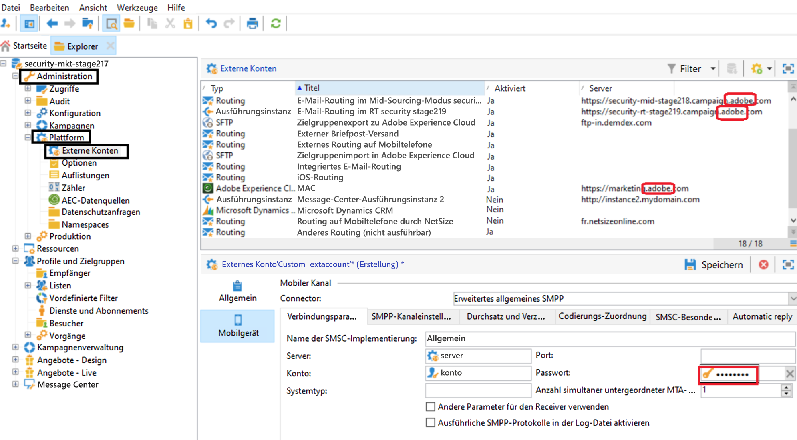

# Technische Anmerkung: Anleitung zur Rotation von Berechtigungen {#ac-customer-credentials}

Als Kunde sind Sie dafür verantwortlich, Ihre Anmeldeinformationen regelmäßig durch einen neuen Satz zu ersetzen, um das Risiko von Kompromissen zu verringern.

## Adobe Campaign Options-Anmeldeinformationen {#ac-options-credentials}

Über den Knoten **Administration > Plattform > Optionen** in Adobe Campaign Explorer können Sie Änderungen an den Adobe Campaign-Optionen vornehmen. Wenn Sie hier einige Anmeldeinformationen gespeichert haben, drehen Sie diese bitte um.

## Anmeldedaten für externe Konten {#ac-accounts-credentials}

Im Knoten **Administration > Plattform > Externe Konten** können Sie Änderungen an externen Adobe Campaign-Konten vornehmen.

Bitte rotieren Sie alle in den externen Konten gespeicherten Anmeldedaten.

>[!CAUTION]
>
>**Ändern Sie die vom Adobe verwalteten Anmeldeinformationen nicht**. Externe Konten mit `adobe` -bezogenen Servern sollten nicht geändert werden.

Für die spezifischen technischen Operatoren `mc*` (z. B. mc1, mc2 usw.) und `Interaction*` (z. B. interaction1, interaction2 usw.) kann einer der beiden folgenden Ansätze verwendet werden:

1. Adobe kann die Anmeldeinformationen für diese Benutzer ändern und für Sie freigeben. Beachten Sie, dass alle Integrationen, die diese Operatoren verwenden, nicht mehr funktionieren, bis die Anmeldeinformationen für diese Operatoren auf Ihrer Seite aktualisiert werden.

1. Adobe kann **neue** -Operatoren erstellen, die den vorhandenen Operatoren entsprechen, und diese für Sie freigeben. Adobe löscht alle Vorkommen alter Operatoren nach dem Wechsel zu diesen neuen Operatoren.

## Mobile Services - Privater Schlüssel/Zertifikat  {#ac-key-credentials}

Informationen zur Rotation der Mobile Services-bezogenen privaten Schlüssel und Zertifikat finden Sie in den unten stehenden Links.

* Informationen zu Android finden Sie in [dieser Dokumentation](https://experienceleague.adobe.com/en/docs/campaign-classic/using/sending-messages/sending-push-notifications/configure-the-mobile-app/configuring-the-mobile-application-android){target="_blank"}.
Navigieren Sie zum Abschnitt **Android Mobile App erstellen > API-Version konfigurieren** .

* Informationen zu iOS finden Sie in [dieser Dokumentation](https://experienceleague.adobe.com/en/docs/campaign-classic/using/sending-messages/sending-push-notifications/configure-the-mobile-app/configuring-the-mobile-application){target="_blank"}.
Navigieren Sie zum Abschnitt **Mobile iOS-App erstellen->Authentifizierungsmodus** .

## GPG-Schlüssel {#ac-gpg-credentials}

Für die Drehung von GPG-Schlüsseln müssen die folgenden Schritte ausgeführt werden:

1. Entschlüsseln Sie die vorhandenen Daten mit dem vorhandenen Schlüssel. [Weitere Informationen](https://experienceleague.adobe.com/en/docs/control-panel/using/instances-settings/gpg-keys-management#decrypting-data){target="_blank"}.

1. Erstellen Sie ein neues GPG-Schlüsselpaar. Weitere Informationen zur Verwaltung von GPG-Schlüsseln finden Sie in [dieser Dokumentation](https://experienceleague.adobe.com/en/docs/control-panel/using/instances-settings/gpg-keys-management#decrypting-data){target="_blank"}.

1. Ersetzen Sie die vorhandene GPG-Schlüsselverwendung in allen Workflows durch den neu erstellten Schlüssel.

1. Löschen Sie den vorhandenen GPG-Schlüssel.