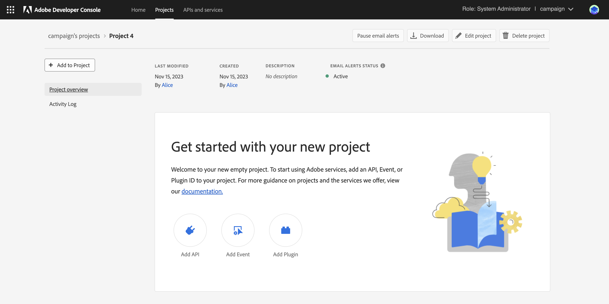

# Migration von technischen Campaign-Benutzerinnen und -Benutzern zur Adobe Developer Console {#migrate-tech-users-to-ims}

Im Rahmen der Bemühungen um die Verbesserung des Sicherheits- und Authentifizierungsprozesses wird ab Campaign v8.5 der Authentifizierungsprozess für Campaign v8 verbessert. Technische Benutzende können sich jetzt über das [Adobe Identity Management System (IMS)](https://helpx.adobe.com/de/enterprise/using/identity.html){target="_blank"} mit Campaign verbinden. In der [Dokumentation zur Adobe Developer Console](https://developer.adobe.com/developer-console/docs/guides/authentication/ServerToServerAuthentication/){target="_blank"} erfahren Sie mehr über den neuen Server-zu-Server-Authentifizierungsprozess.

Eine technische Benutzerin bzw. ein technischer Benutzer ist ein Campaign-Benutzerprofil, das explizit für die API-Integration erstellt wurde. In diesem Artikel werden die Schritte beschrieben, die zum Migrieren einer technischen Benutzerin bzw. eines technischen Benutzers zu einem technischen Konto über die Adobe Developer Console erforderlich sind.


## Sind Sie betroffen?{#ims-impacts}

Wenn Sie API-Aufrufe von einem Campaign-externen System in die Campaign-Marketing-Instanz oder die Echtzeit-Message-Center-Instanz durchführen, müssen Sie die technischen Benutzenden über die Adobe Developer Console wie unten beschrieben in technische Konten migrieren.

Diese Änderung gilt ab Campaign v8.5 und wird ab Campaign v8.6 **obligatorisch**.


## Migrationsprozess {#ims-migration-procedure}

Führen Sie die folgenden Schritte aus, um technische Konten in der Adobe Developer Console zu erstellen und diese neu erstellten Konten zu verwenden, um die Authentifizierungsmethoden für alle externen Systeme zu ändern, die API-Aufrufe in Adobe Campaign tätigen.

Es folgt eine Übersicht über die Schritte:

* Erstellen Sie ein Projekt in der Adobe Developer Console
* Weisen Sie die entsprechenden APIs dem neu erstellten Projekt zu
* Weisen Sie die erforderlichen Campaign-Produktprofile dem Projekt zu
* Aktualisieren Sie die APIs für die Verwendung der neu erstellten technischen Kontoanmeldedaten
* Entfernen Sie die veralteten technischen Benutzerinnen und Benutzer aus Ihrer Campaign-Instanz

### Voraussetzungen für die Migration{#ims-migration-prerequisites}

<!--To be able to create the technical accounts which replace the technical operators, the prerequisite that the proper Campaign Product Profiles exist within the Admin Console for all Campaign instances need to be validated. You can learn more about Product Profiles within the Adobe Console in [Adobe Developer Console documentation](https://developer.adobe.com/developer-console/docs/guides/projects/){target="_blank"}.-->

Für API-Aufrufe der Message-Center-Instanz(en) sollte während der Aktualisierung auf Campaign v8.5 oder während der Bereitstellung der Instanz ein Produktprofil erstellt worden sein. Dieses Produktprofil hat den Namen:

`campaign - <your campaign instance> - messagecenter`

Wenn Sie bereits die IMS-basierte Authentifizierung für den Benutzerzugriff auf Campaign verwendet haben, sollten die für die API-Aufrufe erforderlichen Produktprofile bereits in der Admin Console vorhanden sein. Wenn Sie eine benutzerdefinierte Benutzergruppe in Campaign für die API-Aufrufe an die Marketing-Instanz verwenden, müssen Sie dieses Produktprofil in der Admin Console erstellen.

Für andere Fälle wenden Sie sich an Ihre Adobe-Kontaktperson für Migrationen, damit technische Adobe-Teams Ihre bestehenden Benutzergruppen und spezifischen Berechtigungen in die Produktprofile innerhalb der Admin Console migrieren können.


### Schritt 1: Erstellen Ihres Campaign-Projekts in der Adobe Developer Console {#ims-migration-step-1}

Integrationen werden im Rahmen eines **Projekts** in der Adobe Developer Console erstellt. Weitere Informationen zu Projekten sind in der [Dokumentation zur Adobe Developer Console](https://developer.adobe.com/developer-console/docs/guides/projects/){target="_blank"} zu finden.

Sie können jedes zuvor von Ihnen erstellte Projekt verwenden oder ein neues Projekt erstellen. Die Schritte zum Erstellen eines Projekts werden im Detail in der [Dokumentation zur Adobe Developer Console](https://developer.adobe.com/developer-console/docs/guides/getting-started/){target="_blank"} beschrieben. Nachfolgend finden Sie die wichtigsten Schritte.

<!--
For this migration, you must add below APIs in your project: **I/O Management API** and **Adobe Campaign**.

-->

Um ein neues Projekt zu erstellen, klicken Sie auf **Neues Projekt erstellen** auf dem Hauptbildschirm in der Adobe Developer Console.


Sie können die Schaltfläche **Projekt bearbeiten** verwenden, um dieses Projekt umzubenennen.


### Schritt 2: Hinzufügen von APIs zu Ihrem Projekt {#ims-migration-step-2}

Fügen Sie im neu erstellten Projektbildschirm die erforderlichen APIs hinzu, um dieses Projekt als technisches Konto für Ihre API-Aufrufe an Adobe Campaign verwenden zu können.

Gehen Sie wie folgt vor, um Ihrem Projekt APIs hinzuzufügen:

1. Klicken Sie auf **API hinzufügen**, um die APIs auszuwählen, die zum Projekt hinzugefügt werden sollen.
   
1. Wählen Sie die Adobe Campaign-API aus und fügen Sie sie zu Ihrem Projekt hinzu, indem Sie das Kontrollkästchen oben rechts auf der Adobe Campaign-Karte aktivieren, das angezeigt wird, wenn Sie den Mauszeiger über die Karte bewegen.
   
1. Klicken Sie auf **Weiter** unten auf dem Bildschirm.

### Schritt 3: Authentifizierungstyp auswählen  {#ims-migration-step-3}

Wählen Sie auf dem Bildschirm **API konfigurieren** den benötigten Authentifizierungstyp aus. Die **OAuth-Server-zu-Server**-Authentifizierung ist für dieses Projekt erforderlich. Stellen Sie sicher, dass sie ausgewählt ist, und klicken Sie auf **Weiter** unten auf dem Bildschirm.


<!--
Once your project is created in the Adobe Developer Console, add an API that uses Server-to-Server authentication. Learn how to set up the OAuth Server-to-Server credential in [Adobe Developer Console documentation](https://developer.adobe.com/developer-console/docs/guides/authentication/ServerToServerAuthentication/implementation/){target="_blank"}.

When the API has been successfully connected, you can access the newly generated credentials including Client ID and Client Secret, as well as generate an access token.-->

### Schritt 4: Produktprofile auswählen {#ims-migration-step-4}

Wie im Abschnitt „Voraussetzungen“ beschrieben, müssen Sie die entsprechenden Produktprofile zuweisen, die das Projekt verwenden soll. In diesem Schritt wählen Sie die Produktprofile, die das zu erstellende technische Konto verwenden soll.

Wenn dieses technische Konto verwendet wird, um API-Aufrufe an die Message-Center-Instanz durchzuführen, wählen Sie zum Erstellen eines Produkts das Adobe-Profil aus, das auf `messagecenter` endet.

Wählen Sie für API-Aufrufe an die Marketing-Instanz(en) das Produktprofil aus, das der Instanz und der Benutzergruppe entspricht.

Klicken Sie nach Auswahl der gewünschten Produktprofile auf **Konfigurierte API speichern** unten auf dem Bildschirm.

<!--
You can now add your Campaign product profile to the project, as detailed below:

1. Open the Adobe Campaign API.
1. Click the **Edit product profiles** button

    

1. Assign all the relevant Product Profiles to the API, for example 'messagecenter', and save your changes.
1. Browse to the **Credential details** tab of your project, and copy the **Technical Account Email** value.-->

### Schritt 5: Hinzufügen der I/O-Management-API zu Ihrem Projekt {#ims-migration-step-5}


Klicken Sie im Projektbildschirm auf **[!UICONTROL + Zum Projekt hinzufügen]** und wählen Sie **[!UICONTROL API]** oben links im Bildschirm, um die I/O-Management-API zu diesem Projekt hinzufügen zu können.


Scrollen Sie auf dem Bildschirm **API hinzufügen** nach unten, um die Karte **I/O-Management-API** zu suchen. Wählen Sie sie aus, indem Sie auf das Kontrollkästchen klicken, das angezeigt wird, wenn Sie den Mauszeiger über die Karte bewegen. Klicken Sie anschließend auf **Weiter** unten auf dem Bildschirm.


Im Bildschirm **API konfigurieren** ist die OAuth-Server-zu-Server-Authentifizierung bereits vorhanden. Klicken Sie auf **Konfigurierte API speichern** unten auf dem Bildschirm.


Dadurch gelangen Sie zurück zum Projektbildschirm in der I/O-Management-API des neu erstellten Projekts. Klicken Sie oben im Bildschirm in den Breadcrumbs auf den Projektnamen, um zur Hauptseite mit den Projektdetails zurückzukehren.


### Schritt 6: Überprüfen der Projekteinrichtung {#ims-migration-step-6}

Überprüfen Sie Ihr Projekt, um sicherzustellen, dass es ähnlich wie das unten gezeigte aussieht, mit der **I/O-Management-API** und **Adobe Campaign-API** im Abschnitt „Produkte und Dienste“ sowie **OAuth-Server-zu-Server** im Abschnitt „Anmeldedaten“.


### Schritt 7: Validieren der Konfiguration {#ims-migration-step-7}

Um die Verbindung zu testen, führen Sie die Schritte aus, die im [Handbuch zu den Anmeldedaten für die Adobe Developer Console](https://developer.adobe.com/developer-console/docs/guides/authentication/ServerToServerAuthentication/implementation/#generate-access-tokens){target="_blank"} zum Generieren eines Zugriffstokens beschrieben sind, und kopieren Sie den bereitgestellten Beispiel-cURL-Befehl. Sie können mithilfe dieser Anmeldedaten einen SOAP-Aufruf erstellen, um zu testen, ob Sie sich authentifizieren und eine korrekte Verbindung zu den Adobe Campaign-Instanzen herstellen können. Es wird empfohlen, diese Validierung durchzuführen, bevor alle Änderungen an den API-Integrationen von Drittanbieterfirmen vorgenommen werden.

### Schritt 8: Aktualisieren der API-Integrationen von Drittanbieterfirmen {#ims-migration-step-8}

Sie müssen jetzt alle API-Integrationen aktualisieren, die Aufrufe an Adobe Campaign tätigen, um das neu erstellte technische Konto zu verwenden.

Weitere Informationen zu den Schritten der API-Integration, einschließlich eines Beispiel-Codes für eine reibungslose Integration, finden Sie unter [Dokumentation zur Authentifizierung der Adobe Developer Console](https://developer.adobe.com/developer-console/docs/guides/authentication/ServerToServerAuthentication/){target="_blank"}.

Im Folgenden finden Sie Beispiele für SOAP-Aufrufe, die die Aufrufe vor und nach der Migration für die Systeme von Drittanbietern zeigen.

Wenn Sie die Authentifizierung über das Adobe Identity Management System (IMS) verwenden, sollten Sie im Postman-Aufruf „`Authorization: Bearer <IMS_Technical_Token_Token>`“ hinzufügen:

```
curl --location --request POST 'https://<instance_url>/nl/jsp/schemawsdl.jsp?schema=nms:rtEvent' \--header 'Authorization: Bearer <Technical account access token>'
```

Sobald der Migrationsprozess erreicht und validiert wurde, werden die SOAP-Aufrufe wie folgt aktualisiert:

* Vor der Migration: Zugriffstoken für technische Konten wurden nicht unterstützt.

  ```sql
  POST /nl/jsp/soaprouter.jsp HTTP/1.1
  Host: localhost:8080
  Content-Type: application/soap+xml;
  SOAPAction: "nms:rtEvent#PushEvent"
  charset=utf-8
  
  <?xml version="1.0" encoding="utf-8"?>  <soapenv:Envelope xmlns:soapenv="http://schemas.xmlsoap.org/soap/envelope/" xmlns:urn="urn:nms:rtEvent">
  <soapenv:Header/>
  <soapenv:Body>
      <urn:PushEvent>
          <urn:sessiontoken>SESSION_TOKEN</urn:sessiontoken>
          <urn:domEvent>
              <!--You may enter ANY elements at this point-->
              <rtEvent type="type" email="name@domain.com"/>
          </urn:domEvent>
      </urn:PushEvent>
  </soapenv:Body>
  </soapenv:Envelope>
  ```

* Nach der Migration: Zugriffstoken für technische Konten werden unterstützt. Es wird erwartet, dass das Zugriffstoken in der `Authorization` Kopfzeile als Bearer-Token angegeben wird. Die Verwendung eines Sitzungs-Tokens sollte hier ignoriert werden, wie im folgenden Beispiel für einen SOAP-Aufruf dargestellt.

  ```sql
  POST /nl/jsp/soaprouter.jsp HTTP/1.1
  Host: localhost:8080
  Content-Type: application/soap+xml;
  SOAPAction: "nms:rtEvent#PushEvent"
  charset=utf-8
  Authorization: Bearer <IMS_Technical_Token_Token>
  
  <?xml version="1.0" encoding="utf-8"?>  <soapenv:Envelope xmlns:soapenv="http://schemas.xmlsoap.org/soap/envelope/" xmlns:urn="urn:nms:rtEvent">
  <soapenv:Header/>
  <soapenv:Body>
      <urn:PushEvent>
          <urn:sessiontoken></urn:sessiontoken>
          <urn:domEvent>
              <!--You may enter ANY elements at this point-->
              <rtEvent type="type" email="name@domain.com"/>
          </urn:domEvent>
      </urn:PushEvent>
  </soapenv:Body>
  </soapenv:Envelope>
  ```

### Schritt 9: (optional) Aktualisieren der Benutzenden des technischen Kontos in der Campaign Client-Konsole {#ims-migration-step-9}

Dieser Schritt ist optional und nur innerhalb der Marketing-Instanz(en) verfügbar, nicht aber in einer Message Center-Instanz. Wenn spezifische Ordnerberechtigungen oder spezifische Berechtigungen für die technischen Benutzenden nicht über die zugewiesene(n) Benutzergruppe(n) definiert wurden. Sie müssten jetzt die neu erstellten Benutzenden des technischen Kontos in der Admin Console aktualisieren, um die erforderlichen Ordnerberechtigungen oder spezifischen Berechtigungen zu erteilen.

Beachten Sie, dass die Benutzenden des technischen Kontos so lange NICHT in Adobe Campaign vorhanden sind, bis mindestens ein API-Aufruf an die Campaign-Instanz erfolgt. Zu diesem Zeitpunkt erstellt IMS die Benutzenden in Campaign. Wenn Sie die technischen Benutzenden in Campaign nicht finden können, stellen Sie sicher, dass Sie erfolgreich einen API-Aufruf senden konnten, wie [in Schritt 7](#ims-migration-step-7) beschrieben.

1. Um die für die neuen Benutzenden des technischen Kontos erforderlichen Änderungen anzuwenden, durchsuchen Sie die Campaign Client-Konsole nach E-Mail-Adresse. Diese E-Mail-Adresse wurde während der obigen Schritte zur Projekterstellung und -authentifizierung erstellt.

   Klicken Sie auf die Überschrift **OAuth-Server-zu-Server** im Abschnitt **Anmeldedaten** des Projekts, um diese E-Mail-Adresse zu finden.

   

   Scrollen Sie im Bildschirm „Anmeldedaten“ nach unten, um die **E-Mail-Adresse des technischen Kontos** zu suchen, und klicken Sie auf die Schaltfläche **Kopieren**.

   

1. Sie müssen jetzt den neu erstellten technischen Benutzer bzw. die Benutzerin in der Adobe Campaign-Client-Konsole aktualisieren. Sie müssen die bestehenden Berechtigungen für den Ordner des technischen Benutzers bzw. der Benutzerin auf die neue Person übertragen.

   Gehen Sie wie folgt vor, um diesen Benutzer bzw. diese Benutzerin zu aktualisieren:

   1. Navigieren Sie im Explorer der Campaign-Client-Konsole zu **Administration > Zugriffsverwaltung > Benutzer**.
   1. Greifen Sie auf den bestehenden technischen Benutzer bzw. die technische Benutzerin zu, der bzw. die für APIs verwendet wird.
   1. Navigieren Sie zu den Ordnerberechtigungen und überprüfen Sie die Berechtigungen.
   1. Wenden Sie dieselben Berechtigungen auf den neu erstellten technischen Benutzer bzw. die neu erstellte technische Benutzerin an. Die E-Mail-Adresse dieser Benutzerin bzw. dieses Benutzers ist der Wert der **E-Mail für technische Konten**, der zuvor kopiert wurde.
   1. Speichern Sie Ihre Änderungen.


>[!CAUTION]
>
>Der neue technische Benutzer bzw. die Benutzerin muss mindestens einen API-Aufruf durchgeführt haben, damit diese Person der Campaign-Client-Konsole hinzugefügt werden kann.
>

### Schritt 10: Entfernen der alten technischer Benutzenden aus Adobe Campaign {#ims-migration-step-10}

Sobald Sie alle Drittanbietersysteme migriert haben, um das neue technische Konto mit IMS-Authentifizierung zu verwenden, können Sie die alten technischen Benutzenden aus der Campaign-Client-Konsole löschen.

Melden Sie sich dazu bei der Campaign-Client-Konsole an und navigieren Sie zu **Administration > Zugriffsverwaltung > Benutzer**, wo Sie die alten technischen Benutzenden finden und löschen können.
