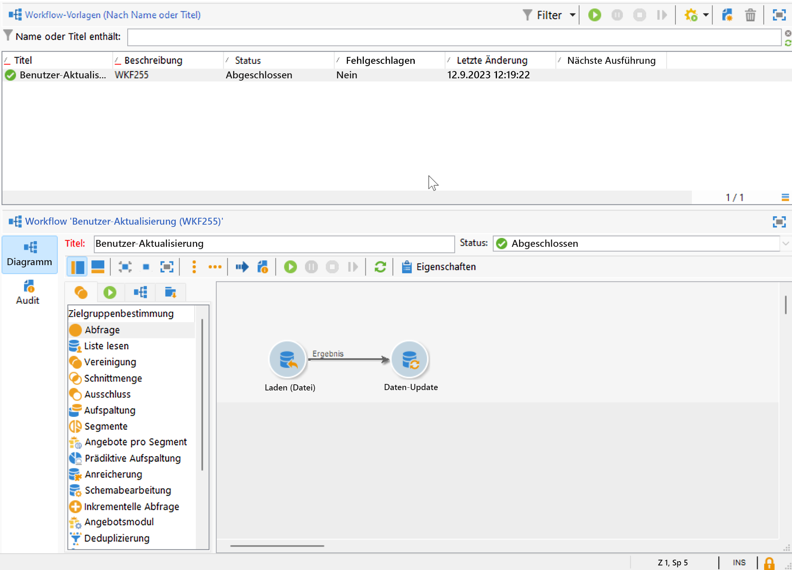
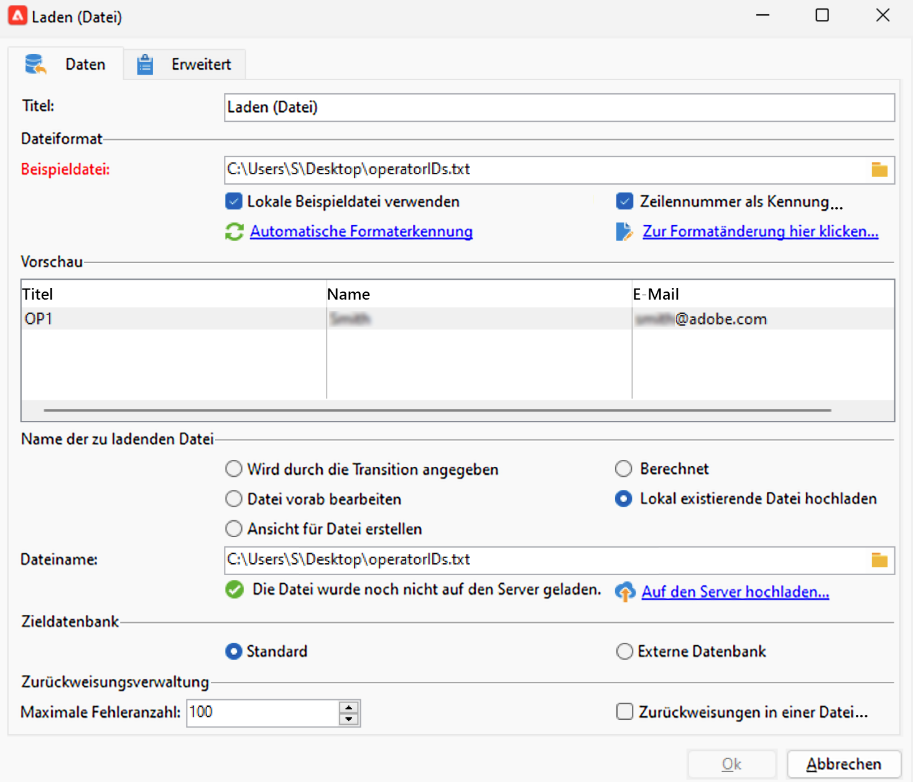
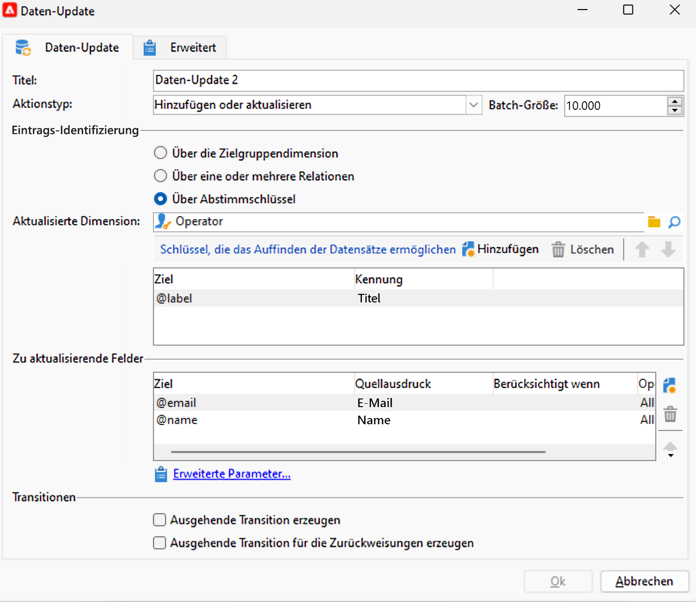
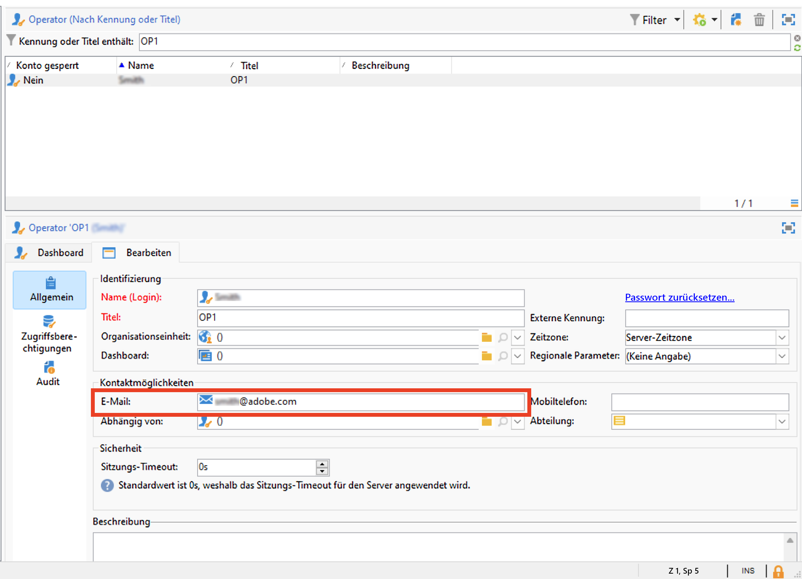
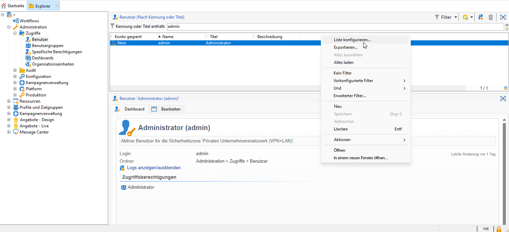
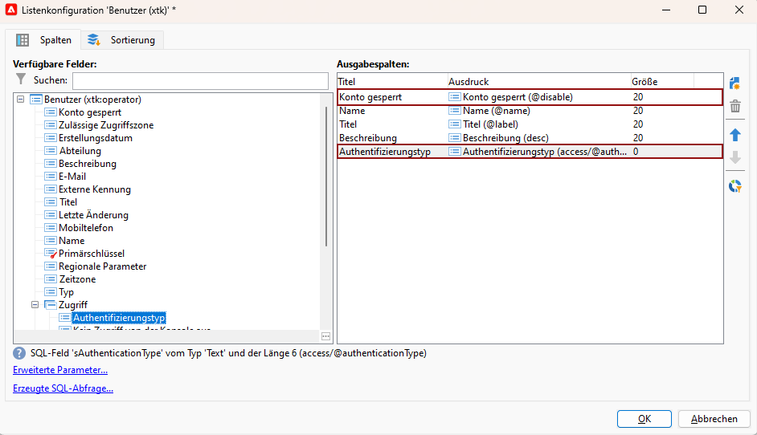
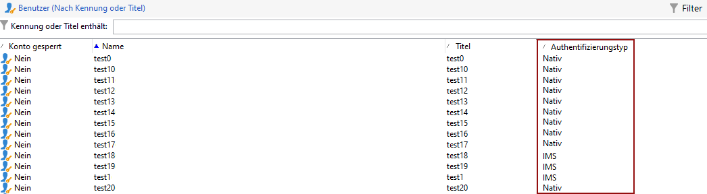

# Migrieren von Campaign-Benutzenden zum Adobe Identity Management System (IMS) {#migrate-users-to-ims}

Ab Campaign v8.6 wird der Authentifizierungsprozess für Campaign v8 verbessert. Alle Benutzer verwenden [Adobe Identity Management System (IMS](https://helpx.adobe.com/de/enterprise/using/identity.html){target="_blank"} **only** für die Verbindung mit Campaign. Die Verbindung mit Benutzername/Kennwort (auch als native Authentifizierung bezeichnet) ist nicht mehr zulässig. Adobe empfiehlt, diese Migration in Campaign v8.5.2 durchzuführen, um eine reibungslose Migration zu Campaign v8.6 zu ermöglichen.

Wenn Sie als Kundin bzw. Kunde von Campaign Classic v7 Managed Services zu Campaign v8 migrieren, gilt dieses Verfahren ebenfalls für Sie.

In diesem Artikel werden die Schritte beschrieben, die zum Migrieren einer technischen Benutzerin bzw. eines technischen Benutzers zu einem technischen Konto in der Adobe Developer Console erforderlich sind.

## Was hat sich geändert?{#move-to-ims-changes}

Mit Campaign v8 sollten sich alle regulären Anwenderinnen und Anwender bereits mit ihrer Adobe ID über das Adobe Identity Management System (IMS) mit der Adobe Campaign Client-Konsole verbinden.  Bei einigen älteren Konfigurationen waren jedoch noch Verbindungen mit Benutzername/Kennwort verfügbar. **Dies ist ab Campaign v8.6 nicht mehr zulässig.**

Darüber hinaus ruft die Adobe Campaign-Client-Anwendung zur Verbesserung der Sicherheit und des Authentifizierungsprozesses die Campaign-APIs jetzt direkt über das technische IMS-Konto-Token auf. Die Migration für technische Benutzende wird in einem speziellen Artikel beschrieben, der auf [dieser Seite](ims-migration.md) zu finden ist.

Diese Änderung gilt seit Campaign v8.5.2 und ist ab Campaign v8.6 **obligatorisch**.

## Sind Sie betroffen?{#migrate-ims-impacts}

Wenn Benutzende Ihrer Organisation über ihr Login/Passwort eine Verbindung zur Campaign-Client-Konsole herstellen (auch bekannt als native Authentifizierung), sind Sie betroffen und müssen diese Benutzenden wie unten beschrieben zu Adobe IMS migrieren.

Die Migration auf das [Adobe Identity Management System (IMS](https://helpx.adobe.com/de/enterprise/using/identity.html){target="_blank"} ist eine Sicherheitsanforderung, um Ihre Umgebungen sicher und standardisiert zu gestalten, da die meisten anderen Adobe Experience Cloud-Lösungen und -Apps bereits auf IMS installiert sind.

>[!IMPORTANT]
>
>**Auswirkungen auf den Control Panel-Zugriff**
>
>Wenn Sie Ihre Benutzerinnen und Benutzer zu IMS migriert haben, beachten Sie, dass jedes Produktprofil in der Adobe Admin Console, das das Wort „admin“ im Namen enthält (z. B. „Administratoren“, „Admin“, „Admins“, „Genehmigungsadmin“ usw.) automatisch Zugriff auf das Campaign Control Panel gewährt. Das Control Panel ist ein Self-Service-Tool, mit dem Sie wesentliche Änderungen an Campaign-Instanzen vornehmen können.
>
>Überprüfen Sie die Benennungskonventionen für Produktprofile sorgfältig, um sicherzustellen, dass nur autorisierte Benutzer Zugriff auf das Control Panel haben. Weitere Informationen zur Verwaltung von Control Panel-Berechtigungen finden Sie in der [Control Panel-Dokumentation](https://experienceleague.adobe.com/docs/control-panel/using/discover-control-panel/managing-permissions.html){target="_blank"}.

## Wie wird die Migration durchgeführt?{#ims-migration-procedure}

### Voraussetzungen{#ims-migration-prerequisites}

Bevor Sie mit dem Migrationsprozess beginnen, müssen Sie sich an Ihren Adobe-Kontakt (Transition Manager) wenden, damit die technischen Teams von Adobe Ihre bestehenden Benutzergruppen und spezifischen Berechtigungen zum Adobe Identity Management System (IMS) migrieren können.

### Die wichtigsten Schritte {#ims-migration-steps}

Die wichtigsten Schritte für diese Migration sind unten aufgeführt:

1. Adobe aktualisiert Ihre Umgebungen auf Campaign v8.5.2.
1. Nach dem Upgrade können Sie weiterhin neue Benutzende mit beiden Methoden erstellen, als native Benutzerin bzw. nativen Benutzer oder mit IMS.
1. Ihre internen Campaign-Admins müssen allen nativen Benutzenden in der Campaign-Client-Konsole eindeutige E-Mails hinzufügen und nach Abschluss dieses Vorgangs Ihrem Adobe Transition Manager bestätigen, dass dies geschehen ist. Dieser Schritt wird in [diesem Abschnitt](#ims-migration-id) beschrieben.
1. Vereinbaren Sie mit Adobe einen Termin, an dem Adobe die automatisierte Migration für Ihre nicht-technischen Benutzenden und Produktprofile durchführen kann. Für diesen Schritt ist ein Zeitfenster von einer Stunde ohne Ausfallzeiten für Ihre Instanzen erforderlich.
1. Ihre internen Campaign-Admins validieren diese Änderungen und geben sie frei. Nach dieser Migration dürfen Sie keinen weiteren Benutzenden mehr erstellen, die sich mit deren Login und Passwort authentifizieren.

Sie können jetzt Ihre technischen Benutzenden zur Adobe Developer Console migrieren, wie in [dieser Technote](ims-migration.md) beschrieben.  Dieser Schritt ist bei der Verwendung von Campaign-APIs obligatorisch.

Bestätigen Sie nach Abschluss der Migration diese Ihrem Adobe Transition Manager. Adobe markiert dann die Migration als abgeschlossen und blockiert die neue native Benutzererstellung und die native Benutzeranmeldung. Ihre Umgebung ist dann gesichert und standardisiert.

## Häufig gestellte Fragen {#ims-migration-faq}

### Wann kann ich die Migration starten? {#ims-migration-start}

Eine Voraussetzung für die Migration auf das [Adobe Identity Management System (IMS)](https://helpx.adobe.com/de/enterprise/using/identity.html){target="_blank"} ist die Aktualisierung Ihrer Umgebung auf Campaign v8.5.2.

Sie können die IMS-Migration in Ihrer Staging-Umgebung starten, sobald sie auf Campaign v8.5.2 aktualisiert wurde, und entsprechend für die Produktionsumgebung planen.

### Was passiert nach einem Build-Upgrade auf Campaign v8.5.2? {#ims-migration-after-upgrade}

Nachdem Ihre Umgebungen auf Campaign v8.5.2 aktualisiert wurden, können Sie den Wechsel zum [Adobe Identity Management System (IMS) &#x200B;](https://helpx.adobe.com/de/enterprise/using/identity.html){target="_blank"}.

Eine neue native Benutzererstellung ist weiterhin zulässig, bis die IMS-Migration abgeschlossen ist.

### Wann ist die Migration abgeschlossen? {#ims-migration-end}

Sobald die Migration der Endbenutzenden und die Migration der technischen Benutzenden auf das Adobe Identity Management System (IMS) abgeschlossen sind, müssen Sie sich an Ihren Adobe Transition Manager wenden, damit Adobe Ihre Migration als abgeschlossen kennzeichnen, die Benutzererstellung über die Client-Konsole blockieren und die native Benutzeranmeldung deaktivieren kann.

### Wie werden nach der Migration Benutzende erstellt? {#ims-migration-native}

Sobald die vollständige IMS-Migration abgeschlossen ist, wendet Adobe die Einschränkungen an, die die Erstellung von neuen nativen Benutzenden blockieren. Diese Einschränkungen werden erst nach Abschluss der IMS-Migration angewendet.

Für neue Kundinnen und Kunden ist die Erstellung von neuen nativen Benutzenden von Anfang an nicht erlaubt.

Als Campaign-Admin können Sie den Benutzenden Ihrer Organisation über die Adobe Admin Console und die Campaign Client-Konsole Berechtigungen erteilen. Benutzende melden sich mit ihrer Adobe ID bei Adobe Campaign an. Weitere Informationen finden Sie in [dieser Dokumentation](../../v8/start/gs-permissions.md).

### Wie kann ich E-Mails für aktuelle native Benutzende hinzufügen? {#ims-migration-id}

Als Campaign-Admin müssen Sie allen nativen Benutzenden über die Client-Konsole E-Mail-IDs hinzufügen. Gehen Sie dazu wie folgt vor:

1. Stellen Sie eine Verbindung zur Client-Konsole her und wechseln Sie zu **Administration > Verwaltung der Zugriffsberechtigungen > Benutzende**.
1. Wählen Sie in der Benutzerliste die zu aktualisierenden Benutzenden aus.
1. Geben Sie die E-Mail-Adresse der jeweiligen Personen im Abschnitt **Kontaktmöglichkeiten** des Benutzerformulars ein.
1. Speichern Sie Ihre Änderungen.

Als für einen Workflow verantwortliche Person oder Campaign-Admin können Sie mit einem Workflow auch eine Massenaktualisierung Ihrer Benutzenden durchführen.

+++Wichtige Schritte zum Aktualisieren Ihrer Benutzer mit einem Workflow

Gehen Sie wie folgt vor, um eine Massenaktualisierung Ihrer nativen Benutzenden durchzuführen:

1. Erstellen Sie einen Workflow, um alle Benutzenden, die eine Verbindung zu Campaign mit der nativen Authentifizierungsmethode herstellen, in eine CSV-Datei zu extrahieren. Verwenden Sie die Aktivität **Abfrage** und die Aktivität **Datenextraktion (Datei)**, um die CSV-Datei zu erstellen. Für alle Benutzenden können Sie, basierend auf den Profildaten, die folgenden Spalten exportieren: `Name, Label`.

   Weitere Informationen über die Aktivität **Abfrage** finden Sie auf [dieser Seite](../../automation/workflow/query.md).

   Weitere Informationen zur Aktivität **Datenextraktion (Datei)** finden Sie auf [dieser Seite](../../automation/workflow/extraction-file.md)

1. Aktualisieren Sie die CSV-Datei mit einer neuen Spalte, die die E-Mail-Adressen Ihrer Benutzenden enthält.

1. Erstellen Sie einen Workflow zum Importieren aktualisierter Daten mit der Aktivität **Laden (Datei)** und der Aktivität **Daten aktualisieren** im Workflow.

   {width="70%"}

1. Bearbeiten Sie die Aktivität **Laden (Datei)** und definieren Sie die Einstellungen zum Laden der aktualisierten CSV-Datei gemäß dem unten stehenden Beispiel.

   {width="70%"}

   Weitere Informationen zur Aktivität **Laden (Datei)** finden Sie auf [dieser Seite](../../automation/workflow/data-loading-file.md)

1. Bearbeiten Sie die Aktivität **Daten aktualisieren** und definieren Sie die Einstellungen gemäß dem unten stehenden Beispiel. Beachten Sie, dass die **aktualisierte Dimension** in `Operators (xtk)` geändert wurde.

   {width="70%"}

   Weitere Informationen über die Aktivität **Daten aktualisieren** finden Sie auf [dieser Seite](../../automation/workflow/update-data.md).

1. Führen Sie den Workflow aus und überprüfen Sie die Ergebnisse. Die E-Mail-Adresse wurde dem Benutzerprofil hinzugefügt.

   {width="70%"}

+++

### Wie meldet man sich über IMS bei Campaign an? {#ims-migration-log}

In [diesem Abschnitt](../../v8/start/connect.md) erfahren Sie, wie Sie eine Verbindung zu Campaign mit Ihrer Adobe ID herstellen.

### Wird es während dieser Migration zu Ausfallzeiten kommen? {#ims-migration-downtime}

Um die Migration (von Benutzenden und Produktprofilen) abzuschließen, benötigt Adobe ein Zeitfenster von einer Stunde, in dem keine Ihrer Instanzen (Workflows usw.) unterbrochen werden dürfen.

Während dieses Zeitrahmens müssen sich alle Campaign-Benutzenden abmelden und sich nach Abschluss der Migration zu IMS erneut mit ihrer Adobe ID anmelden.

### Was passiert mit Benutzenden, die während der IMS-Benutzermigration angemeldet sind? {#ims-migration-log-off}

Adobe empfiehlt dringend, dass alle Benutzenden während des Migrationsfensters abgemeldet sind.

### Benutzende in meinem Unternehmen verwenden IMS bereits. Muss ich trotzdem eine IMS-Migration durchführen?{#ims-migration-needed}

Diese Migration umfasst zwei Aspekte: die Migration von Endbenutzenden und die Migration von technischen Benutzenden (wird in APIs in Ihrem benutzerspezifischen Code verwendet).

Wenn alle Benutzenden (Campaign-Benutzende) IMS verwenden, müssen Sie diese Migration nicht durchführen. Sie müssen jedoch weiterhin technische Benutzende migrieren, die Sie möglicherweise in benutzerdefiniertem Code verwendet haben. Weitere Informationen finden Sie auf [dieser Seite](ims-migration.md).

Sobald diese Migration abgeschlossen ist, müssen Sie sich an Ihren Adobe Transition Manager wenden, damit Adobe die Migration abschließt.

### Wie kann ich den Authentifizierungstyp meiner Benutzenden anzeigen?

Erfahren Sie, wie Sie den Authentifizierungstyp Ihrer Benutzenden in Campaign anzeigen:

1. Greifen Sie aus dem **Explorer** auf **Administration** `>` **Zugriffsverwaltung** `>` **Benutzende** zu.

1. Klicken Sie mit der rechten Maustaste auf die Kopfzeile und wählen Sie das Menü **Liste konfigurieren**.

   

1. Fügen Sie **Account deaktiviert** und **Authentifizierungstyp** als **Ausgabespalten** hinzu.

   

Sie können jetzt die Liste Ihrer **Benutzenden** und deren **Authentifizierungstyp** sehen.

## Nützliche Links {#ims-useful-links}

* [Migration von technischen Benutzerinnen und Benutzern zur Adobe Developer Console](ims-migration.md)
* [Herstellen einer Verbindung zu Adobe Campaign v8](../../v8/start/connect.md)
* [Zugriff und Berechtigungen in Adobe Campaign v8](../../v8/start/gs-permissions.md)
* [Versionshinweise von Adobe Campaign v8](../../v8/start/release-notes.md)
* [Was ist das Adobe Identity Management System (IMS)](https://helpx.adobe.com/de/enterprise/using/identity.html){target="_blank"}
