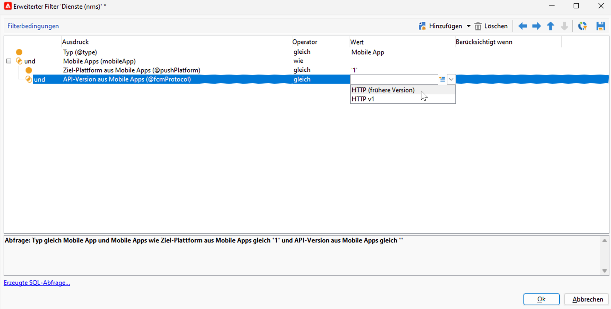
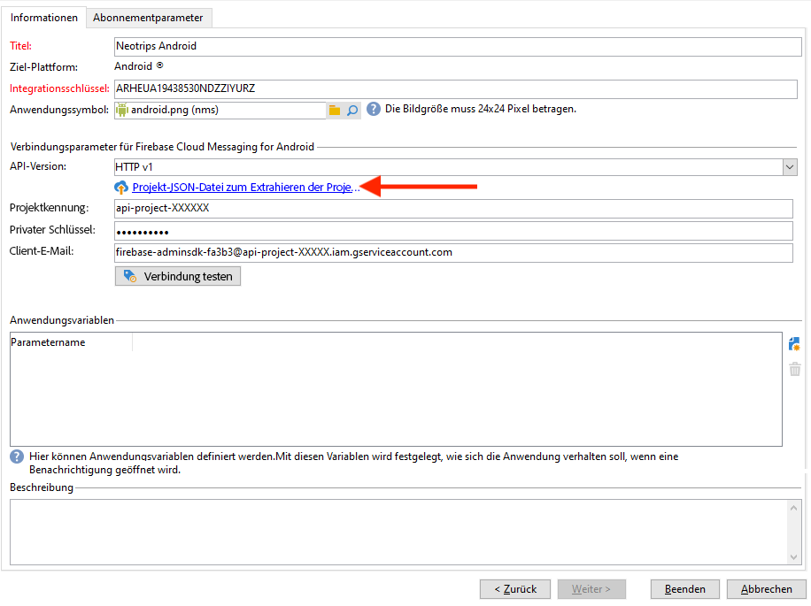
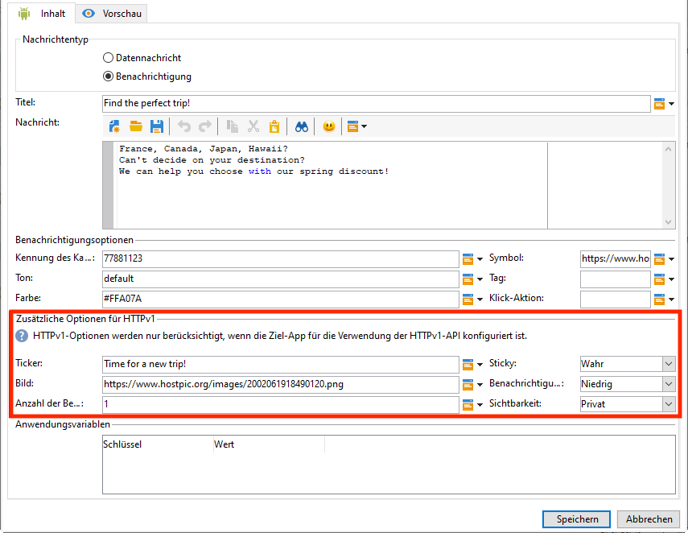

# Künftige Änderungen am Push-Benachrichtigungskanal {#push-upgrade}

Sie können Campaign verwenden, um Push-Benachrichtigungen an Android-Geräte zu senden. Dazu benötigt Campaign bestimmte Abonnementdienste. Einige wichtige Änderungen am FCM-Dienst (Android Firebase Cloud Messaging) werden 2024 veröffentlicht und können sich auf Ihre Implementierung von Adobe Campaign auswirken. Ihre Konfiguration der Anmeldedienste für Android-Push-Nachrichten muss möglicherweise aktualisiert werden, um diese Änderung zu unterstützen.

## Was hat sich geändert? {#fcm-changes}

Im Rahmen der kontinuierlichen Bemühungen von Google, seine Dienste zu verbessern, werden die veralteten FCM-APIs am **20. Juni 2024** eingestellt. Weitere Informationen zum HTTP-Protokoll von Firebase Cloud Messaging finden Sie in der [Google Firebase-Dokumentation](https://firebase.google.com/docs/cloud-messaging/http-server-ref){target="_blank"}.

Adobe Campaign Classic v7 und Adobe Campaign v8 unterstützen bereits die neuesten APIs zum Senden von Push-Benachrichtigungen. Einige alte Implementierungen sind jedoch weiterhin auf die alten APIs angewiesen. Diese Implementierungen müssen aktualisiert werden.

## Sind Sie betroffen? {#fcm-impact}

Wenn Ihre aktuelle Implementierung Anmeldedienste unterstützt, die über die veralteten APIs eine Verbindung zu FCM herstellen, sind Sie betroffen. Die Migration zu den neuesten APIs ist obligatorisch, um Dienstunterbrechungen zu vermeiden. In diesem Fall werden Adobe-Teams Kontakt mit Ihnen aufnehmen.

Um zu überprüfen, ob Sie betroffen sind, können Sie Ihre **Dienste und Abonnements** mit dem untenstehenden Filter filtern:

* Wenn einer Ihrer aktiven Push-Benachrichtigungsdienste die **(veraltete) HTTP-API** verwendet, ist Ihr Setup direkt von dieser Änderung betroffen. Sie müssen Ihre aktuellen Konfigurationen überprüfen und zu den neueren APIs migrieren, wie unten beschrieben.

* Wenn Ihr Setup ausschließlich die **HTTP-v1**-API für Android-Push-Benachrichtigungen verwendet, sind Sie bereits konform und es sind keine weiteren Maßnahmen Ihrerseits erforderlich.

## Wie wird die Migration durchgeführt? {#fcm-migration-procedure}

### Voraussetzungen {#fcm-migration-prerequisites}

* Für Campaign Classic v7 wurde die Unterstützung von HTTP v1 in Version 20.3.1 hinzugefügt. Wenn Ihre Umgebung auf einer älteren Version ausgeführt wird, besteht eine Voraussetzung für die Migration auf HTTP v1 darin, Ihre Umgebung auf den [neueste Campaign Classic-Build](https://experienceleague.adobe.com/docs/campaign-classic/using/release-notes/latest-release.html?lang=de){target="_blank"} zu aktualisieren. Bei Campaign v8 wird HTTP v1 von allen Versionen unterstützt und es ist keine Aktualisierung erforderlich.

* Die JSON-Datei des Kontos des Firebase Admin SDK-Dienstes ist erforderlich, damit die Mobile App auf HTTP v1 verschoben wird. In der [Dokumentation zu Google Firebase](https://firebase.google.com/docs/admin/setup#initialize-sdk){target="_blank"} erfahren Sie, wie Sie diese Datei erhalten.

* Bei hybriden, gehosteten und Managed Services-Bereitstellungen wenden Sie sich zusätzlich zur Ausführung des unten beschriebenen Migrationsverfahrens an Adobe, um Ihren Echtzeit(RT)-Ausführungs-Server zu aktualisieren. Der Mid-Sourcing-Server ist nicht betroffen.

* On-Premise-Benutzende von Campaign Classic v7 wie Sie müssen sowohl die Marketing- als auch die Echtzeit-Ausführungs-Server aktualisieren. Der Mid-Sourcing-Server ist nicht betroffen.

### Migrationsverfahren {#fcm-migration-steps}

Gehen Sie wie folgt vor, um Ihre Umgebung auf HTTP v1 zu migrieren:

1. Navigieren Sie zu Ihrer Liste von **Diensten und Abonnements**.
1. Listen Sie alle Mobile Apps auf, die die **(veraltete) HTTP-API-Version** verwenden.
1. Legen Sie für jede dieser Mobile Apps die **API-Version** auf **HTTP v1** fest.
1. Klicken Sie auf den Link **[!UICONTROL Projekt-JSON-Datei zum Extrahieren der Projektdetails laden…]**, um Ihre JSON-Schlüsseldatei direkt zu laden.

   Sie können auch die folgenden Details manuell eingeben:

   * **[!UICONTROL Projektkennung]**
   * **[!UICONTROL Privater Schlüssel]**
   * **[!UICONTROL Client-E-Mail]**

   

1. Klicken Sie auf **[!UICONTROL Verbindung testen]**, um zu prüfen, ob Ihre Konfiguration korrekt ist und ob der Marketing-Server Zugriff auf den FCM-Server hat. Beachten Sie bei Mid-Sourcing-Bereitstellungen, dass die Schaltfläche **[!UICONTROL Verbindung testen]** nicht überprüfen kann, ob der Server Zugriff auf den Android Firebase Cloud Messaging(FCM)-Dienst hat.
1. Bei Bedarf können Sie die Inhalte von Push-Nachrichten mit bestimmten **[!UICONTROL Anwendungsvariablen]** anreichern. Diese sind vollständig anpassbar; ein Teil der Payload der Nachricht wird an das Mobilgerät gesendet.
1. Klicken Sie auf **[!UICONTROL Beenden]** und danach auf **[!UICONTROL Speichern]**.

Im Folgenden finden Sie die FCM-Payload-Namen, mit denen Sie Ihre Push-Benachrichtigung weiter personalisieren können. Diese Optionen werden [hier](#fcm-apps) im Detail beschrieben.

| Nachrichtentyp | Konfigurierbares Nachrichtenelement (FCM-Payload-Name) | Konfigurierbare Optionen (Name der FCM-Payload) |
|:-:|:-:|:-:|
| Datennachricht | K. A. | validate_only |
| Benachrichtigungsinhalt | title, body, android_channel_id, icon, sound, tag, color, click_action, image, ticker, sticky, visibility, notification_priority, notification_count   | validate_only |

>[!NOTE]
>
>Sobald diese Änderungen auf allen Ihren Servern vorgenommen wurden, verwenden alle neuen Sendungen von Push-Benachrichtigungen an Android-Geräte die HTTP v1 API. Für bestehende Push-Sendungen, die gerade erneut versucht werden, gestartet sind oder verwendet werden, wird weiterhin die (veraltete) HTTP-API verwendet.

### Wie wirkt sich dies auf meine Android-Apps aus? {#fcm-apps}

Es sind keine spezifischen Änderungen am Code der Android Mobile Apps erforderlich, und das Benachrichtigungsverhalten sollte sich nicht ändern.

Mit HTTP v1 können Sie jedoch Ihre Push-Benachrichtigung mit **[!UICONTROL zusätzlichen Optionen für HTTPV1]** weiter personalisieren.

Sie haben folgende Möglichkeiten:

* Verwenden Sie das Feld **[!UICONTROL Ticker]**, um den Ticker-Text Ihrer Benachrichtigung festzulegen.
* Verwenden Sie das Feld **[!UICONTROL Bild]**, um die URL des Bildes festzulegen, das in Ihrer Benachrichtigung angezeigt werden soll.
* Verwenden Sie das Feld **[!UICONTROL Anzahl der Benachrichtigungen]**, um festzulegen, dass die Zahl der neuen, ungelesenen Informationen direkt auf dem App-Symbol angezeigt werden soll.
* Setzen Sie die Option **[!UICONTROL Sticky]** auf „false“, damit die Benachrichtigung automatisch verworfen wird, wenn die Benutzenden darauf klicken. Bei der Einstellung „true“ wird die Benachrichtigung weiter angezeigt, auch wenn die Benutzenden darauf klicken.
* Setzen Sie die **[!UICONTROL Benachrichtigungsprioritätsstufe]** Ihrer Benachrichtigung auf Standard, Minimum, niedrig oder hoch.
* Setzen Sie die **[!UICONTROL Sichtbarkeitsstufe]** Ihrer Benachrichtigung auf öffentlich, privat oder geheim.

Weitere Informationen zu den **[!UICONTROL zusätzlichen HTTP v1-Optionen]** und dazu, wie diese Felder auszufüllen sind, finden Sie in der [FCM-Dokumentation](https://firebase.google.com/docs/reference/fcm/rest/v1/projects.messages#androidnotification){target="_blank"}.
