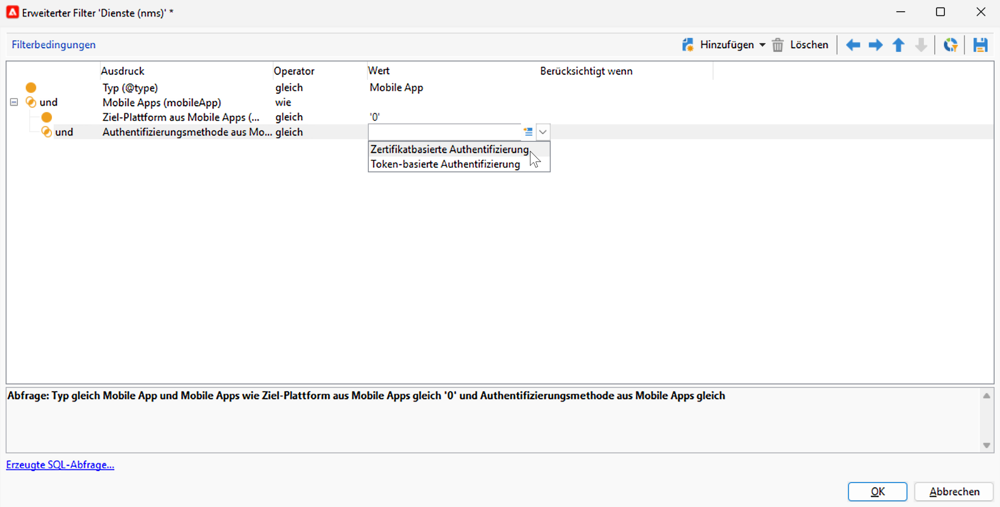
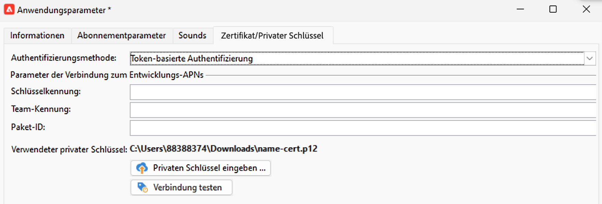

# Änderungen am Push-Benachrichtigungskanal {#push-upgrade}

Sie können Campaign verwenden, um Push-Benachrichtigungen an Android- und iOS-Geräte zu senden. Dazu benötigt Campaign Anmeldedienste für Mobile Apps.

Einige wichtige Änderungen am Android Firebase Cloud Messaging(FCM)-Dienst werden 2024 veröffentlicht und können sich auf Ihre Implementierung von Adobe Campaign auswirken. Ihre Konfiguration der Anmeldedienste für Android-Push-Nachrichten muss möglicherweise aktualisiert werden, um diese Änderung zu unterstützen.

Darüber hinaus empfiehlt Adobe dringend, zur Token-basierten anstatt einer zertifikatbasierten Verbindung zu APNs zu migrieren, weil sie sicherer und skalierbarer ist.

## Google Android Firebase Cloud Messaging (FCM)-Dienst {#fcm-push-upgrade}

### Was hat sich verändert? {#fcm-changes}

Im Rahmen der kontinuierlichen Bemühungen von Google, seine Dienste zu verbessern, werden die veralteten FCM-APIs am **22. Juli 2024** eingestellt. Weitere Informationen zum HTTP-Protokoll von Firebase Cloud Messaging finden Sie in der [Google Firebase-Dokumentation](https://firebase.google.com/docs/cloud-messaging/migrate-v1){target="_blank"}.

Adobe Campaign Classic v7 und Adobe Campaign v8 unterstützen bereits die neuesten APIs zum Senden von Push-Benachrichtigungen. Einige alte Implementierungen sind jedoch weiterhin auf die alten APIs angewiesen. Diese Implementierungen müssen aktualisiert werden.

### Sind Sie betroffen? {#fcm-impact}

Wenn Ihre aktuelle Implementierung Anmeldedienste unterstützt, die über die veralteten APIs eine Verbindung zu FCM herstellen, sind Sie betroffen. Die Migration zu den neuesten APIs ist obligatorisch, um Dienstunterbrechungen zu vermeiden. In diesem Fall werden Adobe-Teams Kontakt mit Ihnen aufnehmen.

Um zu überprüfen, ob Sie betroffen sind, können Sie Ihre **Dienste und Abonnements** mit dem untenstehenden Filter filtern:


* Wenn einer Ihrer aktiven Push-Benachrichtigungsdienste die **(veraltete) HTTP-API** verwendet, ist Ihr Setup direkt von dieser Änderung betroffen. Sie müssen Ihre aktuellen Konfigurationen überprüfen und zu den neueren APIs migrieren, wie unten beschrieben.

* Wenn Ihr Setup ausschließlich die **HTTP-v1**-API für Android-Push-Benachrichtigungen verwendet, sind Sie bereits konform und es sind keine weiteren Maßnahmen Ihrerseits erforderlich.

### Wie erfolgt die Aktualisierung? {#fcm-transition-procedure}

#### Voraussetzungen {#fcm-transition-prerequisites}

* Für Campaign Classic v7 wurde die Unterstützung von HTTP v1 in Version 20.3.1 hinzugefügt. Wenn Ihre Umgebung auf einer älteren Version ausgeführt wird, besteht eine Voraussetzung für die Migration zu HTTP v1 darin, Ihre Umgebung auf den [neuesten Campaign Classic-Build](https://experienceleague.adobe.com/docs/campaign-classic/using/release-notes/latest-release.html?lang=de){target="_blank"} zu aktualisieren. Bei Campaign v8 wird HTTP v1 von allen Versionen unterstützt und es ist keine Aktualisierung erforderlich.

* Die JSON-Datei des Kontos des Firebase Admin SDK-Dienstes ist erforderlich, damit die Mobile App auf HTTP v1 verschoben wird. In der [Dokumentation zu Google Firebase](https://firebase.google.com/docs/admin/setup#initialize-sdk){target="_blank"} erfahren Sie, wie Sie diese Datei erhalten.

* Bei hybriden, gehosteten und Managed Services-Bereitstellungen wenden Sie sich zusätzlich zum unten beschriebenen Migrationsverfahren an Adobe, um Ihren Echtzeit(RT)-Ausführungs-Server zu aktualisieren. Der Mid-Sourcing-Server ist nicht betroffen.

* On-Premise-Benutzende von Campaign Classic v7 wie Sie müssen sowohl die Marketing- als auch die Echtzeit-Ausführungs-Server aktualisieren. Der Mid-Sourcing-Server ist nicht betroffen.

* Überprüfen Sie als On-Premise- oder Hybrid-Benutzer von Campaign Classic v7, ob Ihr externes Android-Routing-Konto mit `androidPushConnectorV2.js` konfiguriert ist. [Weitere Informationen](https://experienceleague.adobe.com/de/docs/campaign-classic/using/sending-messages/sending-push-notifications/configure-the-mobile-app/configuring-the-mobile-application-android#configuring-external-account-android)

#### Migrationsverfahren {#fcm-transition-steps}

Befolgen Sie die folgenden Schritte, um Ihre Umgebung zu HTTP v1 zu migrieren:

1. Navigieren Sie zu Ihrer Liste von **Diensten und Abonnements**.
1. Listen Sie alle Mobile Apps auf, die die **(veraltete) HTTP-API-Version** verwenden.
1. Legen Sie für jede dieser Mobile Apps die **API-Version** auf **HTTP v1** fest.
1. Klicken Sie auf den Link **[!UICONTROL Projekt-JSON-Datei zum Extrahieren der Projektdetails laden…]**, um Ihre JSON-Schlüsseldatei direkt zu laden.

   Sie können auch die folgenden Details manuell eingeben:

   * **[!UICONTROL Projektkennung]**
   * **[!UICONTROL Privater Schlüssel]**
   * **[!UICONTROL Client-E-Mail]**

   

1. Klicken Sie auf **[!UICONTROL Verbindung testen]**, um zu prüfen, ob Ihre Konfiguration korrekt ist und ob der Marketing-Server Zugriff auf den FCM-Server hat. Beachten Sie bei Mid-Sourcing-Bereitstellungen, dass die Schaltfläche **[!UICONTROL Verbindung testen]** nicht überprüfen kann, ob der Server Zugriff auf den Android Firebase Cloud Messaging(FCM)-Dienst hat.
1. Bei Bedarf können Sie die Inhalte von Push-Nachrichten mit bestimmten **[!UICONTROL Anwendungsvariablen]** anreichern. Diese sind vollständig anpassbar; ein Teil der Payload der Nachricht wird an das Mobilgerät gesendet.
1. Klicken Sie auf **[!UICONTROL Beenden]** und danach auf **[!UICONTROL Speichern]**.

   Im Folgenden finden Sie die FCM-Payload-Namen, mit denen Sie Ihre Push-Benachrichtigung weiter personalisieren können. Diese Optionen werden [hier](#fcm-apps) im Detail beschrieben.

   | Nachrichtentyp | Konfigurierbares Nachrichtenelement (FCM-Payload-Name) | Konfigurierbare Optionen (Name der FCM-Payload) |
   |:-:|:-:|:-:|
   | Datennachricht | K. A. | validate_only |
   | Benachrichtigungsinhalt | title, body, android_channel_id, icon, sound, tag, color, click_action, image, ticker, sticky, visibility, notification_priority, notification_count <br> | validate_only |


>[!NOTE]
>
>Sobald diese Änderungen auf Ihren gesamten Server angewendet werden, verwenden alle **neuen** Push-Benachrichtigungsversand an Android-Geräte die HTTP v1-API. Vorhandene Push-Sendungen, die wiederholt, in Bearbeitung und in Verwendung sind, verwenden weiterhin die HTTP-API (frühere Version). Erfahren Sie im folgenden Abschnitt, wie Sie sie aktualisieren können.

### Vorhandene Vorlagen aktualisieren {#fcm-transition-update}

Nach der Migration zu HTTP v1 müssen Sie Ihre **Versandvorlagen** für Android-Push-Benachrichtigungen aktualisieren, um die Anzahl der Batch-Nachrichten zu erhöhen. Öffnen Sie zu diesem Zweck die Eigenschaften Ihrer Android-Versandvorlage und legen Sie auf der Registerkarte **Versand** für die Einstellung [ Kontingentgröße](../../v8/send/configure-and-send.md#delivery-batch-quantity) den Wert **256** fest. Wenden Sie diese Änderung auf alle Versandvorlagen an, die für Ihre Android-Sendungen verwendet werden, sowie auf alle vorhandenen Android-Sendungen.

Sie können auch vorhandene Sendungen und Versandvorlagen aktualisieren, die vor dem Upgrade auf eine Version erstellt wurden, die HTTP v1 unterstützt. Um dies durchzuführen:

* Wenden Sie sich als verwaltete Cloud Service oder gehosteter Kunde an Adobe, um Ihre bestehenden Android-Versandvorlagen zu aktualisieren.

* Laden Sie für On-Premise-Umgebungen das Skript `fcm-httpv1-migration.js` herunter und führen Sie es wie unten beschrieben aus.

  Laden Sie [fcm-httpv1-migration.js](assets/do-not-localize/fcm-httpv1-migration.js) herunter.

  >[!CAUTION]
  >
  >Das Skript muss in Ihren Marketing-, Mid-Sourcing- und Echtzeit-Umgebungen ausgeführt werden.


  +++ Schritte zum Aktualisieren vorhandener Sendungen und Vorlagen

  Gehen Sie wie folgt vor, um alle Sendungen und Versandvorlagen zu patchen, die vor dem Upgrade auf eine Version erstellt wurden, die HTTP v1 unterstützt:

   1. Exportieren Sie Ihre bestehenden Sendungen und Versandvorlagen in ein Package, um sie im Falle eines unerwarteten Problems beim Patchen wiederherzustellen.
   1. Führen Sie den folgenden Befehl in Posgresql aus:

      ```sql
      pg_dump -Fp -f /sftp/<db_name>-nmsdelivery-before_rd_script.sql -t nmsdelivery -d <db_name>
      ```

   1. Standardmäßig befindet sich das Skript im Modus `dryrun` . Sie können es in diesem Modus starten, um zu überprüfen, ob ein Versand gepatcht werden muss.

      Befehl

      ```sql
      nlserver javascript -instance:<instance_name> -file fcm-httpv1-migration.js 
      ```

      Ausgabe

      ```sql
      ...
      HH:MM:SS >   Processing delivery (id:123456,  label:'Deliver on Android - New', name:'DM1234')
      HH:MM:SS >   Dry run: Would update androidCheckParams for delivery (id:123456,  label:'Deliver on Android - New', name:'DM1234')
      HH:MM:SS >   Processing delivery (id:567890,  label:'Deliver on Android - New', name:'DM5678')
      HH:MM:SS >   Dry run: Would update androidCheckParams for delivery (id:567890,  label:'Deliver on Android - New', name:'DM5678')
      ...
      HH:MM:SS >   Summary (XYZ processed deliverie(s) or delivery template(s)):
      HH:MM:SS >>  - X had not patchable androidCheckParams formula!
      HH:MM:SS >   - Y had androidCheckParams formula patched.
      HH:MM:SS >   - Z ignored as alreading having androidCheckParams formula patched.
      ```

      >[!NOTE]
      >
      >Die `not patchable` Sendungen müssen manuell aktualisiert werden. Ihre Kennung finden Sie im Protokoll.

   1. Führen Sie das Skript im Ausführungsmodus wie folgt aus, um Sendungen zu aktualisieren:

      ```sql
      nlserver javascript -instance:<instance_name> -file fcm-httpv1-migration.js -arg:run
      ```

+++

### Wie wirkt sich dies auf meine Android-Apps aus? {#fcm-apps}

Es sind keine spezifischen Änderungen am Code der Android Mobile Apps erforderlich, und das Benachrichtigungsverhalten sollte sich nicht ändern.

Mit HTTP v1 können Sie jedoch Ihre Push-Benachrichtigung mit **[!UICONTROL zusätzlichen Optionen für HTTPV1]** weiter personalisieren.


Sie haben folgende Möglichkeiten:

* Verwenden Sie das Feld **[!UICONTROL Ticker]**, um den Ticker-Text Ihrer Benachrichtigung festzulegen.
* Verwenden Sie das Feld **[!UICONTROL Bild]**, um die URL des Bildes festzulegen, das in Ihrer Benachrichtigung angezeigt werden soll.
* Verwenden Sie das Feld **[!UICONTROL Anzahl der Benachrichtigungen]**, um festzulegen, dass die Zahl der neuen, ungelesenen Informationen direkt auf dem App-Symbol angezeigt werden soll.
* Setzen Sie die Option **[!UICONTROL Sticky]** auf „false“, damit die Benachrichtigung automatisch verworfen wird, wenn die Benutzenden darauf klicken. Bei der Einstellung „true“ wird die Benachrichtigung weiter angezeigt, auch wenn die Benutzenden darauf klicken.
* Setzen Sie die **[!UICONTROL Benachrichtigungsprioritätsstufe]** Ihrer Benachrichtigung auf Standard, Minimum, niedrig oder hoch.
* Setzen Sie die **[!UICONTROL Sichtbarkeitsstufe]** Ihrer Benachrichtigung auf öffentlich, privat oder geheim.

Weitere Informationen zu den **[!UICONTROL zusätzlichen HTTP v1-Optionen]** und dazu, wie diese Felder auszufüllen sind, finden Sie in der [FCM-Dokumentation](https://firebase.google.com/docs/reference/fcm/rest/v1/projects.messages#androidnotification){target="_blank"}.


## Apple iOS-Push-Benachrichtigungsdienst (APNs) {#apns-push-upgrade}

### Was hat sich verändert? {#ios-changes}

Wie von Apple empfohlen, sollten Sie Ihre Kommunikation mit dem Apple-Push-Benachrichtigungsdienst (APNs) mithilfe von Stateless-Authentifizierungs-Token sichern.

Token-basierte Authentifizierung bietet eine Möglichkeit der Stateless-Kommunikation mit dem APNs. Stateless-Kommunikation ist schneller als zertifikatbasierte Kommunikation, da hier der APNs nicht das Zertifikat oder andere Informationen zu Ihrem Anbieter-Server nachschlagen muss. Die Verwendung der Token-basierten Authentifizierung bietet noch weitere Vorteile:

* Sie können dasselbe Token von mehreren Anbieter-Servern verwenden.

* Mit einem einzelnen Token können Sie Benachrichtigungen für alle Apps Ihres Unternehmens verteilen.

Erfahren Sie mehr über Token-basierte Verbindungen zum APNs im [Apple-Entwickler-Handbuch](https://developer.apple.com/documentation/usernotifications/establishing-a-token-based-connection-to-apns){target="_blank"}.

Adobe Campaign Classic v7 und Adobe Campaign v8 unterstützen sowohl Token-basierte als auch zertifikatbasierte Verbindungen. Wenn Ihre Implementierung auf einer zertifikatbasierten Verbindung basiert, empfiehlt Adobe dringend, sie durch eine Token-basierte Verbindung zu ersetzen.

### Sind Sie betroffen? {#ios-impact}

Wenn Ihre aktuelle Implementierung für die Verbindung mit dem APNs auf zertifikatbasierten Anfragen basiert, sind Sie betroffen. Die Migration zu einer Token-basierten Verbindung wird empfohlen.

Um zu überprüfen, ob Sie betroffen sind, können Sie Ihre **Dienste und Abonnements** mit dem untenstehenden Filter filtern:




* Wenn einer Ihrer aktiven Push-Benachrichtigungsdienste den Modus **Zertifikatbasierte Authentifizierung** (.p12) nutzt, sollten Ihre aktuellen Implementierungen überprüft und zum Modus der **Token-basierten Authentifizierung** (.p8) migriert werden, wie unten beschrieben.

* Wenn Ihr Setup ausschließlich den Modus **Token-basierte Authentifizierung** für iOS-Push-Benachrichtigungen verwendet, ist Ihre Implementierung bereits aktuell und es sind keine weiteren Maßnahmen Ihrerseits erforderlich.

### Wie erfolgt die Aktualisierung? {#ios-transition-procedure}

#### Voraussetzungen {#ios-transition-prerequisites}

* Für Campaign Classic v7 wurde die Unterstützung des Modus **Token-basierte Authentifizierung** in Version 20.2 hinzugefügt. Wenn Ihre Umgebung auf einer älteren Version ausgeführt wird, besteht eine Voraussetzung für diese Änderung darin, Ihre Umgebung auf den [neuesten Campaign Classic-Build](https://experienceleague.adobe.com/docs/campaign-classic/using/release-notes/latest-release.html?lang=de){target="_blank"} zu aktualisieren. Bei Campaign v8 wird die **Token-basierte Authentifizierung** in allen Versionen unterstützt und es ist keine Aktualisierung erforderlich.

* Sie benötigen einen Signierschlüssel für die APNs-Authentifizierungs-Token, um die Token zu erzeugen, die Ihr Server verwendet. Sie fordern diesen Schlüssel über Ihr Apple-Entwicklerkonto an, wie im [Apple-Entwickler-Handbuch](https://developer.apple.com/documentation/usernotifications/establishing-a-token-based-connection-to-apns){target="_blank"} beschrieben.

* Bei hybriden, gehosteten und Managed Services-Bereitstellungen wenden Sie sich zusätzlich zum unten beschriebenen Migrationsverfahren an Adobe, um Ihren Echtzeit(RT)-Ausführungs-Server zu aktualisieren. Der Mid-Sourcing-Server ist nicht betroffen.

* On-Premise-Benutzende von Campaign Classic v7 wie Sie müssen sowohl die Marketing- als auch die Echtzeit-Ausführungs-Server aktualisieren. Der Mid-Sourcing-Server ist nicht betroffen.

#### Migrationsverfahren {#ios-transition-steps}

Gehen Sie wie folgt vor, um Ihre mobilen iOS-Apps zum Token-basierten Authentifizierungsmodus zu migrieren:

1. Navigieren Sie zu Ihrer Liste von **Diensten und Abonnements**.
1. Listen Sie alle Mobile Apps auf, die den Modus **zertifikatbasierte Authentifizierung** (.p12) nutzen.
1. Bearbeiten Sie jede dieser Mobile Apps und navigieren Sie zur Registerkarte **Zertifikat/privater Schlüssel**.
1. Wählen Sie in der Dropdown-Liste **Authentifizierungsmodus** den Modus **Token-basierte Authentifizierung** (.p8).
1. Tragen Sie die APN-Verbindungsparameter **[!UICONTROL Schlüsselkennung]**, **[!UICONTROL Team-Kennung]** und **[!UICONTROL Paket-ID]** ein und wählen Sie dann Ihr p8-Zertifikat, indem Sie auf **[!UICONTROL Privaten Schlüssel eingeben…]** klicken.

   

1. Klicken Sie auf **[!UICONTROL Verbindung testen]**, um zu prüfen, ob Ihre Konfiguration korrekt ist und ob der Marketing-Server Zugriff auf APNs hat. Beachten Sie, dass die Schaltfläche **[!UICONTROL Verbindung testen]** bei Mid-Sourcing-Bereitstellungen nicht überprüfen kann, ob der Server Zugriff auf APNs hat.
1. Nun können Sie die Produktionsanwendung konfigurieren, indem Sie auf **[!UICONTROL Weiter]** klicken und nach dem gleichen Verfahren wie oben beschrieben vorgehen.
1. Klicken Sie auf **[!UICONTROL Beenden]** und danach auf **[!UICONTROL Speichern]**.

Ihre iOS-Anwendung wird jetzt zum Token-basierten Authentifizierungsmodus migriert.
