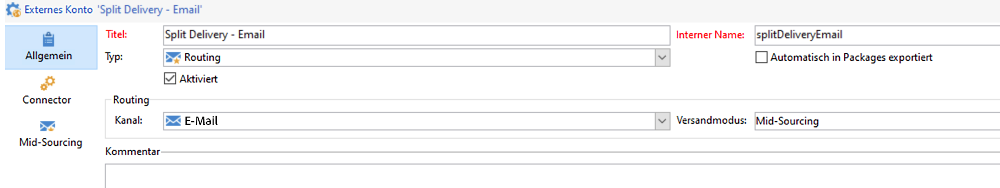
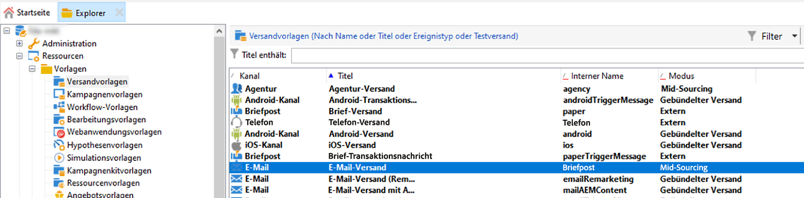
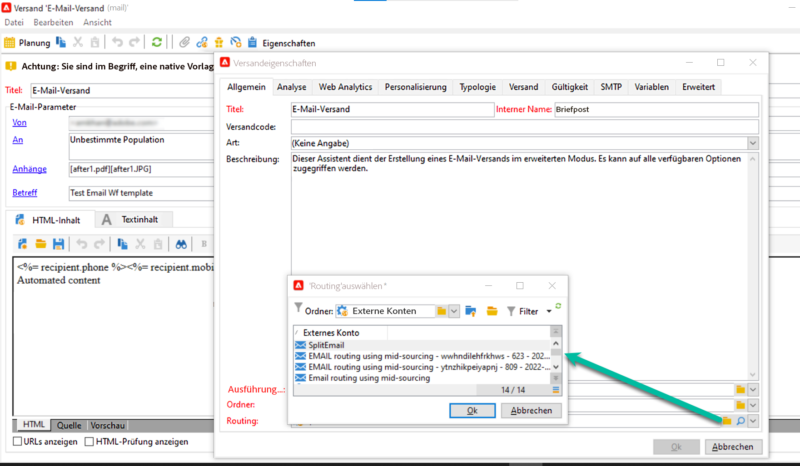
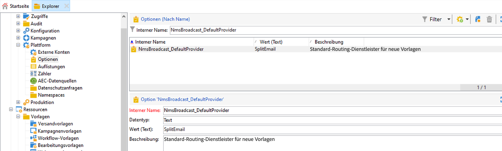

# Erste Schritte mit der Campaign-Architektur{#gs-ac-archi}

## Umgebungen {#environments}

Campaign wird in Form einzelner Instanzen bereitgestellt, wobei jede Instanz eine komplette Campaign-Umgebung darstellt.

Es stehen zwei Arten von Umgebungen zur Verfügung:

* **Produktionsumgebung**: hostet die Programme für die diversen Fachleute.

* **Staging-Umgebung**: wird für verschiedene Leistungs- und Qualitätstests verwendet, bevor Änderungen am Programm in die Produktionsumgebung übertragen werden.

Sie können Packages von einer Umgebung in eine andere exportieren und importieren.

 Weitere Informationen über Packages in der [Dokumentation zu Campaign Classic v7](https://experienceleague.adobe.com/docs/campaign-classic/using/getting-started/administration-basics/working-with-data-packages.html?lang=de){target="_blank"}

## Implementierungsmodelle{#ac-deployment}

Es stehen zwei Implementierungsmodelle zur Verfügung:

* **Campaign FDA [!DNL Snowflake]-Implementierung**

   In seiner [[!DNL Snowflake]  FDA-Implementierung](fda-deployment.md) ist [!DNL Adobe Campaign] v8 zwecks Datenzugriff über die Federated Data Access-Funktion mit [!DNL Snowflake] verbunden: Sie können auf externe Daten und Informationen, die in Ihrer [!DNL Snowflake]-Datenbank gespeichert sind, zugreifen und diese verarbeiten, ohne die Datenstruktur in Adobe Campaign ändern zu müssen. PostgreSQL ist die primäre Datenbank und Snowflake ist die sekundäre Datenbank. Sie können Ihr Datenmodell erweitern und Ihre Daten in Snowflake speichern. Anschließend können Sie ETL, Segmentierung und Berichte für einen großen Datensatz ausführen und hervorragende Leistung erzielen.

* **Implementierung von Campaign Enterprise (FFDA)**

   Im Kontext einer [Enterprise (FFDA)-Implementierung](enterprise-deployment.md) kann [!DNL Adobe Campaign] v8 mit zwei Datenbanken verwendet werden: einer lokalen [!DNL Campaign]-Datenbank für Echtzeit-Messaging und Einzelabfragen über die Benutzeroberfläche und das Schreiben über APIs sowie einer Cloud-[!DNL Snowflake]-Datenbank für die Kampagnenausführung, für Batch-Abfragen und für die Workflow-Ausführung.

   Campaign v8 Enterprise bietet das Konzept des **Full Federated Data Access** (FFDA): Alle Daten befinden sich nun entfernt in der Cloud-Datenbank. Mit dieser neuen Architektur vereinfacht die Campaign v8 Enterprise (FFDA)-Implementierung die Datenverwaltung: Es wird kein Index in der Cloud-Datenbank benötigt. Sie müssen nur die Tabellen erstellen, die Daten kopieren und schon können Sie loslegen. Die Cloud-Datenbanktechnologie erfordert keine spezielle Wartung für eine garantierte Performance.

## Aufspaltung der Versandausführung {#split}

>[!AVAILABILITY]
>
>Diese Funktion ist nur für Kunden mit mehreren MID-Instanzkonfigurationen verfügbar.

Je nach Campaign v8-Package verfügen Sie über eine bestimmte Anzahl von Mid-Sourcing-Instanzen, die für die Durchführung von Sendungen zuständig sind.

Standardmäßig verwenden die externen Konten für alle Kanäle eine **[!UICONTROL Alternative]** Routing-Modus, d. h., dass jeweils ein Versand von jeder Mid-Instanz einzeln abwechselnd gesendet wird.

Um eine schnellere und skalierbarere Leistung zu gewährleisten, können Sie zulassen, dass Sendungen automatisch über Mid-Sourcing-Instanzen verteilt werden, damit sie schneller an die Empfänger gesendet werden. Dieser Vorgang ist transparent, wenn der Versand von der Marketinginstanz aus ausgeführt wird: Nachdem der Versand durchgeführt wurde, werden alle Logs zusammengeführt, bevor sie an die Marketing-Instanz in einem einzigen Versandobjekt zurückgesendet werden.

Dazu benötigen Sie zusätzliche externe Konten mit dem **[!UICONTROL Aufspaltung]** Der Routing-Modus wird bei der Bereitstellung für jeden Kanal erstellt:

* Aufspaltung Versand - E-Mail (splitDeliveryEmail)
* Aufspaltung Versand - SMS (splitDeliverySMS)
* Aufspaltung Versand - iOS (splitDeliveryIOS)
* Aufspaltung - Android (splitDeliveryAndroid)

>[!IMPORTANT]
>
>Der Aufspaltungs-Routing-Modus ist standardmäßig für das Konto &quot;Aufspaltung - E-Mail&quot;aktiviert. Wenden Sie sich bei allen anderen Kanälen an die Kundenunterstützung, damit die Option aktiviert wird.
>
>Standardmäßig beträgt der Schwellenwert für die Schwelle zur Aufteilung eines Versands auf mehrere Mid 100.000. Sie können diesen Wert in der Option &quot;NmsDelivery_MultiMidSplitThreshold&quot;im **[!UICONTROL Administration]** / **[!UICONTROL Plattform]** / **[!UICONTROL Optionen]** Menü.

Um externe Konten als Standardkonto für den Versand aufzuteilen, müssen Sie den Routing-Provider in Ihren Versandvorlagen ändern. Gehen Sie dazu wie folgt vor:

1. Navigieren Sie zum **[!UICONTROL Ressourcen]** / **[!UICONTROL Vorlagen]** / **[!UICONTROL Versandvorlagen]** und öffnen Sie die gewünschte Versandvorlage. In diesem Beispiel möchten wir die E-Mail-Versandvorlage bearbeiten.

   

1. Klicken Sie auf **[!UICONTROL Eigenschaften]** und ändern Sie den Routing-Provider in das entsprechende externe Split-Versand-Konto.

   

1. Speichern Sie Ihre Änderungen. Alle mit der Vorlage gesendeten Sendungen verwenden jetzt standardmäßig den Aufspaltungs-Routing-Modus.

<!--In addition, you can select split external accounts as the default routing provider for all future delivery templates. To do this, change the value of the **[!UICONTROL xtkoption NmsBroadcast_DefaultProvider]** option to the name of the split account.

 -->

## Message Center-Architektur{#transac-msg-archi}

Das Campaign-Modul &quot;Transaktionsnachricht (Message Center)&quot; wurde zum Verwalten von Trigger-Nachrichten entwickelt.

 In [diesem Abschnitt](../send/transactional.md) erfahren Sie, wie Sie Transaktionsnachrichten senden können.

Als Reaktion auf eine Kundenaktion auf einer Website wird ein Ereignis über eine REST-API gesendet. Die Nachrichtenvorlage wird mit den Informationen oder Daten gefüllt, die über den API-Aufruf bereitgestellt werden, und eine Transaktionsnachricht wird in Echtzeit an den Kunden gesendet. Diese Nachrichten können einzeln oder in Batches per E-Mail, SMS oder Push-Benachrichtigungen gesendet werden.

In der hier angewendeten Architektur sind Ausführungszelle und Kontrollinstanz voneinander getrennt, was höhere Verfügbarkeit und besseres Last-Management gewährleistet.

* Die **Kontrollinstanz** (oder die Marketing-Instanz) wird von Marketing-Experten und IT-Teams zum Erstellen, Konfigurieren und Veröffentlichen von Nachrichtenvorlagen verwendet. Diese Instanz zentralisiert auch die Überwachung und den Verlauf von Ereignissen.

    Erfahren Sie in [diesem Abschnitt](../send/transactional.md), wie Sie Nachrichtenvorlagen erstellen und veröffentlichen.

* Die **Ausführungsinstanz** ruft eingehende Ereignisse (z. B. Passwortrücksetzung oder Bestellungen von einer Website) ab und versendet personalisierte Nachrichten. Es kann mehr als eine Ausführungsinstanz geben, um Nachrichten über den Load-Balancer zu verarbeiten und die Anzahl der zu verarbeitenden Ereignisse zwecks maximaler Verfügbarkeit zu skalieren.

>[!CAUTION]
>
>Die Kontroll- und die Ausführungsinstanz(en) müssen auf unterschiedlichen Computern installiert werden. Sie können aber nicht auf derselben Campaign-Instanz ausgeführt werden.

### Authentifizierung

Um diese Funktionen zu nutzen, können Benutzer von Adobe Campaign in der Kontrollinstanz Vorlagen für Transaktionsnachrichten erstellen, eine Nachrichtenvorschau mithilfe einer Testadresse erzeugen, Berichte anzeigen und Ausführungsinstanzen überwachen.

* Einzelne Ausführungsinstanz
Bei der Interaktion mit einer gehosteten Message Center-Ausführungsinstanz kann ein externes System zunächst ein Sitzungs-Token abrufen (das standardmäßig nach 24 Stunden abläuft), indem ein API-Aufruf an die Sitzungs-Anmeldemethode unter Verwendung eines bereitgestellten Kontoanmeldenamens und eines Passworts erfolgt.
Dann kann die externe Anwendung mit dem von der Ausführungsinstanz als Antwort auf den obigen Aufruf bereitgestellten Sitzungs-Token SOAP-API-Aufrufe (rtEvents oder batchEvents) ausführen, um Nachrichten zu senden, ohne dass in jedem SOAP-Aufruf der Kontoanmeldename und das Passwort enthalten sein müssen.

* Mehrere Ausführungsinstanzen
In einer mehrzelligen Ausführungsarchitektur mit mehreren Ausführungsinstanzen hinter einem Load-Balancer durchläuft die vom externen Programm aufgerufene Anmeldemethode den Load-Balancer: Aus diesem Grund kann keine Token-basierte Authentifizierung verwendet werden. Eine Benutzer-/Passwortbasierte Authentifizierung ist erforderlich.

 Weitere Informationen über Transaktionsnachrichten-Ereignisse in der [Dokumentation zu Campaign Classic v7](https://experienceleague.adobe.com/docs/campaign-classic/using/transactional-messaging/processing/event-description.html?lang=de#about-transactional-messaging-datamodel){target="_blank"}
