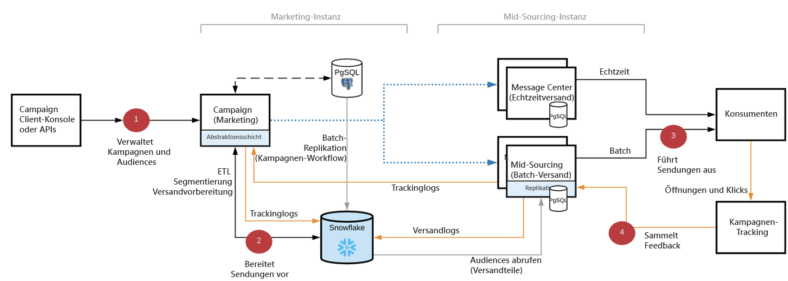

# [!DNL Campaign] FFDA-Implementierung{#gs-ac-ffda}

Durch die Nutzung von [[!DNL Snowflake]](https://www.snowflake.com/), einer Cloud-Datenbanktechnologie, wird die Skalierbarkeit und Geschwindigkeit der FFDA-Implementierung von Adobe Campaign Enterprise erheblich verbessert. So kann eine größere Anzahl von Kundenprofilen verwaltet werden und es werden deutlich höhere Versandraten und mehr Transaktionen pro Stunde erreicht.

## Vorteile {#ffda-benefits}

Campaign v8 Enterprise (FFDA) bietet eine End-to-End-Skalierung bei jedem Schritt des Prozesses, von der Zielgruppenbestimmung bis zum abschließenden Reporting:

* Skalieren Sie die Datenmenge, die Sie verarbeiten können (bis 8 TB)
* Skalieren Sie die Leistung von Abfragen für Segmentierung und Zielgruppenbestimmung, aber auch für Datenaufnahme und -abgabe
* Skalieren der Sendungsvorbereitung (von Stunden auf Minuten)

Dies ist eine grundlegende Änderung der Software-Architektur. Die Daten sind jetzt remote und Campaign führt die gesamten Daten, einschließlich Profilen, zusammen. Die [!DNL Campaign]-Prozesse skalieren jetzt durchgängig, vom Targeting bis zur Ausführung der Nachricht: Datenaufnahme, Segmentierung, Zielgruppenbestimmung, Abfragen und Sendungen laufen jetzt typischerweise in Minuten ab. Diese neue Version löst die ganze Herausforderung der Skalierung und bewahrt dabei den gleichen Grad an Flexibilität und Erweiterbarkeit. Die Anzahl der Profile ist nahezu unbegrenzt, und die Datenspeicherung kann verlängert werden.

Die Cloud-Datenspeicherung wird in **[!DNL Snowflake]** ausgeführt: Ein neues vorkonfiguriertes **externes Konto** stellt die Verbindung zur Cloud-Datenbank sicher. Das Konto wird von Adobe eingerichtet und darf nicht geändert werden. [Weitere Informationen](../config/external-accounts.md)

Jedes integrierte Schema (bzw. Tabelle), das in die Cloud-Datenbank verschoben oder repliziert werden muss, verfügt unter dem **xxl**-Namespace über eine integrierte Schemaerweiterung. Diese Erweiterungen enthalten alle Änderungen, die erforderlich sind, um eingebaute Schemata von der lokalen [!DNL Campaign]-Datenbank in die [!DNL Snowflake]-Cloud-Datenbank zu verschieben und ihre Struktur entsprechend anzupassen: neue UUID, aktualisierte Links usw.

>[!CAUTION]
>
> Kundendaten werden nicht in der lokalen [!DNL Campaign]-Datenbank gespeichert. Daher müssen benutzerdefinierte Tabellen in der Cloud-Datenbank erstellt werden.

## Architektur von Campaign Enterprise (FFDA){#ffda-archi}

In einer [Enterprise (FFDA)-Implementierung](../architecture/enterprise-deployment.md) kann [!DNL Adobe Campaign] v8 mit zwei Datenbanken verwendet werden: einer lokalen [!DNL Campaign]-Datenbank für Echtzeit-Messaging und Einzelabfragen und das Schreiben über APIs sowie einer Cloud-[!DNL Snowflake]-Datenbank für die Kampagnenausführung, für Batch-Abfragen und die Workflow-Ausführung.

Campaign v8 Enterprise bietet das Konzept des **Full Federated Data Access** (FFDA): Alle Daten befinden sich nun entfernt in der Cloud-Datenbank.

Für die Verwaltung von Daten zwischen der lokalen und der Cloud-Datenbank stehen spezifische APIs zur Verfügung. Erfahren Sie auf [dieser Seite](new-apis.md), wie diese neuen APIs funktionieren und wie Sie sie verwenden können.

Die allgemeine Kommunikation zwischen Servern und Prozessen erfolgt gemäß dem folgenden Schema:

* Die Ausführungs- und Bounce-Management-Module sind in der Instanz deaktiviert.
* Das Programm ist so konfiguriert, dass Nachrichten auf einem entfernten &quot;Mid-Sourced&quot;-Server ausgeführt werden, der über SOAP-Aufrufe (über HTTP oder HTTPS) gesteuert wird.

Die [!DNL Snowflake]-Datenbank auf Marketing-Seite wird verwendet, um:

* Alle Kundendaten zu speichern: Profile, kundenspezifische Daten wie Transaktionen, Produkte, Standorte usw.
* Alle Ereignisse und Verhaltensdaten, die von Campaign generiert oder gesammelt werden, zu speichern, z. B. Versandlogs, Trackinglogs, Push-Registrierungen usw.
* Alle Datenaggregate der oben Genannten zu speichern.
* Eine Kopie (h+1) von Referenztabellen (wie Sendungen, Auflistungen, Länder usw.), die in Workflows, Kampagnen und Berichten verwendet werden, zu speichern.
* Alle Batch-Prozesse und -Workflows auszuführen.

Die PostgreSQL-Datenbank in der Marketing-Instanz wird verwendet, um:

* Bestimmte Workloads auszuführen, z. B. APIs mit geringem Volumen.
* Alle Campaign-Daten zu speichern, einschließlich Versand- und Kampagneneinstellungen, Workflow- und Service-Definitionen.
* Alle integrierten Referenztabellen (Auflistungen, Länder usw.) zu speichern, die nach [!DNL Snowflake] repliziert werden.

   Folgendes können Sie jedoch nicht tun:
   * Anpassungen für Kundendaten erstellen, z. B. keine Haushaltstabelle in PostgreSQL erstellen, sondern nur in Snowflake.
   * Versandlogs, Trackinglogs usw. in der FFDA-Zielgruppendimension speichern.
   * Große Datenmengen speichern.

Die PostgreSQL-Datenbank in der Mid-Sourcing-Instanz wird verwendet, um:

* Batch- und Echtzeitsendungen auszuführen.
* Versand- und Trackinglogs zu senden. Beachten Sie, dass Bereitstellungs- und Trackinglog-IDs UUIDs und keine 32-Bit-IDs sind.
* Tracking-Daten zu erfassen und zu speichern.

## Auswirkungen{#ffda-impacts}

### [!DNL Campaign]-API-Staging-Mechanismus{#staging-api}

In der [!DNL Campaign]-Cloud-Datenbank werden gebündelte Einzelabfragen aufgrund von Leistungseinbußen (Latenz und gleichzeitige Nutzung) nicht empfohlen. Batch-Vorgänge sind daher vorzuziehen. Um eine optimale Leistung der APIs zu gewährleisten, verarbeitet Campaign API-Aufrufe weiterhin auf lokaler Datenbankebene.

 [Der API-Staging-Mechanismus wird auf dieser Seite beschrieben.](staging.md)

### Neue APIs{#new-apis}

Für die Verwaltung der Datensynchronisation zwischen der lokalen [!DNL Campaign]-Datenbank und der Cloud-Datenbank stehen neue APIs zur Verfügung. Außerdem wurde ein neuer Mechanismus zur Verarbeitung von API-Aufrufen auf lokaler Datenbankebene eingeführt, um Latenzzeiten zu minimieren und die Gesamtleistung zu erhöhen.

 [Neue APIs werden auf dieser Seite beschrieben.](new-apis.md)

### Datenreplikation{#data-replication}

Ein spezieller technischer Workflow behandelt die Replikation von Tabellen, die auf beiden Seiten vorhanden sein müssen (lokale Campaign-Datenbank und Cloud-Datenbank). Dieser Workflow wird stündlich ausgelöst und basiert auf einer neuen integrierten JavaScript-Bibliothek.

>[!NOTE]
>
> Es wurden mehrere Replikationsrichtlinien erstellt, die auf der Größe der Tabelle basieren (XS, XL usw.).
> Einige Tabellen werden in Echtzeit repliziert, andere werden stündlich repliziert. Einige Tabellen werden inkrementelle Aktualisierungen aufweisen, andere werden eine vollständige Aktualisierung durchlaufen.

[Weitere Informationen zur Datenreplikation](replication.md)

### ID-Management{#id-mgt-ffda}

Campaign v8-Objekte verwenden jetzt eine **Universally Unique ID (UUID)**, die die Identifizierung von Daten durch unbegrenzte eindeutige Werte ermöglicht..

Beachten Sie, dass diese Kennung zeichenfolgenbasiert und nicht sequenziell ist. In Campaign v8 ist der Primärschlüssel kein numerischer Wert. In Ihren Schemata müssen Sie die Attribute **autouid** und **autopk** verwenden.

In Campaign Classic v7 und früheren Versionen wird die Eindeutigkeit eines Schlüssels innerhalb eines Schemas (d. h. einer Tabelle) auf der Ebene der Datenbank-Engine gewährleistet. Im Allgemeinen verfügen klassische Datenbank-Engines wie PostgreSQL, Oracle oder SQL Server über einen nativen Mechanismus, der verhindert, dass duplizierte Zeilen basierend auf einer Spalte oder einem Satz von Spalten über Primärschlüssel und/oder eindeutige Indizes eingefügt werden. Wenn der richtige Index und die richtigen Primärschlüssel auf Datenbankebene festgelegt wurden, sind duplizierte Kennungen bei diesen Versionen nicht möglich.

Adobe Campaign v8 wird mit Snowflake als Hauptdatenbank bereitgestellt. Um eine deutlich erhöhte Anzahl der Abfragen zu vermeiden, bietet die verteilte Architektur der Snowflake-Datenbank keine solchen Mechanismen zur Verwaltung und Durchsetzung eindeutiger Schlüssel innerhalb einer Tabelle. Dementsprechend wird bei Adobe Campaign v8 die Aufnahme duplizierter Schlüssel in einer Tabelle nicht verhindert. Endbenutzer sind nun selbst dafür verantwortlich, die Konsistenz der Schlüssel in der Adobe Campaign-Datenbank sicherzustellen. [Weitere Informationen](keys.md)

**Verwandte Themen**

* [Best Practices für Datenmodelle](../dev/datamodel-best-practices.md)
