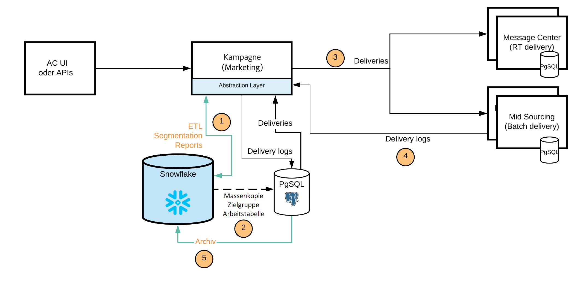

# [!DNL Campaign] FDA [!DNL Snowflake] Implementierung{#gs-fda-snowflake}

In [!DNL Snowflake] FDA-Bereitstellung (Standard), [!DNL Adobe Campaign] v8 ist mit [!DNL Snowflake] für den Datenzugriff über [Federated Data Access](../connect/fda.md) Funktion: Sie können auf externe Daten und Informationen zugreifen und diese verarbeiten, die in Ihrer [!DNL Snowflake] -Datenbank ohne Änderung der Datenstruktur in Adobe Campaign.

## Vorteile{#fda-benefits}

Dieses Bereitstellungsmodell bietet die folgenden Vorteile:

* **Speicherung und Leistung**
Sie können Ihre historischen Daten in [!DNL Snowflake] und reduzieren dann die Abhängigkeiten auf die Grenze für Adobe Campaign IDs. Diese Architektur reduziert auch Ihre Abhängigkeit von PostgreSQL-Speicher und Leistungsbeschränkungen. Da weniger Daten in der Campaign-Datenbank gespeichert werden, ist die Leistung besser und Wartungsaufgaben werden schneller ausgeführt.

* **Datenmodellerweiterung und Datenverwaltung**
Sie können Tabellen in [!DNL Snowflake] und verknüpfen sie mit Adobe Campaign, um beispielsweise archivierte Daten über die Aufbewahrungsdauer zu verwenden oder Segmentierungsprozesse mit herausragender Leistung durchzuführen.

   Diese Architektur ermöglicht Ihnen auch die Verwendung von Workflow-Funktionen für die Datenverwaltung in [!DNL Snowflake]. Nur Aggregate und temporäre Tabellen werden zu Personalisierungs- und Versandzwecken nach Campaign verschoben.

## Architektur{#fda-archi}

Mit diesem Bereitstellungsmodell können Adobe Campaign-Benutzer ihre Daten in [!DNL Snowflake] und nutzen Sie die Vorteile einer einzigen, integrierten Datenplattform für leistungsstarke Dateneinblicke von Marketing-Kampagnen in Echtzeit. Sie bietet Benutzern die Möglichkeit, einen tiefen Wert aus ihren Daten zu entsperren, indem sie eine einzige, einheitliche und benutzerfreundliche Plattform für die Datenanalyse anbieten. Die Cloud-Datenplattform erfordert kein Management, da sie unbegrenzt skaliert wird, um ein beliebiges Volumen an Marketing-Daten aus Adobe Campaign zu unterstützen.

Die allgemeine Kommunikation zwischen Servern und Prozessen erfolgt gemäß dem folgenden Schema:

PostgreSQL ist die primäre Datenbank und Snowflake ist die sekundäre Datenbank. Sie können Ihr Datenmodell erweitern und Ihre Daten in Snowflake speichern. Anschließend können Sie ETL, Segmentierung und Berichte für einen großen Datensatz mit herausragenden Leistungen ausführen.
