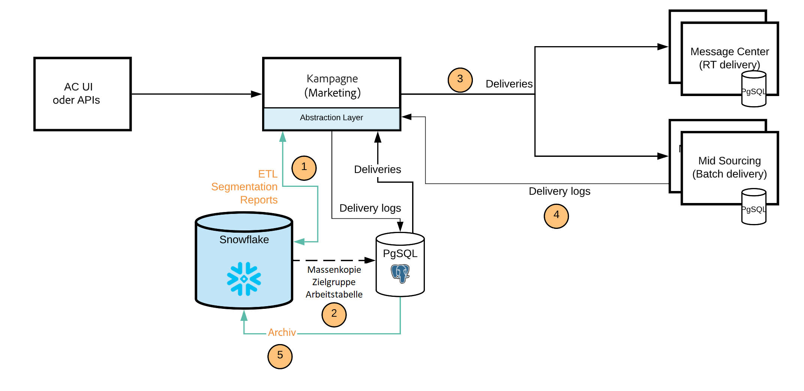

# [!DNL Campaign] FDA-Bereitstellung{#gs-fda}

In einer FDA-Bereitstellung (Standard) von Campaign ist [!DNL Adobe Campaign] v8 zwecks Datenzugriff über die [Federated Data Access](../connect/fda.md)-Funktion mit [!DNL Snowflake] verbunden: Sie können auf externe Daten und Informationen zugreifen, die in Ihrer [!DNL Snowflake]-Datenbank gespeichert sind, und diese verarbeiten, ohne die Datenstruktur in Adobe Campaign ändern zu müssen.

>[!NOTE]
>
>In diesem Bereitstellungsmodell ist die sekundäre Datenbank von [!DNL Snowflake] nur auf Anfrage verfügbar. Um Ihre Bereitstellung mit [!DNL Snowflake] zu aktualisieren, wenden Sie sich an Ihren Adobe Transition Manager.
>

## Vorteile{#fda-benefits}

Dieses Bereitstellungsmodell bietet die folgenden Vorteile:

* **Speicher und Leistung**
Sie können Ihre historischen Daten nach [!DNL Snowflake] verschieben und dann die Abhängigkeiten auf den Grenzwert für Adobe Campaign IDs reduzieren. Diese Architektur reduziert auch Ihre Abhängigkeit vom PostgreSQL-Speicher und von Performance-Beschränkungen. Da weniger Daten in der Campaign-Datenbank gespeichert werden, ist die Performance besser und Wartungsaufgaben werden schneller ausgeführt.

* **Datenmodellerweiterung und Daten-Management**
Sie können in [!DNL Snowflake] Tabellen erstellen und diese mit Adobe Campaign verknüpfen, um beispielsweise archivierte Daten während der Aufbewahrungsfrist zu verwenden oder Segmentierungsprozesse mit hervorragender Performance durchzuführen.

  Diese Architektur ermöglicht Ihnen auch die Verwendung von Workflow-Funktionen für das Daten-Management in [!DNL Snowflake]. Nur Aggregate und temporäre Tabellen werden zu Personalisierungs- und Versandzwecken nach Campaign verschoben.

## Architektur{#fda-archi}

Mit diesem Bereitstellungsmodell können Adobe Campaign-Benutzer ihre Daten nach [!DNL Snowflake] erweitern und in Echtzeit die Vorteile einer zentralen, integrierten Datenplattform für umfassende Dateneinblicke mithilfe von Marketing-Kampagnen nutzen. Es bietet den Benutzern die Möglichkeit, ihre Daten durch eine zentrale, einheitliche und benutzerfreundliche Datenanalyse-Plattform optimal zu nutzen. Die Cloud-Datenplattform erfordert keine Verwaltung, da sie unbegrenzt skaliert werden kann, um ein beliebiges Volumen an Marketing-Daten aus Adobe Campaign aufzunehmen.

Die allgemeine Kommunikation zwischen Servern und Prozessen erfolgt gemäß dem folgenden Schema:

PostgreSQL ist die primäre Datenbank und Snowflake kann als sekundäre Datenbank verwendet werden. Sie können Ihr Datenmodell erweitern und Ihre Daten in Snowflake speichern. Anschließend können Sie ETL, Segmentierung und Berichte für einen großen Datensatz ausführen und hervorragende Performance erzielen.
