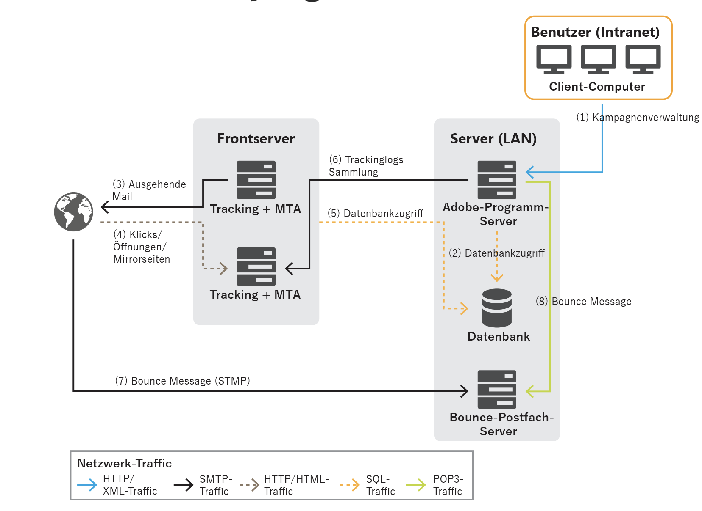

# Allgemeine Architektur{#general-architecture}

Die typische Implementierung einer Adobe Campaign-Lösung setzt sich aus folgenden Komponenten zusammen:

* **Personalisierte Client-Umgebung**

   Eine intuitive grafische Benutzeroberfläche, über die neben der Kommunikation zu und dem Tracking von Marketing-Angeboten die Erstellung von Kampagnen möglich ist, sämtliche Marketing-Aktivitäten, -Programme und Pläne (einschließlich E-Mails, Workflows und Landingpages) geprüft und verwaltet werden können und zudem die Erstellung und Verwaltung von Kundenprofilen und Audiences durchgeführt werden kann.

* **Entwicklungsumgebung**

   Eine Server-seitige Software, die Marketing-Kampagnen über benutzerseitig ausgewählte Kommunikationskanäle ausführt, die von E-Mail, SMS und Push-Benachrichtigungen über Briefpost bis zu Web- und Social-Media-Kanälen reichen. In der Benutzeroberfläche werden dabei zugehörige Regeln und Workflows festgelegt.

* **Datenbank-Container**

   Basierend auf der Technologie relationaler Datenbanken speichert die Adobe Campaign Cloud-Datenbank alle Informationen, Kampagnenkomponenten, Angebote und Workflows sowie die Ergebnisse von Kampagnen in Containern der Datenbank.

## Personalisierte Client-Umgebung {#client-env}

Der Zugriff auf die Anwendung erfolgt auf unterschiedliche Weise: Rich-Client-, Thin-Client- oder API-Integration.

 [Erfahren Sie mehr über die Präsentationsebene von Campaign](../start/ac-components.md).

## Entwicklungsumgebung {#dev-env}

Adobe Campaign führt verschiedene Programme in einer zentralen Plattform zusammen und schafft so eine offenen und zugleich skalierbare Architektur. Die Adobe Campaign-Plattform basiert auf einer flexiblen Anwendungsebene, wodurch sie sich mühelos an verschiedenste Geschäftsanforderungen anpassen lässt. Dank der verteilten Architektur ist das System linear von mehreren Tausend auf mehrere Millionen Nachrichten skalierbar.

Einige Campaign-Module werden durchgängig ausgeführt, andere wiederum werden nur für bestimmte Aufgaben etwa administrativer Art (z. B. zum Konfigurieren der Datenbankverbindung) oder zur Ausführung wiederkehrender Operationen wie der Konsolidierung von Tracking-Informationen gestartet.

Es gibt drei Typen von Adobe Campaign-Modulen:

* **Module mit Mehrfach-Instanzen**: Für alle Instanzen wird ein einzelner Prozess ausgeführt. Dies gilt für die folgenden Module: web, syslogd, trackinglogd und watchdog.
* **Module mit Einfach-Instanz**: Für die einzelnen Instanzen wird jeweils ein Prozess ausgeführt. Dies gilt für die folgenden Module: mta, wfserver, inMail, sms und stat.
* **Dienstprogramm-Module**: Hierbei handelt es sich um Module, die von Zeit zu Zeit für gelegentlich notwendige oder wiederkehrende Operationen ausgeführt werden, darunter z. B. Bereinigung, Konfiguration oder Herunterladen von Trackinglogs.

Dies sind die wichtigsten Prozesse:

* **Anwendungs-Server** (nlserver web)  - Dieser Prozess stellt das gesamte Spektrum an Adobe Campaign-Funktionen mittels Web Services-APIs (SOAP / HTTP + XML) zur Verfügung. Darüber hinaus kann er dynamisch die Web-Seiten generieren, die für den HTML-basierten Zugriff verwendet werden (Berichte, Web-Formulare usw.). Um dies zu ermöglichen, umfasst der Prozess einen Apache Tomcat JSP-Server. Dies ist der Prozess, an den die Konsole angebunden ist.

* **Workflow-Engine** (nlserver wfserver)  - Durch diesen Prozess werden die im Programm definierten Workflow-Prozesse ausgeführt. Außerdem werden durch ihn regelmäßig technische Workflows ausgeführt, darunter:

   * **Tracking**: Stellt Trackinglogs wieder her und konsolidiert sie, sodass Sie die Protokolle vom Weiterleitungs-Server abrufen und die vom Berichtsmodul verwendeten aggregierten Indikatoren erstellen können.
   * **Bereinigung**: Bereinigt die Datenbank, löscht alte Einträge und verhindert, dass die Datenbank exponentiell wächst.
   * **Abrechnung**: Sendet einen Aktivitätsbericht für die Plattform (Größe der Datenbank, Anzahl der Marketing-Aktionen usw.).

* **Versand-Server** (nlserver-mta): Adobe Campaign verfügt über eine native Funktion zum Senden von E-Mails. Dieser Prozess fungiert als SMTP Mail Transfer Agent (MTA). Er personalisiert Nachrichten individuell für den jeweiligen Empfänger und verarbeitet deren physischen Versand. Dies erfolgt mittels Versandvorgängen, wobei zudem auch nachgelagerte, weitere Zustellversuche automatisiert werden. Ist Tracking aktiviert, werden zusätzlich die URLs automatisch ersetzt, sodass sie auf den Weiterleitungs-Server verweisen. Über diesen Prozess ist die Anpassung sowie der automatische Versand an einen Dritt-Router für SMS, Fax und Briefpost möglich.

* **Weiterleitungs-Server** (nlserver webmdl)  - Bei E-Mails übernimmt Adobe Campaign automatisch das Öffnungs- und Klick-Tracking (wobei das Tracking von Transaktionen auf Website-Ebene ebenfalls möglich ist). Hierfür werden die in den E-Mail-Nachrichten enthaltenen URLs so umgeschrieben, dass sie auf dieses Modul verweisen. Dieses wiederum registriert Internet-Benutzer, während diese an die Ziel-URL weitergeleitet werden.

   Zur Sicherstellung maximaler Verfügbarkeit ist dieser Prozess vollkommen unabhängig von der Datenbank: Die anderen Server-Prozesse kommunizieren mit ihm nur über SOAP-Aufrufe (HTTP, HTTPS und XML). Aus technischer Sicht sind diese Funktionen in einem Erweiterungsmodul (ISAPI-Erweiterung in IIS, DSO Apache-Modul usw.) eines HTTP-Servers implementiert. und nur unter Windows verfügbar.

Daneben sind auch noch weitere technische Prozesse verfügbar:

* **Handhabung von Bounce-E-Mails** (nlserver inMail)  - Dieser Prozess ermöglicht den automatischen Abruf von E-Mails aus Postfächern, die für den Empfang von Nachrichten konfiguriert sind, die bei fehlgeschlagenem Versand als unzustellbar zurückgesendet werden. Diese Nachrichten werden dann regelbasiert verarbeitet, um die Gründe für die Unzustellbarkeit zu ermitteln (z. B. Empfänger unbekannt, Nachrichtenkontingente ausgeschöpft) und den Versandstatus in der Datenbank zu aktualisieren. Alle diese Operationen laufen vollkommen automatisch und sind vorkonfiguriert.

* **Status des SMS-Versands** (nlserver sms)  - Dieser Prozess fragt beim SMS-Router den Status des Versandfortschritts ab und aktualisiert diesen in der Datenbank.

* **Schreiben von Protokollnachrichten** (nlserver syslogd): Dieser technische Prozess erfasst von anderen Prozessen generierte Protokollnachrichten und -spuren und schreibt sie auf die Festplatte. Dadurch stehen im Falle von Problemen umfangreiche Informationen zur Diagnose zur Verfügung.

* **Schreiben von Trackinglogs** (nlserver trackinglogd)  - Dieser Prozess speichert die Trackinglogs, die durch den Weiterleitungsprozess generiert werden.

* **Schreiben eingehender Ereignisse** (nlserver interaction): Dieser Prozess stellt sicher, dass eingehende Ereignisse im Rahmen von Interaction auf der Festplatte aufgezeichnet werden.

* **Überwachungsmodule** (nlserver watchdog): Dieser technische Prozess fungiert als primärer Prozess, der die anderen hervorbringt. Zugleich überwacht er diese aber auch startet sie beim Auftreten von Vorfällen automatisch neu, sodass maximale Systemverfügbarkeit gewährleistet bleibt.

* **Statistik-Server** (nlserver stat)  - Dieser Prozess erstellt Statistiken zur Anzahl von Verbindungen, zu an die einzelnen Mailserver gesendeten Nachrichten und zu deren Einschränkungen (Maximalzahl gleichzeitiger Verbindungen, Nachrichten pro Stunde und/oder Verbindung). Ebenfalls lassen sich über diesen Prozess Instanzen oder Computer zusammenführen, sofern diese dieselben öffentlichen IP-Adressen verwenden.

## Datenbank-Container {#db-containers}

Die Cloud-Datenbank von Adobe Campaign nutzt [!DNL Snowflake], wo die funktionellen Daten (Profile, Abonnements, Inhalte usw.), die technischen Daten (Versand, Aufträge und Protokolle, Trackinglogs usw.) und die Arbeitsdaten (Bestellungen, Interessenten) für die Lösung abgelegt sind. Alle Komponenten von Adobe Campaign kommunizieren mit der Datenbank, um ihre spezifischen Aufgaben auszuführen.

Kunden können Adobe Campaign mithilfe der vordefinierten Datenbank und vordefinierten Schemas bereitstellen. Bei Bedarf kann diese vordefinierte Umgebung erweitert werden. Der Zugriff auf alle Daten im Datamart durch Adobe Campaign erfolgt über SQL-Aufrufe. Adobe Campaign bietet außerdem eine vollständige Ergänzung der ETL-Tools (Extract, Transform, Load – Extrahieren, Umwandeln, Laden), mittels derer Daten in das und aus dem System importiert und exportiert werden können.

>[!CAUTION]
>
>Mit **Campaign Managed Cloud Services** wurden Ihre Umgebung und die anfängliche Konfiguration von Adobe gemäß den Bedingungen Ihrer Lizenzvereinbarung festgelegt. Sie dürfen keine installierten integrierten Packages, integrierten Schemata oder Berichte ändern.
>
>Wenn Sie ein Campaign-Add-on oder eine spezifische Funktion verwenden müssen, das/die Ihnen nicht zur Verfügung gestellt wurde, wenden Sie sich an die **Adobe-Kundenunterstützung**.