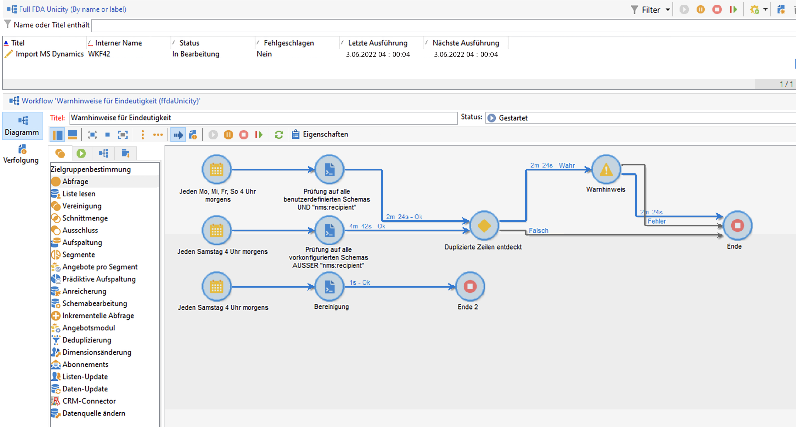
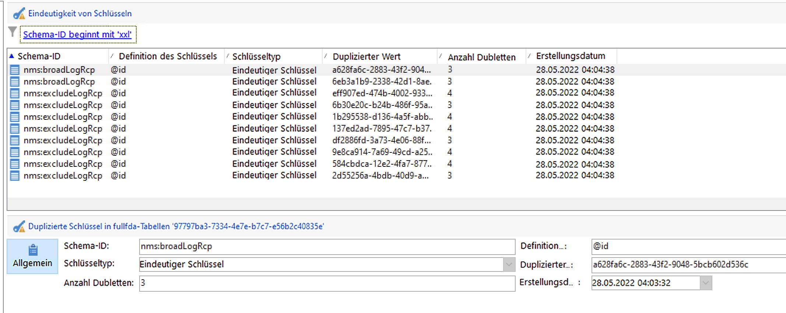
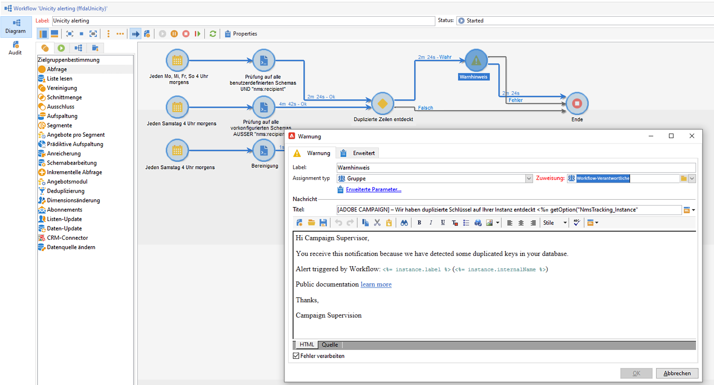
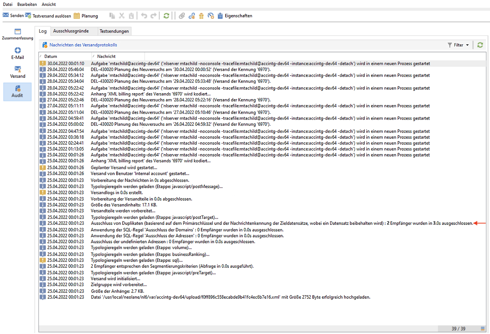
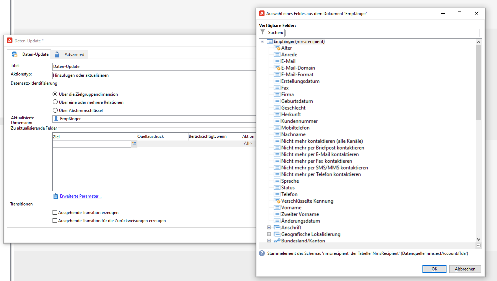
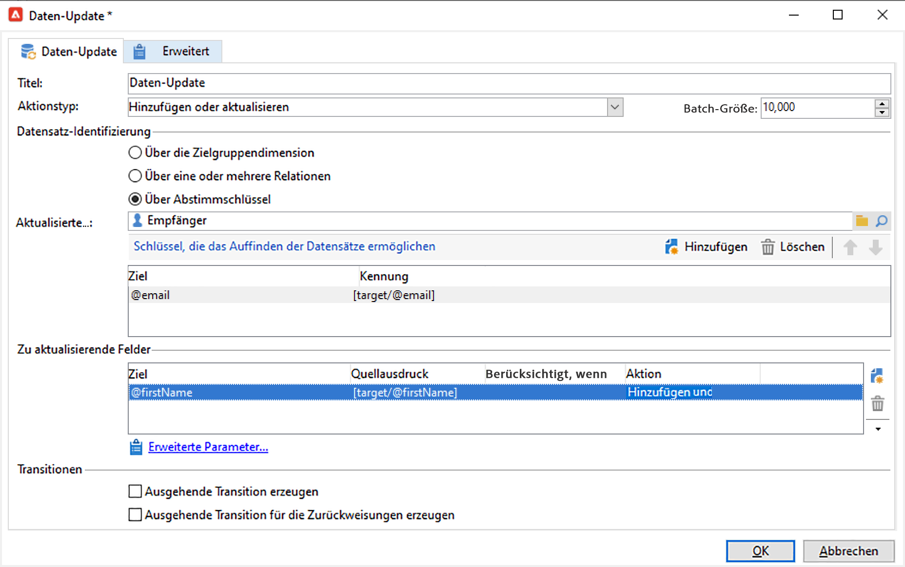
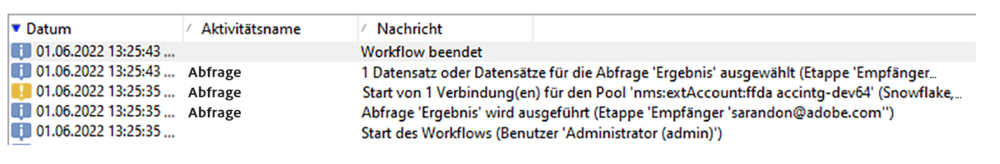

# Schlüsselverwaltung und Eindeutigkeit {#key-management}

Im Kontext einer [Enterprise (FFDA)-Implementierung](enterprise-deployment.md) ist der Primärschlüssel ein Universally Unique IDentifier (UUID), d. h. eine Zeichenfolge. Um diese UUID zu erstellen, muss das Hauptelement des Schemas die Attribute **autouid** und **autopk** enthalten, die auf **true** gesetzt sind.

Adobe Campaign v8 verwendet [!DNL Snowflake] als Hauptdatenbank. Die verteilte Architektur der [!DNL Snowflake]-Datenbank bietet keine Mechanismen zur Gewährleistung der Eindeutigkeit eines Schlüssels in einer Tabelle. Die Endbenutzer sind dafür verantwortlich, die Konsistenz der Schlüssel in der Adobe Campaign-Datenbank sicherzustellen.

Die Vermeidung von Duplikaten bei Schlüsseln, insbesondere bei Primärschlüsseln, ist zur Wahrung der relationalen Datenbankkonsistenz unverzichtbar. Duplikate bei Primärschlüsseln führen zu Problemen mit Workflow-Aktivitäten für die Datenverwaltung, wie der **Abfrage**, der **Abstimmung**, dem **Daten-Update** und anderen. Dies ist entscheidend für die Definition geeigneter Abstimmbedingungen bei der Aktualisierung von [!DNL Snowflake]-Tabellen.

>[!CAUTION]
>
>Duplizierte Schlüssel sind nicht auf UUIDs beschränkt. Duplikate können bei IDs auftreten, einschließlich benutzerdefinierter Schlüssel, die in benutzerdefinierten Tabellen erstellt werden.

## Unicity Service{#unicity-service}

Unicity Service ist eine Cloud Database Manager-Komponente, mit der Benutzer die Integrität der Einschränkungen eindeutiger Schlüssel in Cloud-Datenbanktabellen wahren und überwachen können. Dies hilft Ihnen zu verhindern, dass doppelte Schlüssel eingefügt werden.

Da in der Cloud-Datenbank keine Einschränkungen hinsichtlich der Einheitlichkeit erzwungen werden, reduziert Unicity Service das Risiko, bei der Verwaltung von Daten mit Adobe Campaign Duplikate einzufügen.

### Eindeutigkeits-Workflow{#unicity-wf}

Unicity Service verfügt über den speziellen, integrierten Workflow **[!UICONTROL Warnhinweise für Eindeutigkeit]**, der Eindeutigkeitseinschränkungen überwacht und Alarm schlägt, wenn Duplikate entdeckt werden.

Dieser technische Workflow ist im Knoten **[!UICONTROL Administration > Produktion > Technische Workflows > Vollständige FFDA-Eindeutigkeit]** von Campaign Explorer verfügbar. **Er darf nicht geändert werden**.

Dieser Workflow überprüft alle benutzerdefinierten und integrierten Schemas, um duplizierte Zeilen zu erkennen.

Wenn der Workflow **[!UICONTROL Warnhinweise für Eindeutigkeit]** (ffdaUnicity) doppelte Schlüssel entdeckt, werden diese zu einer bestimmten **Audit-Unicity**-Tabelle hinzugefügt, die den Namen des Schemas, den Typ des Schlüssels, die Anzahl der betroffenen Zeilen und das Datum enthält. Über den Knoten **[!UICONTROL Administration > Audit > Schlüsseleindeutigkeit]** können Sie auf doppelte Schlüssel zugreifen.

Als Datenbankadministrator können Sie eine SQL-Aktivität verwenden, um die Duplikate zu entfernen, oder sich an die Kundenunterstützung von Adobe wenden, um weitere Anleitungen zu erhalten.

### Warnhinweise{#unicity-wf-alerting}

Wenn doppelte Schlüssel erkannt werden, wird eine bestimmte Benachrichtigung an die Benutzergruppe **[!UICONTROL Workflow-Verantwortliche]** gesendet. Inhalt und Zielgruppe dieses Warnhinweises können in der Aktivität **Warnhinweis** des Workflows **[!UICONTROL Warnhinweise für Eindeutigkeit]** geändert werden.

## Zusätzliche Schutzmaßnahmen{#duplicates-guardrails}

Campaign verfügt über eine Reihe neuer Schutzmaßnahmen, um das Einfügen eines doppelten Schlüssels in die [!DNL Snowflake]-Datenbank zu verhindern.

>[!NOTE]
>
>Diese Schutzmaßnahmen sind ab Campaign v8.3 verfügbar. Informationen zur Überprüfung Ihrer Version finden Sie in [diesem Abschnitt](../start/compatibility-matrix.md#how-to-check-your-campaign-version-and-buildversion).

### Versandvorbereitung{#remove-duplicates-delivery-preparation}

Adobe Campaign entfernt während der Versandvorbereitung automatisch jede doppelte UUID aus einer Zielgruppe. Dieser Mechanismus verhindert, dass beim Vorbereiten von Sendungen Fehler auftreten. Als Endbenutzer können Sie diese Informationen in den Versandlogs überprüfen. Manche Empfänger können wegen eines doppelten Schlüssels aus der Hauptzielgruppe ausgeschlossen werden. In diesem Fall wird folgender Warnhinweis angezeigt: `Exclusion of duplicates (based on the primary key or targeted records)`.

### Aktualisieren von Daten in einem Workflow {#duplicates-update-data}

Im Kontext einer [Enterprise (FFDA)-Implementierung](enterprise-deployment.md) können Sie keinen internen Schlüssel (UUID) als Feld auswählen, um Daten in einem Workflow zu aktualisieren.

Wenn Sie einen expliziten Abstimmschlüssel verwenden, stellt die Aktivität **Daten-Update** auf der Grundlage dieses Schlüssels automatisch die Eindeutigkeit des Zielschemas sicher, indem die Aktivität:

1. Eingehende Daten dedupliziert (in der Transition)
1. Daten mit der Zieltabelle dedupliziert (Zusammenführen)

>[!CAUTION]
>
>Diese Schutzmaßnahme ist nur mit der Option **[!UICONTROL Über Abstimmschlüssel]** verfügbar.

### Abfrage eines Schemas mit Duplikaten{#query-with-duplicates}

Wenn ein Workflow die Abfrage eines Schemas startet, prüft Adobe Campaign, ob ein doppelter Eintrag in der [Audit-Unicity-Tabelle](#unicity-wf) vorhanden ist. In diesem Fall protokolliert der Workflow eine Warnung, da der nachfolgende Vorgang mit den doppelten Daten möglicherweise das Workflow-Ergebnis beeinflusst.

Diese Prüfung wird in den folgenden Workflow-Aktivitäten durchgeführt:

* Abfrage
* Inkrementelle Abfrage
* Liste lesen