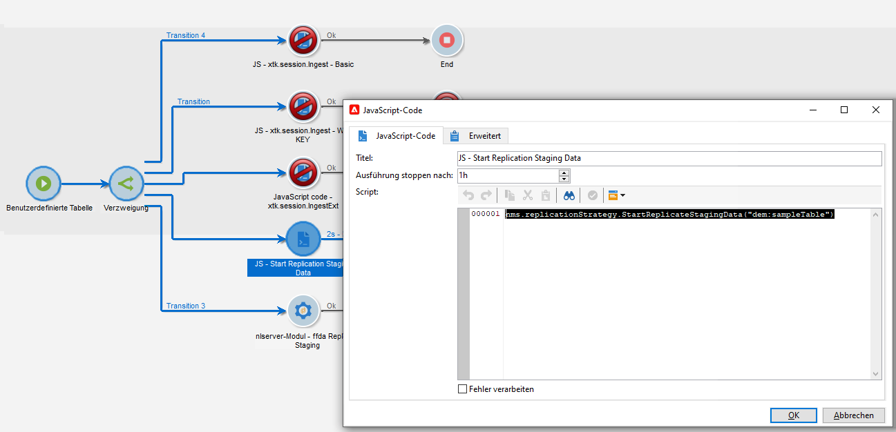
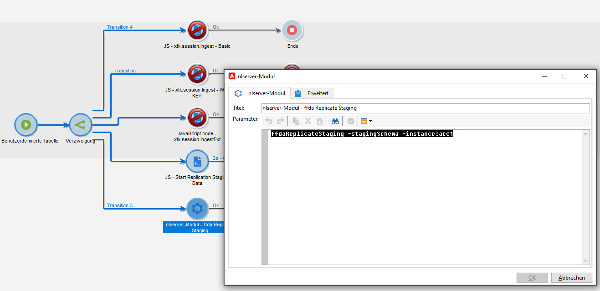

# Technische Workflows und Datenreplikation

## Technische Workflows{#tech-wf}

Im Kontext einer [Enterprise (FFDA)-Implementierung](enterprise-deployment.md) bietet Adobe Campaign eine Reihe integrierter technischer Workflows. Technische Workflows führen Prozesse oder Aufträge aus und werden auf dem Server regelmäßig geplant.

Solche Workflows führen Operationen zur Datenbankwartung aus, nutzen die Tracking-Informationen in den Versand-Logs, erstellen wiederkehrende Kampagnen und mehr.

 Eine vollständige Liste der technischen Workflows finden Sie in der [Dokumentation zu Campaign Classic v7](https://experienceleague.adobe.com/docs/campaign-classic/using/automating-with-workflows/advanced-management/about-technical-workflows.html?lang=de).{target=&quot;_blank&quot;}

Zusätzlich zu diesen technischen Workflows setzt Campaign v8 bei der Verwaltung von [Datenreplikation](#data-replication) auf bestimmte technische Workflows.

* **[!UICONTROL Referenztabellen replizieren]**
Dieser Workflow sorgt für die automatische Replikation von integrierten Tabellen, die in der lokalen Campaign-Datenbank (Postgres) und in der Cloud-Datenbank ([!DNL Snowflake]) vorhanden sein müssen. Er ist so geplant, dass er Tag für Tag einmal stündlich ausgeführt wird. Wenn das Feld **lastModified** vorhanden ist, erfolgt die Replikation inkrementell, ansonsten wird die gesamte Tabelle repliziert. Die Reihenfolge der Tabellen im folgenden Array ist die Reihenfolge, die vom Replikations-Workflow verwendet wird.
* **[!UICONTROL Staging-Daten replizieren]**
Dieser Workflow repliziert Staging-Daten für einheitliche Aufrufe. Er ist so geplant, dass er Tag für Tag einmal stündlich ausgeführt wird.
* **[!UICONTROL FFDA sofort freigeben]**\
   Dieser Workflow sorgt für eine sofortige Bereitstellung in der Cloud-Datenbank.
* **[!UICONTROL FFDA-Daten sofort replizieren]**
Dieser Workflow repliziert die XS-Daten für ein bestimmtes externes Konto.

Diese technischen Workflows sind im Knoten **[!UICONTROL Administration > Produktion > Technische Workflows > Vollständige FFDA-Replikation]** von Campaign Explorer verfügbar. **Sie dürfen nicht geändert werden.**

Bei Bedarf können Sie die Datensynchronisation manuell starten. Klicken Sie dazu mit der rechten Maustaste auf die Aktivität **Planung** und wählen Sie **Aufgabe(n) jetzt bearbeiten**.

## Datenreplikation{#data-replication}

Einige integrierte Tabellen werden mithilfe der oben beschriebenen dedizierten Workflows von der Campaign-Datenbank in die [!DNL Snowflake]-Cloud-Datenbank repliziert.

Erfahren Sie, welche Datenbanken Adobe Campaign v8 verwendet, warum Daten repliziert werden, welche Daten repliziert werden und wie der Replikationsprozess funktioniert.

>[!VIDEO](https://video.tv.adobe.com/v/334460?quality=12)


### Datenreplikationsrichtlinien

Replikationsrichtlinien richten sich nach der Größe der Tabellen. Einige Tabellen werden in Echtzeit repliziert, andere werden hingegen stündlich repliziert. Einige Tabellen erhalten inkrementelle Aktualisierungen, während andere ersetzt werden.

Zusätzlich zum integrierten technischen Workflow **Referenztabellen replizieren** können Sie die Datenreplikation in Ihren Workflows erzwingen.

Sie haben folgende Möglichkeiten:

* Fügen Sie eine bestimmte Aktivität des Typs **JavaScript-Code** mit dem folgenden Code hinzu:

```
nms.replicationStrategy.StartReplicateStagingData("dem:sampleTable")
```




* Fügen Sie eine bestimmte **nlmodule**-Aktivität mit dem folgenden Befehl hinzu:

```
nlserver ffdaReplicateStaging -stagingSchema -instance:acc1
```




**Verwandte Themen**

 Mehr zu den ersten Schritten mit Workflows erfahren Sie in der [Dokumentation zu Campaign Classic v7](https://experienceleague.adobe.com/docs/campaign-classic/using/automating-with-workflows/introduction/about-workflows.html?lang=de#automating-with-workflows){target=&quot;_blank&quot;}

 Informationen zu Fristen für die Datenbeibehaltung finden Sie [diesem Abschnitt](../dev/datamodel-best-practices.md#data-retention)
