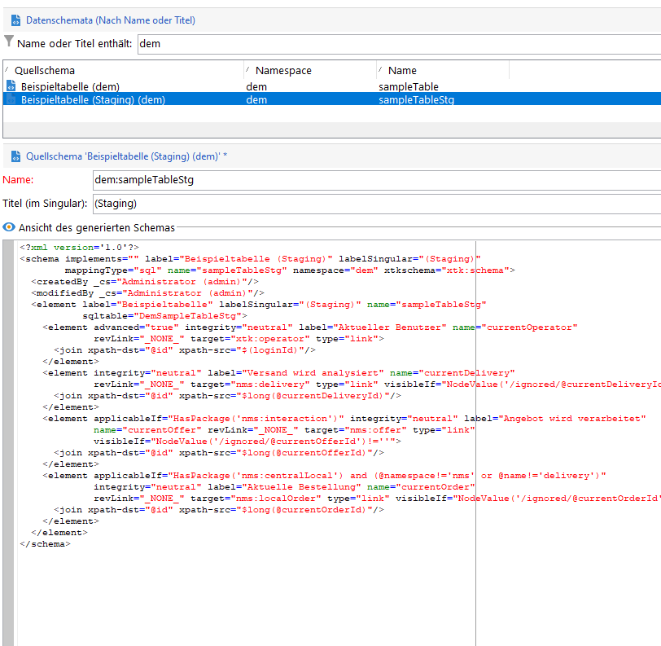

# Campaign-API-Staging-Mechanismus

Im Kontext eines [Enterprise (FFDA)-Bereitstellung](enterprise-deployment.md)nicht empfohlen wird, Einzelaufrufe in Bezug auf Leistungen (Latenz und gleichzeitige Nutzung) freizugeben. Batch-Vorgänge sind daher vorzuziehen. Um die Leistung zu verbessern, werden Aufnahme-APIs an die lokale Datenbank weitergeleitet.

Die Staging-Funktion von Campaign ist in einigen nativen Schemata standardmäßig aktiviert. Sie kann auch für jedes benutzerdefinierte Schema aktiviert werden. Staging-Verfahren in Kürze:

* Die Struktur des Datenschemas wird in die lokale Staging-Tabelle dupliziert.
* Neue APIs zur Datenaufnahme befüllen direkt die lokale Staging-Tabelle. [Weitere Informationen](new-apis.md)
* Ein geplanter Workflow wird stündlich ausgeführt und die Daten werden zurück in die Cloud-Datenbank synchronisiert. [Weitere Informationen](replication.md)

Einige integrierte Schemata werden standardmäßig beim Staging verwendet, etwa nmsSubscriptionRcp, nmsAppSubscriptionRcp und nmsRecipient.

Campaign Classic v7-APIs sind weiterhin verfügbar, profitieren jedoch nicht von dem neuen Staging-Mechanismus: API-Aufrufe fließen direkt in die Cloud-Datenbank. Adobe empfiehlt, wann immer möglich den neuen Staging-Mechanismus zu verwenden, um die Gesamtauslastung und die Latenz der Campaign Cloud-Datenbank zu reduzieren.

>[!CAUTION]
>
>* Mit diesem neuen Mechanismus ist die Datensynchronisation für Kanal-Opt-out, Abonnements, Abmeldungen oder mobile Registrierungen jetzt **asynchron**.
>
>* Staging gilt nur für Schemata, die in der Cloud-Datenbank gespeichert sind. Aktivieren Sie kein Staging für replizierte Schemata. Aktivieren Sie kein Staging für lokale Schemata. Aktivieren Sie kein Staging für ein bereitgestelltes Schema.
>


## Implementierungsschritte{#implement-staging}

Gehen Sie wie folgt vor, um den Campaign-Staging-Mechanismus für eine bestimmte Tabelle zu implementieren:

1. Erstellen Sie ein benutzerdefiniertes Beispielschema in der Campaign Cloud-Datenbank. Bei diesem Schritt ist kein Staging aktiviert.

   ```
   <srcSchema _cs="Sample Table (dem)" created="YYYY-DD-MM"
           entitySchema="xtk:srcSchema" img="xtk:schema.png" label="Sample Table"
           lastModified="YYYY-DD-MM HH:MM:SS.TZ" mappingType="sql" md5="XXX"
           modifiedBy-id="0" name="sampleTable" namespace="dem" xtkschema="xtk:srcSchema">
   <element autopk="true" autouuid="true" dataSource="nms:extAccount:ffda" label="Sample Table"
           name="sampleTable">
       <attribute label="Test Col 1" length="255" name="testcol1" type="string"/>
       <attribute label="Test Col 2" length="255" name="testcol2" type="string"/>
   </element>
   </srcSchema>
   ```

    Weitere Informationen zur Erstellung benutzerdefinierter Schemata finden Sie auf [dieser Seite](../dev/create-schema.md).

1. Speichern und aktualisieren Sie die Datenbankstruktur. [Weitere Informationen](../dev/update-database-structure.md)

1. Aktivieren Sie den Staging-Mechanismus in der Schemadefinition, indem Sie den Parameter **autoStg=&quot;true&quot;** hinzufügen.

   ```
   <srcSchema _cs="Sample Table (dem)" "YYYY-DD-MM"
           entitySchema="xtk:srcSchema" img="xtk:schema.png" label="Sample Table"
           lastModified="YYYY-DD-MM HH:MM:SS.TZ" mappingType="sql" md5="XXX"
           modifiedBy-id="0" name="sampleTable" namespace="dem" xtkschema="xtk:srcSchema">
   <element autoStg="true" autopk="true" autouuid="true" dataSource="nms:extAccount:ffda" label="Sample Table"
           name="sampleTable">
       <attribute label="Test Col 1" length="255" name="testcol1" type="string"/>
       <attribute label="Test Col 2" length="255" name="testcol2" type="string"/>
   </element>
   </srcSchema>
   ```

1. Speichern Sie die Änderung. Ein neues Staging-Schema ist nun verfügbar, bei dem es sich um eine lokale Kopie des ursprünglichen Schemas handelt.

   

1. Datenbankstruktur aktualisieren. Die Staging-Tabelle wird in der lokalen Campaign-Datenbank erstellt.
