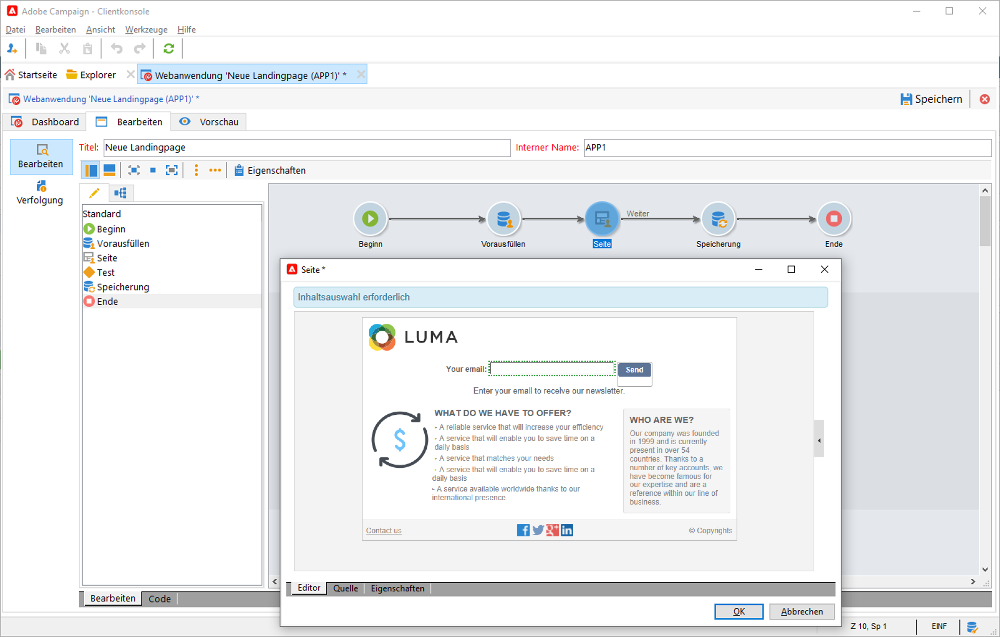

# Erfassen und Aktualisieren von Profilen mit Web-Formularen

Verwenden Sie Campaign, um Web-Formulare zu erstellen und Profilinformationen einfach und effizient zu erfassen und zu verwalten. Sie können diese Formulare auf Ihrer Website freigeben, sodass Ihre Kontakte ihre Informationen einfach bereitstellen können. Die Daten werden an Campaign gesendet, um deren Profil zu erstellen oder zu aktualisieren.

 Wie Sie Web-Formulare erstellen, erfahren Sie in der [Dokumentation zu Campaign Classic v7](https://experienceleague.adobe.com/docs/campaign-classic/using/designing-content/web-forms/about-web-forms.html?lang=de){target=&quot;_blank&quot;}.
