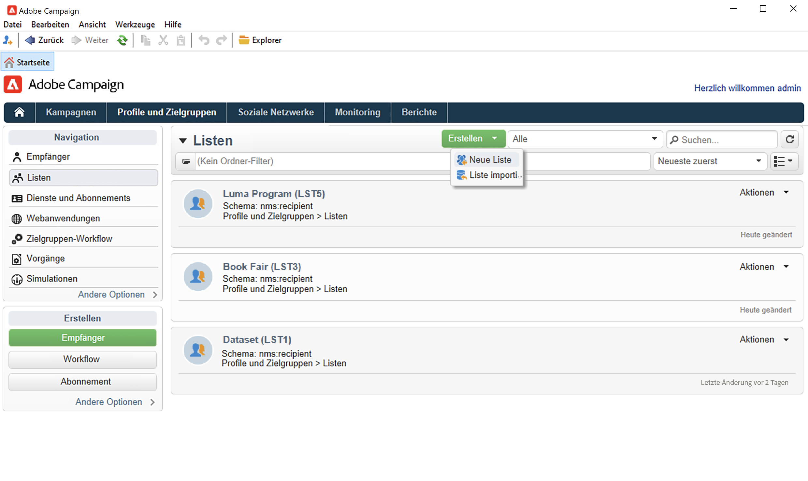
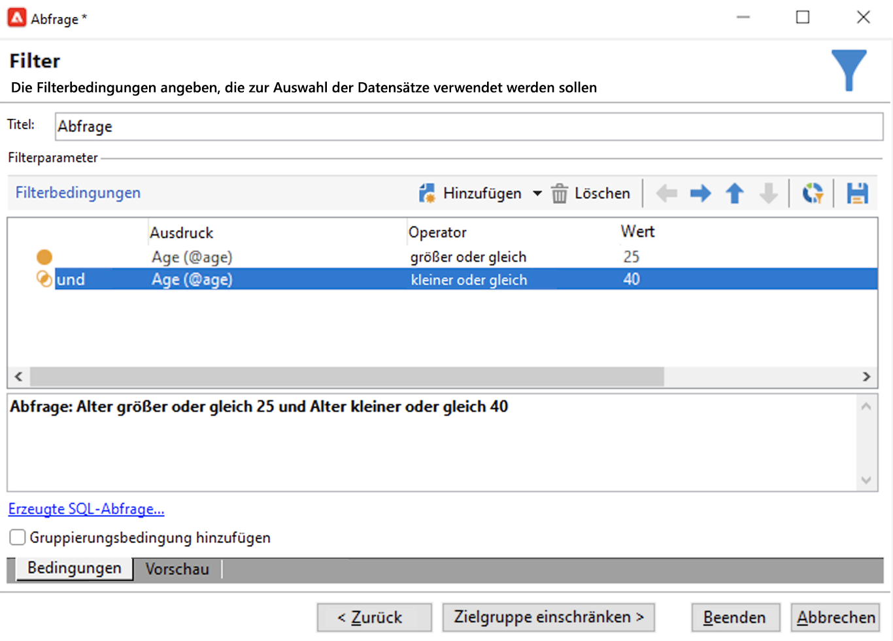

# Erstellen einer Audience in einer Liste{#create-segments}

Verwenden Sie Campaign-Listen, um Audiences zu erstellen und zu ordnen.

Eine Liste ist ein statischer Satz von Kontakten, die in Versandaktionen als Zielkontakte dienen oder beim Importieren bzw. bei einer Workflow-Ausführung aktualisiert werden können. So kann beispielsweise eine Population, die über eine Abfrage aus der Datenbank extrahiert wurde, als Liste gespeichert werden.

Listen werden über den Link **[!UICONTROL Listen]** im Tab **[!UICONTROL Profile und Zielgruppen]** erstellt und verwaltet. Diese Listen basieren auf der standardmäßigen Adobe Campaign-Profiltabelle (nms:recipient). [Weitere Informationen](../dev/datamodel.md#ootb-profiles.md)

Sie können eine Liste mithilfe der Aktivität **Liste aktualisieren** in einem Workflow erstellen. Diese Aktivität speichert die resultierende Population in eine Liste. Verwenden Sie sie, um eine neue Liste zu erstellen oder eine vorhandene Liste zu aktualisieren. Um Listen zu erstellen, die andere Datentypen als die integrierte Profiltabelle enthalten, müssen Sie einen Workflow ausführen. Wenn Sie beispielsweise eine Abfrage in der Besuchertabelle verwenden und die Liste dann aktualisieren, können Sie eine Besucherliste erstellen. [Weitere Informationen](#create-a-list-wf).

In diesem Video erfahren Sie mehr über die Verwaltung von Listen in Adobe Campaign.

>[!VIDEO](https://video.tv.adobe.com/v/334909?quality=12)

## Erstellen einer Liste von Kontakten {#create-a-list-of-contacts}

Gehen Sie wie folgt vor, um eine Liste von Kontakten zu erstellen:

1. Verwenden Sie die Schaltfläche **[!UICONTROL Erstellen]** und wählen Sie **[!UICONTROL Neue Liste]** aus.

   

1. Erfassen Sie im Tab **[!UICONTROL Bearbeiten]** des Listenfensters alle nötigen Informationen.

   

   * Geben Sie im Feld **[!UICONTROL Titel]** den Namen der Liste an und ändern Sie ggf. den internen Namen.
   * Sie haben die Möglichkeit, eine Beschreibung in Bezug auf die Liste zu erfassen.
   * Des Weiteren können Sie ein Ablaufdatum angeben. Bei Erreichen des Datums wird die Liste automatisch gelöscht.

1. Setzen Sie im Tab **[!UICONTROL Inhalt]** durch Klick auf die Schaltfläche **[!UICONTROL Hinzufügen]** Profile auf die Liste.

   

   Sie können ein neues Profil erstellen und es direkt aus diesem Fenster in die Liste einfügen, indem Sie das Symbol **[!UICONTROL Erstellen]** verwenden. Das Profil wird der Datenbank hinzugefügt.

1. Verwenden Sie die Schaltfläche **[!UICONTROL Speichern]**. Die Liste ist nunmehr über die Listenübersicht zugänglich.

## Konvertieren gefilterter Kontakte in Listen {#convert-data-to-a-list}

Sie können Profile auswählen und sie zu einer Liste hinzufügen. Gehen Sie dazu wie folgt vor:

1. Wählen Sie im Campaign Explorer Profile aus und klicken Sie mit der rechten Maustaste darauf.

   Diese Profile können nach bestimmten Kriterien gefiltert werden.

1. Wählen Sie nun > **[!UICONTROL Aktionen > Auswahl einer Liste zuordnen...]**.

   

1. Wählen Sie eine vorhandene Liste aus oder erstellen Sie eine neue Liste und klicken Sie auf **[!UICONTROL Weiter]**.

   

1. Klicken Sie auf die Schaltfläche **[!UICONTROL Starten]**.

   

Wählen Sie die Option **[!UICONTROL Liste neu erstellen]** aus, um die existierenden Inhalte aus der Liste zu löschen und die Listenerstellung zu optimieren (es ist keine Abfrage erforderlich, um zu überprüfen, ob die Profile bereits mit der Liste verknüpft sind).

Wenn Sie die Option **[!UICONTROL Vorgang nicht in der Datenbank protokollieren]** abwählen, ist die Auswahl oder Erstellung eines Ausführungsordners erforderlich, in dem die den Vorgang betreffenden Protokollnachrichten gespeichert werden.

In der oberen Hälfte des Assistenten werden Informationen bezüglich der Ausführung angezeigt. Durch Klick auf die Schaltfläche **[!UICONTROL Abbrechen]** kann der Vorgang gestoppt werden. Bereits verarbeitete Datensätze werden jedoch trotzdem der Liste zugeordnet.

Nachdem die Ausführung abgeschlossen ist, öffnen Sie das Menü **[!UICONTROL Profile und Zielgruppen > Listen]** und wählen Sie die Liste aus: die Registerkarte **[!UICONTROL Inhalte]** zeigt die mit der Liste verknüpften Profile an.

## Erstellen einer Liste mit einem Workflow  {#create-a-list-wf}

Sie können die Aktivität **[!UICONTROL Listen-Update]** verwenden, um eine Liste zu erstellen oder eine Population zu einer Empfängerliste hinzuzufügen.

Im folgenden Beispiel wird eine Liste aller Empfänger zwischen 25 und 40 erstellt.

1. Wählen Sie **[!UICONTROL Profile und Zielgruppen]** und **[!UICONTROL Zielgruppen-Workflows]** aus, erstellen Sie dann über den Button **[!UICONTROL Erstellen]** einen neuen Workflow.
1. Geben Sie einen Titel für diesen Workflow ein, z. B. &quot;Kontakte von 25–40&quot;, fügen Sie eine Beschreibung hinzu und klicken Sie auf **[!UICONTROL Weiter]**.

   

1. Fügen Sie die Aktivität **[!UICONTROL Abfrage]** ein, um die Zielpopulation zu definieren, und bearbeiten Sie die Abfrage.

   

1. Definieren Sie die Filterbedingungen wie folgt:

   

   Wie Sie in einem Workflow eine Abfrage erstellen, erfahren Sie in der [Dokumentation zu Campaign Classic v7](https://experienceleague.adobe.com/docs/campaign-classic/using/automating-with-workflows/targeting-activities/query.html?lang=de#creating-a-query){target=&quot;_blank&quot;}.

1. Geben Sie dieser Abfrage einen Titel und speichern Sie die Änderungen.
1. Fügen Sie die Aktivität **[!UICONTROL Listen-Update]** hinzu und bearbeiten Sie sie.

   

1. Geben Sie der Aktivität einen Titel.
1. Wählen Sie die Option **[!UICONTROL Wenn nötig Liste erstellen (Titel berechnet)]**, damit die Liste beim ersten Ausführen des Workflows erstellt und bei späteren Ausführungen aktualisiert wird.
1. Wählen Sie einen Ordner aus und geben Sie einen Titel für die Liste ein.
1. Wählen Sie die **[!UICONTROL Datenbank der Zielgruppendimension]** aus, um die Tabelle zu speichern.
1. Lassen Sie die Option **[!UICONTROL Wenn sie existiert, Liste leeren (andernfalls zur Liste hinzufügen)]** aktiv, damit die Empfänger, die nicht den Zielgruppenkriterien entsprechen, gelöscht und die neuen Empfänger eingefügt werden.
1. Lassen Sie die Option **[!UICONTROL Liste mit eigener Tabelle erstellen oder verwenden]** ebenfalls aktiv.
1. Lassen Sie die Option **[!UICONTROL Ausgehende Transition erzeugen]** deaktiviert.
1. Klicken Sie auf **[!UICONTROL Ok]** und speichern Sie den Workflow.
1. Starten Sie den Workflow.

   Danach wird eine Liste mit übereinstimmenden Empfängern erstellt. Über den Eintrag **[!UICONTROL Listen]** der Startseite können Sie auf diese Liste zugreifen.

   

   Sie können diesen Workflow wiederkehrend machen, indem Sie ihm eine Planung hinzufügen. Weitere Informationen finden Sie in der [Dokumentation zu Campaign Classic v7](https://experienceleague.adobe.com/docs/campaign-classic/using/automating-with-workflows/flow-control-activities/scheduler.html?lang=de){target=&quot;_blank&quot;}.

## Entfernen eines Profils aus einer Liste {#remove-a-profile-from-a-list}

Um ein Profil aus einer Liste zu entfernen, bearbeiten Sie die Liste, wählen Sie das Profil in der Registerkarte **[!UICONTROL Inhalte]** aus und klicken Sie auf das Symbol **[!UICONTROL Löschen]**.

## Löschen einer Profilliste {#delete-a-list-of-profiles}

Um eine Liste zu löschen, gehen Sie im Campaign Explorer zur entsprechenden Liste, wählen Sie sie aus und klicken Sie mit der rechten Maustaste darauf. Klicken Sie auf **[!UICONTROL Löschen]**. In einer Warnmeldung werden Sie aufgefordert, den Löschvorgang zu bestätigen.

>[!NOTE]
>
>Die Löschung einer Liste hat außer der Aktualisierung der Profildaten keinen Einfluss auf die der Liste zugeordneten Profile.
