# Erstellen und Verwalten von Filtern{#create-filters}

Beim Filtern von Daten wird ein kleinerer Teil Ihres Datensatzes ausgewählt, nur die Datensätze, die bestimmten Kriterien entsprechen, und diese Untergruppe für bestimmte Aktionen (Aktualisierungen, Erstellung von Zielgruppen) oder Analysen verwendet.

Beim Durchsuchen von Campaign über **[!UICONTROL Explorer]**, werden die Daten in Listen angezeigt. Sie können vorhandene integrierte Filter verwenden, um auf eine bestimmte Untergruppe dieser Daten zuzugreifen: Adressen in Quarantäne, Empfänger ohne Targeting, eine bestimmte Altersgruppe oder das Erstellungsdatum.

Sie können auch eigene Filter erstellen, diese zur späteren Verwendung speichern oder für andere Campaign-Benutzer freigeben.

Filterkonfiguration ermöglicht die Auswahl von Daten aus einer Liste **[!UICONTROL dynamisch]**: bei Änderung der Daten werden die gefilterten Daten aktualisiert.

>[!NOTE]
>
>Die Konfigurationseinstellungen der Benutzeroberfläche werden lokal auf Geräteebene definiert. Manchmal kann es notwendig sein, diese Daten zu bereinigen, insbesondere wenn Probleme beim Aktualisieren von Daten auftreten. Verwenden Sie dazu das Menü **[!UICONTROL Datei > Lokalen Cache löschen]**.

Die folgenden Filtertypen sind in Adobe Campaign verfügbar:

## Vordefinierte Filter{#predefined-filters}

Vordefinierte Filter sind über die **Filter** oberhalb jeder Liste.

Für die Profile sind beispielsweise die folgenden integrierten Filter verfügbar:

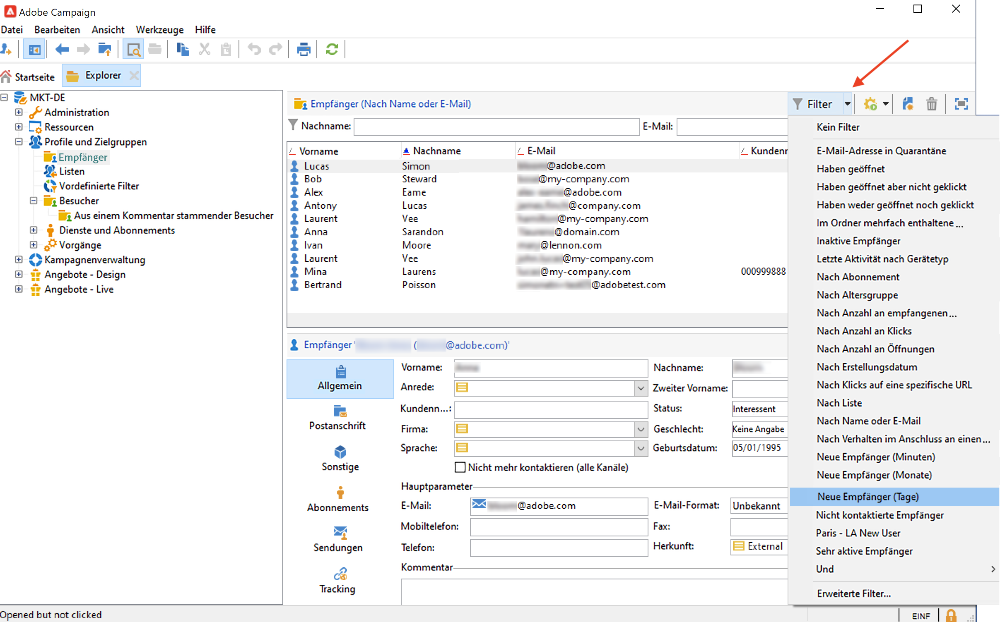

Sie können auf die Filterdetails im **[!UICONTROL Profile und Zielgruppen > Vordefinierte Filter]** -Knoten des Explorers.

>[!NOTE]
>
>Für alle anderen Datenlisten werden vordefinierte Filter im  **[!UICONTROL Administration > Konfiguration > Vordefinierte Filter]** Knoten.

Wählen Sie einen Filter aus, um dessen Definition anzuzeigen.

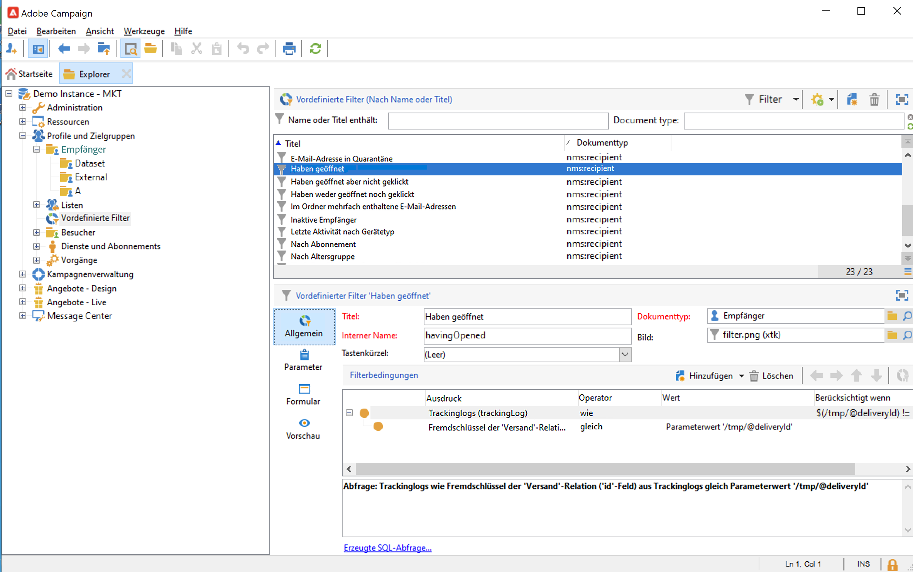

Verwenden Sie die letzte Registerkarte, um die gefilterten Daten in der Vorschau anzuzeigen.

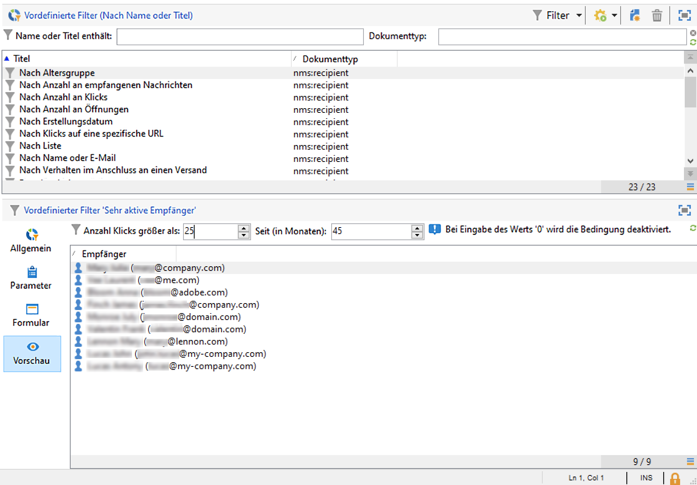

Integrierte vordefinierte Filter sind:

<table> 
 <tbody> 
  <tr> 
   <td> <strong>Titel</strong>  </td> 
   <td> <strong>Abfrage</strong>  </td> 
  </tr> 
  <tr> 
   <td> Haben geöffnet  </td> 
   <td> Auswahl der Empfänger, die einen Versand geöffnet haben.  </td> 
  </tr> 
  <tr> 
   <td> Haben geöffnet aber nicht geklickt  </td> 
   <td> Auswahl der Empfänger, die den angegebenen Versand geöffnet, aber keinen Link angeklickt haben.  </td> 
  </tr> 
  <tr> 
   <td> Inaktive Empfänger  </td> 
   <td> Auswahl der Empfänger, die seit der angegebenen Anzahl an Monaten keinen Versand geöffnet haben.  </td> 
  </tr> 
  <tr> 
   <td> Letzte Aktivität nach Gerätetyp  </td> 
   <td> Auswahl der Empfänger, die unter Verwendung eines Geräts vom Typ X den Versand Y in den letzten Z Tagen angeklickt oder geöffnet haben.  </td> 
  </tr> 
  <tr> 
   <td> Letzte Aktivität nach Gerätetyp (Tracking)  </td> 
   <td> Auswahl der Empfänger, die unter Verwendung eines Geräts vom Typ X den Versand Y in den letzten Z Tagen angeklickt oder geöffnet haben.  </td> 
  </tr> 
  <tr> 
   <td> Nicht kontaktierte Empfänger  </td> 
   <td> Auswahl der Empfänger, die seit X Monaten nicht über den Kanal Y kontaktiert wurden.  </td> 
  </tr> 
  <tr> 
   <td> Sehr aktive Empfänger  </td> 
   <td> Auswahl der Empfänger, die in den letzten X Monaten mindestens Y Mal geklickt haben.  </td> 
  </tr> 
  <tr> 
 <td> E-Mail-Adresse, die auf die Blockierungsliste gesetzt wurde  </td> 
    <td> Wählt Empfänger aus, deren E-Mail-Adresse sich auf der Blockierungsliste befindet.  </td>
  </tr> 
  <tr> 
   <td> E-Mail-Adresse in Quarantäne  </td> 
   <td> Auswahl der Empfänger, deren E-Mail-Adresse in Quarantäne ist.  </td> 
  </tr> 
  <tr> 
   <td> Im Ordner mehrfach enthaltene E-Mail-Adressen  </td> 
   <td> Auswahl der Empfänger, deren E-Mail-Adresse mehrfach im zugrunde liegenden Ordner enthalten ist.  </td> 
  </tr> 
  <tr> 
   <td> Haben weder geöffnet noch geklickt  </td> 
   <td> Auswahl der Empfänger, die den angegebenen Versand weder geöffnet noch darin auf einen Link geklickt haben.  </td> 
  </tr> 
  <tr> 
   <td> Neue Empfänger (Tage)  </td> 
   <td> Auswahl der Empfänger, die in den letzten X Tagen erstellt wurden.  </td> 
  </tr> 
  <tr> 
   <td> Neue Empfänger (Minuten)  </td> 
   <td> Auswahl der Empfänger, die in den letzten X Minuten erstellt wurden.  </td> 
  </tr> 
  <tr> 
   <td> Neue Empfänger (Monate)  </td> 
   <td> Auswahl der Empfänger, die in den letzten X Monaten erstellt wurden.  </td> 
  </tr> 
  <tr> 
   <td> Nach Abonnement  </td> 
   <td> Auswahl der Empfänger, die den angegebenen Dienst abonniert haben.  </td> 
  </tr> 
  <tr> 
   <td> Nach Klicks auf eine spezifische URL  </td> 
   <td> Auswahl der Empfänger, die im Versand X auf die URL Y geklickt haben.  </td> 
  </tr> 
  <tr> 
   <td> Nach Verhalten im Anschluss an einen Versand  </td> 
   <td> Auswahl der Empfänger, die nach Erhalt des Versands X mit dem Verhalten Y reagiert haben.  </td> 
  </tr> 
  <tr> 
   <td> Nach Erstellungsdatum  </td> 
   <td> Auswahl der Empfänger, die im Zeitraum von vor X bis Y Monaten (jeweils aktuelles Datum abzüglich n Monate) erstellt wurden.  </td> 
  </tr> 
  <tr> 
   <td> Nach Liste  </td> 
   <td> Auswahl der Empfänger, die der angegebenen Liste angehören.  </td> 
  </tr> 
  <tr> 
   <td> Nach Anzahl an Klicks  </td> 
   <td> Auswahl der Empfänger, die in den letzten X Monaten zwischen Y und Z Mal in Sendungen geklickt haben.  </td> 
  </tr> 
  <tr> 
   <td> Nach Anzahl an empfangenen Nachrichten  </td> 
   <td> Auswahl der Empfänger, die über den angegebenen Kanal in den letzten X Monaten zwischen Y und Z Nachrichten erhalten haben.  </td> 
  </tr> 
  <tr> 
   <td> Nach Anzahl an Öffnungen  </td> 
   <td> Auswahl der Empfänger, die in den letzten X Monaten zwischen Y und Z Sendungen geöffnet haben.  </td> 
  </tr> 
  <tr> 
   <td> Nach Name oder E-Mail  </td> 
   <td> Auswahl der Empfänger nach Nachname oder E-Mail-Adresse.  </td> 
  </tr> 
  <tr> 
   <td> Nach Altersgruppen  </td> 
   <td> Auswahl der Empfänger im Alter von X bis Y Jahren.  </td> 
  </tr> 
 </tbody> 
</table>

### Standardfilter{#default-filters}

In den Feldern oberhalb jeder Liste können Sie die **vordefinierter Standardfilter** für diese Liste. Für die Empfängerliste können Sie standardmäßig den Namen und die E-Mail-Adresse filtern.

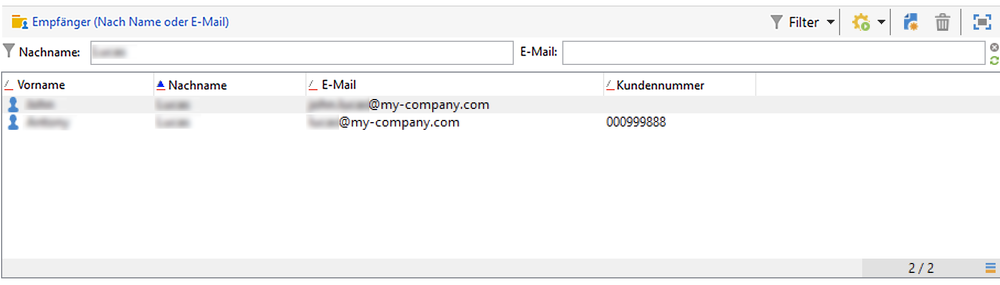

>[!NOTE]
>
>Die **%** ersetzt alle Zeichenfolgen. Geben Sie beispielsweise `%@gmail.com` im Feld E-Mail , um alle Profile mit einer Gmail-Adresse anzuzeigen. Eingabe `%@L` im Feld Nachname , um alle Profile mit L im Nachnamen anzuzeigen.

Um den Standardfilter für eine Empfängerliste zu ändern, navigieren Sie zum **[!UICONTROL Profile und Zielgruppen > Vordefinierte Filter]** Knoten.

Standardfilter für andere Datentypen werden im Verzeichnisknoten **[!UICONTROL Administration > Konfigurationen > Vordefinierte Filter]** konfiguriert.

Gehen Sie wie folgt vor:

1. Wählen Sie den Filter aus, der als Standardfilter dienen soll.
1. Klicken Sie auf den Tab **[!UICONTROL Parameter]** und kreuzen Sie die Option **[!UICONTROL Standardfilter für den verbundenen Dokumenttyp]** an.

   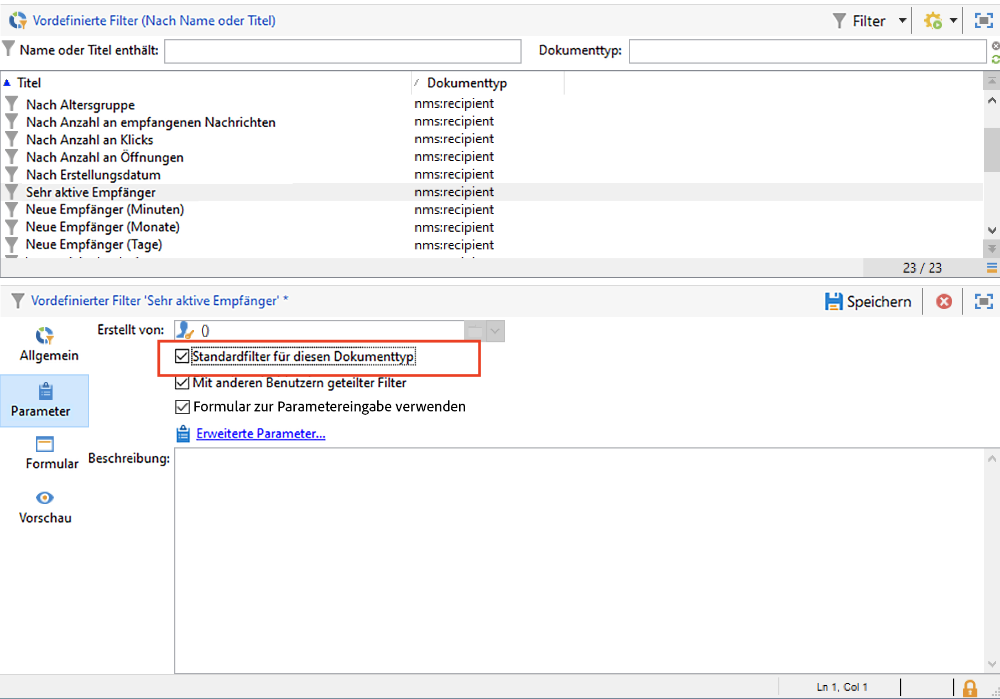

1. Deaktivieren Sie diese Option für den aktuellen vordefinierten Filter.
1. Klicken Sie auf die Schaltfläche **[!UICONTROL Speichern]**, um den Filter anzuwenden.
1. Navigieren Sie zum Ordner Empfänger und klicken Sie auf die Schaltfläche **[!UICONTROL Filter entfernen]** rechts neben dem aktuellen Filter: Der neue Standardfilter ist verfügbar.
   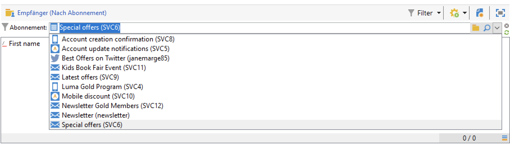

## Schnellfilter{#quick-filters}

Verwendung und Kombination **Schnellfilter** , um Filter für bestimmte Felder zu definieren.

Nach dem Hinzufügen werden über der Datenliste ein nach dem anderen Schnellfilterfeld angezeigt. Sie können unabhängig voneinander gelöscht werden.

Schnellfilter sind für jeden Benutzer spezifisch und werden jedes Mal neu initialisiert, wenn der Benutzer den Cache seiner Clientkonsole löscht.

Wenn Sie einen Filter wiederverwenden müssen, erstellen Sie eine **erweiterter Filter** und speichern Sie es. [Weitere Informationen](#advanced-filters).

So erstellen Sie eine **Schnellfilter** führen Sie die folgenden Schritte aus:

1. Klicken Sie mit der rechten Maustaste auf das Feld, nach dem Sie die Daten filtern möchten, und wählen Sie die Option **[!UICONTROL Nach diesem Feld filtern]** aus.

   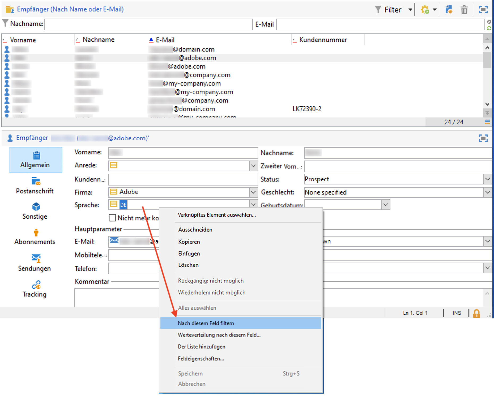

   Die Standard-Filterfelder werden oberhalb der Liste angezeigt.

   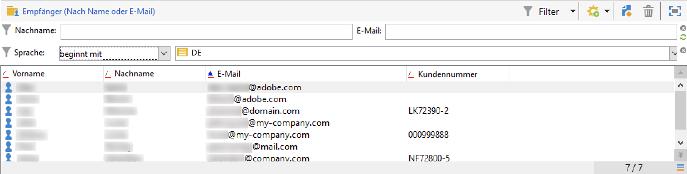

1. Wählen Sie die Filteroptionen aus.
1. Entfernen Sie bei Bedarf das graue Symbol rechts neben einem Filter.
1. Sie können Filter kombinieren, um den Filter zu verfeinern.

   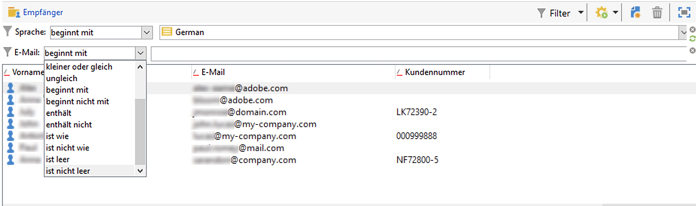

Wenn Sie ein Feld filtern müssen, das nicht im Formular verfügbar ist, dann in den Spalten und nach dieser Spalte filtern. Gehen Sie dazu wie folgt vor,

1. Klicken Sie auf **[!UICONTROL Liste konfigurieren]** Symbol.

   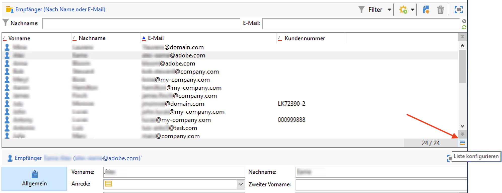

1. Wählen Sie die anzuzeigende Spalte aus, z. B. das Alter der Empfänger, und klicken Sie auf **Ok**.

   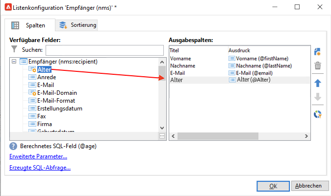

1. Klicken Sie anschließend mit der rechten Maustaste in der Empfängerliste auf die Spalte **Alter** und wählen Sie **[!UICONTROL Nach dieser Spalte filtern]** aus.

   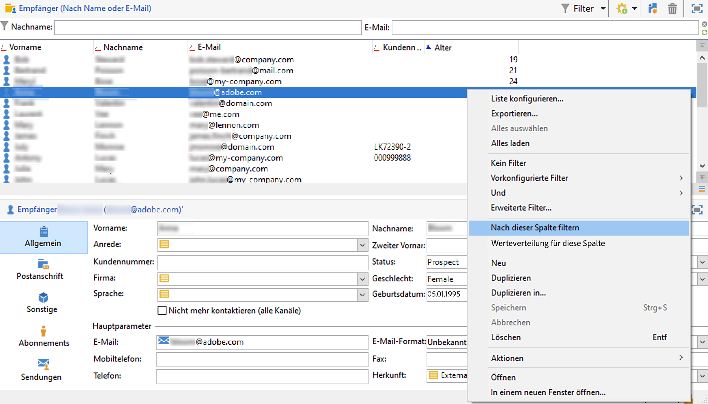

   Nun können Sie die Filteroptionen bezüglich des Alters auswählen. Fügen Sie einen weiteren Altersfilter hinzu, um einen Bereich zu definieren.

   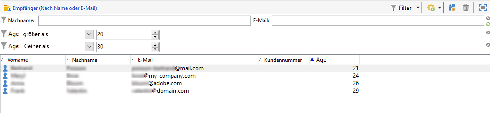

## Erweiterte Filter{#advanced-filters}

Kombinieren komplexer Kriterien in **Erweiterte Filter**. Verwenden Sie diese Filter, um eine komplexe Abfrage oder eine Kombination von Abfragen Ihrer Daten zu erstellen. Diese Filter können gespeichert und für andere Campaign-Benutzer freigegeben werden.

### Erweiterte Filter erstellen{#create-adv-filters}

So erstellen Sie eine **erweiterter Filter**, klicken Sie auf die **[!UICONTROL Filter]** Schaltfläche und wählen Sie **[!UICONTROL Erweiterte Filter...]**.

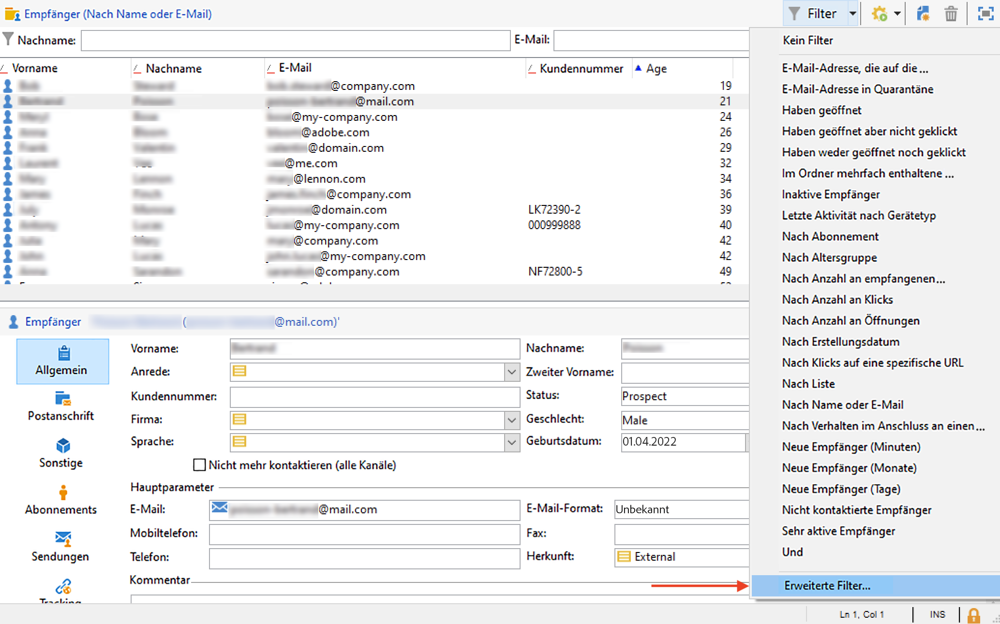

Sie können auch mit der rechten Maustaste auf die Datenliste klicken und **[!UICONTROL Erweiterte Filter...]**.

Filterbedingungen definieren. Im folgenden Beispiel filtern Sie nach Empfängern, deren Kundennummer nicht mit NL beginnt und die in Paris oder Los Angeles leben.

1. Klicken Sie auf **[!UICONTROL Ausdruck bearbeiten]** des **[!UICONTROL Ausdruck]** Spalte.

   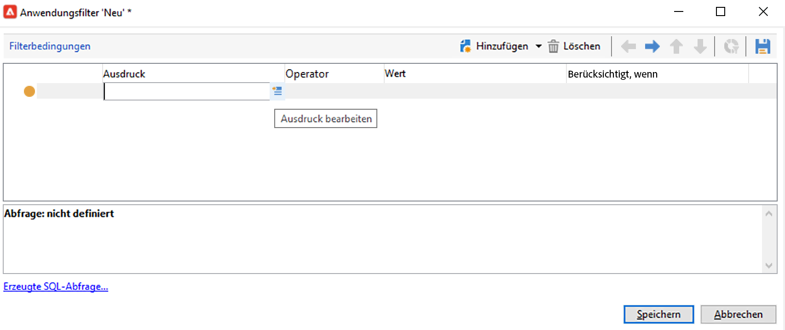

1. Wählen Sie das Feld aus, nach dem gefiltert werden soll.
1. Wählen Sie in der Dropdown-Liste den anzuwendenden Operator aus.

   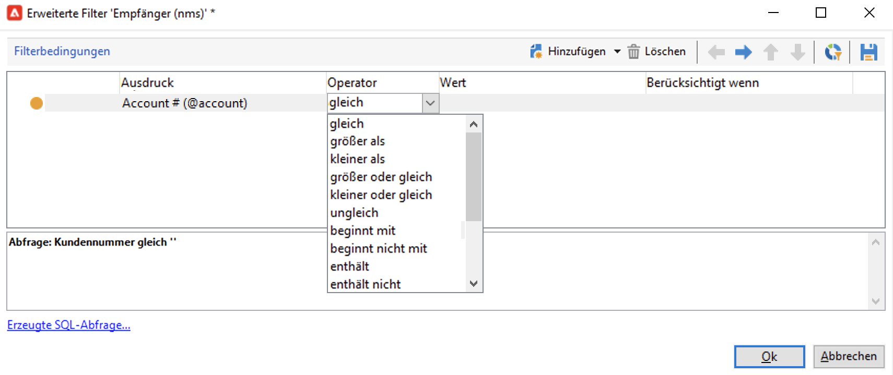

1. Geben Sie dann in der Spalte **[!UICONTROL Wert]** den Vergleichswert an. Sie können mehrere Filter kombinieren, um Ihre Abfrage zu verfeinern. Für jede weitere Filterbedingung klicken Sie auf die Schaltfläche **[!UICONTROL Hinzufügen]**.

   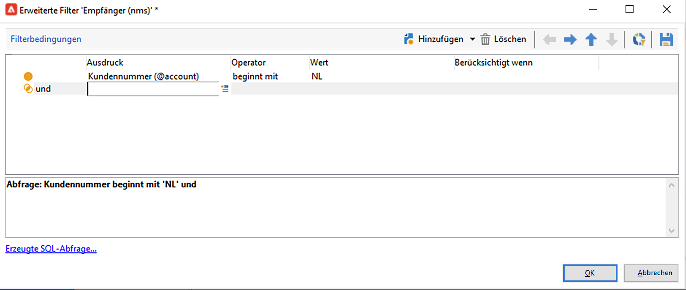

   >[!NOTE]
   >
   >Mithilfe der Pfeile in der Symbolleiste können Sie die Ausdrücke hierarchisch gliedern oder die Reihenfolge der Ausdrücke der Abfrage ändern.

1. Es stehen drei Operatoren zur Kombination von Ausdrücken zur Verfügung:  **und**, **Oder**, **Außer**. Klicken Sie auf den Pfeil, um zu **Oder**.

   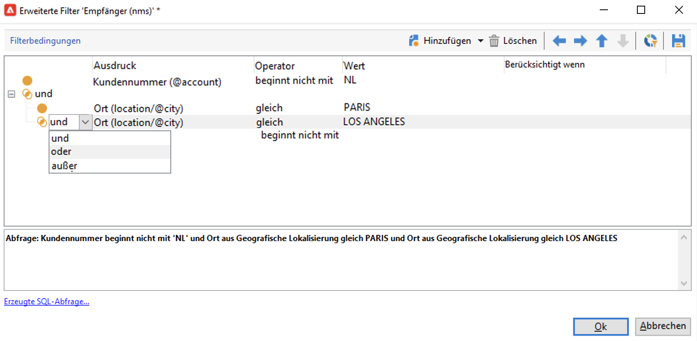

1. Klicken **[!UICONTROL Ok]** , um den Filter zu erstellen und ihn auf die aktuelle Liste anzuwenden.

Der angewendete Filter wird oberhalb der Liste angezeigt.

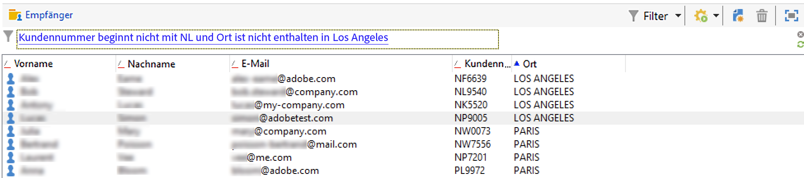

Um diesen Filter zu bearbeiten oder zu ändern, klicken Sie auf den Link mit der Beschreibung in Blau oberhalb der Liste.

### Erweiterte Filter speichern{#save-adv-filters}

Erweiterte Filter können als  [vordefinierter Filter](#predefined-filters), damit Sie sie wiederverwenden und für andere Campaign-Benutzer freigeben können.

Gehen Sie wie folgt vor, um einen erweiterten Filter zu speichern:

1. Klicken Sie auf die Beschreibung des Filters, um ihn zu bearbeiten.
1. Klicken Sie auf **[!UICONTROL Als Filter speichern]** rechts oben im Fenster.

   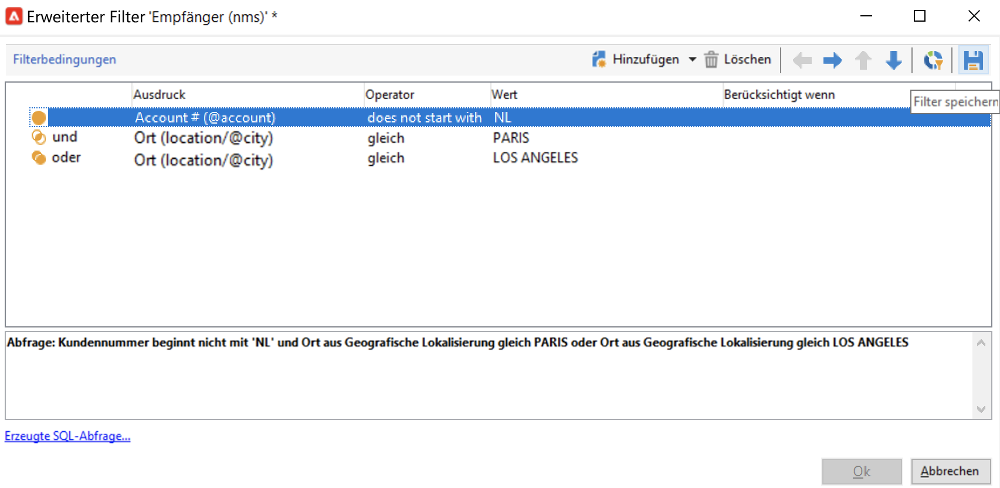

1. Geben Sie einen Namen für diesen Filter ein und speichern Sie ihn.

   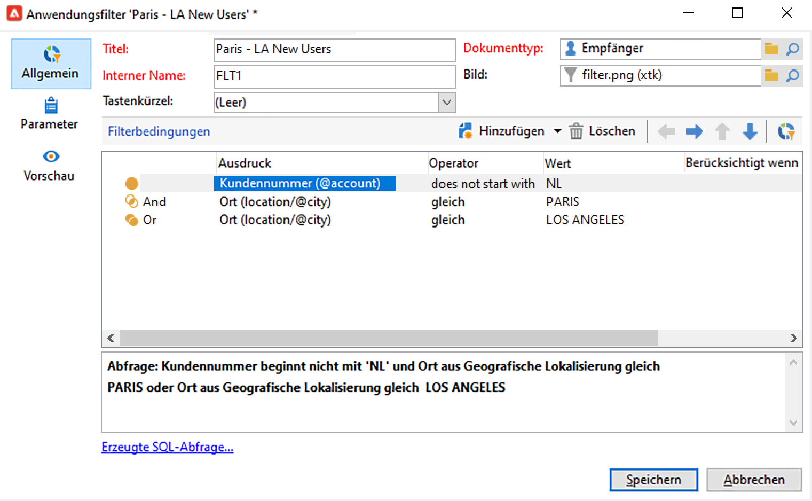

Der Filter wird zum [vordefinierte Filter](#predefined-filters). Sie kann von diesem Knoten aus aktualisiert werden.

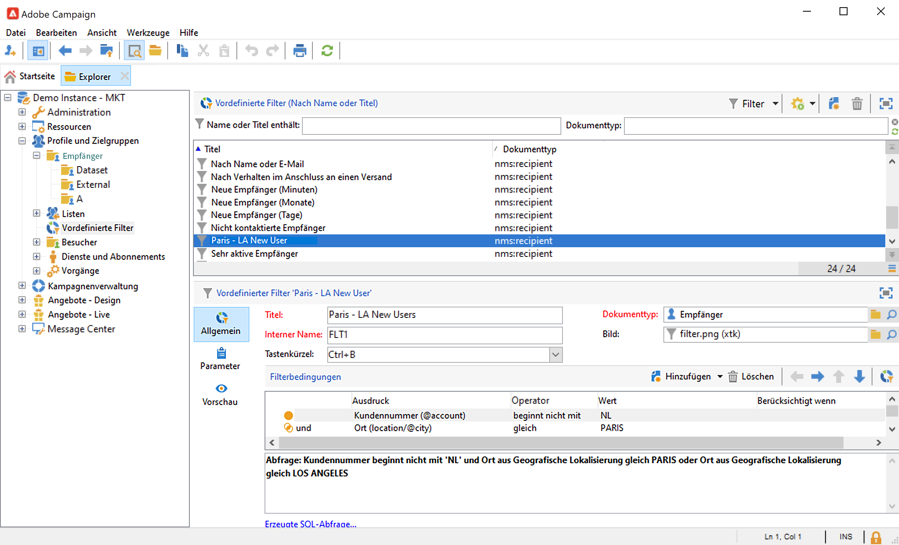

>[!NOTE]
>
>Sie können einen Tastaturbefehl für Ihren Filter hinzufügen, um ihn über Ihre Tastatur zu aktivieren.

Dieser Filter ist auch in den vordefinierten Filtern der Empfängerliste verfügbar.

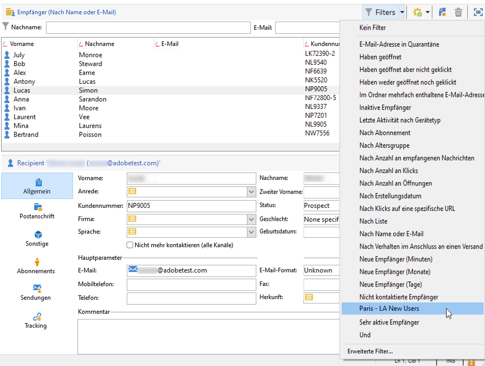

### Verwenden Sie einen Filter, um ein Segment zu definieren {#filter-as-segment}

Sie können Filter verwenden und kombinieren, um ein Zielgruppensegment zu erstellen.

Nach dem Speichern sind erweiterte Filter verfügbar, wenn Sie die Zielpopulation einer Nachricht im **[!UICONTROL Benutzerfilter]** Abschnitt.

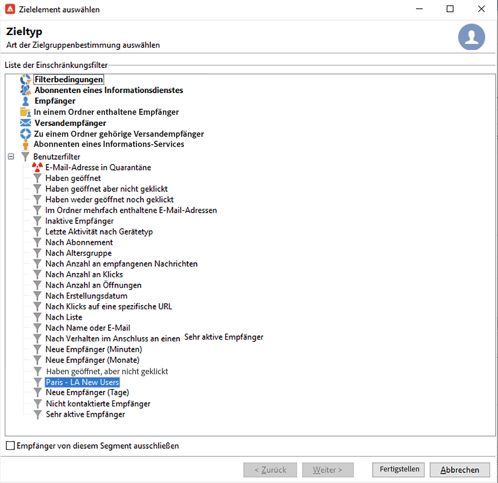

>[!NOTE]
>
>Verwenden Sie die **[!UICONTROL Empfänger aus diesem Segment ausschließen]** , um nur Kontakte auszuwählen, die nicht den Filterkriterien entsprechen.

### Verwenden von Funktionen zum Erstellen erweiterter Filter{#use-functions-adv-filters}

Verwenden Sie Funktionen zur Definition des Inhalts des Filters, um erweiterte Filterfunktionen durchzuführen. Der erweiterte Filter-Editor nutzt alle Funktionen des Campaign-Abfrageeditors.

Erfahren Sie, wie Sie in der Dokumentation zu Adobe Campaign Classic v7 erweiterte Abfragen erstellen. Beispiel:

* Erfahren Sie, wie Sie in einfache Empfängerattribute auswählen können. [Dokumentation zu Adobe Campaign Classic v7](https://experienceleague.adobe.com/docs/campaign-classic/using/automating-with-workflows/targeting-activities/query.html?lang=en#example--targeting-on-simple-recipient-attributes){target=&quot;_blank&quot;}.
* Informationen zum Filtern von Empfängern, die in den letzten sieben Tagen nicht kontaktiert wurden, finden Sie unter [Dokumentation zu Adobe Campaign Classic v7](https://experienceleague.adobe.com/docs/campaign-classic/using/automating-with-workflows/use-cases/designing-queries/querying-using-many-to-many-relationship.html?lang=de){target=&quot;_blank&quot;}.
* Informationen dazu, wie Sie die Benutzerliste abrufen können, finden Sie unter [Dokumentation zu Adobe Campaign Classic v7](https://experienceleague.adobe.com/docs/campaign-classic/using/automating-with-workflows/use-cases/designing-queries/creating-a-filter.html){target=&quot;_blank&quot;}.
* Erfahren Sie, wie Sie eine Geburtstags-E-Mail-Zielgruppe erstellen in  [Dokumentation zu Adobe Campaign Classic v7](https://experienceleague.adobe.com/docs/campaign-classic/using/automating-with-workflows/use-cases/deliveries/sending-a-birthday-email.html?lang=en#identifying-recipients-whose-birthday-it-is){target=&quot;_blank&quot;}.

### Erweiterte Parameter für vordefinierte Filter {#param-for-data-filters}

Erweiterte Parameter sind für vordefinierte Filter verfügbar. Um darauf zuzugreifen, navigieren Sie zum **[!UICONTROL Parameter]** im Filter.

* Um den Filter standardmäßig für alle Listen anzuzeigen, die auf diesem Dokumenttyp basieren, wählen Sie die **[!UICONTROL Standardfilter für den zugehörigen Dokumenttyp]** -Option.

   Beispiel: die **[!UICONTROL Nach Name oder Login]** Filter wird auf Operatoren angewendet Diese Option ist ausgewählt, sodass der Filter immer auf allen Benutzerlisten angezeigt wird.

* Um einen Filter für alle Campaign-Benutzer verfügbar zu machen, wählen Sie die  **[!UICONTROL Mit anderen Benutzern geteilter Filter]** -Option.

* Um ein Formular zur Auswahl der Filterkriterien zu definieren, wählen Sie die  **[!UICONTROL Eingabeformular für Parameter verwenden]** -Option. Dieses Formular muss im XML-Format im **[!UICONTROL Formular]** Registerkarte. Beispielsweise der integrierte vordefinierte Filter **[!UICONTROL Empfänger, die geöffnet haben]** zeigt ein Filterfeld an, in dem Sie den Versand auswählen können, für den der Filter gilt.

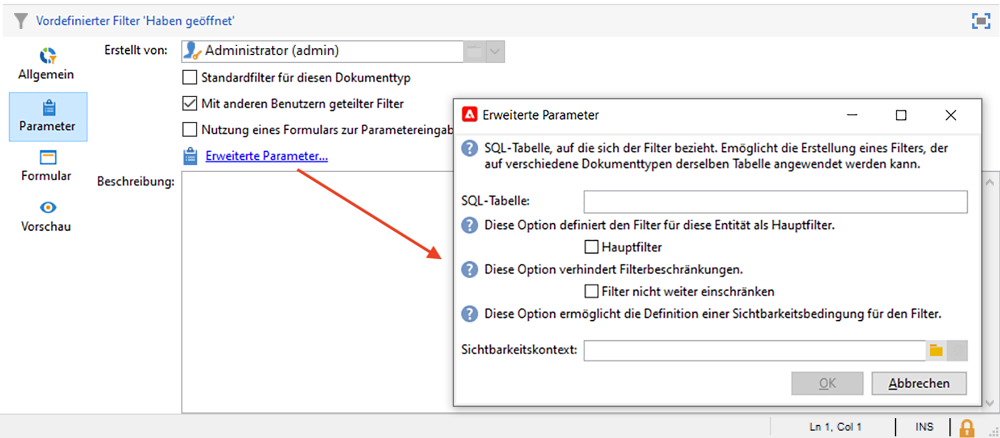

* Die **[!UICONTROL Erweiterte Parameter]** -Link können Sie zusätzliche Einstellungen definieren.

   * Sie können eine SQL-Tabelle mit dem Filter verknüpfen, um ihn für alle Editoren freizugeben, die die Tabelle gemeinsam nutzen.
   * Um zu verhindern, dass Benutzer den Filter überschreiben, wählen Sie die **[!UICONTROL Den Filter nicht einschränken]** -Option. Diese Option ist beispielsweise für die Filter &quot;Versandempfänger&quot; und &quot;Zu einem Ordner gehörende Empfänger von Sendungen&quot; aktiv, die im Versand-Assistenten verfügbar sind. Diese Filter können nicht überschrieben werden.
