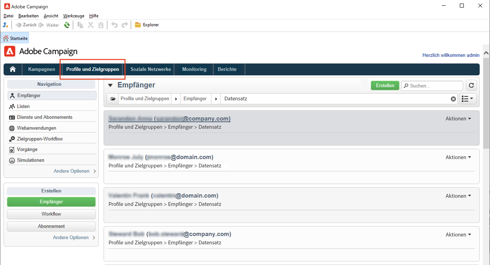
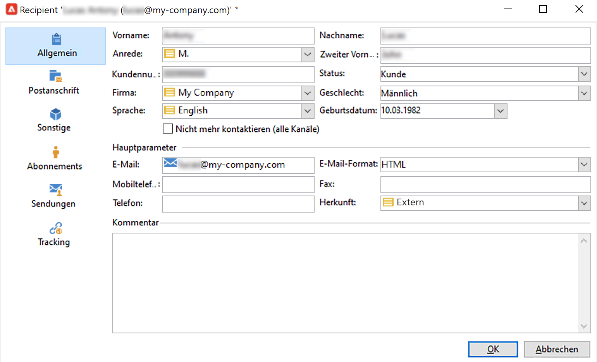

# Manuelles Erstellen von Profilen{#create-profiles-manual}

Um Ihre Campaign-Datenbank zu füllen, können Sie [Profile importieren](import-profiles.md) oder wie unten beschrieben manuell hinzufügen.

Gehen Sie wie folgt vor, um einen Empfänger manuell zu erstellen:

1. Gehen Sie zur Registerkarte **[!UICONTROL Profile und Zielgruppen]** und wählen Sie die Kategorie **[!UICONTROL Empfänger]** aus.

   

   Standardmäßig werden Empfänger in der Baumstruktur im Knoten **[!UICONTROL Profile und Zielgruppen > Empfänger]** gespeichert. Sie können Empfänger auch in dieser Ansicht erstellen.

1. Klicken Sie auf die Schaltfläche **[!UICONTROL Erstellen]**.
1. Machen Sie die erforderlichen Angaben zum Profil.

   

   Auf [dieser Seite](view-profiles.md#edit-a-profiles) erfahren Sie mehr über das integrierte Empfängerformular.

1. Klicken Sie auf **[!UICONTROL Speichern]**: Das Profil wird zum Standard-Empfängerordner in Campaign hinzugefügt.
