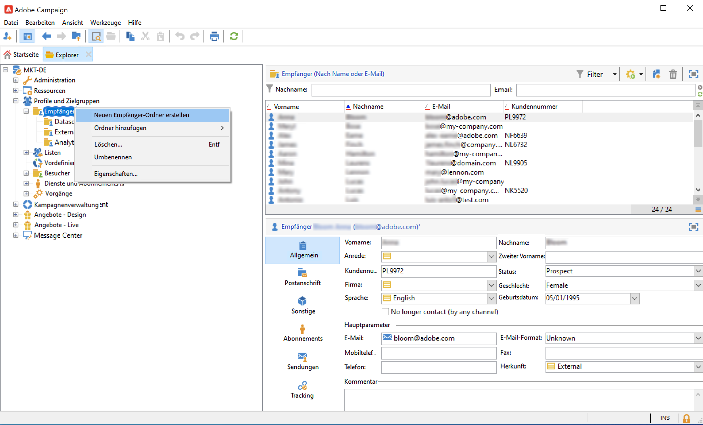
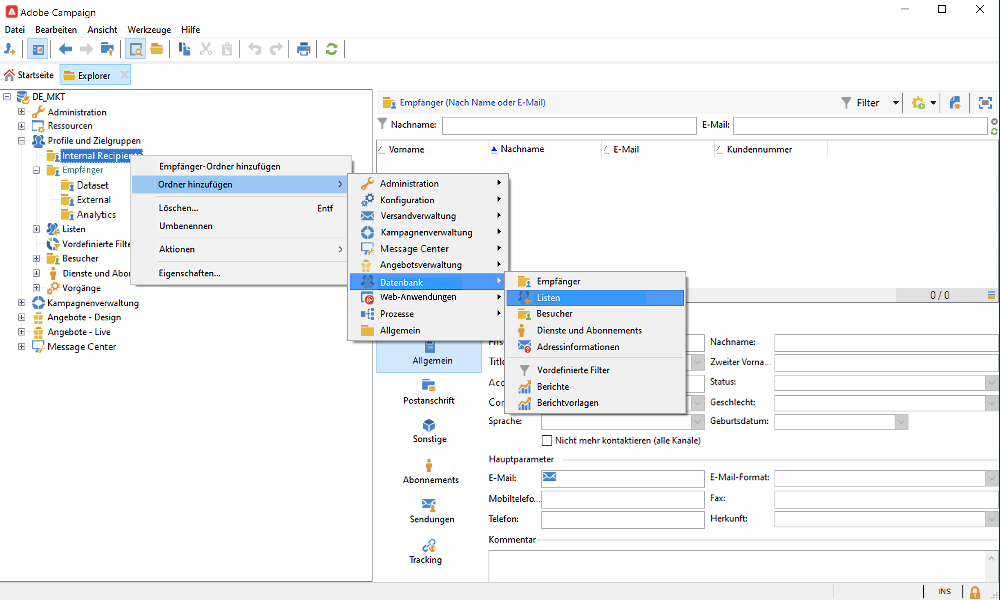
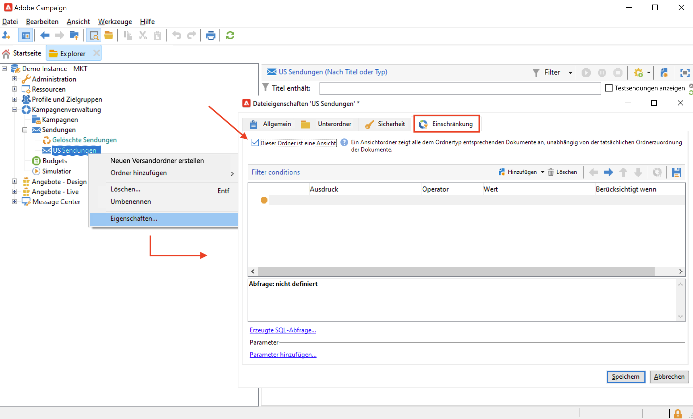
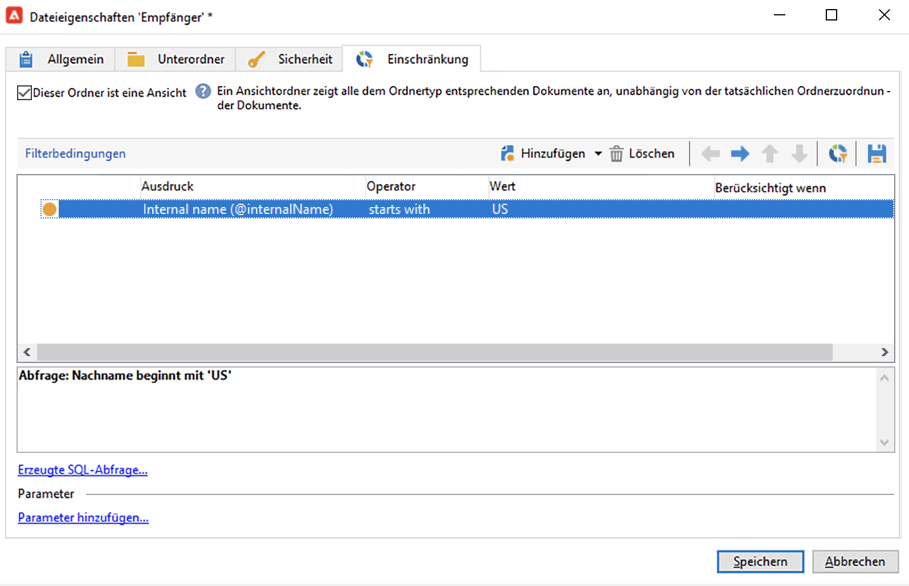
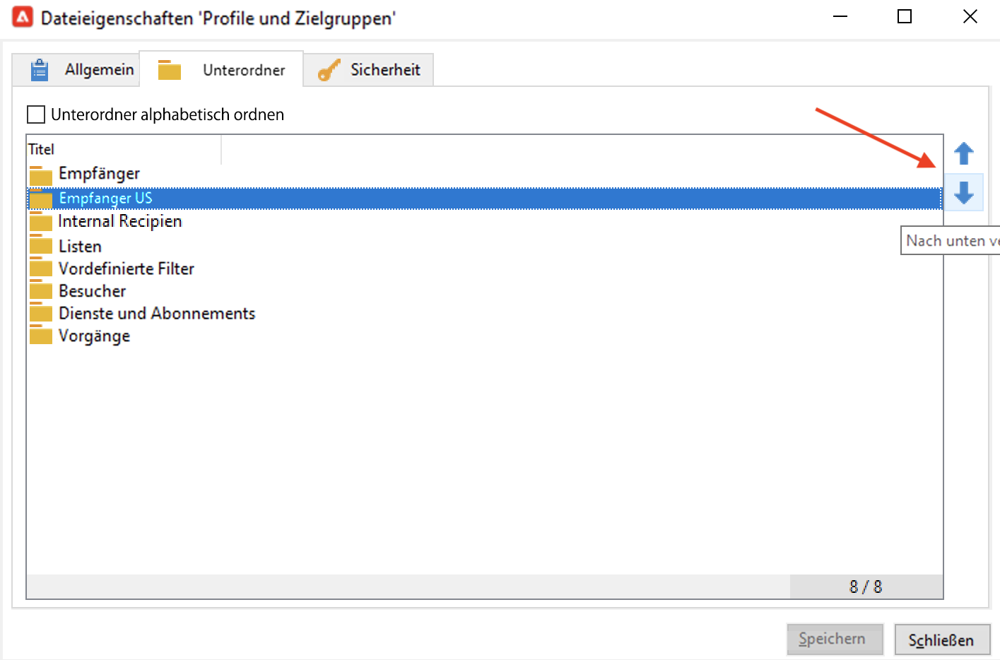
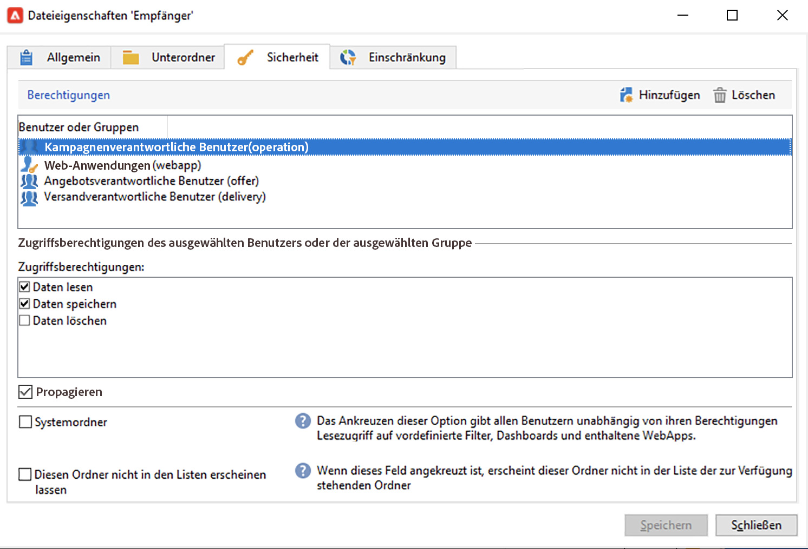

# Verwalten von Ordnern und Ansichten {#folders-and-views}

Campaign-Ordner sind Knoten in der Explorer-Baumstruktur. Je nach Typ enthalten sie bestimmte Datentypen. 

Eine Ansicht ist ein spezieller Ordner, der keine Daten enthält, aber Daten anzeigt, die physisch in anderen Ordnern desselben Typs gespeichert sind. Wenn Sie beispielsweise einen Versandordner in eine Ansicht umwandeln, werden in diesem Ordner alle Sendungen angezeigt. Diese Daten können dann gefiltert werden.

>[!NOTE]
>Um Ansichten von Standardordnern zu unterscheiden, wird ihr Name in hellblau anstelle von schwarz angezeigt.

Beachten Sie, dass Sie Ordnern Berechtigungen zuweisen können, um den Zugriff auf bestimmte Daten zu beschränken. [Weitere Informationen](#restrict-access-to-a-folder)

## Best Practices beim Arbeiten mit Ordnern

* **Verwenden Sie integrierte Ordner**, um es allen am Projekt beteiligten Personen zu erleichtern, die Anwendung zu verwenden, zu warten und Fehler zu beheben. Sie sollten keine benutzerdefinierten Ordnerstrukturen für Empfänger, Listen, Sendungen usw. erstellen, sondern Standardordner wie etwa **Administration**, **Profile und Zielgruppen** und **Kampagnenverwaltung** verwenden.

* **Erstellen Sie Unterordner**, speichern Sie beispielsweise technische Workflows im integrierten Ordner: **[!UICONTROL Administration > Produktion > Technische Workflows]**, und erstellen Sie für jeden Workflow-Typ Unterordner.

* **Definieren und verwenden Sie eine Namenskonvention**. Sie können beispielsweise die Workflows in alphabetischer Reihenfolge benennen, sodass sie in der Ausführungsreihenfolge sortiert werden, z. B.:

   A1 – Empfänger importieren, beginnt um 10:00 Uhr;
A2 – Tickets importieren, beginnt um 11:00 Uhr.

## Erstellen von Ordnern{#create-a-folder}

Klicken Sie zum Erstellen eines Ordners mit der rechten Maustaste auf einen vorhandenen Ordner und verwenden Sie das Kontextmenü.

Um denselben Ordnertyp wie den von Ihnen ausgewählten zu erstellen, wählen Sie die erste Option im Kontextmenü aus. Wählen Sie beispielsweise im Ordner &quot;Empfänger&quot; die Option **[!UICONTROL Neuen Ordner &#39;Empfänger&#39; erstellen]**.

Sie können den neuen Ordner per Drag-and-drop verschieben, um die Campaign Explorer-Baumstruktur nach Bedarf zu ordnen.

Um einen anderen Ordnertyp zu erstellen, klicken Sie mit der rechten Maustaste auf einen vorhandenen Ordner und wählen Sie **[!UICONTROL Neuen Ordner hinzufügen]**. Je nach den zu speichernden Daten können Sie alle Ordnertypen erstellen.

>[!CAUTION]
>Diese Änderungen gelten für alle Campaign-Benutzer.

## Umwandeln eines Ordners in eine Ansicht{#turn-a-folder-to-a-view}

Eine Ansicht ist ein spezieller Ordner, der keine Daten enthält, aber Daten anzeigt, die physisch in anderen Ordnern desselben Typs gespeichert sind.

Sie können jeden Ordner in eine Ansicht umwandeln, der Ordner muss jedoch leer sein. Alle im Ordner gespeicherten Daten werden gelöscht, wenn Sie den Ordner in eine Ansicht umwandeln.

>[!CAUTION]
>
>In einer Ansicht werden Daten angezeigt und der Zugriff darauf wird ermöglicht, selbst wenn die Daten nicht physisch im Ansichtsordner gespeichert sind. Um Zugriff auf die Inhalte zu erhalten, muss der Benutzer über die entsprechenden Berechtigungen in den Quellordnern verfügen, zumindest über Lesezugriff.
>
>Um Zugriff auf eine Ansicht zu gewähren, ohne Zugriff auf den Quellordner zu gewähren, darf kein Lesezugriff auf den übergeordneten Knoten des Quellordners gewährt werden.

Im folgenden Beispiel erstellen wir einen neuen Ordner, in dem nur US-Sendungen basierend auf ihrem internen Namen angezeigt werden.

1. Erstellen Sie einen **[!UICONTROL Versand]**-Ordner und benennen Sie ihn **US-Sendungen**.
1. Klicken Sie mit der rechten Maustaste auf diesen Ordner und wählen Sie **[!UICONTROL Eigenschaften...]** aus.
1. Wählen Sie im Tab **[!UICONTROL Einschränkung]** die Option **[!UICONTROL Dieser Ordner ist eine Ansicht]**: Nun werden alle Sendungen der Datenbank in diesem Ordner angezeigt.

   

1. Definieren Sie im mittleren Bereich des Fensters im Abfrage-Tool die Filterkriterien: Nur die dem Filter entsprechenden Sendungen werden im Ordner angezeigt.

   

   >[!NOTE]
   >
   >Auf [dieser Seite](create-filters.md#advanced-filters) erfahren Sie, wie Sie Abfragen erstellen

>[!CAUTION]
>
>Bei der Verwaltung von Ereignissen des Typs [Transaktionsnachrichten](../send/transactional.md) dürfen die Ordner **[!UICONTROL Echtzeitereignisse]** oder **[!UICONTROL Batch-Ereignisse]** auf den Ausführungsinstanzen nicht als Ansichten festgelegt werden, da dies zu Problemen mit den Zugriffsrechten führen kann.

## Organisieren von Ordnern{#organize-your-folders}

Standardmäßig wird ein neuer Ordner oben in der Hierarchie hinzugefügt.

Durchsuchen Sie die Registerkarte **Unterordner** in den Dateieigenschaften, um die Unterordner zu organisieren.

Sie können die Ordner mit den Pfeilen auf der rechten Seite verschieben oder die Option **[!UICONTROL Sortieren der Unterordner in alphabetischer Reihenfolge]** auswählen, um sie automatisch zu sortieren.

## Filtern von Daten in einem Ordner{#filter-data-in-a-folder}

Um in einem Ordner gespeicherte Daten zu filtern, greifen Sie auf die Dateieigenschaften zu und wählen Sie die Registerkarte &quot;Einschränkung&quot; aus.

Der folgende Ordner enthält beispielsweise nur Kontakte mit einer E-Mail-Adresse, deren Ursprung nicht als &quot;extern&quot; gekennzeichnet oder leer ist.

## Beschränken des Zugriffs auf einen Ordner{#restrict-access-to-a-folder}

Verwenden Sie Berechtigungen für Ordner, um den Zugriff auf Campaign-Daten zu organisieren und zu steuern.

Gehen Sie wie folgt vor, um Berechtigungen für einen bestimmten Campaign-Ordner zu bearbeiten:

1. Klicken Sie mit der rechten Maustaste auf den entsprechenden Ordner und wählen Sie **[!UICONTROL Eigenschaften...]**.
1. Klicken Sie auf die Registerkarte **[!UICONTROL Sicherheit]**, um die Berechtigungen bezüglich des Ordners anzuzeigen.

   

* Um **eine Gruppe oder einen Benutzer zu autorisieren**, klicken Sie auf den Button **[!UICONTROL Hinzufügen]** und wählen Sie die Gruppe oder den Benutzer aus, denen Berechtigungen für diesen Ordner zugewiesen werden sollen.
* Um **einer Gruppe oder einem Benutzer den Zugriff zu verbieten**, klicken Sie auf **[!UICONTROL Löschen]** und wählen Sie die Gruppe oder den Benutzer aus, um deren Autorisierung für diesen Ordner zu entfernen.
* Um **Berechtigungen einer Gruppe oder eines Benutzers auszuwählen**, wählen Sie hierzu die betroffene Gruppe oder den Benutzer aus und wählen Sie die Zugriffsrechte aus, die Sie gewähren möchten, und heben Sie die Auswahl der anderen auf.

### Ausdehnen von Berechtigungen {#propagate-permissions}

Um Berechtigungen und Zugriffsberechtigungen auszudehnen, wählen Sie in den Ordnereigenschaften die Option **[!UICONTROL Ausdehnen]**.

Die in diesem Fenster definierten Berechtigungen werden dann auf alle Unterordner des aktuellen Knotens angewendet. Sie können zu jeder Zeit diese Berechtigungen für jeden Unterordner überschreiben.

>[!NOTE]
>
>Wenn Sie die Option **[!UICONTROL Ausdehnen]** für einen Ordner abwählen, ist sie nicht automatisch auch für alle Unterordner dieses Ordners abgewählt. Sie muss für jeden Unterordner einzeln abgewählt werden.

### Allen Benutzern Zugriff gewähren {#grant-access-to-all-operators}

Wählen Sie auf der Registerkarte **[!UICONTROL Sicherheit]** den **[!UICONTROL Systemordner]** aus, um allen Benutzern ungeachtet ihrer Berechtigungen Zugriff zu gewähren.

Wenn diese Option abgewählt ist, müssen Sie den Benutzer (oder seine Gruppe) explizit wieder in die Liste der Berechtigungen aufnehmen, damit er Zugriff erhält.
