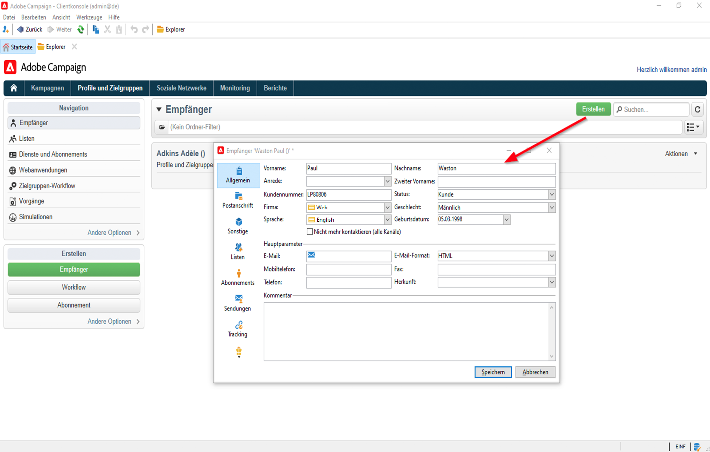

# Erste Schritte mit Profilen und Audiences in Campaign{#gs-profiles-and-audiences}

Profile sind in der Campaign-Datenbank gespeicherte Kontakte, z. B. Kunden, Abonnenten eines Services oder potenzielle Kunden. Die Akquise von Profilen und die Datenbankerstellung können auf viele verschiedene Weisen erfolgen: Online-Akquise über Web-Formulare, manueller oder automatisierter Import von Textdateien, Replikation von bereits existierenden Datenbanken oder Informationssystemen des Unternehmens. Mit Adobe Campaign können Sie Marketing-Verlauf, Kaufinformationen, Voreinstellungen, CRM-Daten und alle relevanten PI-Daten in eine konsolidierte Ansicht integrieren, um sie zu analysieren und Maßnahmen zu ergreifen. Profile enthalten alle Informationen, die für Zielgruppenbestimmung, Qualifizierung und Tracking von Personen erforderlich sind.

Ein Profil ist ein Datensatz in der Tabelle **nmsRecipient** oder einer externen Tabelle, in der alle Profilattribute wie Vorname, Nachname, E-Mail-Adresse, Cookie-ID, Kunden-ID, Smartphone-Kennung oder andere für einen bestimmten Kanal relevante Informationen gespeichert werden. Andere mit der Empfängertabelle verknüpfte Tabellen enthalten profilbezogene Daten, z. B. die Tabelle &quot;Versand-Logs&quot;, die die Datensätze aller an Empfänger gesendeten Sendungen enthält. Weitere Informationen zu den in Campaign integrierten Profil- und Empfängertabellen finden Sie in [diesem Abschnitt](../dev/datamodel.md#ootb-profiles).

In Adobe Campaign sind die Standardprofile für Sendungen (E-Mails, SMS usw.) die **Empfänger**. Mit den in der Datenbank gespeicherten Empfängerdaten können Sie die Zielgruppe filtern, die einen bestimmten Versand erhalten soll, und Personalisierungsdaten in den Versandinhalt einfügen. In der Datenbank gibt es noch andere Arten von Profilen. Sie sind für unterschiedliche Zwecke gedacht. So werden beispielsweise Testprofile erstellt, um Ihre Sendungen zu testen, bevor sie an die endgültige Zielgruppe gesendet werden.

Um Profildaten zu Adobe Campaign hinzuzufügen, haben Sie folgende Möglichkeiten:

* [Importieren von Datendateien](../start/import.md) aus einer externen Datenquelle, z. B. einem CRM-System
* [Erstellen von Web-Formularen](../dev/webapps.md), damit Kunden selbst Informationen eingeben und ihr eigenes Profil erstellen können
* [Zuordnen zu einer externen Datenbank](../connect/fda.md), in der Profile gespeichert werden
* Manuelles Eingeben von Profilen über die Client-Konsole, wie unten beschrieben:

<!--You can also select your message audience in an external file: recipients are stored not in the database, but in files. These are known as “external” deliveries. These contacts can be imported or not in Adobe Campaign. [Learn more](external-profiles.md).-->
