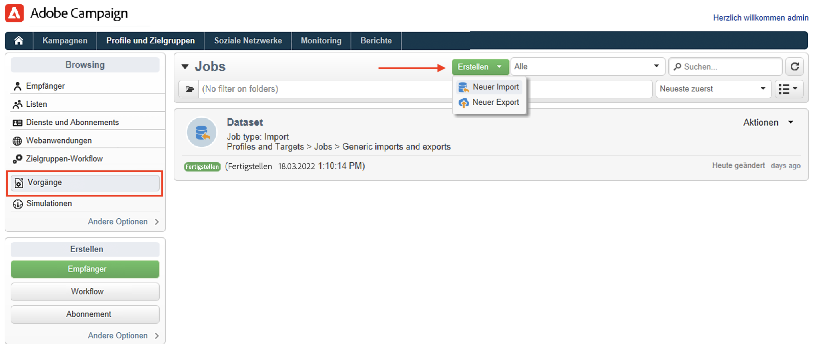

# Importieren von Profilen aus einer Datei{#create-profiles}

Um Ihre Campaign-Datenbank zu füllen, können Sie [Profile manuell hinzufügen](create-profiles.md) oder wie unten beschrieben importieren Sie können auch importierte Dateien verwenden, um Kontaktdaten zu aktualisieren.

## Importieren von Profilen mit einem Workflow {#import-profiles-with-a-wf}

Workflows können eine nützliche Methode sein, um einige Ihrer Importprozesse zu automatisieren. Unabhängig davon, ob Sie Daten aus einer lokalen Datei oder aus einem SFTP-Server importieren, können Sie Workflows verwenden, um Ihre Datenverwaltungsverfahren zu standardisieren.

### Daten aus einer Liste verwenden: Liste lesen {#data-from-read-list}

Bereiten Sie Ihre Daten in einer Datei vor und strukturieren Sie sie, um sie mithilfe eines Workflows zu importieren. [Weitere Informationen](https://experienceleague.adobe.com/docs/campaign/automation/workflows/wf-activities/targeting-activities/read-list.html?lang=de){target="_blank"}.

### Daten aus einer Datei laden {#data-from-a-file}

Die im Workflow verarbeiteten Daten können aus einer strukturierten Datei extrahiert werden, sodass sie in Adobe Campaign importiert werden können. [Weitere Informationen](https://experienceleague.adobe.com/docs/campaign/automation/workflows/wf-activities/action-activities/data-loading--file-.html?lang=de){target="_blank"}.

Nachdem die Daten erfasst wurden, können Sie sie in Ihren Workflows verwenden, um beispielsweise einen Versand anzureichern oder die Datenbank zu aktualisieren. Weiterführende Informationen hierzu finden Sie in [diesem Abschnitt](https://experienceleague.adobe.com/docs/campaign/automation/workflows/introduction/use-workflow-data.html?lang=de){target="_blank"}.

## Einmalige Importe{#import-jobs}

Adobe Campaign bietet eine allgemeine Importfunktion, mit der Sie beispielsweise eine Liste von Kunden oder potenziellen Kunden extrahieren können, die dann Teil einer Zielpopulation werden, oder Sie können Ihre Datenbank mit Daten aus externen Dateien versorgen.

Allgemeine Importe werden über das Menü **[!UICONTROL Profile und Zielgruppen > Aufträge]** auf der Adobe Campaign-Startseite verwaltet.

Die Schritte zum Ausführen eines allgemeinen Imports werden in der [Dokumentation zu Campaign Classic v7 ](https://experienceleague.adobe.com/docs/campaign-classic/using/getting-started/importing-and-exporting-data/generic-imports-exports/about-generic-imports-exports.html?lang=de#getting-started){target="_blank"}.
