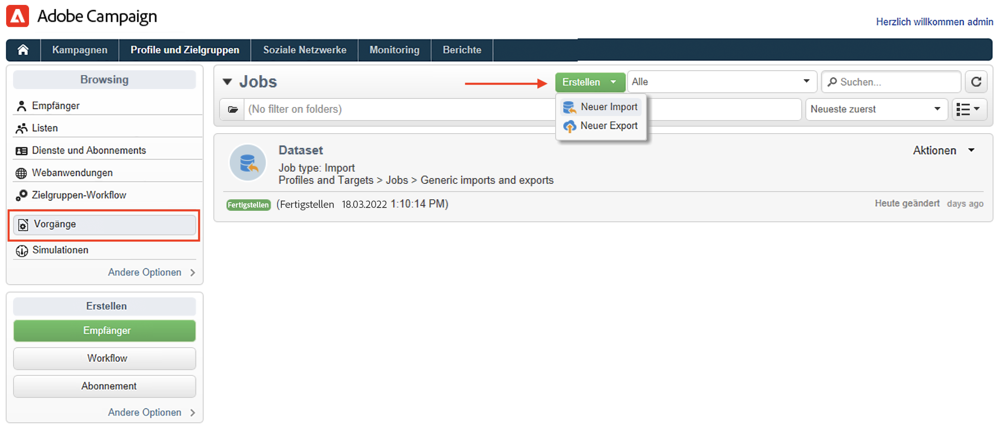

# Profile aus einer Datei importieren{#create-profiles}

Um Ihre Campaign-Datenbank zu füllen, können Sie [Profile manuell hinzufügen](create-profiles.md) oder importieren Sie Profile wie unten beschrieben. Sie können auch importierte Dateien verwenden, um Kontaktdaten zu aktualisieren.

## Importieren von Profilen mit einem Workflow {#import-profiles-with-a-wf}

Workflows sind eine nützliche Methode, um Importverfahren zu automatisieren. Sie helfen Ihnen bei der Standardisierung Ihrer Datenverwaltungsaufgaben, egal ob Sie Daten von einer lokalen Datei oder von einem SFTP-Server importieren.

### Daten aus einer Liste verwenden: Liste lesen {#data-from-read-list}

Bereiten Sie Ihre Daten in einer Datei vor und strukturieren Sie sie mithilfe eines Workflows.

Weiterführende Informationen zur Verwendung der Aktivität Liste lesen in Workflows finden Sie im Abschnitt [Dokumentation zu Campaign Classic v7](https://experienceleague.adobe.com/docs/campaign-classic/using/automating-with-workflows/targeting-activities/read-list.html){target=&quot;_blank&quot;}.

### Daten aus einer Datei laden {#data-from-a-file}

Die im Workflow verarbeiteten Daten können aus einer strukturierten Datei stammen, die in Adobe Campaign importiert wird.

Eine Beschreibung der Aktivität zum Laden von Daten finden Sie im Abschnitt [Dokumentation zu Campaign Classic v7](https://experienceleague.adobe.com/docs/campaign-classic/using/automating-with-workflows/action-activities/data-loading--file-.html){target=&quot;_blank&quot;}.

Nachdem die Daten erfasst wurden, können Sie sie in Ihren Workflows verwenden, um beispielsweise einen Versand anzureichern oder die Datenbank zu aktualisieren. Weitere Informationen hierzu finden Sie unter [Dokumentation zu Campaign Classic v7]https://experienceleague.adobe.com/docs/campaign-classic/using/automating-with-workflows/introduction/how-to-use-workflow-data.htmll){target=&quot;_blank&quot;}.

## Einmalige Importe{#import-jobs}

Adobe Campaign bietet eine allgemeine Importfunktion, mit der Sie beispielsweise eine Liste von Kunden oder Interessenten extrahieren können, die dann Teil einer Zielpopulation werden, oder Ihre Datenbank mit Daten aus externen Dateien versorgen können.

Allgemeine Importe werden über die **[!UICONTROL Profile und Zielgruppen > Aufträge]** auf der Adobe Campaign-Startseite.

Die Schritte zum Ausführen eines allgemeinen Imports werden im Abschnitt [Dokumentation zu Campaign Classic v7](https://experienceleague.adobe.com/docs/campaign-classic/using/getting-started/importing-and-exporting-data/generic-imports-exports/about-generic-imports-exports.html?lang=de#getting-started){target=&quot;_blank&quot;}.
